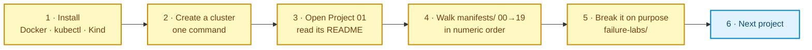
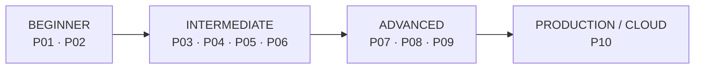

# Kubernetes Project Lab

Learn Kubernetes by **deploying real applications end-to-end** — not by reading isolated YAML snippets.

Every project starts with a working application and a plain `kubectl run`-level deployment, then introduces Kubernetes
resources **one at a time, only when the application actually breaks without them**.

> **Status:** Repository design complete. **[Project 01](project-01-task-tracker-webapp/)** (the reference
> implementation every later project mirrors) and **[Project 02](project-02-three-tier-notes/)** are built.
> Projects 03–10 are next — see [docs/ROADMAP.md](docs/ROADMAP.md).

---

## 🧭 Start Here

If you read one thing, read this. **You do not need any other page in `docs/` to begin.**



```bash
git clone <this-repo> && cd k8s-projects
kind create cluster --name kubernetes-lab --config clusters/kind-single-node.yaml
cd project-01-task-tracker-webapp && cat README.md
```

**Where things live, and when you need them:**

| I want to… | Go to |
|---|---|
| **Start learning** | [Project 01](project-01-task-tracker-webapp/) — everything you need is inside it |
| Learn storage, StatefulSets and Ingress | [Project 02](project-02-three-tier-notes/) — do Project 01 first |
| Type every command myself, explained | that project's [`scripts/manual-steps.md`](project-01-task-tracker-webapp/scripts/manual-steps.md) |
| See which project teaches what | [Resource coverage matrix](docs/RESOURCE-COVERAGE-MATRIX.md) |
| Understand the project line-up | [Roadmap](docs/ROADMAP.md) |
| Add my own project | [CONTRIBUTING.md](CONTRIBUTING.md) + [`templates/project-template/`](templates/project-template/) |
| Know why Kind ≠ EKS | [Local vs cloud](docs/local-vs-cloud.md) |
| Follow the repo's standards | [Conventions](docs/CONVENTIONS.md) |

> **`docs/` is optional reference, never a prerequisite.** Theory is taught *inside each project stage*, at the
> moment the problem appears. You should never have to leave a lesson to look something up.
>
> **Every stage links its primary source.** Each stage README ends with a `📚 Official documentation` table pointing
> at [kubernetes.io](https://kubernetes.io/docs/home/) and the tools' own docs — so you can always check us. Links are
> curl-verified before commit, never written from memory.

---

## Why This Repository Exists

Most Kubernetes tutorials teach objects independently:

> "This is a Deployment. This is a Service. This is a ConfigMap."

That teaches vocabulary, not engineering. It never answers the questions that matter in an incident or an interview:

- *Why* does this object exist?
- What breaks *without* it?
- How does it interact with the objects around it?
- How do I verify it, and how do I debug it when it's wrong?

This repository teaches Kubernetes the other way around — **problem first, resource second**:

```
Application Requirement
  → Problem
    → Kubernetes Resource Needed
      → Theory
        → Manifest
          → Manifest Explanation
            → Apply
              → Validate
                → Observe
                  → Break It On Purpose
                    → Troubleshoot It
                      → Production Considerations
```

Each project is **self-contained**. Theory is deliberately repeated across projects — you should never have to leave
Project 07 and open Project 01 to remember what a Service selector does. **This duplication is intentional.**

---

## What You Will Learn

| Area | Covered |
|---|---|
| Workloads | Pod, ReplicaSet, Deployment, StatefulSet, DaemonSet, Job, CronJob |
| Networking | ClusterIP, NodePort, LoadBalancer, Headless, ExternalName, Ingress, IngressClass, EndpointSlice, CoreDNS, NetworkPolicy |
| Configuration | ConfigMap, Secret, env vars, volume-mounted config, immutable ConfigMaps |
| Storage | emptyDir, hostPath, PV, PVC, StorageClass, dynamic provisioning, access modes, reclaim policies |
| Scaling | Manual scaling, HPA (CPU + memory), Metrics Server, requests vs limits |
| Reliability | Readiness/liveness/startup probes, rolling updates, rollback, PDB, graceful termination |
| Scheduling | nodeSelector, node/pod affinity + anti-affinity, taints, tolerations, topology spread, PriorityClass |
| Security | Namespaces, RBAC, ServiceAccounts, securityContext, Pod Security Standards, NetworkPolicy, imagePullSecrets |
| Resource Mgmt | requests, limits, QoS classes, LimitRange, ResourceQuota |
| Advanced | Init containers, sidecars, lifecycle hooks, Downward API, projected volumes |
| Delivery | Labels, selectors, annotations, canary/blue-green concepts, Kustomize, Helm intro, GitOps |
| Observability | logs, describe, events, top, Metrics Server, Prometheus, Grafana, health endpoints |

Full per-project breakdown: [docs/RESOURCE-COVERAGE-MATRIX.md](docs/RESOURCE-COVERAGE-MATRIX.md)

---

## Learning Path



Do the projects in order the first time. After that, each one stands alone as a reference.

---

## Project Matrix

| # | Project | Difficulty | Application | Headline Kubernetes Concepts |
|---|---|---|---|---|
| 01 | [**Task Tracker Web App** ✅](project-01-task-tracker-webapp/) | Beginner | Python web tier + REST API | Namespace, Pod, ReplicaSet, Deployment, Service, ConfigMap, Secret |
| 02 | [**Three-Tier Notes Platform** ✅](project-02-three-tier-notes/) | Beginner+ | Frontend + API + PostgreSQL | PV, PVC, StorageClass, StatefulSet, headless Service, Ingress, IngressClass, NodePort, LoadBalancer, probes, init containers |
| 03 | [URL Shortener](docs/ROADMAP.md#project-03--url-shortener) | Intermediate | UI + API + Redis + Postgres | Headless Service, DNS, service discovery, ExternalName, immutable ConfigMaps |
| 04 | [E-Commerce Microservices](docs/ROADMAP.md#project-04--e-commerce-microservices) | Intermediate | 5 services + gateway | Ingress path/host routing, NetworkPolicy, east-west traffic, EndpointSlice |
| 05 | [Production Web Platform](docs/ROADMAP.md#project-05--production-web-platform) | Intermediate+ | Traffic-serving web app | requests/limits, QoS, HPA, PDB, rolling update, rollback, preStop, graceful shutdown |
| 06 | [Batch Processing Platform](docs/ROADMAP.md#project-06--batch-processing-platform) | Intermediate+ | API + workers + scheduled cleanup | Job, CronJob, init containers, sidecars, Downward API, backoff/TTL |
| 07 | [Secure Multi-Tenant Platform](docs/ROADMAP.md#project-07--secure-multi-tenant-platform) | Advanced | Tenant-isolated app | RBAC, ServiceAccount, securityContext, PSS, ResourceQuota, LimitRange, NetworkPolicy |
| 08 | [Observability Stack](docs/ROADMAP.md#project-08--observability-stack) | Advanced | App + Prometheus + Grafana | DaemonSet, scraping, metrics, dashboards, alerts, Metrics Server, logging |
| 09 | [Highly Available Platform](docs/ROADMAP.md#project-09--highly-available-platform) | Advanced | Multi-zone HA service | Affinity/anti-affinity, taints/tolerations, topology spread, PriorityClass, PDB |
| 10 | [Production EKS + GitOps](docs/ROADMAP.md#project-10--production-eks--gitops) | Production | Full stack on AWS | EKS, AWS LB Controller, ALB/NLB, EBS CSI, IRSA, ACM, Route53, Kustomize, Helm, GitOps |

---

## Environment Support

| Environment | Status | Notes |
|---|---|---|
| **Kind** | Primary | Every project is authored and validated against Kind |
| Minikube | Supported | Differences flagged inline (Ingress addon, `minikube tunnel`, storage class names) |
| k3d / k3s | Best effort | Uses Traefik + local-path by default; substitutions documented |
| AWS EKS | Project 10 + optional sections | Real cloud LoadBalancer, ALB, EBS, IRSA |
| Azure AKS / Google GKE | Concept notes | Behavioural differences called out; not the primary path |

> **Important:** `type: LoadBalancer` does **not** give you a public IP on every cluster. On Kind it stays `<pending>`
> unless you install Cloud Provider KIND or MetalLB. Every project separates **production LoadBalancer** from
> **local simulation**. See [docs/local-vs-cloud.md](docs/local-vs-cloud.md).

---

## Repository Structure

```
kubernetes-project-lab/
├── README.md                        # you are here
├── CONTRIBUTING.md                  # how to add a new project
├── docs/                            # shared theory (referenced, never required)
│   ├── ROADMAP.md
│   ├── REPOSITORY-DESIGN.md
│   ├── RESOURCE-COVERAGE-MATRIX.md
│   ├── CONVENTIONS.md
│   ├── local-vs-cloud.md
│   ├── kubernetes-architecture.md
│   ├── kubectl-cheatsheet.md
│   ├── yaml-basics.md
│   ├── networking-basics.md
│   ├── storage-basics.md
│   ├── security-basics.md
│   └── troubleshooting-guide.md
├── templates/
│   └── project-template/            # copy this to start a new project
├── clusters/                        # reusable Kind cluster configs
└── project-01-…  …  project-10-…    # the projects
```

Full rationale: [docs/REPOSITORY-DESIGN.md](docs/REPOSITORY-DESIGN.md)

---

## Prerequisites

| Tool | Minimum | Check |
|---|---|---|
| Docker | 24.x | `docker version` |
| kubectl | within one minor of cluster | `kubectl version --client` |
| Kind | 0.23+ | `kind version` |
| Git | any | `git --version` |
| Optional: Helm | 3.14+ | `helm version` |
| Optional: k9s, stern | — | quality-of-life |

Assumed knowledge: **basic Docker** (images, containers, ports, env vars). **No prior Kubernetes required.**

---

## Quick Start

```bash
git clone <this-repo>
cd kubernetes-project-lab

# 1. Create the shared single-node learning cluster
kind create cluster --name kubernetes-lab --config clusters/kind-single-node.yaml

# 2. Confirm it is alive
kubectl cluster-info --context kind-kubernetes-lab
kubectl get nodes

# 3. Start Project 01 and read, don't skip, the README
cd project-01-task-tracker-webapp
cat README.md          # then follow scripts/manual-steps.md
```

Projects that need scheduling across nodes use `clusters/kind-multi-node.yaml` instead; each project README states
exactly which cluster config it expects.

---

## How To Use This Repository

1. **Read the project README first.** It frames the application and the problems before any YAML appears.
2. **Walk `manifests/` in numeric order.** Each numbered directory has its own README that teaches one resource using
   the **WHY / WHAT / HOW** format: why the resource exists, what it is, how it actually works, then manifest →
   apply → validate → observe → break it → production notes → the next problem.
3. **Do the failure labs.** Breaking things on purpose is the fastest way to learn `kubectl describe`.
4. **Attempt the exercises before opening `solutions/`.**
5. **Clean up** with `scripts/cleanup.sh` so the next project starts from a known state.

### Scripts vs manual steps

Every project ships automation **and** the raw steps behind it:

| | |
|---|---|
| `scripts/manual-steps.md` | Every command typed by hand, with *what it does*, *expected output*, and *if it fails* |
| `scripts/*.sh` | The same steps automated, for repeat runs and resets |

**Do it manually the first time.** The scripts do nothing that isn't explained in `manual-steps.md` — that's a rule
enforced in [CONTRIBUTING.md](CONTRIBUTING.md), not a suggestion.

---

## Contribution Guidelines

This repository is designed to grow — new projects are expected. Do not invent a new layout: copy
`templates/project-template/`, follow [docs/CONVENTIONS.md](docs/CONVENTIONS.md), and satisfy the checklist in
[CONTRIBUTING.md](CONTRIBUTING.md). A project is not "done" until it deploys clean on a fresh Kind cluster, every
manifest has an explanation, and `cleanup.sh` leaves nothing behind.
