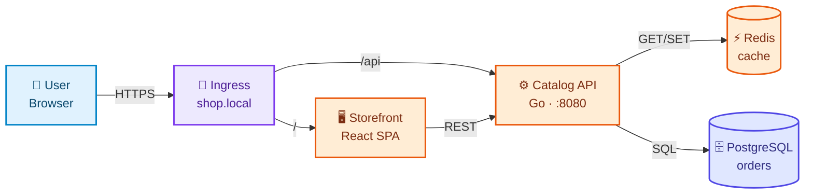
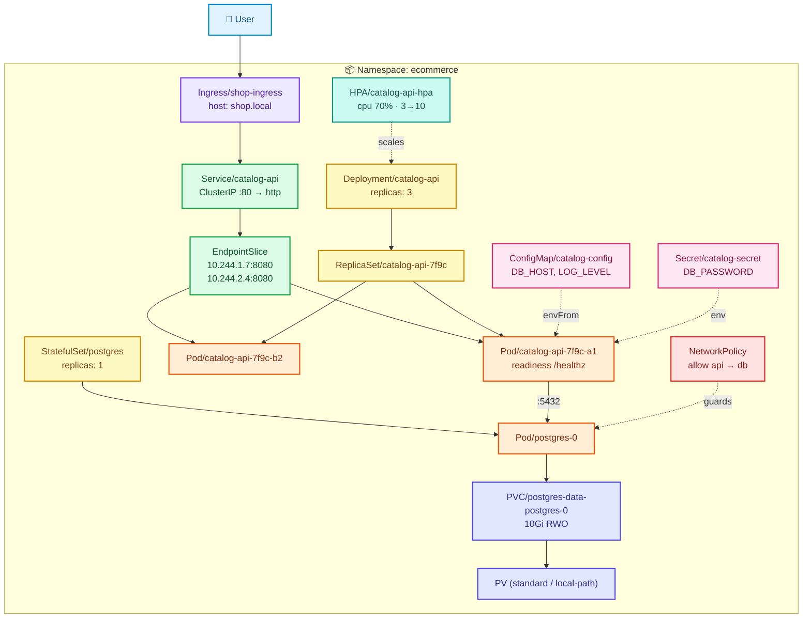

# Conventions

Non-negotiable standards. A project that breaks these is inconsistent with the rest of the repository and will be
harder for a learner to navigate. When in doubt, copy Project 01.

---

## 1. Project Naming

```
project-<NN>-<kebab-slug>/
```

- `NN` is zero-padded and **permanent**. It never changes once merged.
- Slug describes the **application**, not the Kubernetes feature: `project-06-batch-processing-platform`,
  not `project-06-jobs-and-cronjobs`. The app is the hook; the resources are the lesson.
- Max 4 words. Lowercase, hyphens only.

---

## 2. Kubernetes Resource Naming

| Rule | Example |
|---|---|
| Lowercase RFC 1123, hyphens only, no underscores/camelCase | `order-api` ✅ `orderAPI` ❌ |
| Pattern: `<component>-<resource-role>` | `catalog-api`, `catalog-api-svc`, `catalog-db` |
| Do **not** suffix the kind when the kind is obvious from context | `Deployment/catalog-api` ✅ `Deployment/catalog-api-deployment` ❌ |
| Do suffix when disambiguation genuinely helps | `redis-headless`, `postgres-primary`, `api-canary` |
| Namespace = project slug without the number | `task-tracker`, `url-shortener`, `ecommerce` |
| Multi-tenant namespaces | `<project>-<tenant>`: `platform-tenant-a` |
| ConfigMaps / Secrets | `<component>-config`, `<component>-secret`, `<component>-tls` |
| PVCs | `<component>-data` (`postgres-data`); StatefulSet templates yield `postgres-data-postgres-0` |
| ServiceAccounts | `<component>-sa` |
| RBAC | `<component>-role`, `<component>-rolebinding`, `<component>-clusterrole` |
| HPA / PDB | `<component>-hpa`, `<component>-pdb` |
| NetworkPolicy | `<allow|deny>-<source>-to-<target>`: `allow-order-to-payment`, `default-deny-all` |
| Ingress | `<project>-ingress`; hosts use `.local` (`shop.local`, `notes.local`) |
| StorageClass | reuse the cluster's (`standard` on Kind); custom ones named `<project>-<tier>` |

**Never** encode environment into a resource name (`api-prod`) — that's what namespaces and Kustomize overlays are for.

---

## 3. Labeling Conventions

Every resource carries the standard set. This is what makes selectors, NetworkPolicies, and `kubectl get -l`
predictable across ten projects.

```yaml
metadata:
  labels:
    app.kubernetes.io/name: catalog-api          # the component itself
    app.kubernetes.io/instance: catalog-api      # this deployed instance
    app.kubernetes.io/component: backend         # role within the architecture
    app.kubernetes.io/part-of: ecommerce         # the project / application
    app.kubernetes.io/version: "1.2.0"           # image version, quoted
    app.kubernetes.io/managed-by: kubectl        # or kustomize / helm / argocd
```

**Allowed `component` values** (keep this list closed):
`frontend` · `backend` · `database` · `cache` · `queue` · `worker` · `gateway` · `monitoring` · `job` · `migration`

### Selector rule (the one that bites people)

`spec.selector.matchLabels` is **immutable** on Deployments/StatefulSets. Keep selectors **minimal and stable** — put
churny data like `version` in the pod template labels only, never in the selector.

```yaml
spec:
  selector:
    matchLabels:
      app.kubernetes.io/name: catalog-api
      app.kubernetes.io/instance: catalog-api    # ← only these two, forever
  template:
    metadata:
      labels:
        app.kubernetes.io/name: catalog-api
        app.kubernetes.io/instance: catalog-api
        app.kubernetes.io/component: backend     # extra labels fine here
        app.kubernetes.io/version: "1.2.0"
```

### Annotations

| Annotation | Use |
|---|---|
| `kubernetes.io/description` | One line: what this object is for. **Required on every object in this repo.** |
| `lab.k8s-project/stage` | The manifest stage that introduced it, e.g. `"04-services"` |
| `lab.k8s-project/teaches` | Comma-separated concepts, e.g. `"clusterip,selectors,endpointslice"` |
| `checksum/config` | Force a rollout when a ConfigMap changes (Project 03 onward) |

---

## 4. Manifest Numbering Convention

```
manifests/<NN>-<topic>/
```

| NN | Topic | Introduced because |
|---|---|---|
| 00 | `namespace` | isolation before anything else |
| 01 | `pods` | the atom |
| 02 | `replicasets` | pods don't heal |
| 03 | `deployments` | replicasets don't roll |
| 04 | `services` | pod IPs are ephemeral |
| 05 | `configmaps` | config is baked into the image |
| 06 | `secrets` | credentials are in plaintext |
| 07 | `storage` | data dies with the pod |
| 08 | `statefulsets` | stateful pods need identity + ordering |
| 09 | `ingress` | HTTP routing for many services |
| 10 | `loadbalancer` | external exposure, and how it differs per platform |
| 11 | `health-checks` | traffic hits pods that aren't ready |
| 12 | `resources` | noisy neighbours, OOM, quotas |
| 13 | `hpa` | load varies |
| 14 | `pdb` | maintenance takes everything down |
| 15 | `security` | root, cluster-admin, open network |
| 16 | `jobs` | work that finishes |
| 17 | `observability` | "is it healthy?" |
| 18 | `scheduling` | placement, spread, priority |
| 19 | `final` | combined manifest + kustomization |

**Rules**

1. Numbers are **stable identities, not positions**. A project that has no storage simply has no `07-` directory —
   never renumber to close a gap. `07` means *storage* in all ten projects.
2. Multiple resources in one stage → separate files, prefixed for apply order:
   `07-storage/01-storageclass.yaml`, `02-persistent-volume.yaml`, `03-persistent-volume-claim.yaml`.
3. One logical resource per file during teaching stages. Combined manifests **only** in `19-final/`.
4. New cross-cutting topics get numbers **≥ 20** rather than squeezing between existing ones.
5. Every numbered directory has a `README.md` in the [WHY/WHAT/HOW format](REPOSITORY-DESIGN.md#7-the-manifest-readme-format--why--what--how).

---

## 5. YAML Standards

```yaml
# 04-services/backend-service.yaml
# WHY: Pod IPs change on every restart. This Service gives the backend a
#      stable virtual IP and a DNS name the frontend can rely on.
apiVersion: v1
kind: Service
metadata:
  name: task-api
  namespace: task-tracker
  labels:
    app.kubernetes.io/name: task-api
    app.kubernetes.io/instance: task-api
    app.kubernetes.io/component: backend
    app.kubernetes.io/part-of: task-tracker
    app.kubernetes.io/version: "1.0.0"
  annotations:
    kubernetes.io/description: "Stable ClusterIP endpoint for the task API"
    lab.k8s-project/stage: "04-services"
spec:
  type: ClusterIP                 # internal only — see 10-loadbalancer for external
  selector:                       # ← MUST match the Deployment's pod template labels
    app.kubernetes.io/name: task-api
    app.kubernetes.io/instance: task-api
  ports:
    - name: http                  # named ports are required by some features; always name them
      port: 80                    # the Service's port (what clients call)
      targetPort: http            # the container's named port (what the app listens on)
      protocol: TCP
```

| Rule | Detail |
|---|---|
| Indentation | 2 spaces, never tabs |
| Header comment | Every file starts with its path and a `# WHY:` line |
| Inline comments | On any field a beginner would have to look up. Comments teach here — density is intentional. |
| API versions | Current stable only. No `extensions/v1beta1`, no `networking.k8s.io/v1beta1`, no `autoscaling/v2beta2`. |
| Image tags | Explicit version tags always. **Never `latest`** — with a digest where it matters. |
| `imagePullPolicy` | `IfNotPresent` for locally-built Kind images; state why. |
| Ports | Always named (`http`, `grpc`, `metrics`, `postgres`), and `targetPort` references the name. |
| Resources | Every container has `requests`; `limits` from Project 05 onward, with the reasoning written down. |
| Namespace | Always explicit in `metadata` — never rely on the current context. |
| Probes | From Project 02 onward, every long-running container has readiness + liveness. |
| Document separators | Avoid `---` multi-doc during teaching stages; allowed in `19-final/`. |
| Validation | `kubectl apply --dry-run=server` must pass before commit. |

---

## 6. Diagram Conventions

Every project ships **two mandatory Mermaid diagrams**, plus a request-flow sequence. They are colored, and the colors
mean the same thing in all ten projects.

### 6.1 The palette (fixed)

| Layer | Fill | Stroke | Text | Used for |
|---|---|---|---|---|
| External / user | `#e0f2fe` | `#0284c7` | `#0c4a6e` | Browser, internet, DNS, cloud LB |
| Ingress / gateway | `#ede9fe` | `#7c3aed` | `#4c1d95` | Ingress controller, Ingress, API gateway |
| Networking | `#dcfce7` | `#16a34a` | `#14532d` | Services, EndpointSlices, CoreDNS |
| Workload | `#fef9c3` | `#ca8a04` | `#713f12` | Deployment, ReplicaSet, StatefulSet, DaemonSet, Job |
| Pod / container | `#ffedd5` | `#ea580c` | `#7c2d12` | Pods and containers |
| Config / secret | `#fce7f3` | `#db2777` | `#831843` | ConfigMap, Secret, env |
| Storage | `#e0e7ff` | `#4f46e5` | `#312e81` | PVC, PV, StorageClass, volumes |
| Security | `#fee2e2` | `#dc2626` | `#7f1d1d` | RBAC, ServiceAccount, NetworkPolicy, securityContext |
| Observability | `#ccfbf1` | `#0d9488` | `#134e4a` | Prometheus, Grafana, metrics, probes |
| Control plane | `#f1f5f9` | `#475569` | `#0f172a` | API server, scheduler, controller-manager, etcd, kubelet |

Declare them with `classDef` in **every** diagram — no theme-dependent defaults, and explicit `color:` so the text
stays readable in both GitHub light and dark mode:

```
classDef external  fill:#e0f2fe,stroke:#0284c7,stroke-width:2px,color:#0c4a6e
classDef gateway   fill:#ede9fe,stroke:#7c3aed,stroke-width:2px,color:#4c1d95
classDef network   fill:#dcfce7,stroke:#16a34a,stroke-width:2px,color:#14532d
classDef workload  fill:#fef9c3,stroke:#ca8a04,stroke-width:2px,color:#713f12
classDef pod       fill:#ffedd5,stroke:#ea580c,stroke-width:2px,color:#7c2d12
classDef config    fill:#fce7f3,stroke:#db2777,stroke-width:2px,color:#831843
classDef storage   fill:#e0e7ff,stroke:#4f46e5,stroke-width:2px,color:#312e81
classDef security  fill:#fee2e2,stroke:#dc2626,stroke-width:2px,color:#7f1d1d
classDef observe   fill:#ccfbf1,stroke:#0d9488,stroke-width:2px,color:#134e4a
classDef control   fill:#f1f5f9,stroke:#475569,stroke-width:2px,color:#0f172a
```

### 6.2 Diagram 1 — High-Level Design (HLD)

**Purpose:** what the application is, in under 15 nodes. Readable in ten seconds, no Kubernetes noun soup.
**Lives in:** project `README.md` § *Application Architecture* and `architecture/architecture.md`.
**Style:** `flowchart LR`, boxes are *roles* (Frontend, API, Cache, Database), edges are labelled with the protocol.



### 6.3 Diagram 2 — Low-Level Design (LLD)

**Purpose:** every Kubernetes object the project creates and how they relate — the "wiring diagram" a learner checks
when something doesn't work.
**Lives in:** project `README.md` § *Kubernetes Architecture* and `architecture/architecture.md` (source in
`architecture/architecture.mmd`).
**Style:** `flowchart TB` with `subgraph` per namespace/tier, every node labelled `Kind/name`, controller ownership as
solid arrows, config/secret/storage mounts as dotted arrows.



### 6.4 Diagram 3 — Request Flow (required)

`sequenceDiagram` in `architecture/request-flow.md`, tracing one real request from browser → DNS → node port →
ingress controller → Service → EndpointSlice → kube-proxy → pod → container → database and back, with the failure
point of each hop noted.

### 6.5 Optional per-stage diagrams

A manifest README may include a small focused diagram (e.g. `04-services/README.md` showing
`Service → EndpointSlice → Pods`). Same palette, ≤ 8 nodes.

### 6.6 Diagram rules

| Rule | Why |
|---|---|
| Mermaid only, fenced ```` ```mermaid ```` | Renders natively on GitHub, diffable, no binary assets |
| Source of the LLD also stored as `architecture/architecture.mmd` | Editable/exportable outside GitHub |
| Always declare `classDef` inline; always set `color:` | Theme-independent legibility |
| HLD ≤ 15 nodes; LLD unlimited but grouped in `subgraph`s | Two different jobs, two different densities |
| Node label format in LLD: `Kind/name` + key spec on line 2 | Matches what `kubectl get` prints |
| Solid arrow = traffic or ownership; dotted arrow = reference/mount/scale | Consistent semantics |
| Emoji allowed in HLD, sparingly; avoid in LLD | HLD is a poster, LLD is a schematic |
| Cylinders `[( )]` for datastores, `{{ }}` for decisions | Visual shorthand |

---

## 7. Script Conventions

All scripts: `#!/usr/bin/env bash` + `set -euo pipefail`, idempotent, safe to re-run, and they echo the command they
are about to run before running it (no magic).

| Script | Contract |
|---|---|
| `build-images.sh` | `docker build` each app image, then `kind load docker-image` into the named cluster |
| `deploy.sh` | Applies stages `00…19` in order, `kubectl wait` between stages, prints progress |
| `validate.sh` | Asserts pods Ready, endpoints non-empty, HTTP 200 from the app; **non-zero exit on failure** |
| `cleanup.sh` | Deletes the namespace, then explicitly deletes PVs/cluster-scoped objects; confirms nothing is left |

Cluster name is a variable defaulting to `kubernetes-lab`; never hardcode a kube-context.

### 7.1 Every script has a manual-steps document — mandatory

`scripts/manual-steps.md` writes out **by hand** every step the scripts automate, with the raw commands and an
explanation of each one. A learner must be able to complete the entire project without executing a single script.

> **Why:** a script that "just works" teaches you a shell script, not Kubernetes. Automation is the convenience you
> earn *after* you understand the sequence. It also means a broken script never blocks learning — the manual path
> always exists.

**Format — every command gets all four:**

````markdown
### Step 3.3 — Services

```bash
kubectl apply -f ../manifests/04-services/
kubectl get endpointslices -n <ns>
```

▸ **What it does:** …            ← plain-language explanation of the command and its flags
▸ **Expected output:** …         ← what success actually prints
▸ **If it fails:** …             ← most likely cause + the next command to run
````

**Rules**

| Rule | Detail |
|---|---|
| Coverage | Every action a script performs appears as a numbered manual step. No script may do anything undocumented here. |
| Structure | Parts mirror the scripts: cluster setup → build images → deploy (stage by stage) → validate → cleanup |
| Cross-reference | Each Part names its script equivalent; each script header names this file |
| Flags | Explain non-obvious flags inline (`--dry-run=server`, `--previous`, `-o jsonpath`, `--rm`) — never assume |
| Sync | Change a script → update `manual-steps.md` **in the same commit** |
| Ends with | A command-reference table of every `kubectl` command the project uses |

The **why** for each *resource* stays in `manifests/NN-*/README.md`; `manual-steps.md` owns the *operational
sequence*. Don't duplicate the theory — link to the stage README.

---

## 8. Documentation Style

- Sentence-case headings; no walls of text — prefer tables, callouts, and short paragraphs.
- Callouts: `> **Note:**`, `> **Tip:**`, `> ⚠️ **Warning:**`, `> 🧪 **Try it:**`, `> 🎯 **Interview:**`.
- Every command block states what it does and what output to expect.
- Demo vs production is always labelled explicitly:

```
> 🧪 **DEMO / LEARNING CONFIGURATION**
> This Secret stores the password base64-encoded in Git. Never do this outside a lab.

> 🏭 **PRODUCTION CONSIDERATIONS**
> Use External Secrets Operator with AWS Secrets Manager / Azure Key Vault / Vault,
> enable encryption at rest for etcd, and rotate credentials automatically.
```

- Never write "just run this". Every command gets a reason.
- Interview questions are grouped by resource and ship with model answers.
- Exercise solutions live in `exercises/solutions/`, never inline.

---

## 9. Navigation Conventions — a reader is never lost

A learner arriving on any page must be able to answer three questions without scrolling or guessing: **Where am I?
What came before? What's next?** These are mandatory.

### 9.1 Every stage README opens with a breadcrumb

Immediately after the `# ` heading, before anything else:

```markdown
# Stage 04 — Services

[⬅ Project 01](../../README.md) · Stage 5 of 9

[00 Namespace](../00-namespace/README.md) › [01 Pods](../01-pods/README.md) › … › **04 Services** › … › [19 Final](../19-final/README.md)
```

The current stage is **bold and unlinked**; every other stage is a working link. Showing the *whole* chain means the
reader sees the syllabus from any page.

### 9.2 Every stage README closes with a nav footer

The last thing on the page, after the "next problem" paragraph:

```markdown
| ◀ Previous | ▲ Up | Next ▶ |
|---|:--:|---:|
| ◀ **[03 Deployments](../03-deployments/README.md)** | [Project 01](../../README.md) · [Manual steps](../../scripts/manual-steps.md) | **[05 ConfigMaps](../05-configmaps/README.md)** ▶ |
```

First stage uses `◀ *(first stage)*`; last stage points at the next project.

### 9.3 Every stage README ends its body with "The next problem"

A short paragraph naming the limitation this stage exposes, then the arrow link. **The failure is the transition** —
never end a stage with "in the next section we will look at X".

### 9.4 Every project README carries a journey diagram

A `flowchart TB` alternating **stage → failure → stage**, so the whole problem-first chain is visible at a glance.
Stages in workload yellow, failures in security red, the next project in external blue. See
[Project 01 §10](../project-01-task-tracker-webapp/README.md#10-deployment-journey).

### 9.5 Every project README carries a reading order table

`# | Do this | Where | Time` — the exact sequence, with time estimates, so nobody has to guess whether the exercises
come before or after the failure labs.

### 9.6 The root README carries a "Start Here" block

A 6-step flow diagram, a copy-pasteable three-command quick start, and a **"I want to… → go to"** table. It must
state that `docs/` is optional reference, never a prerequisite.

> **Rule of thumb:** if a reader has to return to a parent page to find out what to do next, the navigation has
> failed. Links point forward.


---

## 10. Official Reference Conventions

Learners must be able to check us. Every stage README ends with a link table to the **primary source** for what it
just taught.

### 10.1 Placement

A `## 📚 Official documentation` block at the end of the body, **after** "The next problem" and **before** the nav
footer. It is an appendix, so it never interrupts the narrative.

### 10.2 Format

| Column | Content |
|---|---|
| Reference | Linked page title, as the page actually titles itself |
| What it adds | Why *this* reader would click it — not a restatement of the title |

Open with: *"Everything above is self-contained — these are for going deeper, not for filling gaps."* References must
never be load-bearing. If a learner has to click out to understand the lesson, the lesson is incomplete.

### 10.3 Which links

- **Primary sources only** — `kubernetes.io/docs`, or the project's own site for ecosystem tools
  (`kind.sigs.k8s.io`, `kubernetes.github.io/ingress-nginx`, `kubectl.docs.kubernetes.io`)
- 3–6 per stage. A wall of links is as useless as none.
- **No blogs, no Medium, no Stack Overflow, no video links.** They rot, and they're often wrong.
- Link the **concept** page, not a version-pinned API reference, so the link survives releases.
- Anywhere the repo makes a claim that contradicts common tutorial advice (the LoadBalancer `<pending>` behaviour,
  NetworkPolicy needing an enforcing CNI, base64 ≠ encryption), **cite the source inline** — those are the claims a
  reader is most likely to doubt.

### 10.4 Verification is mandatory

> ⚠️ **Never add a URL from memory.** Documentation sites reorganise constantly and a 404 destroys trust faster than
> a missing link.

Check every link before committing, and stamp the block with the date it was verified:

```bash
while read -r u; do
  printf '%s %s\n' "$(curl -sS -o /dev/null -w '%{http_code}' -L --max-time 20 "$u")" "$u"
done < urls.txt | grep -v '^200 '
```

Anything that isn't `200` gets fixed or dropped — never shipped.