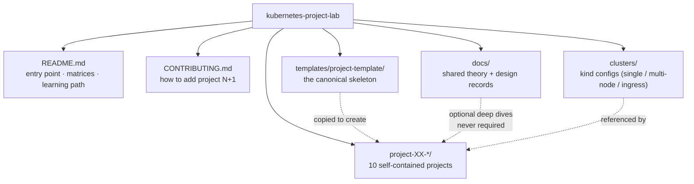

# Repository Design

Design record for the Kubernetes Project Lab. Read this before adding anything to the repository.

---

## 1. Repository Name

**Recommended:** `kubernetes-project-lab`

It reads as *projects* (end-to-end applications) plus *lab* (safe place to break things), and it doesn't over-promise
"production" for beginner content.

| Alternative | Trade-off |
|---|---|
| `kubernetes-end-to-end-projects` | Very descriptive, long, awkward to type |
| `kubernetes-real-world-labs` | Good, but "real-world" is an overloaded claim |
| `k8s-project-playground` | Friendly, reads less serious for interview prep |
| `kubernetes-production-projects` | Misleading — the first six projects are deliberately not production |

> The current working directory is `k8s-projects`. Renaming the GitHub repo to `kubernetes-project-lab` is a
> one-click operation and GitHub keeps redirects; the local folder name does not matter.

---

## 2. Design Principles

| # | Principle | Consequence in the repo |
|---|---|---|
| 1 | **Problem before resource** | No manifest appears before the failure that motivates it |
| 2 | **Self-contained projects** | Theory is duplicated across projects on purpose; `docs/` is a bonus, never a prerequisite |
| 3 | **One resource per file while learning** | Combined manifests only in `18-final/` |
| 4 | **Incremental numbering = the lesson order** | The directory listing *is* the syllabus |
| 5 | **Every project runs on a laptop** | Kind is the primary target; cloud is additive and optional |
| 6 | **Break it on purpose** | Every project ships failure labs with symptom → investigate → root cause → fix |
| 7 | **Demo vs production is always labelled** | Explicit `DEMO / LEARNING CONFIGURATION` and `PRODUCTION CONSIDERATIONS` blocks |
| 8 | **No magic** | No command without an explanation, no field without a breakdown |
| 9 | **Uniform structure** | Every project is navigable identically, so new projects are cheap to add |
| 10 | **Extensible by design** | `templates/project-template/` + `CONTRIBUTING.md` make project 11, 12, 13… mechanical |

---

## 3. Repository Architecture



**Dependency rule:** projects depend on `clusters/` (mechanical) and on nothing else. A project must never say
"see Project 03 for the explanation."

---

## 4. Directory Structure

```
kubernetes-project-lab/
│
├── README.md
├── CONTRIBUTING.md
├── LICENSE
├── .gitignore
│
├── docs/
│   ├── ROADMAP.md                     # the 10 projects, difficulty, concepts
│   ├── REPOSITORY-DESIGN.md           # this file
│   ├── RESOURCE-COVERAGE-MATRIX.md    # resource × project grid
│   ├── CONVENTIONS.md                 # naming, labels, numbering, diagrams, YAML style
│   ├── local-vs-cloud.md              # Kind/Minikube/EKS/AKS/GKE behavioural differences
│   ├── kubernetes-architecture.md     # control plane, kubelet, etcd, scheduler, controllers
│   ├── kubectl-cheatsheet.md
│   ├── yaml-basics.md
│   ├── networking-basics.md
│   ├── storage-basics.md
│   ├── security-basics.md
│   └── troubleshooting-guide.md
│
├── clusters/
│   ├── kind-single-node.yaml
│   ├── kind-ingress.yaml              # extraPortMappings 80/443 for NGINX Ingress
│   ├── kind-multi-node.yaml           # 1 control-plane + 3 workers, zone labels
│   └── README.md
│
├── templates/
│   └── project-template/              # copy → rename → fill in
│
├── project-01-task-tracker-webapp/
├── project-02-three-tier-notes/
├── project-03-url-shortener/
├── project-04-ecommerce-microservices/
├── project-05-production-web-platform/
├── project-06-batch-processing-platform/
├── project-07-secure-multi-tenant-platform/
├── project-08-observability-stack/
├── project-09-highly-available-platform/
└── project-10-eks-gitops-production/
```

---

## 5. Standard Project Folder Template

Every project uses this shape. **Directories that a project does not need are omitted, never renumbered** — the number
is a stable identity, not a sequence position (see [CONVENTIONS.md](CONVENTIONS.md#4-manifest-numbering-convention)).

```
project-XX-<slug>/
│
├── README.md                       # the project narrative (standard template below)
│
├── architecture/
│   ├── architecture.md             # application + kubernetes architecture, narrated
│   ├── architecture.mmd            # source diagram (mermaid)
│   └── request-flow.md             # browser → DNS → LB → ingress → svc → endpointslice → pod
│
├── application/                    # the actual app being deployed
│   ├── frontend/
│   │   ├── src/…
│   │   └── Dockerfile
│   ├── backend/
│   │   ├── src/…
│   │   └── Dockerfile
│   ├── database/                   # init SQL / seed data (if any)
│   └── README.md                   # how to build & run locally with plain Docker first
│
├── manifests/
│   ├── 00-namespace/    { namespace.yaml, README.md }
│   ├── 01-pods/         { pod.yaml, README.md }
│   ├── 02-replicasets/  { replicaset.yaml, README.md }
│   ├── 03-deployments/  { *-deployment.yaml, README.md }
│   ├── 04-services/     { *-service.yaml, README.md }
│   ├── 05-configmaps/   { configmap.yaml, README.md }
│   ├── 06-secrets/      { secret.yaml, README.md }
│   ├── 07-storage/      { storageclass.yaml, pv.yaml, pvc.yaml, README.md }
│   ├── 08-statefulsets/ { statefulset.yaml, headless-service.yaml, README.md }
│   ├── 09-ingress/      { ingress.yaml, ingressclass notes, README.md }
│   ├── 10-loadbalancer/ { loadbalancer-service.yaml, nodeport-service.yaml, README.md }
│   ├── 11-health-checks/{ deployment.yaml, README.md }
│   ├── 12-resources/    { deployment.yaml, limitrange.yaml, resourcequota.yaml, README.md }
│   ├── 13-hpa/          { hpa.yaml, README.md }
│   ├── 14-pdb/          { pdb.yaml, README.md }
│   ├── 15-security/     { serviceaccount.yaml, role.yaml, rolebinding.yaml, network-policy.yaml, README.md }
│   ├── 16-jobs/         { job.yaml, cronjob.yaml, README.md }
│   ├── 17-observability/{ monitoring.yaml, servicemonitor.yaml, README.md }
│   ├── 18-scheduling/   { affinity.yaml, tolerations.yaml, topology-spread.yaml, README.md }
│   └── 19-final/        { complete-production-manifest.yaml, kustomization.yaml, README.md }
│
├── scripts/
│   ├── deploy.sh                   # applies stages in order, idempotent
│   ├── validate.sh                 # asserts expected state, non-zero exit on failure
│   ├── cleanup.sh                  # deletes everything incl. PVs
│   └── build-images.sh             # docker build + kind load docker-image
│
├── troubleshooting/
│   └── common-errors.md            # symptom → investigate → root cause → fix table
│
├── failure-labs/
│   └── labs.md                     # deliberate breakage exercises
│
├── exercises/
│   ├── beginner.md
│   ├── intermediate.md
│   ├── advanced.md
│   └── solutions/
│
└── interview-questions/
    └── questions.md                # grouped by resource, with model answers
```

> Deviation from the master prompt: `18-final` became **`18-scheduling` + `19-final`**, and `failure-labs/` was split
> out of `troubleshooting/`. Rationale: scheduling (affinity/taints/topology spread) is a first-class topic in
> Projects 09/10 and needed a numbered slot; and "how do I fix a real error" and "break this on purpose" are different
> reader intents.

---

## 6. Standard README Template

The canonical copy lives at `templates/project-template/README.md`. Section order is fixed:

```
# Project XX — <Name>
Difficulty · Estimated time · Cluster required · Prerequisites at a glance

## 1. What Are We Building?
## 2. Why This Project?
## 3. Learning Objectives
## 4. Technologies Used
## 5. Prerequisites
## 6. Application Architecture          (mermaid)
## 7. Kubernetes Architecture           (mermaid)
## 8. Request Flow                      (step-by-step, numbered)
## 9. Kubernetes Resources Used         (table: Resource | Why We Need It | Application Usage)
## 10. Deployment Journey                (Stage 00 → 19, one row each, links to manifest READMEs)
## 11. Validation
## 12. Testing
## 13. Failure Simulation
## 14. Troubleshooting
## 15. Production Considerations
## 16. Security Considerations
## 17. Interview Questions
## 18. Exercises
## 19. Cleanup
## 20. What's Next
```

---

## 7. The Manifest README Format — WHY / WHAT / HOW

**Theory lives inside the project, at the moment it is needed.** There is no "read the theory first" step and no
prerequisite reading. Each stage teaches its resource completely, right where the learner hits the problem.

Every `manifests/NN-*/README.md` follows exactly this, no exceptions:

| # | Section | Question it answers |
|---|---|---|
| 0 | **The problem** | What just broke? *(carried over from the previous stage)* |
| 1 | **WHY does this resource exist?** | Why did Kubernetes need to invent this? What happens without it? When do I use it — and when do I not? |
| 2 | **WHAT is it?** | Definition, mental model/analogy **followed by the technically accurate statement**, key fields, related objects |
| 3 | **HOW does it work?** | The mechanism: which controller, what reconcile loop, what the API server/kubelet/kube-proxy actually do |
| 4 | **Manifest** | Complete, valid, commented YAML |
| 5 | **Manifest breakdown** | Field-by-field table: what it does, what breaks if it's wrong |
| 6 | **Apply** | Exact command, explained |
| 7 | **Validate** | `get`/`describe`/`logs` with what "good" looks like and what a red flag looks like |
| 8 | **Observe the mechanism** | Prove the theory with commands — don't ask for trust |
| 9 | **Break it** | Deliberate failure → symptom → investigate → root cause → fix |
| 10 | **How it interacts** | Relationship to the objects around it, with a small diagram |
| 11 | **Production notes** | 🧪 demo vs 🏭 production |
| 12 | **The next problem** | The limitation this stage exposes, which motivates the next stage |

**The three questions are non-negotiable.** A stage README that defines a resource without answering *why it exists*
and *how it actually works* is a reference page, not a lesson — reject it.

> Because theory is embedded per stage, it is **repeated across projects**. That is the design: a learner in Project 07
> gets the full Service explanation again without opening Project 01.

### What `docs/` is for

`docs/` holds **optional cross-cutting reference** (kubectl cheatsheet, YAML syntax, cluster architecture) for people
who want a consolidated view. It is never a prerequisite, and no project may depend on it for an explanation.

---

## 8. Teaching Sequence Rule

Resources are introduced **only after** the learner has felt their absence.

| ❌ Bad | ✅ Good |
|---|---|
| "Now create a ConfigMap." | "The backend URL is hardcoded in the Deployment. Changing it means editing and re-rolling the workload, and the same image can't serve dev and prod. Kubernetes separates configuration from images with a **ConfigMap**." |
| "Add a readiness probe." | "We rolled out a new version and users got 502s for 8 seconds. The pod was `Running` before the app finished booting, so the Service sent it traffic. Kubernetes needs a way to ask 'are you ready?' — the **readiness probe**." |

---

## 9. Build Order (incremental — do not generate everything at once)

**Phase A — Repository design** ✅ *(this commit)*
1. Name, architecture, directory structure
2. Roadmap: 10 projects, difficulty, concepts
3. Resource coverage matrix
4. Conventions: naming, labels, numbering, diagrams
5. Project template + README template
6. Root README

**Phase B — Foundations** (next)
7. `clusters/` Kind configs
8. `docs/` shared theory pages

**Phase C — Project 01, the reference implementation**
Built in 20 phases: architecture → app code → Dockerfiles → namespace → pod → replicaset → deployment → service →
config → secrets → storage → ingress → reliability → scaling → security → observability → failure labs →
production hardening → exercises → cleanup.

**Phase D — Projects 02→10**, each mirroring Project 01's structure exactly.

**Phase E — Ongoing:** new practice projects added via `CONTRIBUTING.md`.

---

## 10. Local vs Cloud Strategy

| Stage | Environment | Why |
|---|---|---|
| Projects 01–09 | Kind (Minikube documented) | Free, fast, disposable, no cloud account required |
| Ingress | NGINX Ingress on Kind with `extraPortMappings` | Real controller, real routing, on localhost |
| LoadBalancer | Cloud Provider KIND or MetalLB, plus NodePort/port-forward fallbacks | Honest simulation with the differences spelled out |
| Storage | Kind `standard` (local-path) StorageClass; static PV/hostPath shown once for teaching only | Dynamic provisioning is the real-world default |
| Project 10 | AWS EKS | The only place cloud-only behaviour (ALB, EBS CSI, IRSA, ACM, Route53) can be shown truthfully |
| AKS / GKE | Concept call-outs inside projects | Avoids tripling maintenance for marginal learning gain |

Every cloud section is **optional**, cost-annotated, and ends with mandatory teardown instructions.

Details: [local-vs-cloud.md](local-vs-cloud.md)
