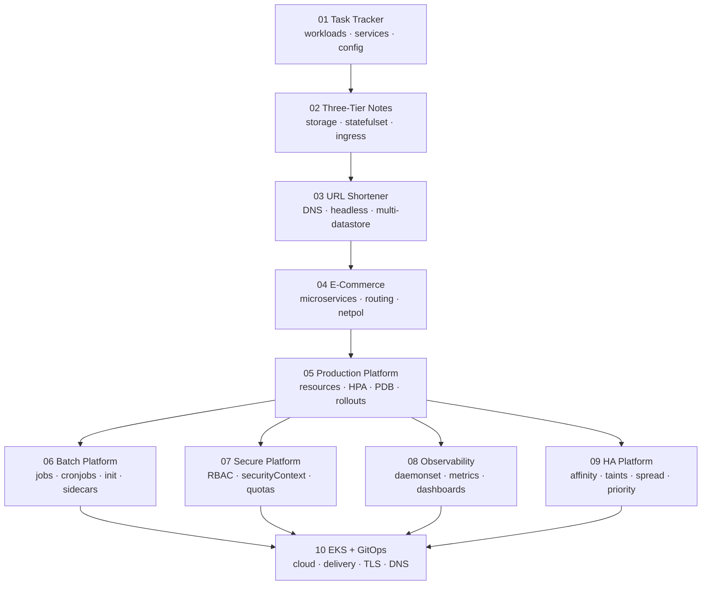

# Project Roadmap

Ten unique end-to-end projects. No project deploys plain nginx as its subject — each one is a real application with a
reason to exist, chosen so that the Kubernetes resource it teaches is *genuinely required*, not bolted on.

| # | Slug | Difficulty | Cluster | Est. time |
|---|---|---|---|---|
| 01 | `project-01-task-tracker-webapp` | 🟢 Beginner | single-node | 3–4 h |
| 02 | `project-02-three-tier-notes` | 🟢 Beginner+ | ingress | 4–5 h |
| 03 | `project-03-url-shortener` | 🟡 Intermediate | ingress | 4–5 h |
| 04 | `project-04-ecommerce-microservices` | 🟡 Intermediate | ingress | 5–6 h |
| 05 | `project-05-production-web-platform` | 🟡 Intermediate+ | multi-node | 5–6 h |
| 06 | `project-06-batch-processing-platform` | 🟡 Intermediate+ | ingress | 4–5 h |
| 07 | `project-07-secure-multi-tenant-platform` | 🔴 Advanced | multi-node | 5–6 h |
| 08 | `project-08-observability-stack` | 🔴 Advanced | multi-node | 5–6 h |
| 09 | `project-09-highly-available-platform` | 🔴 Advanced | multi-node | 5–6 h |
| 10 | `project-10-eks-gitops-production` | ⚫ Production | AWS EKS | 6–8 h + cost |

---

## Project 01 — Task Tracker Web App

**Application:** A personal task tracker. Static HTML/JS UI served by a small Python (Flask) web tier that
proxies to a Python REST API holding tasks in memory. No database — deliberately, so nothing distracts from the workload and networking fundamentals.

**The narrative:** Run the API as a single Pod → delete it → it's gone forever. Introduce ReplicaSet → delete a Pod →
it comes back. Try to update the image → discover ReplicaSets don't roll. Introduce Deployment → rolling update and
rollback. Frontend needs the API's IP → discover Pod IPs change → introduce Service. Hardcode the API URL → introduce
ConfigMap. Add an API token in plaintext → introduce Secret.

**Concepts covered**

| Category | Items |
|---|---|
| Workloads | Pod, ReplicaSet, Deployment, desired state, self-healing, rolling update, rollback |
| Networking | ClusterIP, labels & selectors, EndpointSlice, CoreDNS service discovery, `port-forward` |
| Config | ConfigMap (env + volume), Secret (env), base64 ≠ encryption |
| Ops | `apply`, `get -o wide`, `describe`, `logs`, `exec`, `scale`, `rollout status/history/undo`, `events` |
| Namespaces | Isolation, `-n`, context defaults |

**Failure labs:** `ImagePullBackOff` (bad tag), `CrashLoopBackOff` (bad start command), Service with a typo'd selector
→ zero endpoints, wrong `targetPort`, ConfigMap key rename → pod won't start, missing Secret.

**Why it's first:** it establishes the reference structure. Everything after this mirrors it.

---

## Project 02 — Three-Tier Notes Platform

**Application:** Notes app. Frontend (served static) → Backend API → **PostgreSQL**.

**The narrative:** Run Postgres as a Deployment with no volume → write notes → delete the pod → data gone. Introduce
`emptyDir` → still gone on reschedule. Introduce PVC + dynamic StorageClass → data survives. Then ask: what if we need
two Postgres replicas with stable names and their own volumes? → StatefulSet + headless Service. Meanwhile the app is
only reachable by `port-forward` → introduce NodePort, feel its limits → introduce Ingress + NGINX Ingress Controller.

**Concepts covered**

| Category | Items |
|---|---|
| Storage | `emptyDir`, `hostPath` (teaching only), PV, PVC, StorageClass, dynamic provisioning, access modes, reclaim policies, `volumeClaimTemplates` |
| Workloads | StatefulSet vs Deployment, ordered start-up, stable identity |
| Networking | Headless Service, NodePort, Ingress, **IngressClass**, Ingress Controller ≠ Ingress resource |
| Reliability | Readiness & liveness probes (DB connectivity), init container that waits for Postgres |
| Config | ConfigMap for DB host/name, Secret for credentials, `envFrom` |

**Failure labs:** `Pending` PVC (no matching StorageClass), pod stuck `ContainerCreating` on volume attach, Ingress
404 (wrong host/path), Ingress with no controller installed, readiness probe failing → endpoint removed from Service.

---

## Project 03 — URL Shortener

**Application:** `short.local/abc123` → `https://long.url/...`. Web UI + API + **Redis** (hot cache + counter) +
**PostgreSQL** (durable mappings). Optionally an ExternalName Service pointing at an out-of-cluster URL.

**The narrative:** Two backing stores with genuinely different needs. Redis as a StatefulSet with a headless Service
teaches per-pod DNS (`redis-0.redis.ns.svc.cluster.local`). We resolve names from inside a pod to see CoreDNS work.
Config that must never silently change mid-rollout introduces **immutable ConfigMaps**. An external analytics endpoint
introduces **ExternalName**.

**Concepts covered**

| Category | Items |
|---|---|
| Networking | Headless Service, per-pod DNS, CoreDNS internals, FQDN forms, ExternalName, service discovery patterns |
| Workloads | StatefulSet (Redis), Deployment (API/UI), init container running DB migrations |
| Config | Immutable ConfigMap, config-as-volume with subPath, checksum annotation to force rollout |
| Storage | `volumeClaimTemplates`, per-replica PVCs, what happens to PVCs when a StatefulSet is deleted |
| Ops | `kubectl exec` + `nslookup`/`dig`, `kubectl get endpointslices` |

**Failure labs:** DNS failure (wrong FQDN, wrong namespace), Redis pod rescheduled without its PVC, cache/DB
inconsistency after a rollout, headless Service used where ClusterIP was needed.

---

## Project 04 — E-Commerce Microservices

**Application:** Storefront + `catalog`, `cart`, `order`, `payment` services, Postgres, Redis. Services call each
other over cluster DNS — this is the first project with real **east-west** traffic.

**The narrative:** Five services, one entrypoint. Exposing each with its own LoadBalancer would cost five public IPs →
introduce Ingress with path and host based routing. Then: `payment` should only be reachable by `order`, and nothing
should reach the database except the services that own it → default-deny **NetworkPolicy**, then explicit allows.

**Concepts covered**

| Category | Items |
|---|---|
| Networking | Path-based + host-based Ingress routing, rewrite annotations, EndpointSlice, service-to-service DNS, NetworkPolicy (ingress + egress, default-deny), DNS egress gotcha |
| Delivery | Labels as the contract between Deployment ↔ Service ↔ NetworkPolicy, `app.kubernetes.io/*` at scale |
| Config | Per-service ConfigMaps and Secrets, shared vs owned configuration |
| Reliability | Probes per service, retry/timeout expectations, cascading failure demo |

**Failure labs:** NetworkPolicy blocks DNS (the classic egress mistake), Ingress 404 vs 502 vs 503 — what each means,
Service with no endpoints, one slow service taking down the storefront.

---

## Project 05 — Production Web Platform

**Application:** A traffic-serving web app with a deliberate CPU-burn endpoint and a configurable slow-shutdown mode,
so scaling and termination behaviour are observable rather than theoretical.

**The narrative:** Deploy with no `resources` → one pod starves the node → introduce requests/limits and QoS classes.
Load-test → introduce Metrics Server and **HPA**. Drain a node during a load test → pods all die at once → introduce
**PDB**. Roll out a new version → users see 502s → readiness probes + `maxSurge`/`maxUnavailable` + `preStop` +
`terminationGracePeriodSeconds`.

**Concepts covered**

| Category | Items |
|---|---|
| Resources | requests vs limits, CPU throttling vs OOMKill, QoS (Guaranteed/Burstable/BestEffort), LimitRange, ResourceQuota |
| Scaling | Metrics Server, HPA on CPU and memory, `behavior` scale-up/down policies, stabilisation window, manual `scale` |
| Reliability | Startup + readiness + liveness probes (and how to get them wrong), rolling update strategy, `rollout undo`, PDB, graceful termination, `preStop` hook, lifecycle |
| Delivery | Canary and blue/green **concepts** implemented with labels + Services |

**Failure labs:** OOMKilled, CPU-throttled latency, HPA that never scales (no requests set), liveness probe restart
loop caused by a too-short `initialDelaySeconds`, `kubectl drain` blocked by a badly-written PDB, zero-downtime
rollout broken by a missing `preStop`.

---

## Project 06 — Batch Processing Platform

**Application:** Image/report processing pipeline. API accepts jobs → Redis queue → worker Deployment consumes →
one-off **Job** for backfill → **CronJob** for nightly cleanup and DB backup.

**The narrative:** Long-running Deployments are wrong for work that finishes. Introduce Job (`completions`,
`parallelism`, `backoffLimit`, `ttlSecondsAfterFinished`), then CronJob (`schedule`, `concurrencyPolicy`,
`startingDeadlineSeconds`, history limits). Workers need schema ready before start → **init container**. Workers need
log shipping and a config reloader alongside → **sidecar**. Workers need to know their own pod name and namespace →
**Downward API**.

**Concepts covered**

| Category | Items |
|---|---|
| Workloads | Job, parallel Jobs, CronJob, `restartPolicy` semantics, backoff, TTL controller |
| Advanced pods | Init containers, sidecar containers (incl. native sidecar `restartPolicy: Always` init containers), `postStart`/`preStop`, Downward API, projected volumes |
| Storage | Shared `emptyDir` between containers, PVC for artifacts, `ReadWriteOnce` vs `ReadWriteMany` reality check |
| Ops | Debugging finished pods, `logs --previous`, job history inspection |

**Failure labs:** Job retrying forever (`backoffLimit` too high), CronJob missing runs
(`startingDeadlineSeconds`/clock), overlapping runs corrupting data (`concurrencyPolicy: Allow`), init container stuck
so the pod never starts, sidecar that never exits keeping a Job "running" forever.

---

## Project 07 — Secure Multi-Tenant Platform

**Application:** A small internal platform serving two tenants (`tenant-a`, `tenant-b`) plus a controller app that
reads Kubernetes objects through the API — which forces real RBAC rather than a toy Role.

**The narrative:** Everything so far ran as root with cluster-wide reach. Give the app its own **ServiceAccount**,
then least-privilege **Role**/**RoleBinding**, then show why a **ClusterRole** is sometimes required and how it
over-grants. Harden the pod: `runAsNonRoot`, `readOnlyRootFilesystem`, dropped capabilities, `seccompProfile`. Enforce
namespace-level **Pod Security Standards**. Stop tenants from eating the cluster with **ResourceQuota** +
**LimitRange**. Stop tenants from talking to each other with **NetworkPolicy**.

**Concepts covered**

| Category | Items |
|---|---|
| Identity | ServiceAccount, projected token, `automountServiceAccountToken: false`, `kubectl auth can-i` |
| RBAC | Role, ClusterRole, RoleBinding, ClusterRoleBinding, verbs/resources/apiGroups, aggregation, least privilege |
| Pod security | `securityContext` (pod + container), runAsNonRoot, non-root images, readOnlyRootFilesystem + writable `emptyDir`, capabilities, privilege escalation, Pod Security Standards labels |
| Isolation | Namespaces as tenancy boundary, ResourceQuota, LimitRange, default-deny NetworkPolicy |
| Secrets | imagePullSecrets, why base64 isn't security, External Secrets / Vault / cloud secret managers as the production answer |

**Failure labs:** `Forbidden` from the API (missing verb), pod rejected by PSS `restricted`, `CreateContainerError`
from `runAsNonRoot` with a root image, app crashing on a read-only filesystem, quota exhaustion producing
`FailedCreate` on the *ReplicaSet* (not the pod) — and how to find that.

---

## Project 08 — Observability Stack

**Application:** An instrumented web service exposing `/metrics`, deployed alongside **Prometheus**, **Grafana**,
**node-exporter** (DaemonSet) and **Metrics Server**.

**The narrative:** "Is it healthy?" can't be answered with `kubectl get pods`. Scrape application metrics, build RED
dashboards, alert on symptoms. node-exporter must run on every node → the only correct workload type is a
**DaemonSet**. Prometheus needs read access to the API for discovery → RBAC callback to Project 07.

**Concepts covered**

| Category | Items |
|---|---|
| Workloads | DaemonSet (rolling update, tolerations for control-plane nodes), StatefulSet for Prometheus storage |
| Observability | Prometheus scrape config + service discovery, ServiceMonitor concept, Grafana dashboards & provisioning, alert rules, RED/USE methods, health vs readiness endpoints |
| Metrics | Metrics Server, `kubectl top nodes/pods`, resource metrics vs custom metrics, HPA on custom metrics (concept) |
| Logging | stdout/stderr contract, log rotation, node-level agents, `logs -f --previous`, structured logging, centralised logging concepts |
| Ops | `kubectl events`, event retention, correlating events with metrics during an incident |

**Failure labs:** Prometheus target `DOWN` (wrong port/path/annotation), missing RBAC breaking discovery, Metrics
Server failing on Kind TLS (`--kubelet-insecure-tls`), Grafana datasource misconfigured, cardinality explosion.

---

## Project 09 — Highly Available Platform

**Application:** A multi-replica service on a **multi-node Kind cluster** with simulated zones
(`topology.kubernetes.io/zone=a|b|c`) and a dedicated node pool.

**The narrative:** Three replicas all landed on one node → that node dies → total outage. Introduce pod
**anti-affinity**. Spread evenly across zones → **topology spread constraints**. Keep general workloads off the
dedicated node pool → **taints & tolerations**, plus `nodeSelector`/**node affinity** to attract the right ones. Under
pressure, decide who gets evicted → **PriorityClass** and preemption. Protect availability during maintenance → PDB +
`kubectl drain`.

**Concepts covered**

| Category | Items |
|---|---|
| Scheduling | nodeSelector, node affinity (required vs preferred), pod affinity, pod anti-affinity, topology spread constraints (`maxSkew`, `whenUnsatisfiable`), taints/tolerations (`NoSchedule`/`PreferNoSchedule`/`NoExecute`), PriorityClass, preemption, `nodeName` |
| Reliability | PDB with `minAvailable` vs `maxUnavailable`, cordon/drain/uncordon, node failure simulation, eviction, `terminationGracePeriodSeconds` |
| Scaling | HPA interacting with anti-affinity (pods stuck `Pending`) |
| Ops | Reading the scheduler's `FailedScheduling` events like a pro |

**Failure labs:** Pods `Pending` forever (unsatisfiable anti-affinity), skew violation blocking scale-up, a taint
nobody tolerates, drain hanging on a PDB, low-priority workload evicted at the worst moment.

---

## Project 10 — Production EKS + GitOps

**Application:** Take the Project 05 platform and ship it properly on **AWS EKS**, delivered by **GitOps**.

**The narrative:** Everything local was a simulation. On EKS, `type: LoadBalancer` really provisions an NLB;
Ingress really provisions an ALB via the AWS Load Balancer Controller; PVCs really provision EBS volumes via the EBS
CSI driver; pods really get AWS permissions via IRSA / EKS Pod Identity instead of baked-in keys. Then delivery:
Kustomize base + overlays, a Helm introduction, and a Git-driven reconcile loop.

**Concepts covered**

| Category | Items |
|---|---|
| Cloud | EKS cluster (eksctl), managed node groups, AWS Load Balancer Controller, ALB (Ingress) vs NLB (Service), EBS CSI driver + `gp3` StorageClass, IRSA / EKS Pod Identity, Cluster Autoscaler vs Karpenter (concept), CloudWatch Container Insights, Route53, ACM TLS |
| Delivery | Kustomize base/overlays (dev/staging/prod), Helm chart anatomy & `helm template`, GitOps reconcile loop, sync/drift/rollback, sealed vs external secrets |
| Ops | Multi-env promotion, image tag policy (never `latest`), progressive delivery concepts |
| Cost | Cost table for every AWS resource created, plus a **mandatory** teardown checklist and orphan check |

**Failure labs:** Ingress creates no ALB (controller/IRSA/subnet tags), PVC `Pending` (missing EBS CSI driver or wrong
AZ), pod can't reach S3 (IRSA trust policy), TLS failing (ACM cert in the wrong region), GitOps drift silently
reverting a manual `kubectl edit`.

> ⚠️ **This project costs real money.** Every section is annotated with hourly cost and the project ends with a
> teardown script plus a manual "check for orphaned load balancers, EBS volumes, and elastic IPs" checklist.

---

## Progression Logic

**Rule:** 01→05 are sequential — each depends on intuition built by the previous one. 06–09 are siblings and can be
taken in any order once 05 is done. 10 assumes all of them.

---

## Adding More Projects

This roadmap is a floor, not a ceiling. Candidate follow-ups for practice, in the same format:

| Idea | Teaches |
|---|---|
| Chat app with WebSockets | Session affinity, long-lived connections, Ingress timeouts, graceful drain |
| Multi-cluster / multi-region concepts | Federation concepts, external DNS, failover |
| Service mesh introduction | Sidecar injection, mTLS, traffic splitting, observability |
| Custom controller / Operator | CRDs, controller pattern, reconcile loops, `client-go` |
| CI/CD pipeline on Kubernetes | Tekton/Argo Workflows, ephemeral build pods, registry auth |
| Cost & capacity lab | Right-sizing, VPA, bin-packing, requests hygiene |
| Disaster recovery lab | etcd/Velero backup & restore, PV snapshots |
| Windows/ARM mixed nodes | `nodeSelector` on `kubernetes.io/arch`, multi-arch images |

Follow [CONTRIBUTING.md](../CONTRIBUTING.md) — copy `templates/project-template/`, keep the numbering conventions,
and update the [coverage matrix](RESOURCE-COVERAGE-MATRIX.md).
