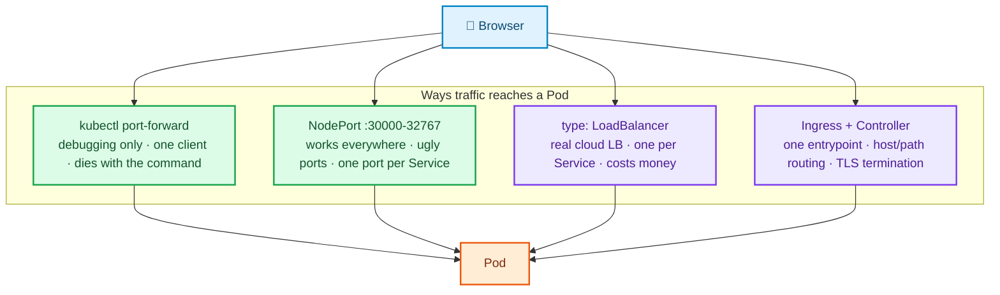

# Local vs Cloud Deployment Strategy

Kubernetes is not one environment. The same manifest behaves differently on Kind, Minikube, and EKS — and most
tutorials hide that, which is exactly why `type: LoadBalancer` confuses so many beginners.

This page is the repository's honest reference for what is **real** and what is **simulated**.

---

## 1. Strategy

| Projects | Target | Rationale |
|---|---|---|
| 01–09 | **Kind** (Minikube documented as an alternative) | Free, fast, disposable, reproducible, no account needed |
| 10 | **AWS EKS** | Cloud-only behaviour (ALB, EBS CSI, IRSA, ACM, Route53) cannot be simulated truthfully |
| AKS / GKE | Concept call-outs inside projects | Equivalent concepts, different names; documented, not maintained as a third path |

Cloud sections are always **optional**, always cost-annotated, and always end with teardown.

---

## 2. Cluster Configurations

| Config | Nodes | Used by | Notes |
|---|---|---|---|
| `clusters/kind-single-node.yaml` | 1 control-plane | P01 | Smallest possible surface |
| `clusters/kind-ingress.yaml` | 1 control-plane + 1 worker | P02, P03, P04, P06 | `extraPortMappings` 80/443 so Ingress works on `localhost` |
| `clusters/kind-multi-node.yaml` | 1 control-plane + 3 workers, `topology.kubernetes.io/zone=a|b|c` | P05, P07, P08, P09 | Enables real scheduling, spread, drain, and taint labs |

Each project README states which config it needs. Recreating a cluster takes ~60 seconds — when in doubt, delete and
recreate rather than debugging a polluted cluster.

---

## 3. External Access — the four options, honestly



| Method | Kind | Minikube | EKS/AKS/GKE | Use it for |
|---|---|---|---|---|
| `port-forward` | ✅ | ✅ | ✅ | Debugging a single pod or Service. **Never** production. |
| NodePort | ✅ (needs `extraPortMappings`) | ✅ (`minikube service`) | ✅ (open the security group) | Learning, and clusters with no LB integration |
| LoadBalancer | ⚠️ `<pending>` unless Cloud Provider KIND / MetalLB | ⚠️ needs `minikube tunnel` | ✅ real NLB/ALB/Cloud LB | Production L4 exposure |
| Ingress | ✅ NGINX + `extraPortMappings` | ✅ `minikube addons enable ingress` | ✅ + cloud controller | Production HTTP(S) routing |

### ⚠️ The LoadBalancer truth

`type: LoadBalancer` does nothing by itself. It asks a **cloud controller manager** to provision an external load
balancer. Kind ships no cloud controller, so the Service sits at:

```
NAME      TYPE           CLUSTER-IP     EXTERNAL-IP   PORT(S)
web-lb    LoadBalancer   10.96.14.22    <pending>     80:31480/TCP
```

`<pending>` forever is **correct behaviour**, not a bug. To make it resolve locally, install one of:

| Option | What it does | When we use it |
|---|---|---|
| **Cloud Provider KIND** | Runs a local cloud-controller that assigns Docker-network IPs to LB Services | Preferred for the LoadBalancer lab |
| **MetalLB** | Bare-metal L2/BGP load balancer; assigns IPs from a pool you define | Alternative; shown as the bare-metal answer |
| NodePort fallback | The Service still has a NodePort — reachable via `extraPortMappings` | Always available |

Every project that shows a LoadBalancer Service labels the section as **local simulation** and contrasts it with the
Project 10 EKS behaviour.

---

## 4. Ingress — controller ≠ resource

> **An Ingress resource is just data.** Without an Ingress **Controller** watching for it, nothing happens: no error,
> no routing, no clue. This is the single most common beginner trap in Kubernetes.

```
Browser → localhost:80 (Kind extraPortMapping)
        → NGINX Ingress Controller Pod (hostPort on the node)
        → reads Ingress rules (host + path)
        → Service (ClusterIP)
        → EndpointSlice
        → Pod → Container
```

Kind setup used throughout the repository:

```bash
# 1. Cluster must expose 80/443 — this is why clusters/kind-ingress.yaml exists
kind create cluster --name kubernetes-lab --config clusters/kind-ingress.yaml

# 2. Install the NGINX Ingress Controller (Kind-specific manifest)
kubectl apply -f https://raw.githubusercontent.com/kubernetes/ingress-nginx/main/deploy/static/provider/kind/deploy.yaml

# 3. Wait until the controller is actually ready (skipping this causes the
#    "failed calling webhook ingress-nginx-controller-admission" error)
kubectl wait --namespace ingress-nginx \
  --for=condition=ready pod \
  --selector=app.kubernetes.io/component=controller \
  --timeout=120s

# 4. Confirm the IngressClass exists — your Ingress must reference it
kubectl get ingressclass
```

Host-based routing on a laptop needs `/etc/hosts` entries (or `nip.io`):

```
127.0.0.1  notes.local shop.local short.local grafana.local
```

**Minikube difference:** `minikube addons enable ingress`, then use `minikube ip` instead of `127.0.0.1`.

---

## 5. Storage differences

| Aspect | Kind | Minikube | EKS | AKS | GKE |
|---|---|---|---|---|---|
| Default StorageClass | `standard` (local-path-provisioner) | `standard` (hostPath) | none by default — install EBS CSI | `default`/`managed-csi` | `standard-rwo` |
| Backing store | Directory on the node container | Directory on the VM | EBS volume | Azure Disk | PD |
| Survives pod reschedule | Only on the same node | Only on the same node | Yes (within the AZ) | Yes | Yes |
| Survives cluster delete | ❌ | ❌ | ✅ (unless reclaimed) | ✅ | ✅ |
| ReadWriteMany | ❌ | ❌ | EFS CSI | Azure Files | Filestore |
| AZ constraint | n/a | n/a | ⚠️ EBS is single-AZ — pod must schedule in the volume's AZ | similar | similar |

> ⚠️ **Kind data is not durable.** `kind delete cluster` destroys every PV. That's a feature for a lab and a
> catastrophe in production — the difference is the reclaim policy and the backing storage, both taught in Project 02.

---

## 6. Other behavioural differences worth knowing

| Behaviour | Kind | Minikube | Cloud |
|---|---|---|---|
| Image source | Must `kind load docker-image`, or pull from a registry | `minikube image load` / `eval $(minikube docker-env)` | Pull from ECR/ACR/GAR/Docker Hub |
| Metrics Server | Not installed; needs `--kubelet-insecure-tls` | `minikube addons enable metrics-server` | Usually preinstalled or an add-on |
| Node count | Containers on one host — no real failure isolation | Single VM by default | Real machines across real AZs |
| Node failure sim | `docker stop <node-container>` | `minikube node stop` | Terminate the instance |
| Control plane access | Full — you can `docker exec` into the node | Full | Managed and hidden |
| DNS | CoreDNS | CoreDNS | CoreDNS (+ cloud DNS integration) |
| NetworkPolicy enforcement | ⚠️ **kindnet does not enforce it** — install Calico or Cilium | ⚠️ needs a CNI that enforces | ✅ enforced (VPC CNI + policy agent, Calico, Cilium) |

> ⚠️ **NetworkPolicy trap:** on a default Kind cluster you can apply a `default-deny` policy and traffic still flows,
> because the default CNI ignores policies. Projects 04 and 07 install a policy-enforcing CNI first and prove
> enforcement with a `kubectl exec … curl` test *before* teaching the rules.

---

## 7. Cloud sections

Optional per-project appendices, always in this shape:

1. **What changes vs local** — concretely, which fields and which behaviours
2. **Prerequisites** — CLI tools, IAM permissions, quotas
3. **Cost estimate table** — hourly and per-lab totals
4. **Deployment steps**
5. **Validation**
6. **Teardown** — scripted, followed by a manual orphan checklist

### Project 10 (EKS) cost awareness

| Resource | Approx. cost |
|---|---|
| EKS control plane | ~$0.10/hour |
| 2 × t3.medium managed nodes | ~$0.08/hour |
| Application Load Balancer | ~$0.023/hour + LCU |
| Network Load Balancer | ~$0.023/hour + LCU |
| 2 × 20 GiB gp3 EBS | ~$0.005/hour |
| NAT Gateway (if used) | ~$0.045/hour + data — **the usual surprise on the bill** |

> ⚠️ Teardown is **mandatory**, and deleting the cluster is not enough. Load balancers and EBS volumes created *by
> Kubernetes* can outlive `eksctl delete cluster` if their owning objects weren't deleted first. Project 10 deletes
> Services and Ingresses, waits, then deletes the cluster, then greps for orphans.

### Cloud equivalents at a glance

| Concept | AWS EKS | Azure AKS | Google GKE |
|---|---|---|---|
| L7 from Ingress | ALB (AWS Load Balancer Controller) | Application Gateway (AGIC) | GCE Ingress / GCLB |
| L4 from Service | NLB | Azure Load Balancer | Network LB |
| Block storage | EBS CSI (`gp3`) | Azure Disk CSI | PD CSI |
| Shared filesystem | EFS CSI | Azure Files CSI | Filestore |
| Pod → cloud identity | IRSA / EKS Pod Identity | Workload Identity | Workload Identity |
| Managed TLS | ACM | App Gateway cert / Key Vault | Google-managed certs |
| DNS automation | Route53 (+ ExternalDNS) | Azure DNS (+ ExternalDNS) | Cloud DNS (+ ExternalDNS) |
| Metrics/logs | CloudWatch Container Insights | Azure Monitor | Cloud Operations |
| Node autoscaling | Cluster Autoscaler / Karpenter | Cluster Autoscaler | Autopilot / CA |


---

## 8. Official references

The claims on this page are deliberately contrarian to a lot of tutorial content, so here are the primary sources.
*(All links verified 2026-08-09.)*

| Claim on this page | Source |
|---|---|
| `type: LoadBalancer` needs a cloud controller; `<pending>` on Kind is correct | [Service — LoadBalancer](https://kubernetes.io/docs/concepts/services-networking/service/) · [Kind — LoadBalancer](https://kind.sigs.k8s.io/docs/user/loadbalancer/) |
| An Ingress resource does nothing without a controller | [Ingress](https://kubernetes.io/docs/concepts/services-networking/ingress/) · [Kind — Ingress](https://kind.sigs.k8s.io/docs/user/ingress/) |
| NetworkPolicy is ignored unless the CNI enforces it | [Network policies](https://kubernetes.io/docs/concepts/services-networking/network-policies/) |
| ClusterIP is an iptables/IPVS rule, not a process | [Virtual IPs and Service proxies](https://kubernetes.io/docs/reference/networking/virtual-ips/) |
| Storage classes, access modes and reclaim policies differ per platform | [Persistent Volumes](https://kubernetes.io/docs/concepts/storage/persistent-volumes/) |
| Metrics Server needs `--kubelet-insecure-tls` on Kind | [Metrics Server](https://kubernetes-sigs.github.io/metrics-server/) |
| Local images must be loaded into the cluster | [Kind — quick start](https://kind.sigs.k8s.io/docs/user/quick-start/) · [Images](https://kubernetes.io/docs/concepts/containers/images/) |
