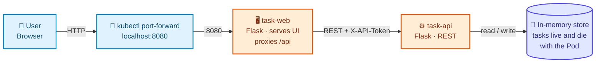
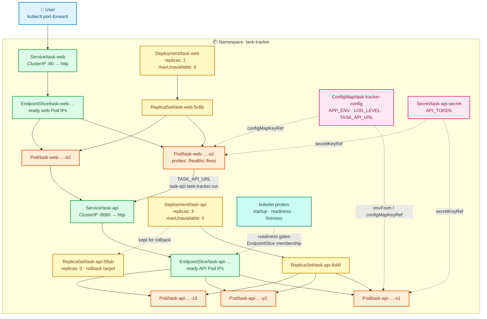

# Project 01 — Task Tracker Web App

> **Difficulty:** 🟢 Beginner
> **Estimated time:** 3–4 hours
> **Cluster required:** [`clusters/kind-single-node.yaml`](../clusters/kind-single-node.yaml)
> **Assumes:** basic Docker (images, containers, ports, env vars). **No prior Kubernetes knowledge.**

This is the reference implementation for the repository. Every later project mirrors its structure.

---

## 1. What Are We Building?

A personal task tracker: add a task, list tasks, delete a task. Two tiers, deployed to Kubernetes and then broken
repeatedly on purpose.

| Component | Technology | Responsibility | Port |
|---|---|---|---|
| `task-web` | Python 3.13 · Flask · gunicorn | Serves the UI and **proxies `/api/*` to the backend** | 8080 |
| `task-api` | Python 3.13 · Flask · gunicorn | REST API, tasks held in memory | 8080 |

**Why no database?** Deliberate. This project is about workloads, networking and configuration. A database would add
storage concepts before you understand Pods — and losing data is the opening lesson of Project 02, where it belongs.

**Why does the web tier proxy instead of the browser calling the API directly?** Because that makes `task-web` a
*real in-cluster consumer* of `task-api`: it resolves the backend by DNS and connects over the cluster network. That
is exactly the problem a Service solves. If the browser called the backend directly, "Pod IPs are unstable" would be
a claim you read rather than a failure you watch happen.

---

## 2. Why This Project?

Most tutorials hand you a Deployment and a Service on page one, so you learn the syntax and never the reason.

Here you start with a bare Pod, delete it, and watch your application vanish permanently. Only then does a ReplicaSet
appear. You try to ship a new version, discover ReplicaSets can't roll out, and only then meet Deployments. You
hardcode a Pod IP, watch it break on the next Pod restart, and only then meet Services.

**Every resource arrives as the answer to a failure you just experienced.**

---

## 3. Learning Objectives

By the end you will be able to:

- [ ] Explain what a Pod is and why Kubernetes schedules Pods rather than containers
- [ ] Explain the `Deployment → ReplicaSet → Pod` chain and what each layer is responsible for
- [ ] Perform a rolling update and a rollback, and explain what `rollout undo` actually does
- [ ] Explain why Pod IPs cannot be used directly, and how `Service → EndpointSlice → Pods` fixes it
- [ ] Debug a Service with no endpoints (the most common silent failure in Kubernetes)
- [ ] Externalise configuration with a ConfigMap, and explain why env vars don't update on a running Pod
- [ ] Explain why base64 is not encryption and what actually protects a Secret
- [ ] Distinguish readiness from liveness probes and explain why confusing them causes outages
- [ ] Diagnose `ImagePullBackOff`, `CrashLoopBackOff`, `CreateContainerConfigError` and empty endpoints from
      `kubectl describe` alone

---

## 4. Technologies Used

| Layer | Choice | Why |
|---|---|---|
| Language | Python 3.13 | Readable by everyone; the app is never the hard part |
| Framework | Flask 3.1 | Minimal, no magic to explain away |
| Server | gunicorn 23 | Handles SIGTERM gracefully — required for zero-downtime rollouts |
| Base image | `python:3.13-slim`, two-stage build | Small image, no build tools in the runtime layer |
| Container user | UID 10001, non-root | Project 07 enforces this cluster-wide; start correct |
| Cluster | Kind (single node) | Free, disposable, recreated in a minute |

---

## 5. Prerequisites

| Tool | Version | Verify |
|---|---|---|
| Docker | 24+ | `docker version` |
| kubectl | 1.29+ | `kubectl version --client` |
| Kind | 0.23+ | `kind version` |

```bash
# From the repository root
kind create cluster --name kubernetes-lab --config clusters/kind-single-node.yaml
kubectl cluster-info --context kind-kubernetes-lab
kubectl get nodes
```

---

## 6. Application Architecture — HLD

*What the application is, ignoring Kubernetes entirely.*



---

## 7. Kubernetes Architecture — LLD

*Every object this project creates and how they wire together. This is the diagram to come back to when something
doesn't work.*



**Legend** — colours mean the same thing in every project in this repository:

| Colour | Layer | Colour | Layer |
|---|---|---|---|
| 🟦 blue | External / user | 🟧 orange | Pods / containers |
| 🟩 green | Networking (Service, EndpointSlice) | 🩷 pink | Config / Secrets |
| 🟨 yellow | Workload controllers | 🟩 teal | Observability / probes |

Diagram source: [`architecture/architecture.mmd`](architecture/architecture.mmd)

---

## 8. Request Flow

| # | Hop | What happens | Fails when |
|---|---|---|---|
| 1 | Browser → `localhost:8080` | `kubectl port-forward` tunnels through the API server | The port-forward died (it's a foreground process) |
| 2 | → `Service/task-web` | ClusterIP; kube-proxy DNATs to a ready web Pod | No ready web Pods → empty EndpointSlice |
| 3 | → `Pod/task-web` | Flask serves `index.html` | Container not listening on `0.0.0.0:8080` |
| 4 | Browser JS → `/api/tasks` | Same-origin request back to `task-web` | — |
| 5 | `task-web` → CoreDNS | Resolves `task-api.task-tracker.svc.cluster.local` | Wrong namespace or FQDN in `TASK_API_URL` |
| 6 | → `Service/task-api` | ClusterIP `:8080` | Service selector doesn't match Pod labels |
| 7 | → EndpointSlice → Pod | kube-proxy picks a **ready** backend Pod | `targetPort` wrong → connection refused |
| 8 | `task-api` validates `X-API-Token` | Compares against the Secret value | Tiers disagree → 401, though everything is "healthy" |
| 9 | → in-memory store → response | Returns JSON | — |

Full sequence diagram: [`architecture/request-flow.md`](architecture/request-flow.md)

---

## 9. Kubernetes Resources Used

| Resource | Why We Need It | Application Usage | Stage |
|---|---|---|---|
| Namespace | Scope + one-command cleanup | `task-tracker` | [00](manifests/00-namespace/README.md) |
| Pod | The smallest schedulable unit | Run the API once, by hand | [01](manifests/01-pods/README.md) |
| ReplicaSet | Keep N Pods alive; self-healing | 3 API replicas | [02](manifests/02-replicasets/README.md) |
| Deployment | Versioned rollouts + rollback | Both tiers | [03](manifests/03-deployments/README.md) |
| Service (ClusterIP) | Stable address for changing Pods | `task-web` → `task-api` | [04](manifests/04-services/README.md) |
| EndpointSlice | Tracks which Pods are *ready* | Auto-managed | [04](manifests/04-services/README.md) |
| ConfigMap | Config outside the image | API URL, log level, env | [05](manifests/05-configmaps/README.md) |
| Secret | Credentials handled separately | `API_TOKEN` | [06](manifests/06-secrets/README.md) |
| Probes | Ready ≠ Running | Startup, readiness, liveness | [11](manifests/11-health-checks/README.md) |
| Kustomize | One declarative end state | Final manifest | [19](manifests/19-final/README.md) |

---

## 10. Deployment Journey

Each stage introduces **one** idea, motivated by the failure in the stage before it. Read the chain top to bottom —
every arrow is a failure you will actually see on your own cluster.

```mermaid
flowchart TB
    S0["**Stage 00 · Namespace**<br/>a scope to put things in"]:::stage
    F0(["❌ nothing runs yet"]):::fail
    S1["**Stage 01 · Pod**<br/>run the container"]:::stage
    F1(["❌ delete the Pod →<br/>gone forever"]):::fail
    S2["**Stage 02 · ReplicaSet**<br/>keep N Pods alive"]:::stage
    F2(["❌ change the image →<br/>nothing rolls out"]):::fail
    S3["**Stage 03 · Deployment**<br/>versioned rollouts + rollback"]:::stage
    F3(["❌ hardcoded Pod IP →<br/>502 after any restart"]):::fail
    S4["**Stage 04 · Service**<br/>stable name + load balancing"]:::stage
    F4(["❌ config hardcoded<br/>in workload specs"]):::fail
    S5["**Stage 05 · ConfigMap**<br/>config outside the image"]:::stage
    F5(["❌ the API token would<br/>go in plaintext too"]):::fail
    S6["**Stage 06 · Secret**<br/>credentials handled apart"]:::stage
    F6(["❌ READY 1/1 before<br/>the app can serve"]):::fail
    S11["**Stage 11 · Probes**<br/>ready actually means ready"]:::stage
    F11(["❌ final state spread<br/>across three stages"]):::fail
    S19["**Stage 19 · Final**<br/>one declarative end state"]:::stage
    NEXT["▶ Project 02<br/>your data dies with every Pod"]:::next

    S0 --> F0 --> S1 --> F1 --> S2 --> F2 --> S3 --> F3 --> S4
    S4 --> F4 --> S5 --> F5 --> S6 --> F6 --> S11 --> F11 --> S19 --> NEXT

    classDef stage fill:#fef9c3,stroke:#ca8a04,stroke-width:2px,color:#713f12
    classDef fail  fill:#fee2e2,stroke:#dc2626,stroke-width:2px,color:#7f1d1d
    classDef next  fill:#e0f2fe,stroke:#0284c7,stroke-width:2px,color:#0c4a6e
```



| Stage | Problem it solves | The failure that motivates the next stage |
|---|---|---|
| [00 — Namespace](manifests/00-namespace/README.md) | Objects scattered in `default` | Nothing runs yet |
| [01 — Pods](manifests/01-pods/README.md) | Get the app running at all | **Delete the Pod → it's gone forever** |
| [02 — ReplicaSets](manifests/02-replicasets/README.md) | Self-healing, N replicas | **Change the image → nothing rolls out** |
| [03 — Deployments](manifests/03-deployments/README.md) | Rolling updates, rollback | **Hardcoded Pod IP → 502 after any restart** |
| [04 — Services](manifests/04-services/README.md) | Stable name, load balancing | **Config is hardcoded in workload specs** |
| [05 — ConfigMaps](manifests/05-configmaps/README.md) | Config outside the image | **The API token would go in plaintext too** |
| [06 — Secrets](manifests/06-secrets/README.md) | Credentials handled apart | **`READY 1/1` before the app can serve** |
| [11 — Health Checks](manifests/11-health-checks/README.md) | Ready means ready | **Final state spread across three stages** |
| [19 — Final](manifests/19-final/README.md) | One declarative end state | → Project 02 |

> Stages 07–10 and 12–18 are absent because this project doesn't need storage, ingress, autoscaling or scheduling.
> **Numbers are identities, not positions** — `07` means storage in every project in this repository, so gaps are
> left rather than renumbered.

### Two ways to run this project

| Path | Use it | Start here |
|---|---|---|
| **Manual (do this first)** | Every command typed by hand and explained — what it does, expected output, what to do when it fails | [`scripts/manual-steps.md`](scripts/manual-steps.md) |
| **Scripted** | After you've done it once, or to reset quickly | `./scripts/build-images.sh && ./scripts/deploy.sh` |

> The scripts do nothing that isn't written out in `manual-steps.md`. Run only the script and you've learned a shell
> script, not Kubernetes.

### Reading order

Follow this exactly the first time — it's about 3–4 hours and every step depends on the one before it.

| # | Do this | Where | Time |
|---|---|---|---|
| 1 | Read sections 1–9 above (what you're building and why) | this file | 15 min |
| 2 | Create the cluster and build the images | [`scripts/manual-steps.md`](scripts/manual-steps.md) Parts 1–2 | 15 min |
| 3 | **Walk the stages in order**, reading each README fully and running its commands | [Stage 00 ▶](manifests/00-namespace/README.md) | 2 h |
| 4 | Run the failure labs | [`failure-labs/labs.md`](failure-labs/labs.md) | 45 min |
| 5 | Attempt the exercises before opening solutions | [`exercises/`](exercises/) | 30 min+ |
| 6 | Review the interview questions | [`interview-questions/questions.md`](interview-questions/questions.md) | 20 min |
| 7 | Clean up | [`scripts/manual-steps.md`](scripts/manual-steps.md) Part 5 | 2 min |

Every stage README carries a breadcrumb and a **◀ Previous / Next ▶** footer, so you can always tell where you are
and what comes next without returning here.

---

## 11. Validation

```bash
./scripts/validate.sh
```

| Check | Command | Expected |
|---|---|---|
| Pods ready | `kubectl get pods -n task-tracker` | 3 × `task-api`, 2 × `task-web`, all `1/1 Running` |
| Endpoints populated | `kubectl get endpointslices -n task-tracker` | Pod IPs listed, never `<unset>` |
| App responds | `curl localhost:8080/api/tasks` | JSON array of tasks |
| Config applied | `curl localhost:8080/api/info` | `"auth_enabled": true` |

---

## 12. Testing

```bash
kubectl port-forward svc/task-web 8080:80 -n task-tracker
```

Open <http://localhost:8080>, add and delete a few tasks. Refresh repeatedly and watch the **"served by pod"** line
at the bottom change — that's kube-proxy load-balancing across three backend Pods.

> ⚠️ **Tasks differ between Pods.** Each API Pod holds its own in-memory list, so the task you added may vanish on the
> next refresh when a different Pod answers. That is not a bug — it is a *demonstration* that stateless scaling and
> in-memory state don't mix, and it's exactly the problem Project 02 solves with a database.

---

## 13. Failure Simulation

Twelve labs in [`failure-labs/labs.md`](failure-labs/labs.md), each **break → observe → diagnose → fix**:

| # | You break | You should see | You learn |
|---|---|---|---|
| 1 | Delete a Pod | Replacement with a new name and IP | Reconciliation, cattle not pets |
| 2 | Bad image tag | `ImagePullBackOff` | Reading `describe` events |
| 3 | Bad start command | `CrashLoopBackOff` | `logs --previous` |
| 4 | Typo the Service selector | Empty EndpointSlice, 502 | Selectors are the wiring |
| 5 | Wrong `targetPort` | Endpoints exist but refused | Service vs Pod layer |
| 6 | Rename a ConfigMap key | `CreateContainerConfigError` | Config is a hard dependency |
| 7 | Delete the Secret | `CreateContainerConfigError`, old Pods keep serving | `maxUnavailable: 0` protects you |
| 8 | Mismatch the API token | 401s while everything is "healthy" | Green status ≠ working app |
| 9 | Break the readiness path | Rollout stalls, old Pods serve | Readiness gates rollouts |
| 10 | Point liveness at `/healthz` | Restart loop, exit code 137 | The classic self-inflicted outage |
| 11 | Scale to 0 | Service with no endpoints | Where 503s come from |
| 12 | Delete the ReplicaSet | Deployment recreates it | Ownership and garbage collection |

---

## 14. Troubleshooting

Full table: [`troubleshooting/common-errors.md`](troubleshooting/common-errors.md)

| Symptom | First command | Likely cause |
|---|---|---|
| `Pending` | `kubectl describe pod` → Events | Insufficient resources, unschedulable |
| `ImagePullBackOff` | `kubectl describe pod` | Image not `kind load`ed, or `imagePullPolicy: Always` |
| `CrashLoopBackOff` | `kubectl logs --previous` | App exits on start |
| `CreateContainerConfigError` | `kubectl describe pod` | Missing ConfigMap/Secret key |
| `0/1 READY` but `Running` | `kubectl describe pod` | Readiness probe failing |
| 502 from the UI | `kubectl logs deployment/task-web` | Backend unreachable — check endpoints |
| Empty endpoints | `kubectl get endpointslices` | Selector mismatch, or no Pod is Ready |

**The universal first three commands:**

```bash
kubectl get pods -n task-tracker -o wide
kubectl describe pod <pod> -n task-tracker        # read the Events at the bottom
kubectl get events -n task-tracker --sort-by=.lastTimestamp
```

---

## 15. Production Considerations

> 🧪 **DEMO / LEARNING CONFIGURATION**
> In-memory state, no resource requests or limits, a Secret committed to Git, an unauthenticated `/debug` endpoint,
> single-node cluster, access via `port-forward`.

> 🏭 **PRODUCTION CONSIDERATIONS**
> - **State** → a real datastore; in-memory data dies with every Pod (Project 02)
> - **Resources** → set `requests` and `limits`; without requests the scheduler is guessing (Project 05)
> - **Availability** → spread replicas across nodes with anti-affinity + a PodDisruptionBudget (Projects 05, 09)
> - **Exposure** → Ingress with TLS, not `port-forward` (Projects 02, 04)
> - **Scaling** → HPA on CPU, which requires resource requests to exist (Project 05)
> - **Graceful shutdown** → add a `preStop` sleep so Pods leave the EndpointSlice before SIGTERM (Project 05)
> - **Images** → pin by digest, scan in CI, use a private registry with `imagePullSecrets`
> - **Observability** → export metrics, scrape them, alert on symptoms (Project 08)

---

## 16. Security Considerations

| Area | This project | Production |
|---|---|---|
| Secrets | base64 in Git | External Secrets Operator / Sealed Secrets / cloud secret manager |
| Encryption at rest | Off (Kind default) | `EncryptionConfiguration` for etcd |
| Container user | ✅ non-root (UID 10001) | Also `readOnlyRootFilesystem`, drop all capabilities |
| Pod securityContext | ❌ not set | `runAsNonRoot`, `allowPrivilegeEscalation: false`, seccomp (Project 07) |
| RBAC | Default ServiceAccount, auto-mounted token | Dedicated SA, least privilege, `automountServiceAccountToken: false` (Project 07) |
| Network | Flat — any Pod can reach any Pod | Default-deny NetworkPolicy (Projects 04, 07) |
| Debug endpoints | `/debug/toggle-ready` open | Removed or authenticated |
| Images | Explicit tags, non-root, slim base | Digest-pinned, scanned, signed |

---

## 17. Interview Questions

Full set with model answers: [`interview-questions/questions.md`](interview-questions/questions.md)

> 🎯 What's the difference between a Deployment and a ReplicaSet, and when would you create a ReplicaSet directly?
> 🎯 A Pod is `Running` but the Service returns connection refused. Walk me through your debugging.
> 🎯 Are Kubernetes Secrets encrypted?
> 🎯 What's the difference between a readiness and a liveness probe, and what happens if you swap them?
> 🎯 You edited a ConfigMap but the app still uses the old value. Why, and how do you fix it?

---

## 18. Exercises

| Level | File |
|---|---|
| Beginner | [`exercises/beginner.md`](exercises/beginner.md) |
| Intermediate | [`exercises/intermediate.md`](exercises/intermediate.md) |
| Advanced | [`exercises/advanced.md`](exercises/advanced.md) |

Solutions in [`exercises/solutions/`](exercises/solutions/) — try first.

---

## 19. Cleanup

```bash
./scripts/cleanup.sh

# Confirm
kubectl get all -n task-tracker
kubectl get pv
```

Or reset everything:

```bash
kind delete cluster --name kubernetes-lab
```

---

## 📚 Further Reading — official documentation

Each stage README ends with references specific to that resource. These are the repository-wide starting points.
*(All links verified 2026-08-09.)*

| Topic | Official reference |
|---|---|
| Kubernetes components & architecture | [Cluster architecture](https://kubernetes.io/docs/concepts/architecture/) |
| Object basics (`apiVersion`, `kind`, `spec`) | [Working with objects](https://kubernetes.io/docs/concepts/overview/working-with-objects/) |
| Pods · ReplicaSets · Deployments | [Pods](https://kubernetes.io/docs/concepts/workloads/pods/) · [ReplicaSet](https://kubernetes.io/docs/concepts/workloads/controllers/replicaset/) · [Deployment](https://kubernetes.io/docs/concepts/workloads/controllers/deployment/) |
| Services, DNS, EndpointSlices | [Service](https://kubernetes.io/docs/concepts/services-networking/service/) · [DNS](https://kubernetes.io/docs/concepts/services-networking/dns-pod-service/) · [EndpointSlices](https://kubernetes.io/docs/concepts/services-networking/endpoint-slices/) |
| ConfigMaps & Secrets | [ConfigMap](https://kubernetes.io/docs/concepts/configuration/configmap/) · [Secret](https://kubernetes.io/docs/concepts/configuration/secret/) |
| Probes | [Configure probes](https://kubernetes.io/docs/tasks/configure-pod-container/configure-liveness-readiness-startup-probes/) |
| Debugging | [Debug applications](https://kubernetes.io/docs/tasks/debug/debug-application/) · [Debug a running Pod](https://kubernetes.io/docs/tasks/debug/debug-application/debug-running-pod/) |
| Every command used here | [kubectl reference](https://kubernetes.io/docs/reference/kubectl/) |
| Kind (the local cluster) | [Kind quick start](https://kind.sigs.k8s.io/docs/user/quick-start/) |

> **These are for going deeper, not for filling gaps.** Every stage teaches its resource completely; you should never
> need to leave a lesson to understand it.

---

## 20. What's Next

You can run, expose, configure and health-check a stateless application. The obvious gap: **your data dies with every
Pod.**

Project 02 adds PostgreSQL, watches the data disappear, and introduces PersistentVolumes, PVCs, StorageClasses,
StatefulSets, and real external access via Ingress.

→ **[Project 02 — Three-Tier Notes Platform](../project-02-three-tier-notes/README.md)**
