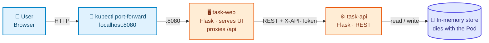

# Architecture — Project 01, Task Tracker

## 1. Design Decisions

| Question | Answer |
|---|---|
| What is the application? | A two-tier task tracker: a Flask web tier serving a small SPA and proxying `/api/*` to a Flask REST API that holds tasks in memory. |
| Why is it interesting as a Kubernetes lesson? | Two tiers is the minimum needed for **service-to-service** communication, which is the only way to make "Pod IPs are unstable" a failure you *watch* rather than a claim you read. |
| Why no database? | Storage would introduce PVs/PVCs before Pods are understood. Losing data is the opening lesson of Project 02 — it belongs there, not here. |
| Why does the web tier proxy? | It makes `task-web` a real in-cluster client of `task-api`: DNS resolution plus a cluster-network connection. A browser calling the API directly would bypass the very mechanism being taught. |
| Which stages apply? | 00, 01, 02, 03, 04, 05, 06, 11, 19 |
| Which are skipped, and why? | 07–10 (no storage, no external ingress — `port-forward` is enough at this level), 12–18 (resources, HPA, PDB, RBAC, jobs, observability, scheduling all need context this project hasn't built yet) |
| What does it add to the coverage matrix? | First 🟩 for Pod, ReplicaSet, Deployment, ClusterIP Service, EndpointSlice, ConfigMap, Secret, probes, rolling update/rollback, self-healing |

---

## 2. High-Level Design (HLD)



### Component responsibilities

| Component | Technology | Responsibility | Port | Stateful? |
|---|---|---|---|---|
| `task-web` | Python 3.13 · Flask · gunicorn (2 workers) | Serve `index.html`; proxy `/api/*` to the API adding `X-API-Token` | 8080 | No |
| `task-api` | Python 3.13 · Flask · gunicorn (1 worker) | CRUD over `/api/tasks`; `/api/info`; `/healthz`; `/livez` | 8080 | **Yes — in memory** |

> **Why one gunicorn worker on the API:** tasks live in the process's memory. Two workers would each hold their own
> copy and return different data depending on which answered. That constraint is a deliberate, visible demonstration
> of why stateful services need real storage.

### Configuration contract

Everything the app reads from the environment — which is exactly what becomes ConfigMap and Secret keys.

| Variable | Source | Default | Purpose |
|---|---|---|---|
| `APP_ENV` | ConfigMap | `development` | Reported by `/api/info` |
| `LOG_LEVEL` | ConfigMap | `info` | `debug` enables per-request logging |
| `TASK_API_URL` | ConfigMap | — | Where `task-web` sends `/api/*` |
| `API_TOKEN` | **Secret** | empty | When set, the API requires `X-API-Token`; the web tier sends it |
| `POD_NAME` | **Downward API** | `unknown` | Lets `/api/info` show which Pod answered |

---

## 3. Low-Level Design (LLD)

Rendered in the [project README §7](../README.md#7-kubernetes-architecture--lld). Source of truth:
[`architecture.mmd`](architecture.mmd) — keep the two in sync.

### Object inventory

| Kind | Name | Stage | Owns / owned by | Notes |
|---|---|---|---|---|
| Namespace | `task-tracker` | 00 | owns everything below | Deleting it removes all of it |
| Deployment | `task-api` | 03 → 11 | owns ReplicaSets | 3 replicas, `maxUnavailable: 0` |
| ReplicaSet | `task-api-<hash>` | auto | owns Pods | One per Pod-template hash |
| Pod | `task-api-<hash>-<rand>` | auto | owned by ReplicaSet | Ephemeral name and IP |
| Service | `task-api` | 04 | selects Pods by label | ClusterIP `:8080` → `targetPort: http` |
| EndpointSlice | `task-api-<rand>` | auto | managed by the endpoints controller | Ready Pod IPs only |
| Deployment | `task-web` | 03 → 11 | owns ReplicaSets | 2 replicas |
| Service | `task-web` | 04 | selects Pods by label | ClusterIP `:80` → `targetPort: http` |
| ConfigMap | `task-tracker-config` | 05 | referenced by both tiers | 3 keys |
| Secret | `task-api-secret` | 06 | referenced by both tiers | `Opaque`, one key |

### Relationships this project demonstrates

```
Deployment → ReplicaSet → Pods            (ownership, via ownerReferences)
Service    → EndpointSlice → Pods         (label selection, filtered by readiness)
ConfigMap / Secret → Pod                  (injection at container start)
readinessProbe → Pod Ready → EndpointSlice → Service routing AND rollout progress
```

> The two chains reach the same Pods from different directions and never talk to each other. That indirection is why
> a Service survives rollouts: new Pods carry the same labels.

---

## 4. Failure Domains

| If this fails | Blast radius | Mitigation in this project |
|---|---|---|
| One API Pod | ⅓ of API capacity; its in-memory tasks are lost | ReplicaSet recreates it; readiness removes it from the Service first |
| One web Pod | ½ of web capacity | Same |
| The node | **Total outage** | ❌ none — single-node cluster. Projects 05/09 fix this with anti-affinity and PDBs |
| The ConfigMap or Secret | New Pods can't start; **existing Pods keep serving** | `maxUnavailable: 0` stalls the rollout rather than causing an outage |
| CoreDNS | `task-web` can't resolve `task-api` → 502 | ❌ none at this level |

---

## 5. Scaling Characteristics

| Component | Stateless? | Scale by | Limit |
|---|---|---|---|
| `task-web` | ✅ yes | `kubectl scale` / `replicas` | Node capacity |
| `task-api` | ❌ **no** — in-memory tasks | Replicas add throughput but **fragment the data** | Correctness, not capacity |

> Scaling the API past 1 replica is deliberately *wrong* here, and visibly so: refresh the UI and tasks appear and
> disappear as different Pods answer. This is the strongest possible motivation for Project 02.

---

## 6. What This Architecture Is Not

| Simplification | Production alternative |
|---|---|
| In-memory state | A database with persistent storage (Project 02) |
| No resource requests/limits | Requests + limits, QoS, LimitRange (Project 05) |
| `port-forward` for access | Ingress with TLS (Projects 02, 04) |
| Secret committed to Git | External Secrets Operator / Sealed Secrets / cloud secret manager |
| No `securityContext` | `runAsNonRoot`, `readOnlyRootFilesystem`, dropped capabilities (Project 07) |
| Flat network | Default-deny NetworkPolicy (Projects 04, 07) |
| Single node | Multi-node with anti-affinity, topology spread, PDB (Projects 05, 09) |
| Open `/debug/toggle-ready` | Removed or authenticated |
| No metrics or alerts | Prometheus, Grafana, alert rules (Project 08) |
