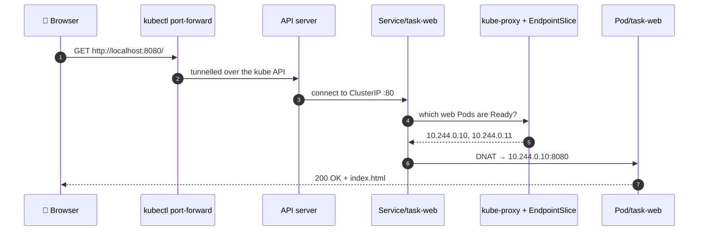
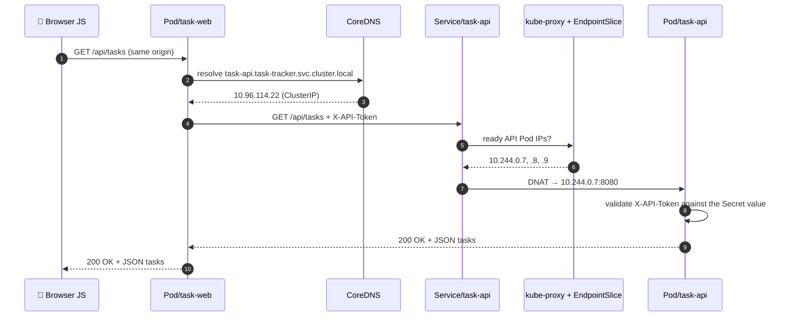

# Request Flow — Project 01

One real request, traced end to end. This is the mental model that makes debugging fast: when you get a 502, a 401,
or "connection refused", you should immediately know **which hop** is talking.

---

## 1. External request: browser → task-web



---

## 2. Internal (east-west) request: task-web → task-api

This is the hop that matters. It is a **real in-cluster service call**, which is why the Service lesson lands.



---

## 3. Hop-by-hop

| # | Hop | Mechanism | Fails when | Symptom | First command |
|---|---|---|---|---|---|
| 1 | Browser → `localhost:8080` | `kubectl port-forward` | The command was stopped | Connection refused | Restart the port-forward |
| 2 | → `Service/task-web` | ClusterIP + iptables DNAT | Selector mismatch, or no web Pod Ready | Connection refused | `kubectl get endpointslices -n task-tracker` |
| 3 | → `Pod/task-web` | gunicorn on `0.0.0.0:8080` | App bound to `127.0.0.1`, or wrong `targetPort` | Connection refused | `kubectl logs deployment/task-web -n task-tracker` |
| 4 | Browser JS → `/api/tasks` | Same-origin fetch | — | — | Browser devtools |
| 5 | `task-web` → CoreDNS | Cluster DNS | Wrong FQDN or namespace in `TASK_API_URL` | 502 with the URL in the message | `kubectl exec … -- nslookup task-api` |
| 6 | → `Service/task-api` | ClusterIP `:8080` | Service deleted or renamed | 502 | `kubectl get svc -n task-tracker` |
| 7 | → EndpointSlice → Pod | kube-proxy picks a **Ready** Pod | No Pod Ready (probe failing) | 502 | `kubectl get pods -n task-tracker` (READY column) |
| 8 | Token validation | `X-API-Token` vs the Secret | The two tiers hold different tokens | **401**, everything "healthy" | `kubectl exec … -- env \| grep API_TOKEN` |
| 9 | In-memory store | Python list in the gunicorn worker | The Pod restarted | Tasks silently gone | `kubectl get pods` (RESTARTS) |

---

## 4. Reading the failure

| What you see | Who emitted it | Usually means |
|---|---|---|
| `502 — cannot reach the task API at http://…` | **`task-web`** (our own error handler) | The backend was unreachable. The message names the exact URL it tried — start there. |
| `{"error":"invalid or missing X-API-Token"}` | `task-api` | The tiers disagree about the token. Kubernetes is perfectly healthy. |
| `Connection refused` on `localhost:8080` | Nothing is listening | The port-forward died, or the Service has no endpoints |
| Empty task list that keeps changing | Not an error | Different API Pods, different in-memory state — Project 02's problem |

---

## 5. DNS names

From a Pod in the **same namespace**, all four resolve:

```
task-api                                    # relies on the search domain in /etc/resolv.conf
task-api.task-tracker
task-api.task-tracker.svc
task-api.task-tracker.svc.cluster.local     # FQDN — what this project uses in config
```

From a **different** namespace, only the last three. We use the FQDN because it's explicit and immune to
search-domain surprises.

```bash
kubectl run dnstest --rm -it --restart=Never --image=busybox:1.36 -n task-tracker -- \
  nslookup task-api.task-tracker.svc.cluster.local

kubectl run dnstest --rm -it --restart=Never --image=busybox:1.36 -n task-tracker -- \
  cat /etc/resolv.conf
```

---

## 6. What kube-proxy actually does

Nothing listens on a ClusterIP. There is no proxy Pod and no process holding that address — it's a **rule in the
node's packet-filtering tables**. A packet addressed to `10.96.114.22:8080` has its destination rewritten to a real
Pod IP before it leaves the node.

Consequences worth knowing:

- A Service adds essentially **no latency** — it's a kernel DNAT, not a hop through a proxy
- You **cannot `ping` a ClusterIP** — there's nothing there to answer ICMP
- Balancing is **per connection, at L4**, chosen randomly. A client using HTTP keep-alive holds one connection and
  therefore keeps hitting the same Pod. Per-*request* balancing needs an L7 proxy or a service mesh.
