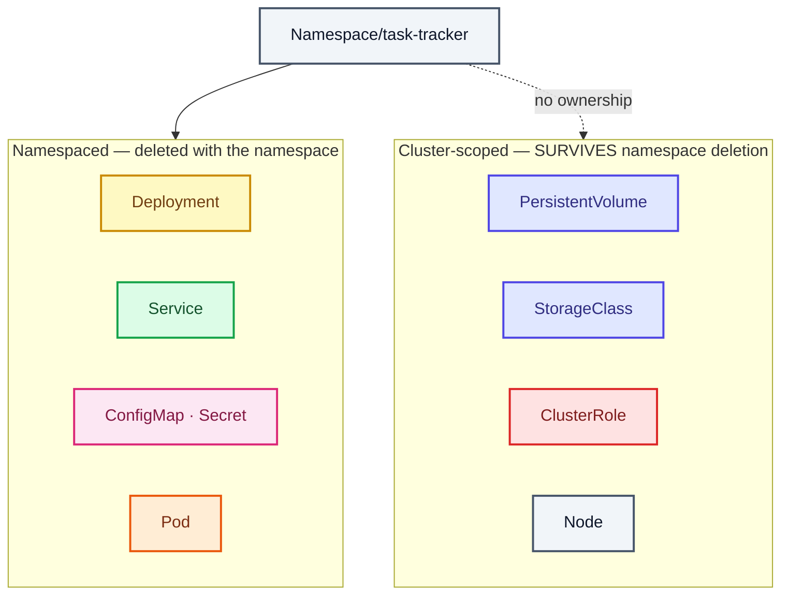

# Stage 00 — Namespace

[⬅ Project 01](../../README.md) · Stage 1 of 9

**00 Namespace** › [01 Pods](../01-pods/README.md) › [02 ReplicaSets](../02-replicasets/README.md) › [03 Deployments](../03-deployments/README.md) › [04 Services](../04-services/README.md) › [05 ConfigMaps](../05-configmaps/README.md) › [06 Secrets](../06-secrets/README.md) › [11 Probes](../11-health-checks/README.md) › [19 Final](../19-final/README.md)


> **The problem:** you haven't created anything yet. But before you do, decide *where* it goes — because "everywhere"
> is the default, and it is a bad default.

---

## 1. WHY does this resource exist?

Run `kubectl get pods` on a shared cluster and you'll see a jumble: your app, someone else's app, half-finished
experiments. Three concrete problems follow:

| Problem | Without namespaces |
|---|---|
| **Name collisions** | Two teams both want a Deployment called `api`. Only one can have it. |
| **Cleanup** | "Delete my project" becomes "delete these 14 objects and hope you remembered them all" |
| **Blast radius** | `kubectl delete deployment --all` in `default` deletes *everything anyone* put there |

Kubernetes needed a scope for object names — a folder. That's a **Namespace**.

### What happens without it

Everything lands in `default`. It works, which is exactly why it's dangerous: the mess is invisible until the day you
need to clean up or apply a quota, and by then twelve unrelated things live there.

### When do you use one — and when not?

| Use a namespace for | Don't bother when |
|---|---|
| A project, an app, a team, an environment | Truly cluster-wide infrastructure (that's cluster-scoped anyway) |
| Anything needing its own quota, RBAC, or NetworkPolicy | A one-off `kubectl run` you'll delete in a minute |

> **Namespaces are not a security boundary by themselves.** They're a *scope*. What makes them an isolation boundary
> is what you attach to them: RBAC, ResourceQuota, LimitRange, NetworkPolicy. Project 07 does exactly that.

---

## 2. WHAT is it?

A Namespace is a **virtual cluster inside your cluster** — a named scope in which object names must be unique.

> **Analogy:** folders on a filesystem. You can have `work/notes.txt` and `personal/notes.txt`.
>
> **Technically:** the namespace is part of every namespaced object's identity. The API path for a Pod is literally
> `/api/v1/namespaces/task-tracker/pods/task-api`. Two Pods named `task-api` in different namespaces are two
> different objects at two different URLs.

### Not everything is namespaced

```bash
kubectl api-resources --namespaced=true  | head    # Pod, Deployment, Service, ConfigMap, Secret, PVC…
kubectl api-resources --namespaced=false | head    # Node, PersistentVolume, StorageClass, ClusterRole, Namespace
```

This matters at cleanup time: `kubectl delete namespace` removes everything in the first list and **nothing** in the
second. That's why this project's `cleanup.sh` has a second phase.

---

## 3. HOW does it work?

1. `kubectl apply` POSTs the object to the API server, which persists it in etcd.
2. The **namespace controller** watches Namespaces and manages their lifecycle.
3. On delete, the namespace enters `Terminating` and the controller enumerates every namespaced resource type and
   deletes the objects it finds. Only when nothing is left does the `kubernetes` finalizer clear and the Namespace
   disappear. That's why deletion isn't instant — and why a stuck finalizer leaves a Namespace `Terminating` forever.
4. DNS uses the namespace too: a Service `task-api` in namespace `task-tracker` gets the name
   `task-api.task-tracker.svc.cluster.local`. Stage 04 relies on this.

---

## 4. Manifest

```yaml
apiVersion: v1
kind: Namespace
metadata:
  name: task-tracker
  labels:
    app.kubernetes.io/name: task-tracker
    app.kubernetes.io/part-of: task-tracker
    app.kubernetes.io/managed-by: kubectl
  annotations:
    kubernetes.io/description: "Project 01 — Task Tracker web application"
    lab.k8s-project/stage: "00-namespace"
```

Full file: [`namespace.yaml`](namespace.yaml)

---

## 5. Manifest breakdown

| Field | Value | What it does | What breaks if it's wrong |
|---|---|---|---|
| `apiVersion` | `v1` | Namespace lives in the core API group, which has no group name — just `v1` | `no matches for kind "Namespace"` |
| `kind` | `Namespace` | The object type | — |
| `metadata.name` | `task-tracker` | Cluster-unique. Must be a valid DNS label: lowercase alphanumerics and `-`, ≤63 chars | Rejected by the API server |
| `metadata.labels` | `app.kubernetes.io/*` | Lets you select the namespace later (`kubectl get ns -l …`); Pod Security Standards are applied via namespace labels in Project 07 | Nothing immediately — but you lose selectability |
| `metadata.annotations` | description | Non-identifying metadata for humans and tools. Cannot be selected on | Nothing |

> Note there is no `spec` worth writing. A Namespace is almost pure identity.

---

## 6. Apply

```bash
kubectl apply -f manifests/00-namespace/namespace.yaml
```

▸ **What it does:** sends the object to the API server, which **creates** it if absent and **patches** it if present.
That idempotency is why we use `apply` rather than `create` everywhere in this repo — re-running is always safe.

▸ **Expected output:** `namespace/task-tracker created` (or `unchanged` on a re-run).

---

## 7. Validate

```bash
kubectl get namespace task-tracker
kubectl describe namespace task-tracker
```

**Good:**

```
NAME           STATUS   AGE
task-tracker   Active   5s
```

**Red flag:** `Terminating` — a previous delete hasn't finished. Wait, or investigate finalizers.

---

## 8. Observe the mechanism

Prove that a namespace really is a name scope:

```bash
# Same name, two namespaces, zero conflict
kubectl create configmap demo --from-literal=k=v -n task-tracker
kubectl create configmap demo --from-literal=k=v -n default

kubectl get configmap demo -n task-tracker
kubectl get configmap demo -n default        # a different object entirely

kubectl delete configmap demo -n task-tracker
kubectl delete configmap demo -n default
```

> 🧪 **Try it:** run `kubectl get pods` with no `-n`. It searches your *current context's* namespace (usually
> `default`) and reports "No resources found" even when your app is running perfectly in `task-tracker`. This is the
> single most common "my pods disappeared" panic.

Save yourself the `-n` on every command:

```bash
kubectl config set-context --current --namespace=task-tracker
kubectl config view --minify | grep namespace:
```

> ⚠️ Every command in this project still writes `-n task-tracker` explicitly. Being explicit is a good habit — the
> day you delete production because your context was pointed there, you'll agree.

---

## 9. Break it

**Break:** try to create an object in a namespace that doesn't exist.

```bash
kubectl create configmap ghost --from-literal=a=b -n does-not-exist
```

**Symptom:**

```
Error from server (NotFound): namespaces "does-not-exist" not found
```

**Root cause:** namespaces are not auto-created. The API server rejects any namespaced object whose namespace is
absent.

**Fix:** create the namespace first — which is precisely why this is stage 00.

**What you learned:** ordering matters at the namespace boundary. Everything else in this project depends on this
object existing.

---

## 10. How it interacts



---

## 11. Production notes

> 🧪 **DEMO / LEARNING CONFIGURATION**
> One namespace, no quota, no policy, anyone with cluster access can write to it.

> 🏭 **PRODUCTION CONSIDERATIONS**
> - **ResourceQuota** so one team can't consume the cluster (Project 07)
> - **LimitRange** to give containers default requests/limits (Project 07)
> - **RBAC** scoped per namespace — this is where namespaces become a real boundary (Project 07)
> - **Default-deny NetworkPolicy** — pods in different namespaces can talk freely by default (Projects 04, 07)
> - **Pod Security Standards** enforced with `pod-security.kubernetes.io/enforce: restricted` labels (Project 07)
> - Naming convention across environments: `<app>-<env>` (`task-tracker-prod`), or separate clusters entirely for
>   production, since a namespace shares the control plane and nodes with its neighbours

---

## 12. The next problem

You have an empty folder. Nothing runs yet.

The smallest thing Kubernetes can run for you is a **Pod** → **[Stage 01 — Pods](../01-pods/README.md)**

---

## 📚 Official documentation

Everything above is self-contained — these are for going deeper, not for filling gaps.
*(All links verified 2026-08-09.)*

| Reference | What it adds |
|---|---|
| [Namespaces](https://kubernetes.io/docs/concepts/overview/working-with-objects/namespaces/) | What a namespace scopes, and the default namespaces |
| [Working with Kubernetes objects](https://kubernetes.io/docs/concepts/overview/working-with-objects/) | Object structure: apiVersion, kind, metadata, spec |
| [Namespaced vs cluster-scoped resources](https://kubernetes.io/docs/reference/kubernetes-api/) | Which kinds live inside a namespace and which don't |
| [kubectl reference](https://kubernetes.io/docs/reference/kubectl/) | Every command and flag used in this stage |

---

| ◀ Previous | ▲ Up | Next ▶ |
|---|:--:|---:|
| ◀ *(first stage)* | [Project 01](../../README.md) · [Manual steps](../../scripts/manual-steps.md) | **[01 Pods](../01-pods/README.md)** ▶ |
