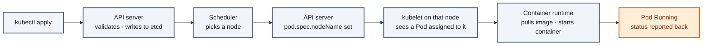
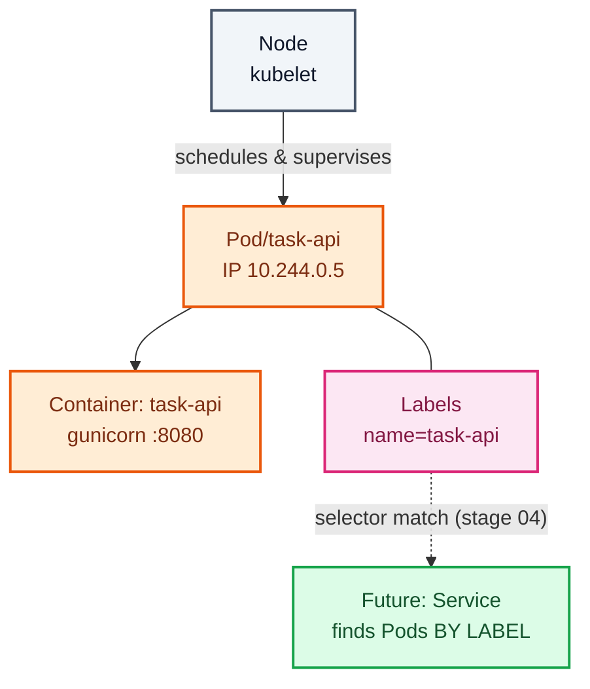

# Stage 01 — Pods

[⬅ Project 01](../../README.md) · Stage 2 of 9

[00 Namespace](../00-namespace/README.md) › **01 Pods** › [02 ReplicaSets](../02-replicasets/README.md) › [03 Deployments](../03-deployments/README.md) › [04 Services](../04-services/README.md) › [05 ConfigMaps](../05-configmaps/README.md) › [06 Secrets](../06-secrets/README.md) › [11 Probes](../11-health-checks/README.md) › [19 Final](../19-final/README.md)


> **The problem:** you have an empty namespace and a container image. You need to run it.

---

## 1. WHY does this resource exist?

You have a container. Why can't Kubernetes just run containers? Why invent a wrapper?

Because in practice a "unit of application" is often **more than one container** that must share a fate:

- a web server plus a log shipper reading the same files
- an app plus a proxy sidecar handling its network traffic
- a main container plus an init container that prepares its data

Those containers need to share a network namespace (talk over `localhost`), share volumes, be scheduled onto the
**same node**, and live and die together. If Kubernetes scheduled bare containers, none of that would be expressible.

So Kubernetes made the smallest schedulable unit a **group of co-located containers** — a Pod. Even when the group
has exactly one member, which is the common case.

### What happens without it

There is no "without it" — a Pod is the atom. Every workload controller you'll meet (ReplicaSet, Deployment,
StatefulSet, DaemonSet, Job) exists to *create Pods*. Understanding the Pod is what makes all of them make sense.

### When do you create a bare Pod?

| Use a bare Pod for | Use a controller for |
|---|---|
| Learning (this stage) | Literally everything you run for real |
| Throwaway debugging (`kubectl run tmp --rm -it …`) | Anything that should survive a node failure |

> **A bare Pod has no self-healing.** That's not a bug — it's the definition, and you're about to feel it.

---

## 2. WHAT is it?

A Pod is **one or more containers that share a network namespace, storage volumes, and a lifecycle**, scheduled
together onto one node.

> **Analogy:** an apartment. Containers are roommates: separate rooms (filesystems, processes), one shared address
> (IP), one shared front door. If the building goes, everyone goes.
>
> **Technically:** every Pod gets its own IP from the cluster CIDR. Containers in the Pod share that network
> namespace, so they reach each other on `localhost:<port>` and **cannot bind the same port twice**. They can also
> mount the same volumes. A `pause` container holds the namespaces open so individual containers can restart without
> the Pod losing its IP.

### Pod lifecycle

| Phase | Meaning |
|---|---|
| `Pending` | Accepted, but not running yet — being scheduled, or pulling images |
| `Running` | Bound to a node, at least one container is running |
| `Succeeded` | All containers exited 0 and won't restart (Jobs) |
| `Failed` | All containers terminated, at least one failed |
| `Unknown` | The node stopped reporting |

> ⚠️ `Running` ≠ working. A Pod is `Running` the moment its container process starts, long before the app can serve
> a request. Stage 11 fixes that gap with readiness probes.

### Key fact: Pods are disposable

A Pod is never "repaired". It is deleted and a *new* Pod is created — new name, **new IP**. Pod IPs are ephemeral,
which is the entire reason Services exist (stage 04).

---

## 3. HOW does it work?

Applying `pod.yaml` sets off a chain you can watch in real time:



1. **API server** validates the manifest and persists it. At this moment the Pod exists but has no node.
2. **Scheduler** watches for Pods with an empty `spec.nodeName`, filters nodes that *can* run it (resources,
   selectors, taints), scores the survivors, and binds it to the winner.
3. **kubelet** on that node notices a Pod assigned to it, asks the container runtime to pull the image and start the
   container, and reports status back.
4. **kubelet** keeps watching. If the container process exits, `restartPolicy` (default `Always`) makes the kubelet
   restart it **in the same Pod** — with exponential backoff, which is what `CrashLoopBackOff` means.

> **Critical distinction:** the kubelet restarts *containers*. Nothing here recreates a deleted *Pod*. That's the gap
> stage 02 fills.

---

## 4. Manifest

```yaml
apiVersion: v1
kind: Pod
metadata:
  name: task-api
  namespace: task-tracker
  labels:
    app.kubernetes.io/name: task-api
    app.kubernetes.io/instance: task-api
    app.kubernetes.io/component: backend
    app.kubernetes.io/part-of: task-tracker
    app.kubernetes.io/version: "1.0.0"
spec:
  containers:
    - name: task-api
      image: task-api:1.0.0
      imagePullPolicy: IfNotPresent
      ports:
        - name: http
          containerPort: 8080
          protocol: TCP
      env:
        - name: APP_ENV
          value: "development"
        - name: POD_NAME
          valueFrom:
            fieldRef:
              fieldPath: metadata.name
```

Full file: [`pod.yaml`](pod.yaml)

---

## 5. Manifest breakdown

| Field | Value | What it does | What breaks if it's wrong |
|---|---|---|---|
| `apiVersion` | `v1` | Pod is core API — no group prefix | `no matches for kind "Pod"` |
| `metadata.name` | `task-api` | Unique within the namespace | `AlreadyExists` |
| `metadata.labels` | `app.kubernetes.io/*` | Key/value tags. **Selectors match on these** — stage 04's Service finds this Pod by label, not by name | Service finds nothing; zero endpoints |
| `spec.containers[].name` | `task-api` | Names the container within the Pod. Needed by `kubectl logs -c` | — |
| `spec.containers[].image` | `task-api:1.0.0` | Which image to run. Explicit tag, never `latest` | `ImagePullBackOff` |
| `imagePullPolicy` | `IfNotPresent` | Use the local copy if present. Required for `kind load`ed images | With `Always`, kubelet tries Docker Hub → `ErrImagePull` |
| `ports[].name` | `http` | A label for the port. Services can target it **by name** — so changing the number later touches one file | — |
| `ports[].containerPort` | `8080` | **Documentation only.** It does not open or restrict anything | Wrong value misleads readers; traffic still depends on what the app actually binds |
| `env[].value` | literal | Environment variable, hardcoded here | Stage 05 explains why this is a problem |
| `env[].valueFrom.fieldRef` | `metadata.name` | **Downward API** — injects Pod metadata into the container. Nothing at build time can know the Pod's name | App reports `unknown` |

---

## 6. Apply

```bash
kubectl apply -f manifests/01-pods/pod.yaml
```

▸ **Expected output:** `pod/task-api created`

Watch it come up:

```bash
kubectl get pods -n task-tracker -w
```

▸ **What it does:** `-w` streams changes instead of exiting. You'll see `Pending → ContainerCreating → Running`.
Ctrl-C to stop.

---

## 7. Validate

```bash
kubectl get pods -n task-tracker -o wide
```

**Good:**

```
NAME       READY   STATUS    RESTARTS   AGE   IP           NODE
task-api   1/1     Running   0          12s   10.244.0.5   kubernetes-lab-control-plane
```

**Note the IP.** Write it down — you'll watch it change.

**Red flags:** `Pending` (not scheduled), `ImagePullBackOff` (image missing — did you `kind load`?),
`CrashLoopBackOff` (app exiting), `0/1 READY` while `Running` (nothing to worry about yet — no probes until stage 11).

```bash
kubectl describe pod task-api -n task-tracker
```

▸ **What it does:** the full object plus, at the bottom, the **Events** — the timeline of what the scheduler, kubelet
and runtime did. When a Pod misbehaves, that section answers "why" more often than the logs do.

```bash
kubectl logs task-api -n task-tracker
```

▸ **Expected:** `level=INFO pod=task-api msg=task-api starting env=development auth=False` and gunicorn's startup
lines. Logs are just the container's stdout/stderr — that's the whole contract.

---

## 8. Observe the mechanism

**Reach the app.** It has a Pod IP, but that IP only exists inside the cluster network:

```bash
kubectl port-forward pod/task-api 8080:8080 -n task-tracker
# in another terminal:
curl -s localhost:8080/api/tasks
curl -s localhost:8080/api/info
```

▸ **What it does:** opens a tunnel from your laptop through the API server to this one Pod. Debugging only — one
client, no load balancing, dies with the command.

**See the shared namespace idea:**

```bash
kubectl exec -it task-api -n task-tracker -- sh -c 'hostname; hostname -i'
```

▸ The hostname is the Pod name and the IP is the Pod IP — the container inherits the Pod's identity, not its own.

**Watch the kubelet restart a container without recreating the Pod:**

```bash
kubectl exec task-api -n task-tracker -- sh -c 'kill 1' || true
kubectl get pod task-api -n task-tracker -o wide
```

▸ **What you see:** `RESTARTS` becomes `1`, but the **Pod name and IP are unchanged**. The kubelet restarted the
container inside the surviving Pod. That is `restartPolicy: Always` at work.

---

## 9. Break it — the failure that motivates stage 02

**Break:** delete the Pod, the way a node failure or an eviction would.

```bash
kubectl delete pod task-api -n task-tracker
kubectl get pods -n task-tracker
```

**Symptom:**

```
No resources found in task-tracker namespace.
```

Your application is gone. It does not come back. Not in a minute, not ever.

**Investigate:**

```bash
kubectl get events -n task-tracker --sort-by=.lastTimestamp
```

You'll see the Pod being killed — and nothing after it. No controller reacted, because **nothing was watching**.

**Root cause:** a Pod object is a *record of one specific Pod*. Deleting it removes the record. The kubelet restarts
containers *within* a Pod; no component in the cluster has been told "there should always be a task-api Pod." Nobody
asked for that, so nobody enforces it.

**Fix (for now):**

```bash
kubectl apply -f manifests/01-pods/pod.yaml
kubectl get pod task-api -n task-tracker -o wide
```

**Look at the IP.** It's different from the one you wrote down. Same name, new object, new address.

**What you learned:** two rules that drive the rest of Kubernetes.

1. Bare Pods have **no self-healing**. Something must declare desired state and reconcile toward it.
2. Pod IPs are **ephemeral**. Anything that hardcodes one is already broken.

---

## 10. How it interacts



---

## 11. Production notes

> 🧪 **DEMO / LEARNING CONFIGURATION**
> A bare Pod with no resource requests, no probes, no security context. It exists to be deleted.

> 🏭 **PRODUCTION CONSIDERATIONS**
> - **Never deploy bare Pods.** Use a Deployment, StatefulSet, DaemonSet, Job, or CronJob — always.
> - Set `resources.requests` so the scheduler can place the Pod sensibly (Project 05)
> - Set readiness and liveness probes so `Running` means something (stage 11)
> - Set a `securityContext`: `runAsNonRoot`, `readOnlyRootFilesystem`, dropped capabilities (Project 07)
> - Pin images by digest (`image@sha256:…`) so a tag can't be repointed under you
> - The only legitimate bare-Pod use is ephemeral debugging: `kubectl run tmp --rm -it --image=… -- sh`

---

## 12. The next problem

Your app disappears whenever its Pod does — a node reboot, an eviction, a stray `kubectl delete`. You need something
that *watches* and recreates Pods to match a desired count.

→ **[Stage 02 — ReplicaSets](../02-replicasets/README.md)**

---

## 📚 Official documentation

Everything above is self-contained — these are for going deeper, not for filling gaps.
*(All links verified 2026-08-09.)*

| Reference | What it adds |
|---|---|
| [Pods](https://kubernetes.io/docs/concepts/workloads/pods/) | Why the Pod is the smallest deployable unit |
| [Pod lifecycle](https://kubernetes.io/docs/concepts/workloads/pods/pod-lifecycle/) | Phases, container states, restartPolicy, backoff |
| [Images & imagePullPolicy](https://kubernetes.io/docs/concepts/containers/images/) | Tags, digests, pull policy, and why not `:latest` |
| [Downward API](https://kubernetes.io/docs/concepts/workloads/pods/downward-api/) | How `POD_NAME` reaches the container |
| [Expose Pod info via env vars](https://kubernetes.io/docs/tasks/inject-data-application/environment-variable-expose-pod-information/) | The `fieldRef` task, step by step |
| [Port forwarding](https://kubernetes.io/docs/tasks/access-application-cluster/port-forward-access-application-cluster/) | What `kubectl port-forward` actually does |

---

| ◀ Previous | ▲ Up | Next ▶ |
|---|:--:|---:|
| ◀ **[00 Namespace](../00-namespace/README.md)** | [Project 01](../../README.md) · [Manual steps](../../scripts/manual-steps.md) | **[02 ReplicaSets](../02-replicasets/README.md)** ▶ |
