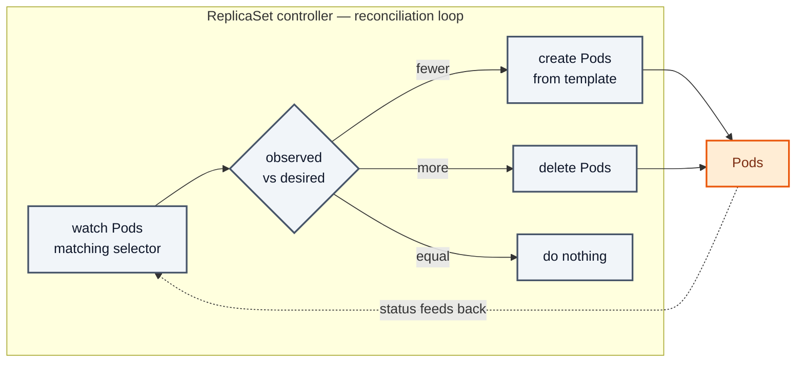
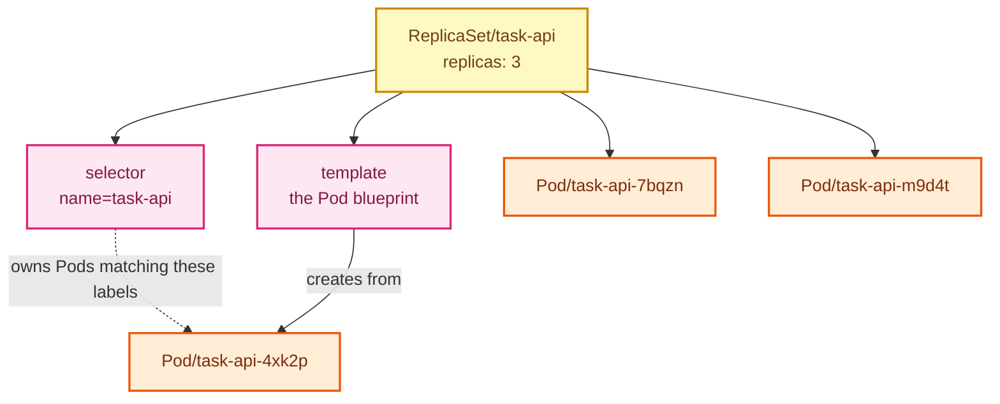

# Stage 02 — ReplicaSets

[⬅ Project 01](../../README.md) · Stage 3 of 9

[00 Namespace](../00-namespace/README.md) › [01 Pods](../01-pods/README.md) › **02 ReplicaSets** › [03 Deployments](../03-deployments/README.md) › [04 Services](../04-services/README.md) › [05 ConfigMaps](../05-configmaps/README.md) › [06 Secrets](../06-secrets/README.md) › [11 Probes](../11-health-checks/README.md) › [19 Final](../19-final/README.md)


> **The problem:** you deleted the Pod and it stayed dead. Nothing in the cluster had been told your app *should* be
> running, so nothing brought it back.

---

## 1. WHY does this resource exist?

Two things a bare Pod cannot give you:

**Availability.** One Pod means one node. That node reboots, gets drained for maintenance, or runs out of memory —
your app is down until a human notices.

**Capacity.** One Pod means one process. Traffic doubles and you have no way to say "run three of these."

Both problems have the same shape: you want to state a *desired number* of identical Pods and have the cluster
maintain it, forever, without you watching.

That's a **ReplicaSet**.

### What happens without it

Exactly what you just saw: Pods vanish permanently. Every failure becomes a manual recovery, and scaling means
copy-pasting manifests with different names.

### When do you create a ReplicaSet directly?

**Almost never.** You'll use Deployments (stage 03), which create ReplicaSets for you. This stage exists because
the Deployment→ReplicaSet→Pod chain is invisible until you've seen the middle layer on its own — and because
`kubectl describe` will show you ReplicaSet names for the rest of your career.

---

## 2. WHAT is it?

A ReplicaSet is a controller that **maintains a stable set of identical Pods**, defined by a *count*, a *selector*,
and a *Pod template*.

> **Analogy:** a shift supervisor with a rule: "three people on the floor at all times." Someone leaves, they call in
> a replacement. They don't care *which* three.
>
> **Technically:** the ReplicaSet controller runs a reconciliation loop. It lists Pods matching `spec.selector`,
> compares that count to `spec.replicas`, and creates or deletes Pods to close the gap. It has no notion of "the same
> Pod coming back" — only of the count being right.

### The three parts

| Part | Meaning |
|---|---|
| `replicas` | **Desired state.** How many should exist |
| `selector` | **Ownership.** Which Pods count toward that number |
| `template` | **The blueprint.** What a new Pod should look like |

### The selector is not cosmetic

The ReplicaSet owns **every Pod in the namespace matching its selector** — including Pods it didn't create.

> 🧪 **Try it below:** your leftover bare Pod from stage 01 carries the same labels. Create this ReplicaSet with
> `replicas: 3` and it will *adopt* that Pod and only create two more. Adoption is a real mechanism, and it's how a
> sloppy selector can make one controller steal another's Pods.

### Pods are cattle, not pets

A replacement Pod has a **new name and a new IP**. The ReplicaSet does not restore anything — it creates a fresh Pod
from the template. Any state inside the old Pod is gone. That's fine here (tasks are in memory and this is a lab) and
it's the exact problem Project 02 solves with persistent storage.

---

## 3. HOW does it work?



This loop is the heart of Kubernetes and it never stops:

1. The controller **watches** the API server for Pods matching the selector.
2. It compares the count it observes with `spec.replicas`.
3. It creates or deletes Pods to close the gap, stamping each new Pod with an `ownerReferences` entry pointing at
   itself.
4. Repeat, forever.

**Two consequences worth internalising:**

- **It's level-triggered, not edge-triggered.** The controller doesn't react to a "Pod deleted" event; it repeatedly
  observes reality and corrects it. Miss an event and the next loop still fixes things. This is why Kubernetes
  self-heals rather than getting stuck.
- **`ownerReferences` drive garbage collection.** Delete the ReplicaSet and the garbage collector deletes the Pods it
  owns. Use `--cascade=orphan` and the Pods survive, unmanaged.

---

## 4. Manifest

```yaml
apiVersion: apps/v1
kind: ReplicaSet
metadata:
  name: task-api
  namespace: task-tracker
spec:
  replicas: 3
  selector:
    matchLabels:
      app.kubernetes.io/name: task-api
      app.kubernetes.io/instance: task-api
  template:
    metadata:
      labels:                                # MUST satisfy the selector above
        app.kubernetes.io/name: task-api
        app.kubernetes.io/instance: task-api
        app.kubernetes.io/component: backend
        app.kubernetes.io/part-of: task-tracker
        app.kubernetes.io/version: "1.0.0"
    spec:
      containers:
        - name: task-api
          image: task-api:1.0.0
          imagePullPolicy: IfNotPresent
          ports:
            - name: http
              containerPort: 8080
```

Full file: [`replicaset.yaml`](replicaset.yaml)

---

## 5. Manifest breakdown

| Field | Value | What it does | What breaks if it's wrong |
|---|---|---|---|
| `apiVersion` | `apps/v1` | ReplicaSet lives in the `apps` group — unlike Pod, which is core `v1` | `no matches for kind` |
| `spec.replicas` | `3` | Desired Pod count. Omitted means 1 | Too few = no redundancy; too many = wasted capacity |
| `spec.selector.matchLabels` | 2 labels | Which Pods this controller owns | Too broad → adopts other apps' Pods. Doesn't match template → API server rejects it |
| `spec.template.metadata.labels` | 5 labels | Applied to every Pod created. Must be a **superset** of the selector | `selector does not match template labels` |
| `spec.template.spec` | — | An ordinary Pod spec — everything from stage 01 applies | Same failures as stage 01 |

> **Why is the selector only 2 labels when the template has 5?** Because `spec.selector` is **immutable** after
> creation. Put a churny label like `version` in it and you can never change the version without deleting and
> recreating the object. Keep selectors minimal and stable; put descriptive labels in the template only.

### `matchLabels` vs `matchExpressions`

```yaml
selector:
  matchLabels:            # AND of exact matches — what you want 95% of the time
    app.kubernetes.io/name: task-api
  matchExpressions:       # richer: In, NotIn, Exists, DoesNotExist
    - key: tier
      operator: In
      values: [backend, api]
```

---

## 6. Apply

```bash
# Clean slate: remove the bare Pod first (or keep it and watch adoption in §8)
kubectl delete pod task-api -n task-tracker --ignore-not-found

kubectl apply -f manifests/02-replicasets/replicaset.yaml
```

▸ **Expected output:** `replicaset.apps/task-api created`

---

## 7. Validate

```bash
kubectl get replicaset -n task-tracker
```

**Good:**

```
NAME       DESIRED   CURRENT   READY   AGE
task-api   3         3         3       10s
```

▸ **Reading it:** `DESIRED` is what you asked for, `CURRENT` is how many exist, `READY` is how many passed their
readiness checks (with no probes yet, "started" counts as ready — stage 11 makes this meaningful).

```bash
kubectl get pods -n task-tracker -o wide
```

```
NAME             READY   STATUS    RESTARTS   AGE   IP
task-api-4xk2p   1/1     Running   0          15s   10.244.0.7
task-api-7bqzn   1/1     Running   0          15s   10.244.0.8
task-api-m9d4t   1/1     Running   0          15s   10.244.0.9
```

▸ **Note the names:** `<replicaset-name>-<random>`. The random suffix is why you can never hardcode a Pod name.

**Prove ownership:**

```bash
kubectl get pod -n task-tracker -o jsonpath='{.items[0].metadata.ownerReferences}' | python3 -m json.tool
```

▸ Shows `kind: ReplicaSet, name: task-api, controller: true` — the link the garbage collector follows.

---

## 8. Observe the mechanism

### Self-healing

```bash
kubectl get pods -n task-tracker -w      # leave this running in terminal 1
```

```bash
# terminal 2 — kill one
kubectl delete pod -n task-tracker -l app.kubernetes.io/name=task-api --field-selector=status.phase=Running \
  --wait=false | head -1
```

▸ **What you see in terminal 1:** the Pod goes `Terminating`, and within a second a **new Pod with a new name**
appears and starts. The count returns to 3. You did nothing.

### Scaling

```bash
kubectl scale replicaset task-api --replicas=5 -n task-tracker
kubectl get pods -n task-tracker
```

▸ Two more Pods appear immediately. Scale back down:

```bash
kubectl scale replicaset task-api --replicas=3 -n task-tracker
```

> ⚠️ `kubectl scale` is **imperative** — it edits the live object, not your file. The next
> `kubectl apply -f replicaset.yaml` resets it to 3. That divergence between cluster and Git is exactly what GitOps
> exists to prevent (Project 10).

### Adoption — the selector really is the contract

```bash
# Create a bare Pod wearing the ReplicaSet's labels
kubectl run intruder -n task-tracker --image=task-api:1.0.0 \
  --labels="app.kubernetes.io/name=task-api,app.kubernetes.io/instance=task-api" \
  --overrides='{"spec":{"containers":[{"name":"intruder","image":"task-api:1.0.0","imagePullPolicy":"IfNotPresent"}]}}'

kubectl get pods -n task-tracker
```

▸ **What happens:** the ReplicaSet now counts 4 Pods where it wants 3, so it **deletes one** — possibly one of its
own. Your intruder was adopted into the set.

▸ **The lesson:** ReplicaSets own Pods by *labels*, not by creation. An overlapping selector between two controllers
makes them fight over the same Pods.

```bash
kubectl delete pod intruder -n task-tracker --ignore-not-found
```

---

## 9. Break it — the failure that motivates stage 03

**Break:** ship a new version of the app. Edit the ReplicaSet's image and apply it.

```bash
kubectl set image replicaset/task-api task-api=task-api:2.0.0 -n task-tracker
kubectl get pods -n task-tracker -o jsonpath='{range .items[*]}{.metadata.name}{"\t"}{.spec.containers[0].image}{"\n"}{end}'
```

**Symptom:**

```
task-api-4xk2p   task-api:1.0.0
task-api-7bqzn   task-api:1.0.0
task-api-m9d4t   task-api:1.0.0
```

The ReplicaSet's *template* now says `2.0.0`. The running Pods still say `1.0.0`. **Nothing rolled out.**

**Investigate:**

```bash
kubectl get replicaset task-api -n task-tracker -o jsonpath='{.spec.template.spec.containers[0].image}'; echo
kubectl describe replicaset task-api -n task-tracker | tail -15
```

The spec changed; there are no events about replacing Pods.

**Root cause:** the ReplicaSet controller only reconciles **count**, never **content**. Three Pods match the selector,
so its job is done. The template is consulted *only when creating a new Pod*.

The only way to roll out a change is to delete Pods yourself and let them be recreated:

```bash
kubectl delete pod -n task-tracker -l app.kubernetes.io/name=task-api
```

That's a hard delete of every replica at once — a full outage, no gradual rollout, and no way back if `2.0.0` is
broken. Doing it one at a time is manual, slow, and unrepeatable at 3am.

**Fix:** revert and move on to a controller that understands versions.

```bash
kubectl set image replicaset/task-api task-api=task-api:1.0.0 -n task-tracker
kubectl delete replicaset task-api -n task-tracker
```

**What you learned:** ReplicaSets guarantee *how many*, never *which version*. Rollouts need a controller one level
up.

---

## 10. How it interacts



**Relationship to remember:** `Deployment → ReplicaSet → Pods`. You're standing on the middle rung.

---

## 11. Production notes

> 🧪 **DEMO / LEARNING CONFIGURATION**
> A hand-written ReplicaSet. This is a teaching artifact.

> 🏭 **PRODUCTION CONSIDERATIONS**
> - **Never create ReplicaSets directly.** Use a Deployment — you'd be giving up rolling updates, rollback, and
>   revision history for nothing.
> - Keep selectors minimal and stable; they're immutable
> - `replicas: 1` is not high availability. Use ≥2 and spread them across nodes (Project 09)
> - You will still *read* ReplicaSets constantly — `kubectl describe deployment` names them, and a failing rollout is
>   usually diagnosed with `kubectl describe replicaset <name>`

---

## 12. The next problem

You can keep N Pods alive, but you cannot change what they run without an outage. Real applications ship new versions
constantly, and sometimes those versions are bad and must be undone in seconds.

You need versioned, gradual rollouts with a rollback button.

→ **[Stage 03 — Deployments](../03-deployments/README.md)**

---

## 📚 Official documentation

Everything above is self-contained — these are for going deeper, not for filling gaps.
*(All links verified 2026-08-09.)*

| Reference | What it adds |
|---|---|
| [ReplicaSet](https://kubernetes.io/docs/concepts/workloads/controllers/replicaset/) | Reconciliation, selectors, Pod adoption |
| [Labels and selectors](https://kubernetes.io/docs/concepts/overview/working-with-objects/labels/) | `matchLabels` vs `matchExpressions` |
| [Owners and dependents](https://kubernetes.io/docs/concepts/overview/working-with-objects/owners-dependents/) | `ownerReferences` — how adoption is recorded |
| [Garbage collection](https://kubernetes.io/docs/concepts/architecture/garbage-collection/) | Cascading deletion and `--cascade=orphan` |

---

| ◀ Previous | ▲ Up | Next ▶ |
|---|:--:|---:|
| ◀ **[01 Pods](../01-pods/README.md)** | [Project 01](../../README.md) · [Manual steps](../../scripts/manual-steps.md) | **[03 Deployments](../03-deployments/README.md)** ▶ |
