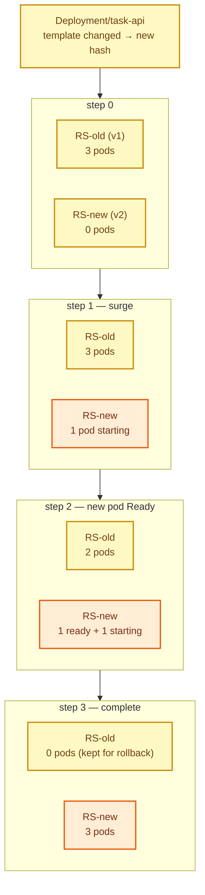
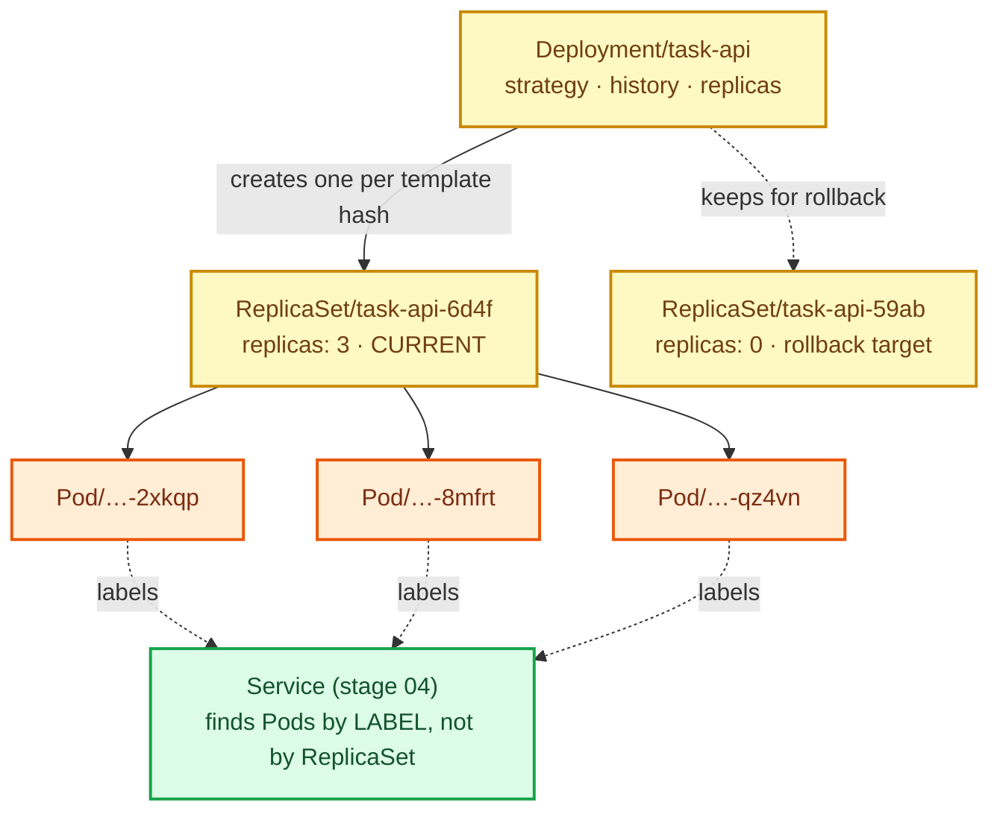

# Stage 03 — Deployments

[⬅ Project 01](../../README.md) · Stage 4 of 9

[00 Namespace](../00-namespace/README.md) › [01 Pods](../01-pods/README.md) › [02 ReplicaSets](../02-replicasets/README.md) › **03 Deployments** › [04 Services](../04-services/README.md) › [05 ConfigMaps](../05-configmaps/README.md) › [06 Secrets](../06-secrets/README.md) › [11 Probes](../11-health-checks/README.md) › [19 Final](../19-final/README.md)


> **The problem:** a ReplicaSet keeps three Pods alive but has no idea what "version" means. Changing the image
> updated the template and did nothing to the running Pods. Your only rollout tool was deleting every Pod at once.

---

## 1. WHY does this resource exist?

Shipping software is not a one-time event. You deploy several times a week, and each deploy needs to:

| Requirement | ReplicaSet alone |
|---|---|
| Replace Pods gradually, staying available | ❌ delete-all-and-pray |
| Keep serving traffic during the change | ❌ |
| Stop automatically if the new version won't start | ❌ |
| Go back to the previous version in seconds | ❌ the old template is overwritten and gone |
| Record what changed and when | ❌ |

Every one of those needs the **old version to still exist** while the new one comes up. One ReplicaSet holds one
template, so it structurally cannot do this.

The answer: a controller that manages **multiple ReplicaSets** — one per version — and shifts replicas between them.
That's a **Deployment**.

### What happens without it

You hand-roll rollouts: create `task-api-v2` ReplicaSet, scale it up, scale `v1` down, remember to delete `v1`, and
keep a copy of the old manifest somewhere in case you need to reverse it. People did this. It went badly.

### When do you use one?

**For every stateless workload.** Deployment is the default answer. Use something else only when you specifically
need stable identity and ordering (StatefulSet — Project 02), one Pod per node (DaemonSet — Project 08), or
run-to-completion work (Job/CronJob — Project 06).

---

## 2. WHAT is it?

A Deployment is a controller that **manages ReplicaSets to give you declarative, versioned updates** of a stateless
application.

> **Analogy:** ReplicaSet is the shift supervisor keeping three people on the floor. Deployment is the manager who
> can swap the whole crew for a newly trained one — a couple at a time, checking that the new ones work before
> sending the old ones home, and able to call the old crew back if things go wrong.
>
> **Technically:** the Deployment controller creates a ReplicaSet per unique Pod template, identified by a hash of
> that template (`pod-template-hash`, added automatically to labels and selectors). During a rollout it scales the new
> ReplicaSet up and the old one down according to `maxSurge`/`maxUnavailable`, keeping old ReplicaSets at zero
> replicas as revision history.

### The chain

```
Deployment  →  ReplicaSet  →  Pods
(versions)     (count)        (containers)
```

Each layer does exactly one job. That separation is why rollback is nearly free: the previous ReplicaSet still
exists, scaled to 0, holding the previous template intact.

---

## 3. HOW does it work?

A rollout with `replicas: 3`, `maxSurge: 1`, `maxUnavailable: 0`:



1. You change `spec.template`. The controller hashes the new template — a different hash means a **new ReplicaSet**.
2. It scales the new ReplicaSet up by at most `maxSurge` above the desired count.
3. It waits for new Pods to become **available**, then scales the old ReplicaSet down, never letting ready Pods drop
   more than `maxUnavailable` below desired.
4. Repeat until the new ReplicaSet holds all replicas and the old one holds zero.
5. The old ReplicaSet is **kept** (up to `revisionHistoryLimit`). That's your rollback.

> **"Available" is doing a lot of work here.** With no readiness probe, a Pod is available as soon as it's Running —
> so the rollout marches on even if the app can't serve a request. `maxUnavailable: 0` is only a real guarantee once
> stage 11 adds probes.

**Changing only `replicas` does not create a new ReplicaSet** — that's not a template change, so it's a scale, not a
rollout.

---

## 4. Manifest

```yaml
apiVersion: apps/v1
kind: Deployment
metadata:
  name: task-api
  namespace: task-tracker
spec:
  replicas: 3
  revisionHistoryLimit: 5
  selector:
    matchLabels:
      app.kubernetes.io/name: task-api
      app.kubernetes.io/instance: task-api
  strategy:
    type: RollingUpdate
    rollingUpdate:
      maxSurge: 1
      maxUnavailable: 0
  template:
    metadata:
      labels:
        app.kubernetes.io/name: task-api
        app.kubernetes.io/instance: task-api
        app.kubernetes.io/component: backend
        app.kubernetes.io/part-of: task-tracker
        app.kubernetes.io/version: "1.0.0"
    spec:
      containers:
        - name: task-api
          image: task-api:1.0.0
          imagePullPolicy: IfNotPresent
          ports:
            - name: http
              containerPort: 8080
```

Files: [`task-api-deployment.yaml`](task-api-deployment.yaml) · [`task-web-deployment.yaml`](task-web-deployment.yaml)

> ⚠️ **`task-web-deployment.yaml` is broken on purpose.** Its `TASK_API_URL` is a hardcoded Pod IP. That's what you're
> going to watch fail in §9.

---

## 5. Manifest breakdown

| Field | Value | What it does | What breaks if it's wrong |
|---|---|---|---|
| `apiVersion` | `apps/v1` | Deployment lives in the `apps` group | `no matches for kind` |
| `spec.replicas` | `3` | Desired Pod count, delegated to the current ReplicaSet | — |
| `spec.revisionHistoryLimit` | `5` | How many old ReplicaSets to keep. **These are your rollback targets** | `0` = no rollback possible |
| `spec.selector` | 2 labels | Which Pods belong to this Deployment. **Immutable** | Changing it later requires deleting the Deployment |
| `spec.strategy.type` | `RollingUpdate` | Gradual replacement. The alternative is `Recreate` — kill everything, then start the new version (accepts downtime; needed when two versions can't coexist, e.g. an incompatible DB schema) | `Recreate` = outage on every deploy |
| `maxSurge` | `1` | Extra Pods allowed above `replicas` during rollout. Can be a percentage | `0` = slower rollout (must remove before adding) |
| `maxUnavailable` | `0` | How many ready Pods you're willing to lose. `0` = zero-downtime | `1` = brief capacity dip |
| `spec.template` | Pod spec | The blueprint. **Any change here triggers a rollout** | — |
| `spec.progressDeadlineSeconds` | default 600 | How long a stalled rollout runs before being marked `Failed` | Too low = false alarms on slow image pulls |

---

## 6. Apply

```bash
kubectl apply -f manifests/03-deployments/
```

▸ **What it does:** `-f <directory>` applies every manifest in it (not recursively — add `-R` for that). Both
Deployments are created.

▸ **Expected output:**

```
deployment.apps/task-api created
deployment.apps/task-web created
```

```bash
kubectl rollout status deployment/task-api -n task-tracker --timeout=120s
```

▸ **What it does:** blocks until the rollout completes, exiting non-zero if it fails. This is the command you put in
CI — `apply` alone returns instantly and tells you nothing about whether the app came up.

---

## 7. Validate

```bash
kubectl get deployments,replicasets,pods -n task-tracker
```

**Good:**

```
NAME                       READY   UP-TO-DATE   AVAILABLE   AGE
deployment.apps/task-api   3/3     3            3           30s
deployment.apps/task-web   2/2     2            2           30s

NAME                                  DESIRED   CURRENT   READY
replicaset.apps/task-api-6d4f8b9c7    3         3         3
replicaset.apps/task-web-5c8b7d6f9    2         2         2

NAME                            READY   STATUS    RESTARTS
pod/task-api-6d4f8b9c7-2xkqp    1/1     Running   0
...
```

▸ **Read the whole chain:** you created two Deployments; they created ReplicaSets with hash suffixes; those created
Pods with a further random suffix. `Deployment → ReplicaSet → Pod`, visible in the names.

| Column | Meaning |
|---|---|
| `READY` | ready replicas / desired |
| `UP-TO-DATE` | replicas running the **current** template |
| `AVAILABLE` | ready for at least `minReadySeconds` |

---

## 8. Observe the mechanism

### A rolling update

```bash
kubectl get pods -n task-tracker -w        # terminal 1
```

```bash
# terminal 2 — a template change triggers a rollout. An annotation counts.
kubectl set env deployment/task-api APP_ENV=staging -n task-tracker
kubectl rollout status deployment/task-api -n task-tracker
```

▸ **What you see:** a new Pod appears (surge to 4), goes Ready, then an old Pod terminates. Repeat until all three
are replaced. **The count never drops below 3** — that's `maxUnavailable: 0`.

```bash
kubectl get replicasets -n task-tracker
```

▸ **Now there are two ReplicaSets** for `task-api`: the new one with 3 replicas, the old one with 0. The old one is
your rollback.

### Revision history

```bash
kubectl rollout history deployment/task-api -n task-tracker
kubectl rollout history deployment/task-api -n task-tracker --revision=1
```

▸ `CHANGE-CAUSE` is empty unless you set it. Add
`kubernetes.io/change-cause: "bump to 2.0.0"` as an annotation, or use `--record` (deprecated) — in practice, GitOps
makes the git commit the change cause (Project 10).

### Rollback

```bash
kubectl rollout undo deployment/task-api -n task-tracker
kubectl rollout status deployment/task-api -n task-tracker
kubectl get deployment task-api -n task-tracker -o jsonpath='{.spec.template.spec.containers[0].env}'; echo
```

▸ **What actually happened:** nothing was "restored". The controller scaled the *old ReplicaSet* back up and the
current one down. The old template was never deleted — that's why rollback takes seconds.

### Self-healing still works

```bash
kubectl delete pod -n task-tracker -l app.kubernetes.io/name=task-api --wait=false | head -1
kubectl get pods -n task-tracker
```

▸ The ReplicaSet underneath still does its job. Deployment added versioning *on top of* what stage 02 gave you.

---

## 9. Break it — the failure that motivates stage 04

The `task-web` tier is configured with a **hardcoded backend Pod IP**. Let's make it real.

**Setup:** point it at an actual Pod IP.

```bash
API_IP=$(kubectl get pod -n task-tracker -l app.kubernetes.io/name=task-api \
  -o jsonpath='{.items[0].status.podIP}')
echo "Backend Pod IP: $API_IP"

kubectl set env deployment/task-web TASK_API_URL="http://${API_IP}:8080" -n task-tracker
kubectl rollout status deployment/task-web -n task-tracker
```

**It works:**

```bash
kubectl port-forward deployment/task-web 8080:8080 -n task-tracker &
sleep 2
curl -s localhost:8080/api/tasks
```

```json
[{"done":false,"id":1,"title":"Learn what a Pod is"}, ...]
```

**Break:** now delete the Pod at that IP — exactly what happens on any node reboot, eviction, or rollout.

```bash
kubectl delete pod -n task-tracker -l app.kubernetes.io/name=task-api --field-selector=status.podIP=$API_IP
sleep 5
curl -s localhost:8080/api/tasks
```

**Symptom:**

```
502 — cannot reach the task API at http://10.244.0.7:8080
```

**Investigate:**

```bash
kubectl logs deployment/task-web -n task-tracker | tail -3
kubectl get pods -n task-tracker -o wide
```

```
level=ERROR msg=backend unreachable url=http://10.244.0.7:8080/api/tasks
```

And the Pod list shows a **new Pod with a different IP**. The old IP belongs to nothing.

**Root cause:** Pod IPs are assigned at creation and released at deletion. The ReplicaSet faithfully replaced the
Pod — with a *new* Pod, which by definition has a new address. Any client holding the old IP is now pointing at
nothing.

Worse: there are **three** backend Pods and this config only ever used one. Two thirds of your capacity was idle, and
the one you picked was a single point of failure.

**Fix:** you can't. Not with the tools you have. You need a stable name that always resolves to the *current* set of
healthy backend Pods.

```bash
kill %1 2>/dev/null    # stop the port-forward
```

**What you learned:** never address a Pod directly. Pod IPs are an implementation detail of a resource designed to be
replaced.

---

## 10. How it interacts



> Note the Service will attach to **Pods by label** — not to the Deployment. That indirection is why a Service keeps
> working across rollouts: new Pods carry the same labels.

---

## 11. Production notes

> 🧪 **DEMO / LEARNING CONFIGURATION**
> No resource requests, no probes, hardcoded config, and a hardcoded Pod IP that you just watched break.

> 🏭 **PRODUCTION CONSIDERATIONS**
> - **Readiness probes are mandatory** — without them `maxUnavailable: 0` is a lie (stage 11)
> - Set `resources.requests`/`limits`; without requests the scheduler is guessing (Project 05)
> - `replicas: 1` is not HA; use ≥2 with anti-affinity across nodes (Project 09)
> - Add a `PodDisruptionBudget` so node maintenance can't take all replicas at once (Project 05)
> - `minReadySeconds` gives a new Pod time to prove itself before the next one is replaced
> - `progressDeadlineSeconds` should be tuned so a stuck rollout alerts rather than hanging
> - Consider `Recreate` when two versions genuinely cannot coexist (incompatible schema migration)
> - Canary and blue/green are built from this primitive — two Deployments, one Service (Project 05)
> - Pin images by digest so a moved tag can't change what a rollback rolls back *to*

---

## 12. The next problem

Your frontend cannot reliably address your backend. Pod IPs change on every recreation, and you have no way to spread
requests across all three replicas.

You need a **stable name and virtual IP** that always points at the current, healthy backend Pods.

→ **[Stage 04 — Services](../04-services/README.md)**

---

## 📚 Official documentation

Everything above is self-contained — these are for going deeper, not for filling gaps.
*(All links verified 2026-08-09.)*

| Reference | What it adds |
|---|---|
| [Deployments](https://kubernetes.io/docs/concepts/workloads/controllers/deployment/) | Rolling updates, rollback, `maxSurge`/`maxUnavailable`, revision history |
| [Managing workloads](https://kubernetes.io/docs/concepts/workloads/management/) | Update, scale and roll back applications |
| [Declarative object management](https://kubernetes.io/docs/tasks/manage-kubernetes-objects/declarative-config/) | Why `apply` and not `create` |
| [Images & imagePullPolicy](https://kubernetes.io/docs/concepts/containers/images/) | Tag policy — why `:latest` breaks rollbacks |

---

| ◀ Previous | ▲ Up | Next ▶ |
|---|:--:|---:|
| ◀ **[02 ReplicaSets](../02-replicasets/README.md)** | [Project 01](../../README.md) · [Manual steps](../../scripts/manual-steps.md) | **[04 Services](../04-services/README.md)** ▶ |
