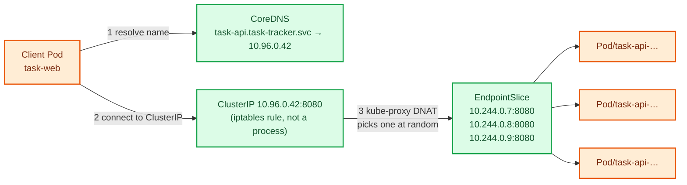
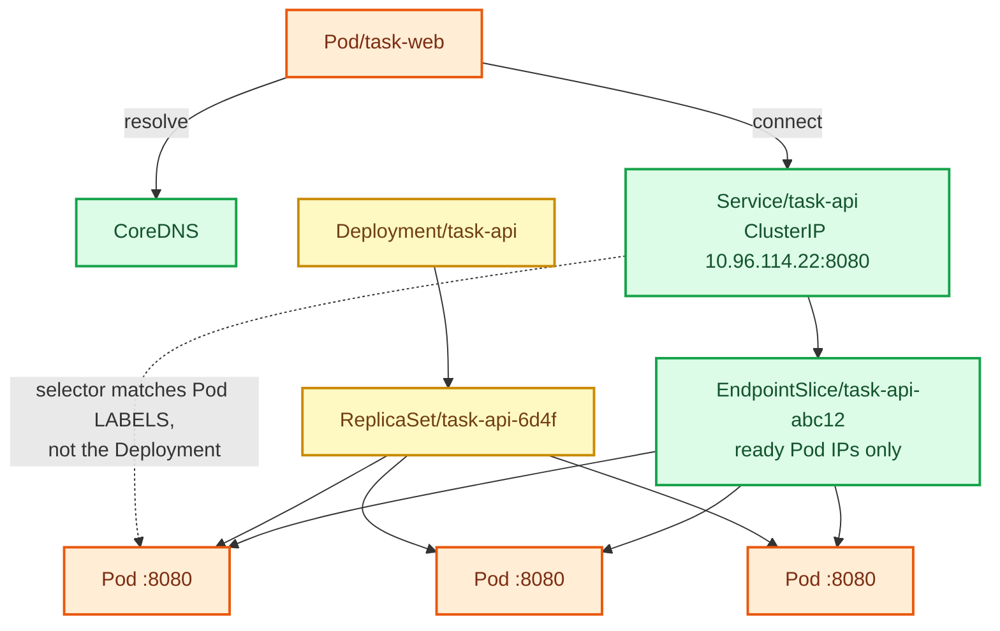

# Stage 04 — Services

[⬅ Project 01](../../README.md) · Stage 5 of 9

[00 Namespace](../00-namespace/README.md) › [01 Pods](../01-pods/README.md) › [02 ReplicaSets](../02-replicasets/README.md) › [03 Deployments](../03-deployments/README.md) › **04 Services** › [05 ConfigMaps](../05-configmaps/README.md) › [06 Secrets](../06-secrets/README.md) › [11 Probes](../11-health-checks/README.md) › [19 Final](../19-final/README.md)


> **The problem:** `task-web` held a backend Pod IP. That Pod was replaced, the IP died with it, and the UI now
> returns `502 — cannot reach the task API at http://10.244.0.7:8080`. Meanwhile two other healthy backend Pods sat
> idle the whole time.

---

## 1. WHY does this resource exist?

Three problems, one root cause — Pods are designed to be replaced:

| Problem | Why it happens |
|---|---|
| **Unstable addresses** | Every new Pod gets a new IP. Any stored IP is a time bomb. |
| **No load balancing** | Three replicas, and a client can only hold one address at a time. |
| **No health awareness** | A crashed or still-booting Pod's IP looks identical to a healthy one's. |

You could solve this outside Kubernetes — service registry, client-side discovery, a load balancer you configure by
hand. Kubernetes builds it in instead: a **stable virtual IP plus a DNS name** that always resolves to whichever Pods
are *currently ready*.

That's a **Service**.

### What happens without it

Exactly what you just saw. Clients hardcode Pod IPs, break on every rollout, and use one replica out of three. There
is no supported way to reliably reach a set of Pods without a Service.

### When do you use one?

Any time something needs to reach a set of Pods — from inside the cluster or outside it. Practically: every workload
that receives traffic.

The exception is Pods that only make *outbound* calls (a queue worker, a batch Job). Nothing connects to them, so
they need no Service.

---

## 2. WHAT is it?

A Service is a **stable network identity for a dynamic set of Pods**, selected by label.

> **Analogy:** a company's reception desk phone number. Staff join and leave constantly; the number on the website
> never changes. You call reception and get whoever is on duty.
>
> **Technically:** a Service allocates a virtual IP (the ClusterIP) from the service CIDR and registers a DNS name.
> The endpoints controller watches Pods matching `spec.selector` and maintains an **EndpointSlice** listing the
> *ready* ones. `kube-proxy` on every node programs iptables/IPVS rules that DNAT traffic destined for the ClusterIP
> to one of those Pod IPs.

### The ClusterIP is not a machine

Nothing listens on the ClusterIP. There's no proxy Pod, no process holding that address. It's a **rule in the kernel's
packet-filtering tables on every node**. A packet to `10.96.0.42:8080` gets its destination rewritten to a real Pod IP
before it ever leaves the node. That's why a Service adds essentially no latency, and why you can't `ping` a
ClusterIP — there's nothing there to answer ICMP.

### Service types

| Type | What it does | Reachable from |
|---|---|---|
| **ClusterIP** (default) | Virtual IP inside the cluster | Inside the cluster only |
| **NodePort** | ClusterIP + a port on every node (30000–32767) | Outside, via `<node-ip>:<nodeport>` |
| **LoadBalancer** | NodePort + asks the cloud for an external LB | The internet (on a cloud provider) |
| **Headless** (`clusterIP: None`) | No virtual IP; DNS returns Pod IPs directly | Inside; used for StatefulSets (Project 03) |
| **ExternalName** | A CNAME to an external DNS name | Inside; maps external services (Project 03) |

This project uses **ClusterIP** only. Both tiers live inside the cluster, and you'll reach the UI with
`port-forward`. External exposure (NodePort, LoadBalancer, Ingress) arrives in Project 02, where the difference
between them is the lesson.

---

## 3. HOW does it work?



**The four moving parts:**

1. **Service object** — you declare a selector and ports. The API server allocates a ClusterIP.
2. **EndpointSlice controller** — watches Pods matching the selector, writes the IPs of the **ready** ones into an
   EndpointSlice object. This is the piece that makes the Service self-updating.
3. **kube-proxy** — a DaemonSet on every node, watching Services and EndpointSlices, programming iptables (or IPVS)
   rules that rewrite the destination of packets aimed at the ClusterIP.
4. **CoreDNS** — watches Services and answers `task-api.task-tracker.svc.cluster.local` with the ClusterIP.

**The crucial consequence:** when a Pod dies, the EndpointSlice controller removes its IP within moments and
kube-proxy updates the rules. Clients keep using the same name and IP throughout and never notice.

### DNS names

From a Pod in the **same namespace**, all of these work:

```
task-api                                      # relies on the search domain
task-api.task-tracker
task-api.task-tracker.svc
task-api.task-tracker.svc.cluster.local       # FQDN — use this in config
```

From a **different** namespace, only the last three. This project uses the FQDN: explicit, and immune to
search-domain surprises.

### Load balancing is L4, per connection

kube-proxy balances **connections**, not requests, and does it randomly (iptables mode). A client using HTTP
keep-alive holds one connection and therefore keeps hitting the **same Pod**. That surprises people constantly —
you'll see it in §8.

---

## 4. Manifest

```yaml
apiVersion: v1
kind: Service
metadata:
  name: task-api
  namespace: task-tracker
spec:
  type: ClusterIP
  selector:                       # ← must match the Pods' LABELS
    app.kubernetes.io/name: task-api
    app.kubernetes.io/instance: task-api
  ports:
    - name: http
      port: 8080                  # the Service's port
      targetPort: http            # the container's NAMED port
      protocol: TCP
```

Files:
[`task-api-service.yaml`](task-api-service.yaml) ·
[`task-web-service.yaml`](task-web-service.yaml) ·
[`task-web-deployment-patched.yaml`](task-web-deployment-patched.yaml) *(swaps the Pod IP for the Service DNS name)*

---

## 5. Manifest breakdown

| Field | Value | What it does | What breaks if it's wrong |
|---|---|---|---|
| `apiVersion` | `v1` | Service is core API | `no matches for kind` |
| `metadata.name` | `task-api` | **Becomes the DNS name.** Renaming the Service changes every client's config | Clients get NXDOMAIN |
| `spec.type` | `ClusterIP` | Internal virtual IP | `NodePort`/`LoadBalancer` expose it externally |
| `spec.selector` | 2 labels | **The wiring.** Ready Pods with these labels become endpoints | Typo → zero endpoints → connection refused, **with no error message anywhere** |
| `spec.ports[].port` | `8080` | Port the Service listens on — what clients connect to | Client connects to the wrong port |
| `spec.ports[].targetPort` | `http` | Port on the Pod. Can be a number or a **named** container port | Wrong value → connection refused *through the Service* while `port-forward` to the Pod works |
| `spec.ports[].name` | `http` | Required when a Service has multiple ports; good practice always | — |
| `spec.ports[].protocol` | `TCP` | TCP (default), UDP, or SCTP | — |

### Two things people get wrong

**1. The selector has nothing to do with the Deployment.** A Service selects **Pods**, by label. It doesn't know
Deployments exist. That indirection is a feature: a canary Deployment with matching labels joins the same Service
automatically (Project 05).

**2. `port` and `targetPort` are different numbers for a reason.** Clients can use a conventional port (80) while the
container listens on whatever it wants (8080). Referencing `targetPort` **by name** means changing the container port
later touches only the Deployment.

---

## 6. Apply

```bash
kubectl apply -f manifests/04-services/task-api-service.yaml
kubectl apply -f manifests/04-services/task-web-service.yaml
```

▸ **Expected:** `service/task-api created`, `service/task-web created`

Now fix the frontend to use the Service name instead of a Pod IP:

```bash
kubectl apply -f manifests/04-services/task-web-deployment-patched.yaml
kubectl rollout status deployment/task-web -n task-tracker
```

▸ **What changed:** `TASK_API_URL` went from `http://10.244.0.7:8080` to
`http://task-api.task-tracker.svc.cluster.local:8080`. A template change, so a rollout happens.

---

## 7. Validate

```bash
kubectl get svc -n task-tracker
```

```
NAME       TYPE        CLUSTER-IP      EXTERNAL-IP   PORT(S)    AGE
task-api   ClusterIP   10.96.114.22    <none>        8080/TCP   20s
task-web   ClusterIP   10.96.201.7     <none>        80/TCP     20s
```

▸ `EXTERNAL-IP: <none>` is correct — ClusterIP is internal by design.

**The check that actually matters:**

```bash
kubectl get endpointslices -n task-tracker
```

```
NAME             ADDRESSTYPE   PORTS   ENDPOINTS
task-api-abc12   IPv4          8080    10.244.0.7,10.244.0.8,10.244.0.9
task-web-xyz89   IPv4          8080    10.244.0.10,10.244.0.11
```

> ⚠️ **`ENDPOINTS: <unset>` or an empty list means the Service is wired to nothing.** Connections will be refused and
> *no object will report an error*. This is the single most common silent failure in Kubernetes. Check endpoints
> first, always.

```bash
kubectl describe svc task-api -n task-tracker
```

▸ Shows the selector and the resolved `Endpoints:` line — the fastest way to confirm the selector matches reality.

---

## 8. Observe the mechanism

### It works again — and now uses all three replicas

```bash
kubectl port-forward svc/task-web 8080:80 -n task-tracker &
sleep 2
curl -s localhost:8080/api/tasks
```

▸ Tasks come back. Note you port-forwarded to a **Service** this time (`svc/task-web 8080:80` — local 8080 to Service
port 80).

**Watch load balancing across backend Pods:**

```bash
for i in $(seq 1 8); do curl -s localhost:8080/api/info | python3 -c 'import sys,json;print(json.load(sys.stdin)["pod"])'; done
```

▸ **Expected:** a mix of the three backend Pod names. Each `curl` is a new connection, so kube-proxy picks a backend
each time. (Requests over one keep-alive connection would all land on the same Pod — L4 balances connections, not
requests.)

### DNS resolution, from inside the cluster

```bash
kubectl run dnstest --rm -it --restart=Never --image=busybox:1.36 -n task-tracker -- \
  nslookup task-api.task-tracker.svc.cluster.local
```

▸ **Expected:** the ClusterIP `10.96.114.22`. That's CoreDNS answering.

```bash
kubectl run dnstest --rm -it --restart=Never --image=busybox:1.36 -n task-tracker -- \
  cat /etc/resolv.conf
```

▸ **What you see:** `nameserver` pointing at CoreDNS, and a `search` line including `task-tracker.svc.cluster.local`.
That search list is why the bare name `task-api` resolves from inside this namespace.

### The failure from stage 03 is now survivable

```bash
kubectl delete pod -n task-tracker -l app.kubernetes.io/name=task-api --wait=false | head -1
sleep 8
curl -s localhost:8080/api/tasks | head -c 80; echo
kubectl get endpointslices -n task-tracker
```

▸ **What you see:** the killed Pod's IP disappears from the EndpointSlice, the replacement's IP appears, and the app
never breaks. `task-web` didn't change, wasn't restarted, and knows nothing about any of it.

> 🧪 **Try it:** watch endpoints update live while you delete a Pod:
> `kubectl get endpointslices -n task-tracker -w`

```bash
kill %1 2>/dev/null
```

---

## 9. Break it

### Break 1 — the selector typo (the classic)

```bash
kubectl patch svc task-api -n task-tracker \
  -p '{"spec":{"selector":{"app.kubernetes.io/name":"task-apiz"}}}'
```

**Symptom:**

```bash
kubectl get endpointslices -n task-tracker -l kubernetes.io/service-name=task-api
```

```
NAME             ADDRESSTYPE   PORTS     ENDPOINTS
task-api-abc12   IPv4          <unset>   <unset>
```

The UI now shows `502 — cannot reach the task API`.

**Investigate:**

```bash
kubectl describe svc task-api -n task-tracker | grep -A2 -E 'Selector|Endpoints'
kubectl get pods -n task-tracker --show-labels | head -3
```

Compare the two. The Service is looking for `task-apiz`; the Pods say `task-api`.

**Root cause:** the selector is a label query. A query that matches nothing returns nothing. **The Service is not
"broken" from Kubernetes' point of view** — it's doing exactly what you asked, which is why there's no error event
anywhere.

**Fix:**

```bash
kubectl apply -f manifests/04-services/task-api-service.yaml
kubectl get endpointslices -n task-tracker
```

**What you learned:** empty endpoints = selector/label mismatch, or no Pod is Ready. It is always one of those two.

### Break 2 — the wrong targetPort

```bash
kubectl patch svc task-api -n task-tracker \
  -p '{"spec":{"ports":[{"name":"http","port":8080,"targetPort":9999,"protocol":"TCP"}]}}'
```

**Symptom:** endpoints are **populated** (`10.244.0.7:9999`) but connections are refused.

**Investigate — the diagnostic that separates the two layers:**

```bash
# through the Service — fails
kubectl run t --rm -it --restart=Never --image=curlimages/curl:8.10.1 -n task-tracker -- \
  curl -sS -m 5 http://task-api:8080/livez

# straight to the Pod, bypassing the Service — works
kubectl port-forward deployment/task-api 9090:8080 -n task-tracker &
sleep 2; curl -s localhost:9090/livez; kill %1
```

**Root cause:** the app listens on 8080; the Service forwards to 9999. Endpoints exist because the *selector* is
fine — endpoints only prove label matching, never that the port is right.

**Fix:** `kubectl apply -f manifests/04-services/task-api-service.yaml`

**What you learned:** "works via port-forward to the Pod, fails via the Service" almost always means `targetPort`.

---

## 10. How it interacts



**Relationships to remember:**

```
Service → EndpointSlice → Pods        (by label, filtered by readiness)
Deployment → ReplicaSet → Pods        (by ownership)
```

Both point at the same Pods from different directions, and they never talk to each other.

---

## 11. Production notes

> 🧪 **DEMO / LEARNING CONFIGURATION**
> ClusterIP only, reached via `port-forward`. No probes, so "ready" just means "started" — endpoints include Pods
> that may not be able to serve yet.

> 🏭 **PRODUCTION CONSIDERATIONS**
> - **Readiness probes are what make endpoints trustworthy** (stage 11). Without them the Service routes to Pods that
>   are still booting, causing errors on every rollout.
> - Use `Ingress` for HTTP rather than one LoadBalancer per Service — cheaper and gives you host/path routing
>   (Project 02, Project 04)
> - Understand your `externalTrafficPolicy` when exposing externally: `Cluster` (default) load-balances but hides the
>   client IP; `Local` preserves it but can create imbalance
> - `sessionAffinity: ClientIP` if you genuinely need stickiness — but prefer stateless services
> - Set `publishNotReadyAddresses: false` (default) so unready Pods never receive traffic
> - Long-lived keep-alive connections defeat L4 balancing; an L7 proxy or a service mesh balances per request
> - Name your ports — some features (`NetworkPolicy`, metrics, mesh protocol detection) rely on it

---

## 12. The next problem

`task-web` now finds `task-api` reliably. But look at where its configuration lives: the API URL, the environment
name, and the log level are all **literals inside Deployment manifests**.

Change the log level and you edit a workload spec and trigger a rollout of the *application*. Run the same image in
dev and prod and you need two different Deployment files that differ only in a few strings.

Configuration should not live inside the thing being configured.

→ **[Stage 05 — ConfigMaps](../05-configmaps/README.md)**

---

## 📚 Official documentation

Everything above is self-contained — these are for going deeper, not for filling gaps.
*(All links verified 2026-08-09.)*

| Reference | What it adds |
|---|---|
| [Service](https://kubernetes.io/docs/concepts/services-networking/service/) | All Service types, `port` vs `targetPort`, selectors |
| [EndpointSlices](https://kubernetes.io/docs/concepts/services-networking/endpoint-slices/) | How ready Pod IPs are tracked |
| [DNS for Services and Pods](https://kubernetes.io/docs/concepts/services-networking/dns-pod-service/) | The four name forms and search domains |
| [Virtual IPs and Service proxies](https://kubernetes.io/docs/reference/networking/virtual-ips/) | What kube-proxy programs — iptables/IPVS, and why you can't ping a ClusterIP |
| [Connecting applications with Services](https://kubernetes.io/docs/concepts/services-networking/connect-applications-service/) | The end-to-end walkthrough this stage mirrors |
| [Cluster networking](https://kubernetes.io/docs/concepts/cluster-administration/networking/) | The Pod-network model underneath all of it |

---

| ◀ Previous | ▲ Up | Next ▶ |
|---|:--:|---:|
| ◀ **[03 Deployments](../03-deployments/README.md)** | [Project 01](../../README.md) · [Manual steps](../../scripts/manual-steps.md) | **[05 ConfigMaps](../05-configmaps/README.md)** ▶ |
