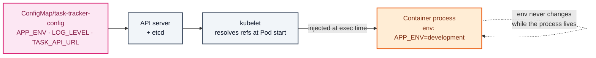
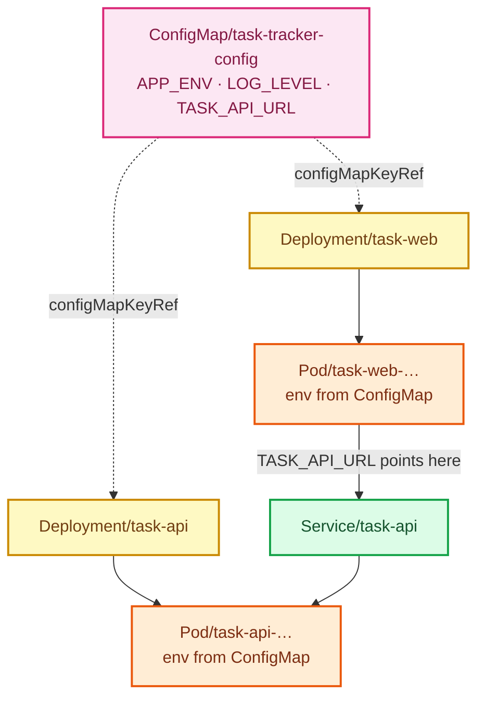

# Stage 05 — ConfigMaps

[⬅ Project 01](../../README.md) · Stage 6 of 9

[00 Namespace](../00-namespace/README.md) › [01 Pods](../01-pods/README.md) › [02 ReplicaSets](../02-replicasets/README.md) › [03 Deployments](../03-deployments/README.md) › [04 Services](../04-services/README.md) › **05 ConfigMaps** › [06 Secrets](../06-secrets/README.md) › [11 Probes](../11-health-checks/README.md) › [19 Final](../19-final/README.md)


> **The problem:** `TASK_API_URL`, `APP_ENV` and `LOG_LEVEL` are literals inside two Deployment manifests. To change a
> log level you edit a workload spec. To run the same image in dev and prod you maintain two nearly identical
> Deployment files.

---

## 1. WHY does this resource exist?

Configuration changes far more often than code, and differs per environment. If it lives inside the container image,
you get the worst outcome:

| If config is baked into the image | Consequence |
|---|---|
| Different image per environment | The thing you tested in staging is **not** the thing you ship |
| Change a setting → rebuild → repush → redeploy | Minutes to hours for a one-line change |
| Secrets in image layers | Anyone who can pull the image can read them |

Moving it into the Deployment manifest (where it is now) is better but still wrong:

- The Deployment describes *how to run* the app; mixing in *what to tell* the app conflates two concerns
- Multiple workloads sharing a setting must each repeat it — and drift apart
- Every config tweak is a change to a workload spec

Kubernetes separates the two. **A ConfigMap is a first-class object holding configuration**, referenced by workloads.
One image, many environments.

### What happens without it

Config duplicated across manifests, drifting silently. The same `TASK_API_URL` is currently written in two files — if
the Service is ever renamed, forgetting one gives you a half-broken app.

### When do you use one — and when not?

| Use a ConfigMap | Don't |
|---|---|
| URLs, hostnames, feature flags, log levels, timeouts | **Anything secret** — use a Secret (stage 06) |
| Whole config files (nginx.conf, application.yaml) | Data over ~1 MiB — that's the hard etcd-backed limit |
| Anything that differs between environments | Values that must change without a restart *and* are consumed via env vars (see §3) |

---

## 2. WHAT is it?

A ConfigMap is a **namespaced key/value object holding non-confidential configuration**, which Pods consume as
environment variables, command-line arguments, or files in a volume.

> **Analogy:** the notice board in a staff room. Anyone can read it, it's posted separately from the people reading
> it, and updating it doesn't require replacing staff.
>
> **Technically:** a ConfigMap is just data in etcd. It has **no schema, no validation, and no behaviour** — it does
> nothing until a Pod references it. Errors surface at Pod startup, not at ConfigMap creation.

### Three ways to consume it

| Method | YAML | Result | Updates without restart? |
|---|---|---|---|
| Single key → env var | `valueFrom.configMapKeyRef` | One explicit variable | ❌ never |
| All keys → env vars | `envFrom.configMapRef` | Every key becomes a variable | ❌ never |
| Mount as files | `volumes.configMap` | One file per key | ✅ yes (~60s, kubelet sync) |

**Environment variables are read once, at process start.** The Linux process environment is fixed at exec time —
Kubernetes cannot change it afterwards. Editing a ConfigMap consumed via env has **no effect on running Pods**, and
this trips up everyone once.

Mounted volumes are different: the kubelet refreshes the files periodically, so the *file* changes. Whether the *app*
notices depends on whether it re-reads the file.

This stage uses env vars (the common case, and the one with the surprising behaviour). Volume mounts appear in
Project 03, where a config file must be reloaded without a restart.

---

## 3. HOW does it work?



1. You create the ConfigMap. **Nothing happens** — it's inert data.
2. A Pod is created referencing it. The kubelet fetches the ConfigMap and resolves each `configMapKeyRef`.
3. If a referenced key is **missing**, the container will not start:
   `CreateContainerConfigError`. The Pod stays `Pending`/not-ready and the reason is in `kubectl describe`.
4. Values are passed to the container at `exec()` time. From then on they're frozen for that process.

### How do you actually roll out a config change?

Change the ConfigMap, then restart the workloads that read it:

```bash
kubectl rollout restart deployment/task-api -n task-tracker
```

▸ **What it does:** patches the Pod template with a `kubectl.kubernetes.io/restartedAt` annotation. A template change
means a new ReplicaSet, which means a normal rolling update — zero downtime, unlike deleting Pods.

Better still, make the change *itself* trigger the rollout by adding a `checksum/config` annotation to the Pod
template containing a hash of the ConfigMap. Project 03 does this properly.

---

## 4. Manifest

```yaml
apiVersion: v1
kind: ConfigMap
metadata:
  name: task-tracker-config
  namespace: task-tracker
data:
  APP_ENV: "development"
  LOG_LEVEL: "info"
  TASK_API_URL: "http://task-api.task-tracker.svc.cluster.local:8080"
```

And the consumption side:

```yaml
env:
  - name: APP_ENV
    valueFrom:
      configMapKeyRef:
        name: task-tracker-config
        key: APP_ENV
```

Files: [`configmap.yaml`](configmap.yaml) ·
[`task-api-deployment.yaml`](task-api-deployment.yaml) ·
[`task-web-deployment.yaml`](task-web-deployment.yaml)

---

## 5. Manifest breakdown

| Field | Value | What it does | What breaks if it's wrong |
|---|---|---|---|
| `data` | string map | UTF-8 key/value pairs. Keys must be alphanumeric with `-`, `_`, `.` | Invalid key rejected by the API server |
| `binaryData` | base64 map | For non-UTF-8 content (certificates, archives) | — |
| `immutable` | `true`/`false` | If true, the ConfigMap can never be edited — only deleted and recreated. Reduces API-server watch load and prevents accidental live edits | Covered in Project 03 |
| `configMapKeyRef.name` | ConfigMap name | Which ConfigMap | Missing → `CreateContainerConfigError` |
| `configMapKeyRef.key` | key name | Which key | Missing key → `CreateContainerConfigError` |
| `configMapKeyRef.optional` | default `false` | `false` = the Pod refuses to start without it | `true` on a required setting hides the failure until runtime |

> **YAML gotcha:** everything in `data` is a **string**. `LOG_LEVEL: info` is fine, but `PORT: 8080` makes YAML parse
> an integer and the API server rejects it — you need `PORT: "8080"`. Same for `true`/`false`/`yes`/`no`. **Quote
> everything.**

---

## 6. Apply

```bash
kubectl apply -f manifests/05-configmaps/configmap.yaml
kubectl apply -f manifests/05-configmaps/task-api-deployment.yaml
kubectl apply -f manifests/05-configmaps/task-web-deployment.yaml
kubectl rollout status deployment/task-api -n task-tracker
kubectl rollout status deployment/task-web -n task-tracker
```

▸ **Order matters:** create the ConfigMap **before** the workloads that reference it, or the new Pods hit
`CreateContainerConfigError` (which you'll deliberately cause in §9).

---

## 7. Validate

```bash
kubectl get configmap -n task-tracker
kubectl describe configmap task-tracker-config -n task-tracker
```

▸ `describe` prints the values in full — a ConfigMap offers **zero** confidentiality. That is precisely why stage 06
exists.

**Confirm the values actually reached the container:**

```bash
kubectl exec deployment/task-api -n task-tracker -- env | grep -E 'APP_ENV|LOG_LEVEL'
```

```
APP_ENV=development
LOG_LEVEL=info
```

**And that the app is using them:**

```bash
kubectl port-forward svc/task-web 8080:80 -n task-tracker &
sleep 2; curl -s localhost:8080/api/info; kill %1
```

```json
{"app_env":"development","auth_enabled":false,"log_level":"info","pod":"task-api-..."}
```

---

## 8. Observe the mechanism

### Env vars really are frozen at process start

```bash
# Change the config
kubectl patch configmap task-tracker-config -n task-tracker \
  -p '{"data":{"LOG_LEVEL":"debug"}}'

# The object changed:
kubectl get configmap task-tracker-config -n task-tracker -o jsonpath='{.data.LOG_LEVEL}'; echo
# debug

# The running container did NOT:
kubectl exec deployment/task-api -n task-tracker -- env | grep LOG_LEVEL
# LOG_LEVEL=info        ← still the old value
```

▸ **This is not a bug.** The process environment is immutable after `exec()`. Nothing in Kubernetes can reach into a
running process and change it.

**Roll it out properly:**

```bash
kubectl rollout restart deployment/task-api -n task-tracker
kubectl rollout status deployment/task-api -n task-tracker
kubectl exec deployment/task-api -n task-tracker -- env | grep LOG_LEVEL
# LOG_LEVEL=debug       ← new Pods, new environment
```

▸ Watch the logs get chattier — the app now logs at debug level:

```bash
kubectl logs deployment/task-api -n task-tracker --tail=5
```

Put it back:

```bash
kubectl apply -f manifests/05-configmaps/configmap.yaml
kubectl rollout restart deployment/task-api -n task-tracker
```

### One source of truth, two consumers

```bash
kubectl exec deployment/task-web -n task-tracker -- env | grep TASK_API_URL
```

▸ Both tiers now read `TASK_API_URL` from the same key. Rename the Service and you edit **one** line instead of
hunting through workload manifests.

> 🧪 **Try it:** create a ConfigMap from files or literals without writing YAML —
> `kubectl create configmap demo --from-literal=A=1 --from-file=./some.conf --dry-run=client -o yaml`
> The `--dry-run=client -o yaml` trick generates the manifest for you to save.

---

## 9. Break it

### Break 1 — a missing key

```bash
kubectl patch deployment task-api -n task-tracker --type=json \
  -p='[{"op":"replace","path":"/spec/template/spec/containers/0/env/0/valueFrom/configMapKeyRef/key","value":"APP_ENVIRONMENT"}]'
kubectl get pods -n task-tracker
```

**Symptom:**

```
NAME                        READY   STATUS                       RESTARTS   AGE
task-api-7d9c8f5b4-x2klm    0/1     CreateContainerConfigError   0          15s
```

**Investigate:**

```bash
kubectl describe pod -n task-tracker -l app.kubernetes.io/name=task-api | grep -A5 Events
```

```
Warning  Failed  kubelet  Error: couldn't find key APP_ENVIRONMENT in ConfigMap task-tracker/task-tracker-config
```

**Root cause:** `optional` defaults to `false`, so a missing key is a hard failure. The kubelet cannot construct the
container's environment, so it never starts the container. The Pod is scheduled and `Running`-adjacent but the
container is stuck.

▸ **Note the old Pods are still serving.** `maxUnavailable: 0` meant the rollout stalled rather than taking the app
down — the Deployment protected you.

**Fix:**

```bash
kubectl apply -f manifests/05-configmaps/task-api-deployment.yaml
kubectl rollout status deployment/task-api -n task-tracker
```

**What you learned:** `CreateContainerConfigError` always means a referenced ConfigMap/Secret **object or key** is
missing. `describe` names the exact key.

### Break 2 — the unquoted-value trap

```bash
cat <<'EOF' | kubectl apply -f - 2>&1 | tail -2
apiVersion: v1
kind: ConfigMap
metadata:
  name: bad-types
  namespace: task-tracker
data:
  PORT: 8080
  DEBUG: true
EOF
```

**Symptom:**

```
Error from server (BadRequest): ... cannot unmarshal number into Go struct field ConfigMap.data of type string
```

**Root cause:** YAML parsed `8080` as an integer and `true` as a boolean. `data` accepts strings only.

**Fix:** quote them — `PORT: "8080"`, `DEBUG: "true"`.

**What you learned:** always quote ConfigMap values. The failure is at least loud; the *silent* version of this bug is
`version: 1.10` becoming the float `1.1`.

---

## 10. How it interacts



**Note the loop:** the ConfigMap tells `task-web` the *name of the Service* that fronts `task-api`. Configuration and
service discovery meet here.

---

## 11. Production notes

> 🧪 **DEMO / LEARNING CONFIGURATION**
> One shared ConfigMap for both tiers, mutable, consumed as environment variables.

> 🏭 **PRODUCTION CONSIDERATIONS**
> - **Never put secrets in a ConfigMap.** `kubectl describe` prints it, RBAC on ConfigMaps is usually loose, and it
>   isn't encrypted at rest by default. Stage 06.
> - Use `immutable: true` for config that shouldn't change under a running fleet — it also reduces API-server load at
>   scale (Project 03)
> - Add a `checksum/config` annotation on the Pod template so a config change automatically triggers a rollout
>   instead of requiring a remembered `rollout restart` (Project 03)
> - Prefer **per-component** ConfigMaps over one shared blob at scale — a shared one means a change restarts
>   everything
> - Environment overlays via Kustomize (`overlays/dev`, `overlays/prod`) rather than hand-maintained copies
>   (stage 19, Project 10)
> - Validate config at application startup and fail fast with a clear message; a typo'd URL should not become a
>   confusing runtime error an hour later
> - 1 MiB is the hard size limit — large configs belong in a volume or an object store

---

## 12. The next problem

The app currently has **no authentication at all**. Add an API token and there's an obvious temptation:

```yaml
data:
  API_TOKEN: "super-secret-value"     # ← in the ConfigMap, next to LOG_LEVEL
```

That token would be printed by `kubectl describe`, readable by anyone with `get configmap`, stored unencrypted, and
committed to Git in plain sight.

Credentials need different handling from log levels.

→ **[Stage 06 — Secrets](../06-secrets/README.md)**

---

## 📚 Official documentation

Everything above is self-contained — these are for going deeper, not for filling gaps.
*(All links verified 2026-08-09.)*

| Reference | What it adds |
|---|---|
| [ConfigMaps](https://kubernetes.io/docs/concepts/configuration/configmap/) | Consumption methods, immutability, the 1 MiB limit |
| [Configure a Pod to use a ConfigMap](https://kubernetes.io/docs/tasks/configure-pod-container/configure-pod-configmap/) | `configMapKeyRef`, `envFrom`, volume mounts |
| [Configuration best practices](https://kubernetes.io/docs/concepts/configuration/overview/) | Official guidance on separating config from images |

---

| ◀ Previous | ▲ Up | Next ▶ |
|---|:--:|---:|
| ◀ **[04 Services](../04-services/README.md)** | [Project 01](../../README.md) · [Manual steps](../../scripts/manual-steps.md) | **[06 Secrets](../06-secrets/README.md)** ▶ |
