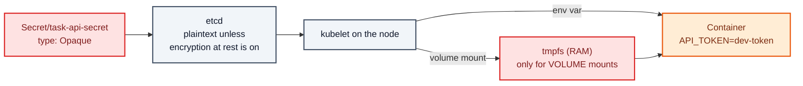
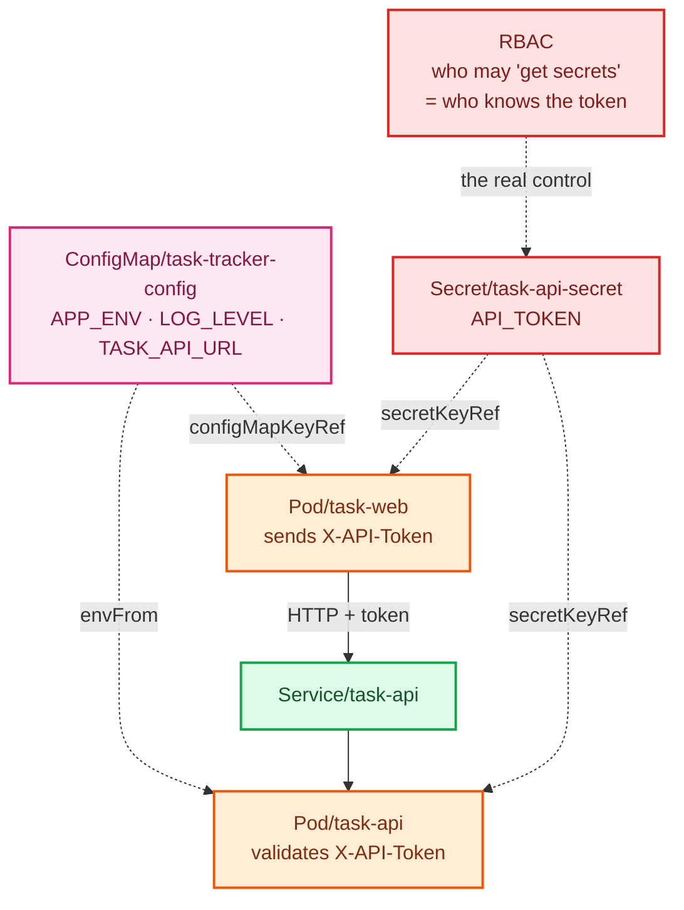

# Stage 06 — Secrets

[⬅ Project 01](../../README.md) · Stage 7 of 9

[00 Namespace](../00-namespace/README.md) › [01 Pods](../01-pods/README.md) › [02 ReplicaSets](../02-replicasets/README.md) › [03 Deployments](../03-deployments/README.md) › [04 Services](../04-services/README.md) › [05 ConfigMaps](../05-configmaps/README.md) › **06 Secrets** › [11 Probes](../11-health-checks/README.md) › [19 Final](../19-final/README.md)


> **The problem:** the API has no authentication. Adding a token to the ConfigMap would put a credential somewhere
> `kubectl describe` prints in full, anyone with `get configmap` can read, and Git stores forever.

---

## 1. WHY does this resource exist?

Every real application holds credentials — database passwords, API tokens, TLS private keys, registry logins. Each
place you could put them is worse than the last:

| Where | Why it fails |
|---|---|
| In the image | Anyone who can pull the image can extract it. Image layers are forever, so rotating means rebuilding. |
| In the Deployment manifest | In Git, in `kubectl get deploy -o yaml`, in every CI log that echoes the manifest |
| In a ConfigMap | Printed by `describe`, covered by whatever loose RBAC ConfigMaps have, unencrypted at rest |

Kubernetes gives credentials a **separate object kind** so they can be *handled* differently:

- **Separate RBAC surface** — you can grant `get configmaps` without granting `get secrets`
- **Not printed** by `kubectl describe` (it shows `<n> bytes` instead of the value)
- **Encryptable at rest** in etcd via `EncryptionConfiguration`
- **Stored in tmpfs** (memory, never disk) when mounted as a volume on a node
- **Typed** (`kubernetes.io/tls`, `kubernetes.io/dockerconfigjson`) so other features can consume them

### ⚠️ What a Secret is NOT

> **Base64 is encoding, not encryption.** `ZGV2LXRva2Vu` is `dev-token` to anyone with `base64 -d`. Base64 exists so
> arbitrary binary can travel in a JSON string field — it provides **zero** confidentiality.

A Secret is a *marker* saying "handle this carefully" plus a few mechanisms that make careful handling possible. It is
not, by itself, secure. Everything in §11 is about closing that gap.

### When do you use one?

Any credential, token, key, or certificate. And nothing else — putting `LOG_LEVEL` in a Secret just makes it harder to
read for no benefit.

---

## 2. WHAT is it?

A Secret is a **namespaced object for small amounts of sensitive data**, consumed by Pods as environment variables or
files, and handled with extra care by the control plane.

> **Analogy:** the locked drawer versus the notice board. Same room, different access rules — but a determined person
> with the key still reads everything. The lock is only as good as who holds keys (RBAC) and whether the drawer is in
> a secure building (encryption at rest).
>
> **Technically:** structurally almost identical to a ConfigMap — key/value data in etcd — but with `type`, a
> different RBAC resource name, tmpfs mounting, redacted output, and optional envelope encryption.

### Secret types

| Type | Purpose | Required keys |
|---|---|---|
| `Opaque` | Generic key/value (this project) | any |
| `kubernetes.io/tls` | TLS cert + key for Ingress | `tls.crt`, `tls.key` |
| `kubernetes.io/dockerconfigjson` | Private registry auth (`imagePullSecrets`) | `.dockerconfigjson` |
| `kubernetes.io/basic-auth` | Username/password | `username`, `password` |
| `kubernetes.io/service-account-token` | Legacy SA token (modern clusters use projected tokens) | — |

### `data` vs `stringData`

```yaml
data:                                # you provide base64 yourself
  API_TOKEN: ZGV2LXRva2Vu
stringData:                          # you provide plain text; API server encodes it
  API_TOKEN: "dev-token"
```

Use **`stringData`** in hand-written manifests. It's readable, diffable, and impossible to get wrong — and it is
exactly as (in)secure, because base64 was never the protection.

---

## 3. HOW does it work?



1. You submit `stringData`; the API server base64-encodes it into `data` and stores it in etcd — **in plaintext**
   unless the cluster has `EncryptionConfiguration` enabled.
2. The kubelet on the node running the Pod fetches the Secret and injects it.
3. **As an env var:** the value lands in the process environment — visible in `/proc/<pid>/environ`, in crash dumps,
   and often in application logs that dump their config.
4. **As a volume:** written to a tmpfs (RAM) mount, never touching the node's disk, and auto-updated when the Secret
   changes.
5. The kubelet only fetches Secrets for Pods scheduled on its node — a node compromise exposes the Secrets used
   there, not all of them.

> **Volume mounts are the more secure consumption method.** Env vars leak into logs, error reports and child
> processes far too easily. This stage uses env vars because they're what you'll meet most often; Project 07 shows the
> volume approach with proper hardening.

---

## 4. Manifest

```yaml
apiVersion: v1
kind: Secret
metadata:
  name: task-api-secret
  namespace: task-tracker
type: Opaque
stringData:
  API_TOKEN: "dev-token-not-for-production"
```

And consumption:

```yaml
env:
  - name: API_TOKEN
    valueFrom:
      secretKeyRef:
        name: task-api-secret
        key: API_TOKEN
```

Files: [`secret.yaml`](secret.yaml) ·
[`task-api-deployment.yaml`](task-api-deployment.yaml) ·
[`task-web-deployment.yaml`](task-web-deployment.yaml)

> 🧪 **DEMO ONLY.** This Secret is committed to Git with a readable value. In a real repository this file would leak
> the credential to everyone with read access, forever, including in history after you "delete" it. §11 covers what
> to do instead.

---

## 5. Manifest breakdown

| Field | Value | What it does | What breaks if it's wrong |
|---|---|---|---|
| `type` | `Opaque` | Generic secret. Typed secrets require specific keys | Wrong type → rejected if required keys are absent |
| `stringData` | plain text | API server base64-encodes into `data`. Write-only — never appears in reads | — |
| `data` | base64 | What you get back when you read the object | Invalid base64 → rejected |
| `immutable` | `true`/`false` | Prevents edits; must delete and recreate. Good for rotation discipline | — |
| `secretKeyRef.name`/`.key` | — | Which Secret and which key | Missing → `CreateContainerConfigError` |
| `secretKeyRef.optional` | default `false` | Hard dependency by default | `true` on a required credential hides failures |

Note the API deployment also switches its ConfigMap consumption to `envFrom`:

```yaml
envFrom:
  - configMapRef:
      name: task-tracker-config     # every key becomes an env var
env:
  - name: API_TOKEN                 # the Secret stays explicit — deliberately
    valueFrom:
      secretKeyRef: {name: task-api-secret, key: API_TOKEN}
```

▸ `envFrom` is concise but hides what the container consumes. Keeping the Secret reference explicit means the
credential dependency is visible in the manifest — worth the extra lines.

---

## 6. Apply

```bash
kubectl apply -f manifests/06-secrets/secret.yaml
kubectl apply -f manifests/06-secrets/task-api-deployment.yaml
kubectl apply -f manifests/06-secrets/task-web-deployment.yaml
kubectl rollout status deployment/task-api -n task-tracker
kubectl rollout status deployment/task-web -n task-tracker
```

▸ **Both tiers must roll together.** The moment the API sees a non-empty `API_TOKEN` it starts requiring the
`X-API-Token` header. If `task-web` doesn't have the token yet, every request becomes a 401 — which is failure lab 2
below, and a good lesson in coordinated config changes.

---

## 7. Validate

```bash
kubectl get secret -n task-tracker
```

```
NAME              TYPE     DATA   AGE
task-api-secret   Opaque   1      10s
```

```bash
kubectl describe secret task-api-secret -n task-tracker
```

```
Data
====
API_TOKEN:  27 bytes
```

▸ **Note what `describe` does NOT print.** Compare with `describe configmap`, which printed values in full. That
difference is the entire practical distinction at the CLI level.

**But it is trivially readable if you have permission:**

```bash
kubectl get secret task-api-secret -n task-tracker -o jsonpath='{.data.API_TOKEN}' | base64 -d; echo
```

```
dev-token-not-for-production
```

▸ **This is the point.** Anyone with `get secrets` in this namespace has the credential. RBAC is the actual control.

**Confirm auth is live:**

```bash
kubectl port-forward svc/task-web 8080:80 -n task-tracker &
sleep 2
curl -s localhost:8080/api/info
```

```json
{"app_env":"development","auth_enabled":true,"log_level":"info","pod":"task-api-..."}
```

▸ `auth_enabled: true` — and the UI still works, because `task-web` attaches the token when proxying.

---

## 8. Observe the mechanism

### The token is enforced

```bash
# Direct to the API, no token → 401
kubectl run t --rm -it --restart=Never --image=curlimages/curl:8.10.1 -n task-tracker -- \
  curl -sS http://task-api:8080/api/tasks
```

```json
{"error":"invalid or missing X-API-Token"}
```

```bash
# With the token → works
kubectl run t --rm -it --restart=Never --image=curlimages/curl:8.10.1 -n task-tracker -- \
  curl -sS -H "X-API-Token: dev-token-not-for-production" http://task-api:8080/api/tasks
```

▸ Through `task-web` it works either way, because the proxy injects the header server-side. The browser never sees
the token — which is why the proxy design exists.

### Env vars leak more than you'd like

```bash
kubectl exec deployment/task-api -n task-tracker -- env | grep API_TOKEN
```

▸ Anyone with `exec` on the Pod reads the credential instantly. Also visible in `/proc/1/environ`, in most crash
handlers, and in any log line that dumps configuration.

> 🎯 **Interview point:** "Are Kubernetes Secrets secure?" — No, not by default. They're base64-encoded in etcd, and
> anyone with `get secrets` or etcd access can read them. They become reasonably secure with encryption at rest,
> tight RBAC, and ideally an external secret manager so the value never lives in the cluster or in Git.

### Rotation requires a restart (same reason as stage 05)

```bash
kubectl patch secret task-api-secret -n task-tracker \
  -p '{"stringData":{"API_TOKEN":"rotated-token-v2"}}'

kubectl exec deployment/task-api -n task-tracker -- env | grep API_TOKEN
# still the OLD value — env is frozen at process start
```

```bash
# Roll BOTH tiers, or they'll disagree about the token
kubectl rollout restart deployment/task-api deployment/task-web -n task-tracker
kubectl rollout status deployment/task-api -n task-tracker
kubectl exec deployment/task-api -n task-tracker -- env | grep API_TOKEN
# rotated-token-v2
```

▸ **Volume-mounted Secrets update automatically** (~60s) without a restart — one of the strongest arguments for
mounting rather than injecting.

Restore:

```bash
kubectl apply -f manifests/06-secrets/secret.yaml
kubectl rollout restart deployment/task-api deployment/task-web -n task-tracker
```

---

## 9. Break it

### Break 1 — a missing Secret

```bash
kubectl delete secret task-api-secret -n task-tracker
kubectl rollout restart deployment/task-api -n task-tracker
sleep 5
kubectl get pods -n task-tracker
```

**Symptom:**

```
task-api-8f7d6c5b9-k2mnp   0/1   CreateContainerConfigError   0   10s
```

**Investigate:**

```bash
kubectl describe pod -n task-tracker -l app.kubernetes.io/name=task-api | grep -A5 Events
```

```
Warning  Failed  kubelet  Error: secret "task-api-secret" not found
```

**Root cause:** identical mechanics to a missing ConfigMap key — `optional: false` makes it a hard dependency, so the
kubelet can't build the container's environment and never starts it.

▸ Again the **old Pods keep serving**. `maxUnavailable: 0` stalled the rollout instead of causing an outage.

**Fix:**

```bash
kubectl apply -f manifests/06-secrets/secret.yaml
kubectl rollout status deployment/task-api -n task-tracker
```

### Break 2 — the two tiers disagree about the token

```bash
kubectl set env deployment/task-web API_TOKEN=wrong-token -n task-tracker
kubectl rollout status deployment/task-web -n task-tracker

kubectl port-forward svc/task-web 8080:80 -n task-tracker &
sleep 2; curl -s localhost:8080/api/tasks; kill %1
```

**Symptom:**

```json
{"error":"invalid or missing X-API-Token"}
```

The UI loads but shows no tasks. **Every Pod is `Running` and `1/1 READY`.** Nothing in `kubectl get` looks wrong.

**Investigate:**

```bash
kubectl logs deployment/task-api -n task-tracker --tail=5      # 401s in the access log
kubectl exec deployment/task-web -n task-tracker -- env | grep API_TOKEN
kubectl get secret task-api-secret -n task-tracker -o jsonpath='{.data.API_TOKEN}' | base64 -d; echo
```

Compare the two values.

**Root cause:** an application-level authentication failure. Kubernetes has no opinion about your app's HTTP status
codes — from its perspective everything is perfectly healthy.

**Fix:**

```bash
kubectl apply -f manifests/06-secrets/task-web-deployment.yaml
kubectl rollout status deployment/task-web -n task-tracker
```

**What you learned:** "all Pods Running and Ready" does not mean the application works. Green Kubernetes status plus a
broken app means the fault is in configuration or code — go to the logs.

---

## 10. How it interacts



---

## 11. Production notes

> 🧪 **DEMO / LEARNING CONFIGURATION**
> A plaintext credential committed to Git, injected as an environment variable, never rotated, readable by anyone
> with namespace access. Every one of those is a finding in a real security review.

> 🏭 **PRODUCTION CONSIDERATIONS**
>
> **Keep secrets out of Git entirely**
> - **External Secrets Operator** syncing from AWS Secrets Manager / Azure Key Vault / Google Secret Manager / Vault
> - **Sealed Secrets** — encrypted with a cluster key, safe to commit, decrypted only in-cluster
> - **SOPS** with age/KMS for encrypted-at-rest files in Git
> - Never `git commit` a real credential. Once pushed, treat it as compromised and rotate — deleting the file doesn't
>   remove it from history.
>
> **Protect them in the cluster**
> - Enable **encryption at rest** (`EncryptionConfiguration`) or Secrets sit in etcd in plaintext
> - **RBAC is the real access control.** `get secrets` in a namespace = every credential in it. Audit it.
> - Set `automountServiceAccountToken: false` on Pods that never call the API (Project 07)
> - Restrict etcd access and encrypt etcd backups — a backup file is a complete credential dump
>
> **Consume them safely**
> - Prefer **volume mounts over env vars** — tmpfs-backed, auto-updating, far less likely to end up in a log
> - Use short-lived, automatically rotated credentials where possible (IRSA / Workload Identity in Project 10)
> - Never log configuration at startup without redaction
>
> **Operate them**
> - Rotate on a schedule *and* on any suspicion of exposure
> - Remember env-var consumers need a rollout to pick up a new value — build that into the rotation runbook
> - Scan images and repos for leaked credentials in CI

---

## 12. The next problem

Your Pods report `1/1 READY` the instant gunicorn's process starts — before it can serve a single request. During the
last few rollouts, the Service was sending traffic to Pods that weren't listening yet.

You set `maxUnavailable: 0` expecting zero downtime, but Kubernetes has no way to know whether a Pod is actually
*able* to serve. It never asked.

And if the app deadlocks while the process stays alive, nothing will ever notice.

→ **[Stage 11 — Health Checks](../11-health-checks/README.md)**

---

## 📚 Official documentation

Everything above is self-contained — these are for going deeper, not for filling gaps.
*(All links verified 2026-08-09.)*

| Reference | What it adds |
|---|---|
| [Secrets](https://kubernetes.io/docs/concepts/configuration/secret/) | Types, `stringData` vs `data`, and the explicit security caveats |
| [Distribute credentials securely](https://kubernetes.io/docs/tasks/configure-pod-container/distribute-credentials-secure/) | Env vars vs volume mounts in practice |
| [Encrypting Secret data at rest](https://kubernetes.io/docs/tasks/administer-cluster/encrypt-data/) | What actually protects etcd — base64 does not |
| [RBAC](https://kubernetes.io/docs/reference/access-authn-authz/rbac/) | `get secrets` is the real access control |
| [Security checklist](https://kubernetes.io/docs/concepts/security/security-checklist/) | Official pre-production checklist |

---

| ◀ Previous | ▲ Up | Next ▶ |
|---|:--:|---:|
| ◀ **[05 ConfigMaps](../05-configmaps/README.md)** | [Project 01](../../README.md) · [Manual steps](../../scripts/manual-steps.md) | **[11 Probes](../11-health-checks/README.md)** ▶ |
