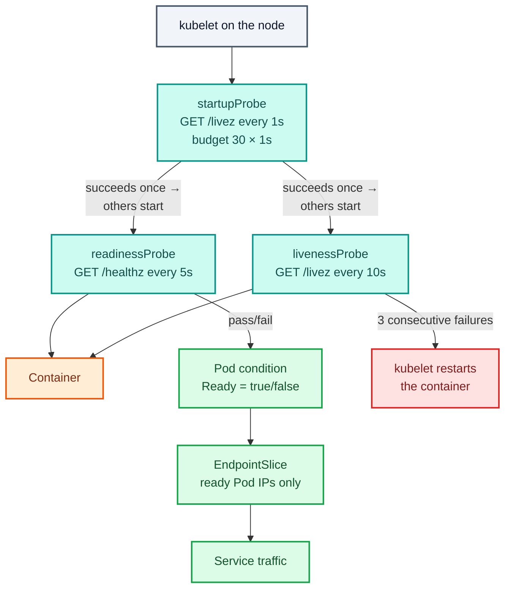
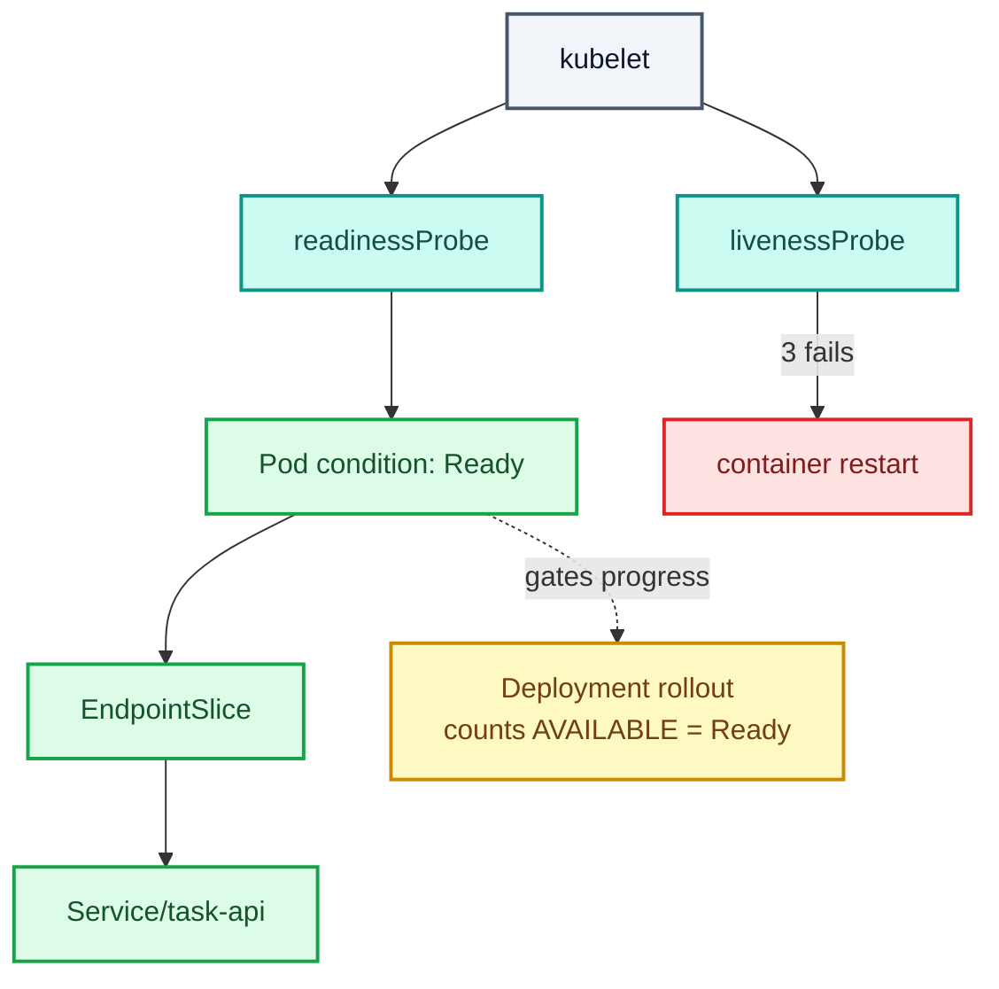

# Stage 11 — Health Checks (Probes)

[⬅ Project 01](../../README.md) · Stage 8 of 9

[00 Namespace](../00-namespace/README.md) › [01 Pods](../01-pods/README.md) › [02 ReplicaSets](../02-replicasets/README.md) › [03 Deployments](../03-deployments/README.md) › [04 Services](../04-services/README.md) › [05 ConfigMaps](../05-configmaps/README.md) › [06 Secrets](../06-secrets/README.md) › **11 Probes** › [19 Final](../19-final/README.md)


> **The problem:** a Pod reports `1/1 READY` the moment its process starts. The Service immediately sends it traffic —
> possibly seconds before the app can answer. And if the app hangs while the process stays alive, nothing notices.
> Your `maxUnavailable: 0` "zero-downtime" rollout has been a guess all along.

---

## 1. WHY does this resource exist?

Kubernetes can see one thing about your container: **is the process running?** That's a terrible proxy for "is this
application working", and it fails in both directions:

| Reality | What Kubernetes sees without probes | Consequence |
|---|---|---|
| Still loading config / warming up | `Running` → send traffic | Users get errors for the first seconds of every Pod's life |
| Deadlocked, thread pool exhausted, stuck on a dead dependency | `Running` → keep sending traffic | A zombie Pod black-holes its share of requests indefinitely |
| Temporarily overloaded | `Running` → keep sending traffic | Pile-on makes it worse |
| Slow starter (30s boot) | `Running` immediately | Rollout completes before anything can serve |

The only entity that knows whether an application is healthy is **the application**. So Kubernetes asks it — over
HTTP, TCP, gRPC, or by running a command. Those questions are **probes**.

### What happens without them

You already saw it, without noticing: every rollout in stages 03–06 briefly routed traffic to Pods that weren't
ready. In this lab the app starts fast enough to hide it. In production, with a 20-second JVM start, it's a wave of
502s on every deploy.

### When do you use them?

**Readiness on every workload that receives traffic** — non-negotiable. **Liveness only when you can articulate a
failure that a restart genuinely fixes** — a bad liveness probe causes more outages than it prevents. **Startup
whenever boot time is long or variable.**

---

## 2. WHAT is it?

Three probes, three completely different consequences. Confusing them is the most common probe mistake.

| Probe | Question | On failure | On success |
|---|---|---|---|
| **readinessProbe** | "Can you serve traffic *right now*?" | **Removed from Service endpoints.** Container keeps running | Added back automatically |
| **livenessProbe** | "Are you still functioning at all?" | **Container is killed and restarted** | Nothing |
| **startupProbe** | "Have you finished booting?" | Container killed after the budget expires | Readiness + liveness begin |

> **Analogy:** readiness is a shop assistant stepping away from the counter — still employed, just not serving right
> now. Liveness is finding them unconscious and calling an ambulance. Startup is their induction period, during which
> you don't judge their performance.
>
> **Technically:** the **kubelet** executes probes locally against the container. Readiness results update the Pod's
> `Ready` condition, which the EndpointSlice controller watches to include or exclude the Pod's IP. Liveness failures
> make the kubelet restart the container, incrementing `RESTARTS`.

### The rule people get wrong

> ⚠️ **Never point a liveness probe at an endpoint that depends on your dependencies.**
>
> If `/healthz` checks the database and the database has a hiccup, a liveness probe on it restarts every replica
> simultaneously — turning a brief dependency blip into a full outage, and the restarts often make recovery slower.
>
> **Liveness = "is this process itself broken?"** (use `/livez`, a trivial check).
> **Readiness = "should I get traffic right now?"** (may check dependencies).
>
> That's why this app exposes two separate endpoints, and why the manifest points each probe at a different one.

### Probe mechanisms

| Type | Use for | Success means |
|---|---|---|
| `httpGet` | HTTP services (this project) | Status 200–399 |
| `tcpSocket` | Databases, non-HTTP servers | The TCP connection opens |
| `exec` | Anything else | Command exits 0 |
| `grpc` | gRPC services | The standard health service reports SERVING |

### Timing fields

| Field | Default | Meaning |
|---|---|---|
| `initialDelaySeconds` | 0 | Wait before the first probe. **Prefer a startupProbe** — this is a guess |
| `periodSeconds` | 10 | How often |
| `timeoutSeconds` | 1 | How long to wait for a response. Often too short |
| `successThreshold` | 1 | Consecutive successes to be considered passing (must be 1 for liveness/startup) |
| `failureThreshold` | 3 | Consecutive failures before acting |

**Time to react = `periodSeconds` × `failureThreshold`.** Readiness here: 5 × 3 = ~15s before traffic is withdrawn.

---

## 3. HOW does it work?



1. Container starts. **Only the startup probe runs** — readiness and liveness are suspended, so a slow boot can't
   trigger a restart loop.
2. Startup succeeds once → readiness and liveness begin, on their own schedules.
3. Readiness result → the Pod's `Ready` condition → the EndpointSlice → whether the Service routes to it. Continuous,
   not one-shot.
4. Liveness failing `failureThreshold` times → the kubelet kills the container. `restartPolicy: Always` restarts it,
   with exponential backoff (`CrashLoopBackOff` if it keeps failing).

**This is also what makes rollouts safe.** The Deployment counts a Pod as *available* only when it's `Ready`. With
`maxUnavailable: 0` and a real readiness probe, a broken new version simply never becomes ready — the rollout stalls
and the old Pods keep serving. Without the probe, the rollout marches on and takes the app down.

---

## 4. Manifest

```yaml
spec:
  template:
    spec:
      terminationGracePeriodSeconds: 30
      containers:
        - name: task-api
          ports:
            - name: http
              containerPort: 8080

          startupProbe:
            httpGet: { path: /livez, port: http }
            periodSeconds: 1
            failureThreshold: 30        # 30 × 1s = 30s to finish booting

          readinessProbe:
            httpGet: { path: /healthz, port: http }
            periodSeconds: 5
            timeoutSeconds: 2
            successThreshold: 1
            failureThreshold: 3         # ~15s before traffic is withdrawn

          livenessProbe:
            httpGet: { path: /livez, port: http }   # NOT /healthz
            periodSeconds: 10
            timeoutSeconds: 2
            failureThreshold: 3         # ~30s before a restart
```

Files: [`task-api-deployment.yaml`](task-api-deployment.yaml) ·
[`task-web-deployment.yaml`](task-web-deployment.yaml)

---

## 5. Manifest breakdown

| Field | Value | What it does | What breaks if it's wrong |
|---|---|---|---|
| `startupProbe.failureThreshold × periodSeconds` | 30 × 1s | Total boot budget | Too small → the container is killed mid-boot, forever |
| `readinessProbe.httpGet.path` | `/healthz` | May check dependencies | Pointing it at a static file makes it always pass — useless |
| `readinessProbe.httpGet.port` | `http` | **Named** port, resolved from `ports[].name` | A wrong number → probe fails → Pod never Ready → Service has no endpoints |
| `readinessProbe.failureThreshold` | 3 | ~15s of failures before removal | Too low → flapping in and out of the Service under load |
| `livenessProbe.httpGet.path` | `/livez` | Process-liveness only, **no dependency checks** | Pointing at `/healthz` → a DB blip restarts every replica |
| `livenessProbe.periodSeconds` | 10 | Deliberately less aggressive than readiness | Too aggressive → restart storms |
| `timeoutSeconds` | 2 | Default of 1s is often too short for a loaded app | Too low → false failures under load, the worst possible time |
| `terminationGracePeriodSeconds` | 30 | Time between SIGTERM and SIGKILL | Too low → in-flight requests killed mid-response |

> **`initialDelaySeconds` is absent on purpose.** It's a fixed guess about boot time that's either too short (restart
> loop) or too long (slow rollouts). A startup probe adapts: it exits the moment the app is up, and only kills the
> container if the *whole budget* is exhausted.

---

## 6. Apply

```bash
kubectl apply -f manifests/11-health-checks/
kubectl rollout status deployment/task-api -n task-tracker
kubectl rollout status deployment/task-web -n task-tracker
```

▸ **Expected:** both roll out cleanly. This time `maxUnavailable: 0` means what it says — a new Pod must *pass its
readiness probe* before an old one is removed.

---

## 7. Validate

```bash
kubectl get pods -n task-tracker
```

```
NAME                        READY   STATUS    RESTARTS   AGE
task-api-6c9d8f7b5-4kzpq    1/1     Running   0          25s
...
```

▸ **`1/1 READY` now means something:** the app answered `/healthz` with a 200.

```bash
kubectl describe pod -n task-tracker -l app.kubernetes.io/name=task-api | grep -E 'Liveness|Readiness|Startup'
```

```
Liveness:   http-get http://:http/livez delay=0s timeout=2s period=10s #success=1 #failure=3
Readiness:  http-get http://:http/healthz delay=0s timeout=2s period=5s #success=1 #failure=3
Startup:    http-get http://:http/livez delay=0s timeout=2s period=1s #success=1 #failure=30
```

```bash
kubectl get pod -n task-tracker -l app.kubernetes.io/name=task-api \
  -o jsonpath='{range .items[*]}{.metadata.name}{"\t"}{.status.conditions[?(@.type=="Ready")].status}{"\n"}{end}'
```

▸ Shows the `Ready` condition per Pod — the exact field the EndpointSlice controller watches.

---

## 8. Observe the mechanism

This app has a `/debug/toggle-ready` endpoint that flips readiness **without killing the process** — so you can watch
readiness and liveness behave differently on the same container.

### Readiness withdraws traffic without restarting

```bash
kubectl get endpointslices -n task-tracker -w      # terminal 1
```

```bash
# terminal 2 — pick one Pod and make it unready
POD=$(kubectl get pod -n task-tracker -l app.kubernetes.io/name=task-api -o jsonpath='{.items[0].metadata.name}')
echo "Target: $POD"
kubectl exec $POD -n task-tracker -- python3 -c \
  "import urllib.request;print(urllib.request.urlopen('http://localhost:8080/debug/toggle-ready').read())"

sleep 20
kubectl get pods -n task-tracker
```

**What you see:**

```
NAME                        READY   STATUS    RESTARTS   AGE
task-api-6c9d8f7b5-4kzpq    0/1     Running   0          3m      ← unready, NOT restarted
task-api-6c9d8f7b5-8xnvt    1/1     Running   0          3m
task-api-6c9d8f7b5-qm2wd    1/1     Running   0          3m
```

And in terminal 1, that Pod's IP **disappeared from the EndpointSlice**.

▸ **This is the entire point of readiness.** `STATUS: Running`, `RESTARTS: 0`, but `READY 0/1` — the container is
alive and deliberately not receiving traffic. Note also that the liveness probe (`/livez`) is still passing, which is
why nothing restarted.

**Confirm traffic avoids it:**

```bash
kubectl port-forward svc/task-web 8080:80 -n task-tracker &
sleep 2
for i in $(seq 1 10); do curl -s localhost:8080/api/info | python3 -c 'import sys,json;print(json.load(sys.stdin)["pod"])'; done
kill %1
```

▸ The unready Pod's name never appears. The Service is routing around it, automatically.

**Bring it back:**

```bash
kubectl exec $POD -n task-tracker -- python3 -c \
  "import urllib.request;print(urllib.request.urlopen('http://localhost:8080/debug/toggle-ready').read())"
sleep 10
kubectl get pods -n task-tracker
```

▸ `1/1 READY` again and the IP returns to the EndpointSlice — with no human action, no restart, no rollout.

### Rollouts are now genuinely zero-downtime

```bash
# terminal 1 — hammer the app during a rollout
kubectl port-forward svc/task-web 8080:80 -n task-tracker &
sleep 2
while true; do curl -s -o /dev/null -w "%{http_code} " localhost:8080/api/tasks; sleep 0.3; done
```

```bash
# terminal 2
kubectl rollout restart deployment/task-api -n task-tracker
kubectl rollout status deployment/task-api -n task-tracker
```

▸ **Expected:** an unbroken stream of `200`s. New Pods only join the Service after passing readiness; old ones only
leave after replacements are ready.

```bash
kill %1
```

---

## 9. Break it

### Break 1 — a readiness probe pointing at the wrong path

```bash
kubectl patch deployment task-api -n task-tracker --type=json \
  -p='[{"op":"replace","path":"/spec/template/spec/containers/0/readinessProbe/httpGet/path","value":"/does-not-exist"}]'
sleep 25
kubectl get pods -n task-tracker
```

**Symptom:**

```
task-api-5f8c9d7b6-t9plk    0/1     Running   0    25s     ← new Pod, never ready
task-api-6c9d8f7b5-4kzpq    1/1     Running   0    8m      ← old Pods still serving
```

```bash
kubectl rollout status deployment/task-api -n task-tracker --timeout=30s
# error: timed out waiting for the condition
```

**Investigate:**

```bash
kubectl describe pod -n task-tracker -l app.kubernetes.io/name=task-api | grep -B2 -A6 'Readiness probe failed'
```

```
Warning  Unhealthy  kubelet  Readiness probe failed: HTTP probe failed with statuscode: 404
```

**Root cause:** the probe gets a 404, which is outside 200–399, so the Pod never becomes Ready. It's never added to
the Service, and the Deployment never counts it as available.

▸ **The failure was contained.** `maxUnavailable: 0` + a readiness probe = a broken version cannot take down the
running one. This is the safety property you've been missing since stage 03.

**Fix:**

```bash
kubectl apply -f manifests/11-health-checks/task-api-deployment.yaml
kubectl rollout status deployment/task-api -n task-tracker
```

### Break 2 — liveness pointed at a dependency-checking endpoint (the classic outage)

```bash
kubectl patch deployment task-api -n task-tracker --type=json \
  -p='[{"op":"replace","path":"/spec/template/spec/containers/0/livenessProbe/httpGet/path","value":"/healthz"}]'
kubectl rollout status deployment/task-api -n task-tracker

# Now simulate a transient problem that makes the app report "not ready"
POD=$(kubectl get pod -n task-tracker -l app.kubernetes.io/name=task-api -o jsonpath='{.items[0].metadata.name}')
kubectl exec $POD -n task-tracker -- python3 -c \
  "import urllib.request;urllib.request.urlopen('http://localhost:8080/debug/toggle-ready')"

kubectl get pod $POD -n task-tracker -w
```

**Symptom:** after ~30 seconds the container is **killed and restarted**, `RESTARTS` climbs, and because the app
restarts fresh it becomes ready again — until the condition recurs. In a real outage where the dependency is down,
this repeats across every replica forever.

**Investigate:**

```bash
kubectl describe pod $POD -n task-tracker | grep -A3 'Last State'
kubectl get events -n task-tracker --sort-by=.lastTimestamp | tail -5
```

```
Last State:  Terminated
  Reason:    Error
  Exit Code: 137          ← SIGKILL, i.e. the kubelet killed it
Warning  Unhealthy  Liveness probe failed: HTTP probe failed with statuscode: 503
Normal   Killing    Container task-api failed liveness probe, will be restarted
```

**Root cause:** liveness was checking a *readiness* signal. "Temporarily unable to serve" got treated as "permanently
broken", and the response — restart everything — is exactly the wrong move during a dependency outage.

**Fix:**

```bash
kubectl apply -f manifests/11-health-checks/task-api-deployment.yaml
kubectl rollout status deployment/task-api -n task-tracker
```

**What you learned:** exit code 137 = SIGKILL. Combined with `Liveness probe failed` in the events, that's a
self-inflicted restart. Liveness endpoints must check **only the process itself**.

---

## 10. How it interacts



**The chain that matters:**
`readinessProbe → Pod Ready condition → EndpointSlice → Service routing → and rollout progress`.

One probe result controls both who gets traffic *and* whether a deploy proceeds.

---

## 11. Production notes

> 🧪 **DEMO / LEARNING CONFIGURATION**
> A `/debug/toggle-ready` endpoint with no authentication — great for a lab, an availability hole in production.
> No resource requests, so probe timeouts under CPU pressure aren't yet a concern.

> 🏭 **PRODUCTION CONSIDERATIONS**
> - **Readiness should reflect real serving capacity** — connection pool available, caches warm, dependencies
>   reachable. **Liveness must not.**
> - Consider omitting the liveness probe entirely unless you can name a hang that only a restart fixes. Many mature
>   teams run readiness-only.
> - Probes consume request capacity. Keep the endpoints cheap and never let them do heavy work.
> - `timeoutSeconds: 1` (the default) is a trap: under load the app is slowest exactly when the probe is strictest
> - Add a `preStop` hook (`sleep 5`) so the Pod leaves the EndpointSlice before SIGTERM arrives — endpoint
>   propagation is not instantaneous, and this closes the last zero-downtime gap (Project 05)
> - Match `terminationGracePeriodSeconds` to your longest legitimate request
> - Never expose debug endpoints like `/debug/toggle-ready`; gate health endpoints from the public internet
> - Use a startup probe for JVM/.NET/large-model services rather than a large `initialDelaySeconds`
> - Alert on `RESTARTS` climbing — it usually means a liveness probe is misconfigured (Project 08)

---

## 12. The next problem

Every stage from 05 onward changed the same two Deployments. The real desired state of `task-api` is now scattered
across `05-configmaps/`, `06-secrets/` and `11-health-checks/` — and applying them in a different order gives you a
different cluster.

You need **one declarative description of the final state**.

→ **[Stage 19 — The Complete Manifest](../19-final/README.md)**

---

## 📚 Official documentation

Everything above is self-contained — these are for going deeper, not for filling gaps.
*(All links verified 2026-08-09.)*

| Reference | What it adds |
|---|---|
| [Configure liveness, readiness and startup probes](https://kubernetes.io/docs/tasks/configure-pod-container/configure-liveness-readiness-startup-probes/) | The canonical task — every field used here |
| [Pod lifecycle — container probes](https://kubernetes.io/docs/concepts/workloads/pods/pod-lifecycle/) | Probe mechanisms, outcomes, and the Ready condition |
| [Container lifecycle hooks](https://kubernetes.io/docs/concepts/containers/container-lifecycle-hooks/) | `preStop` — the remaining zero-downtime gap (Project 05) |
| [Deployments — progress and availability](https://kubernetes.io/docs/concepts/workloads/controllers/deployment/) | Why readiness gates rollout progress |

---

| ◀ Previous | ▲ Up | Next ▶ |
|---|:--:|---:|
| ◀ **[06 Secrets](../06-secrets/README.md)** | [Project 01](../../README.md) · [Manual steps](../../scripts/manual-steps.md) | **[19 Final](../19-final/README.md)** ▶ |
