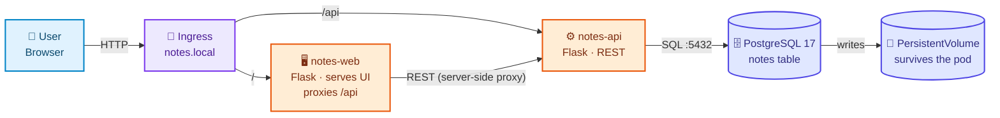
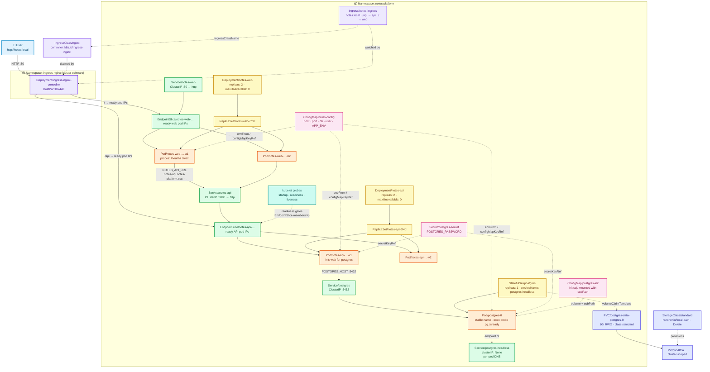

# Project 02 — Three-Tier Notes Platform

> **Difficulty:** 🟢 Beginner+
> **Estimated time:** 4–5 hours
> **Cluster required:** [`clusters/kind-ingress.yaml`](../clusters/kind-ingress.yaml) — **not** the single-node config
> **Assumes:** you can run, expose and configure a stateless workload (Project 01, or equivalent experience)

---

## 1. What Are We Building?

A notes application. Write a note, read your notes, delete one. Three tiers,
deployed to Kubernetes and then broken repeatedly on purpose.

| Component | Technology | Responsibility | Port |
|---|---|---|---|
| `notes-web` | Python 3.13 · Flask · gunicorn | Serves the UI and **proxies `/api/*` to the API** | 8080 |
| `notes-api` | Python 3.13 · Flask · psycopg 3 | REST API — every note is a row in PostgreSQL | 8080 |
| `postgres` | PostgreSQL 17 (`postgres:17.5-alpine`) | Stores the notes | 5432 |

**Why a database this time?** Project 01 deliberately had none — it was about
workloads and networking, and losing data would have been a distraction. Here
losing data is the *opening lesson*. The first thing you will do is write a note,
delete the database pod, and watch it vanish.

**Why does the web tier proxy instead of the browser calling the API directly?**
Because that makes `notes-web` a *real in-cluster consumer* of `notes-api`: it
resolves the API by DNS and connects over the cluster network. That is exactly
the problem a Service solves. It also gives the Ingress two genuinely different
backends to route between — `/` and `/api`.

---

## 2. Why This Project?

Most tutorials show you a PersistentVolumeClaim, tell you it makes storage
persistent, and move on. You learn the syntax and never the reason — and you
certainly never learn *why a Deployment cannot run a database*.

Here you run PostgreSQL as an ordinary Deployment, because that is what everyone
tries first. You write notes. You delete the pod. **The notes are gone.** You add
an `emptyDir` and they are still gone. You add a PersistentVolumeClaim and they
finally survive — and then you scale to two replicas and watch both pods fight
over a volume that permits one writer.

Only then does a StatefulSet mean anything.

The same pattern runs through external access: `port-forward` works until you
need a second person to use the app, so you meet Ingress; the Ingress works and
you cannot explain *how traffic reaches the controller*, so you meet NodePort and
LoadBalancer; and then a rollout drops requests, so you meet probes.

**Every resource arrives as the answer to a failure you just experienced.**

---

## 3. Learning Objectives

By the end you will be able to:

- [ ] Explain where a container's writes actually go, and why they die with it
- [ ] Distinguish `emptyDir`, `hostPath` and PersistentVolumes by what each one survives
- [ ] Explain the PV / PVC / StorageClass split and why it makes manifests portable
- [ ] Debug a `Pending` PVC from `describe` alone, and know when `Pending` is correct
- [ ] Explain access modes and reclaim policies — and why `ReadWriteMany` does not make PostgreSQL clusterable
- [ ] Say precisely what a StatefulSet gives you, **and what it does not**
- [ ] Explain per-pod DNS, headless Services, and why `serviceName` is not optional
- [ ] Explain why deleting a StatefulSet leaves its PVCs behind, and why that is right
- [ ] Distinguish an Ingress resource from an Ingress controller, and diagnose 404 vs 502 vs 503 instantly
- [ ] Explain what `type: LoadBalancer` actually does, and why `<pending>` is not a bug
- [ ] Wire readiness to a dependency and liveness to the process — and explain what happens when you swap them
- [ ] Use an init container for dependency ordering, and read `Init:0/1` correctly

---

## 4. Technologies Used

| Layer | Choice | Why |
|---|---|---|
| Language | Python 3.13 | Readable by everyone; the app is never the hard part |
| Framework | Flask 3.1 | Minimal, no magic to explain away |
| Driver | psycopg 3 (binary wheels) | No compiler in the build; a real PostgreSQL client |
| Server | gunicorn 23 | Handles SIGTERM gracefully — required for zero-downtime rollouts |
| Database | PostgreSQL 17.5 Alpine | A real data directory, a real init sequence, a non-HTTP health check |
| Ingress | ingress-nginx `controller-v1.15.1` | The most widely deployed controller, with a Kind-specific manifest |
| Cluster | Kind, 2 nodes, ports 80/443 mapped | Ingress needs a real path from the host into the cluster |

---

## 5. Prerequisites

| Tool | Version | Verify |
|---|---|---|
| Docker | 24+ | `docker version` |
| kubectl | 1.29+ | `kubectl version --client` |
| Kind | 0.23+ | `kind version` |

```bash
# From the repository root — note the INGRESS cluster config
kind create cluster --name kubernetes-lab --config clusters/kind-ingress.yaml
kubectl cluster-info --context kind-kubernetes-lab
kubectl get nodes
kubectl get storageclass          # a default class must exist
```

> ⚠️ **If you still have Project 01's single-node cluster, delete it.** The
> `extraPortMappings` that let an Ingress work **cannot be added to an existing
> cluster** — it is a node-creation setting. This is the most common reason
> "my Ingress does nothing" on a laptop.

---

## 6. Application Architecture — HLD

*What the application is, ignoring Kubernetes entirely.*



**Two tiers are stateless; one is not.** Everything difficult in this project is
downstream of that sentence.

---

## 7. Kubernetes Architecture — LLD

*Every object this project creates in its final state. This is the diagram to
come back to when something doesn't work.*



**Legend** — colours mean the same thing in every project in this repository:

| Colour | Layer | Colour | Layer |
|---|---|---|---|
| 🟦 blue | External / user | 🩷 pink | Config / Secrets |
| 🟪 purple | Ingress / gateway | 🟪 indigo | Storage (PV, PVC, StorageClass) |
| 🟩 green | Networking (Service, EndpointSlice) | 🟩 teal | Observability / probes |
| 🟨 yellow | Workload controllers | 🟧 orange | Pods / containers |

Diagram source: [`architecture/architecture.mmd`](architecture/architecture.mmd)

---

## 8. Request Flow

| # | Hop | What happens | Fails when |
|---|---|---|---|
| 1 | Browser → `notes.local` | `/etc/hosts` (or a `Host:` header) points at 127.0.0.1 | No entry, and no header — nginx returns 404 |
| 2 | → node port 80 | Kind's `extraPortMappings` map host :80 into the node container | The cluster was created without them |
| 3 | → ingress controller | The controller pod's `hostPort: 80` | The controller is not running |
| 4 | Rule matching | Host header first, then the longest path prefix | **404** — no rule matched |
| 5 | → EndpointSlice | The controller reads **ready pod IPs directly**, not the ClusterIP | **503** — no ready endpoints |
| 6 | → `Pod/notes-web` or `Pod/notes-api` | HTTP to a pod IP | **502** — refused, or the app errored |
| 7 | `notes-web` → CoreDNS | Resolves `notes-api.notes-platform.svc.cluster.local` | Wrong FQDN or namespace in `NOTES_API_URL` |
| 8 | `notes-api` → `Service/postgres` | ClusterIP `:5432`, kube-proxy DNATs to `postgres-0` | Selector mismatch ⇒ no endpoints |
| 9 | Authentication | The password from the Secret | Secret and initialised database disagree ⇒ 503 with a clear message |
| 10 | Query → PersistentVolume | Reads the mounted volume on the node | PVC `Pending` ⇒ the pod never started |

Full sequence diagrams: [`architecture/request-flow.md`](architecture/request-flow.md)

---

## 9. Kubernetes Resources Used

| Resource | Why We Need It | Application Usage | Stage |
|---|---|---|---|
| Namespace | Scope + one-command cleanup | `notes-platform` | [00](manifests/00-namespace/README.md) |
| Deployment | Versioned rollouts + self-healing | All three tiers, initially | [03](manifests/03-deployments/README.md) |
| Service (ClusterIP) | Stable address for changing pods | Every tier | [04](manifests/04-services/README.md) |
| EndpointSlice | Tracks which pods are *ready* | Auto-managed | [04](manifests/04-services/README.md) |
| ConfigMap (env) | Config outside the image | Connection settings | [05](manifests/05-configmaps/README.md) |
| ConfigMap (volume + `subPath`) | Config that is a **file** | `init.sql` seed schema | [05](manifests/05-configmaps/README.md) |
| Secret | Credentials handled separately | `POSTGRES_PASSWORD` | [06](manifests/06-secrets/README.md) |
| emptyDir | Pod-scoped scratch space | Attempt 1 at persistence — it fails | [07](manifests/07-storage/README.md) |
| PersistentVolume | Storage that exists | A hand-written `hostPath` exhibit | [07](manifests/07-storage/README.md) |
| PersistentVolumeClaim | A *request* for storage | The database's data directory | [07](manifests/07-storage/README.md) |
| StorageClass | Dynamic provisioning + reclaim policy | `standard`, and a `Retain` exhibit | [07](manifests/07-storage/README.md) |
| StatefulSet | Stable identity + per-pod storage | PostgreSQL | [08](manifests/08-statefulsets/README.md) |
| Headless Service | Per-pod DNS names | `postgres-0.postgres-headless…` | [08](manifests/08-statefulsets/README.md) |
| IngressClass | Binds a rule to a controller | `nginx` | [09](manifests/09-ingress/README.md) |
| Ingress | HTTP routing for many backends | `/` and `/api` on one hostname | [09](manifests/09-ingress/README.md) |
| NodePort Service | A port on every node | Teaching comparison | [10](manifests/10-loadbalancer/README.md) |
| LoadBalancer Service | An external address from the platform | `<pending>` on Kind, on purpose | [10](manifests/10-loadbalancer/README.md) |
| Probes | Ready ≠ Running | Startup, readiness, liveness — HTTP and exec | [11](manifests/11-health-checks/README.md) |
| Init container | Dependency ordering | `wait-for-postgres` | [11](manifests/11-health-checks/README.md) |
| Kustomize | One declarative end state | Final manifest | [19](manifests/19-final/README.md) |

---

## 10. Deployment Journey

Each stage introduces **one** idea, motivated by the failure in the stage before
it. Read the chain top to bottom — every arrow is a failure you will actually see
on your own cluster.

```mermaid
flowchart TB
    S0["**Stage 00 · Namespace**<br/>a scope to put things in"]:::stage
    F0(["❌ nothing runs yet"]):::fail
    S3["**Stage 03 · Deployments**<br/>three tiers running"]:::stage
    F3(["❌ hardcoded Pod IPs →<br/>broken on every restart"]):::fail
    S4["**Stage 04 · Services**<br/>stable names + load balancing"]:::stage
    F4(["❌ config duplicated across<br/>three workload specs"]):::fail
    S5["**Stage 05 · ConfigMaps**<br/>config outside the image"]:::stage
    F5(["❌ the DB password is<br/>plaintext in Git"]):::fail
    S6["**Stage 06 · Secrets**<br/>credentials handled apart"]:::stage
    F6(["❌ delete the DB pod →<br/>every note is gone"]):::fail
    S7["**Stage 07 · Storage**<br/>PVC · data outlives the pod"]:::stage
    F7(["❌ 2 replicas fight over<br/>one ReadWriteOnce volume"]):::fail
    S8["**Stage 08 · StatefulSets**<br/>identity + per-pod volume"]:::stage
    F8(["❌ port-forward is not<br/>a front door"]):::fail
    S9["**Stage 09 · Ingress**<br/>HTTP routing, one hostname"]:::stage
    F9(["❌ how does traffic reach<br/>the controller at all?"]):::fail
    S10["**Stage 10 · LoadBalancer**<br/>NodePort · LB · pending"]:::stage
    F10(["❌ rollouts drop requests;<br/>API starts before the DB"]):::fail
    S11["**Stage 11 · Probes**<br/>ready actually means ready"]:::stage
    F11(["❌ final state spread<br/>across seven stages"]):::fail
    S19["**Stage 19 · Final**<br/>one declarative end state"]:::stage
    NEXT["▶ Project 03<br/>two datastores, per-pod DNS"]:::next

    S0 --> F0 --> S3 --> F3 --> S4 --> F4 --> S5 --> F5 --> S6
    S6 --> F6 --> S7 --> F7 --> S8 --> F8 --> S9 --> F9 --> S10
    S10 --> F10 --> S11 --> F11 --> S19 --> NEXT

    classDef stage fill:#fef9c3,stroke:#ca8a04,stroke-width:2px,color:#713f12
    classDef fail  fill:#fee2e2,stroke:#dc2626,stroke-width:2px,color:#7f1d1d
    classDef next  fill:#e0f2fe,stroke:#0284c7,stroke-width:2px,color:#0c4a6e
```



| Stage | Problem it solves | The failure that motivates the next stage |
|---|---|---|
| [00 — Namespace](manifests/00-namespace/README.md) | Objects scattered, and colliding with Project 01 | Nothing runs yet |
| [03 — Deployments](manifests/03-deployments/README.md) | Get three tiers running and self-healing | **Hardcoded pod IPs break on every restart** |
| [04 — Services](manifests/04-services/README.md) | Stable names, load balancing | **Config is duplicated across three workload specs** |
| [05 — ConfigMaps](manifests/05-configmaps/README.md) | Config outside the image, including a whole file | **The database password is plaintext in Git** |
| [06 — Secrets](manifests/06-secrets/README.md) | Credentials handled apart | **Delete the database pod → every note is gone** |
| [07 — Storage](manifests/07-storage/README.md) | Data outlives the pod | **Two replicas fight over one ReadWriteOnce volume** |
| [08 — StatefulSets](manifests/08-statefulsets/README.md) | Stable identity, per-pod storage | **`port-forward` is not a front door** |
| [09 — Ingress](manifests/09-ingress/README.md) | HTTP routing, many backends, one hostname | **How does traffic reach the controller at all?** |
| [10 — LoadBalancer](manifests/10-loadbalancer/README.md) | External exposure, and how it differs per platform | **Rollouts drop requests; the API starts before the database** |
| [11 — Probes](manifests/11-health-checks/README.md) | Ready means ready; ordered start-up | **Final state spread across seven stages** |
| [19 — Final](manifests/19-final/README.md) | One declarative end state | → Project 03 |

> Stages 01, 02 and 12–18 are absent. Pods and ReplicaSets were taught in
> Project 01 and this project starts at Deployments; resources, autoscaling,
> security and scheduling belong to later projects.
> **Numbers are identities, not positions** — `07` means storage in every project
> in this repository, so gaps are left rather than renumbered.

### Two ways to run this project

| Path | Use it | Start here |
|---|---|---|
| **Manual (do this first)** | Every command typed by hand and explained — what it does, expected output, what to do when it fails | [`scripts/manual-steps.md`](scripts/manual-steps.md) |
| **Scripted** | After you've done it once, or to reset quickly | `./scripts/build-images.sh && ./scripts/deploy.sh` |

> The scripts do nothing that isn't written out in `manual-steps.md`. Run only
> the script and you've learned a shell script, not Kubernetes.

### Reading order

Follow this exactly the first time — about 4–5 hours, and every step depends on
the one before it.

| # | Do this | Where | Time |
|---|---|---|---|
| 1 | Read sections 1–9 above (what you're building and why) | this file | 20 min |
| 2 | Create the cluster, install the ingress controller, build the images | [`scripts/manual-steps.md`](scripts/manual-steps.md) Parts 1–2 | 20 min |
| 3 | **Walk the stages in order**, reading each README fully and running its commands | [Stage 00 ▶](manifests/00-namespace/README.md) | 2.5 h |
| 4 | Run the failure labs | [`failure-labs/labs.md`](failure-labs/labs.md) | 50 min |
| 5 | Attempt the exercises before opening solutions | [`exercises/`](exercises/) | 40 min+ |
| 6 | Review the interview questions | [`interview-questions/questions.md`](interview-questions/questions.md) | 25 min |
| 7 | Clean up | [`scripts/manual-steps.md`](scripts/manual-steps.md) Part 5 | 3 min |

Every stage README carries a breadcrumb and a **◀ Previous / Next ▶** footer, so
you can always tell where you are and what comes next without returning here.

---

## 11. Validation

```bash
./scripts/validate.sh
```

| Check | Command | Expected |
|---|---|---|
| Workloads ready | `kubectl get all -n notes-platform` | `postgres` 1/1, `notes-api` 2/2, `notes-web` 2/2 |
| Storage bound | `kubectl get pvc -n notes-platform` | `postgres-data-postgres-0` `Bound` |
| Endpoints populated | `kubectl get endpointslices -n notes-platform` | Pod IPs listed, never `<unset>` |
| Data really in PostgreSQL | `kubectl exec statefulset/postgres -n notes-platform -- psql -U notes -d notes -c 'SELECT count(*) FROM notes'` | A count, not an error |
| App responds internally | in-cluster `curl notes-web/api/notes` | JSON array |
| Ingress responds externally | `curl -H 'Host: notes.local' http://localhost/api/notes` | JSON array |

---

## 12. Testing

```bash
echo "127.0.0.1 notes.local" | sudo tee -a /etc/hosts
open http://notes.local
```

Add and delete a few notes. Refresh repeatedly and watch the **"served by pod"**
line change — that is the ingress controller balancing across API replicas.

> 🧪 **Watch what does *not* change.** The note list is identical no matter which
> pod answers, because every replica reads the same database. Compare with
> Project 01, where each replica had its own in-memory list and the answer
> changed on every refresh. **That contrast is the whole point of this project.**

Then do the thing that mattered:

```bash
kubectl delete pod postgres-0 -n notes-platform
# wait ~30s, refresh — your notes are still there
```

---

## 13. Failure Simulation

Twelve labs in [`failure-labs/labs.md`](failure-labs/labs.md), each
**break → observe → diagnose → fix**:

| # | You break | You should see | You learn |
|---|---|---|---|
| 1 | The image tag | `ImagePullBackOff` | Kind nodes have their own image store |
| 2 | Storage (back to `emptyDir`) | Notes vanish on pod deletion | Container filesystems are ephemeral |
| 3 | The StorageClass name | PVC `Pending`, pod `Pending` | Chase storage failures backwards |
| 4 | Scale the database to 2 | `postmaster.pid` exists / Multi-Attach | Why Deployments cannot run databases |
| 5 | The Service selector | 502, empty EndpointSlice | Selectors are the wiring |
| 6 | The password | `password authentication failed` | Green pods, broken app |
| 7 | Host, port, replicas | 404 vs 502 vs 503 | One-command ingress diagnosis |
| 8 | Liveness → `/healthz` | `CrashLoopBackOff`, exit 137 | The classic self-inflicted outage |
| 9 | The readiness path | Rollout stalls at `0/1` | Readiness gates rollouts |
| 10 | The init command | `Init:0/1` forever | A different failure from a crash |
| 11 | `serviceName` | NXDOMAIN on a healthy pod | StatefulSet identity is not automatic |
| 12 | Delete the StatefulSet | PVC still `Bound` | Data outlives workloads |

---

## 14. Troubleshooting

Full tables: [`troubleshooting/common-errors.md`](troubleshooting/common-errors.md)

| Symptom | First command | Likely cause |
|---|---|---|
| PVC `Pending` | `kubectl describe pvc` | No StorageClass, bad access mode — or `WaitForFirstConsumer`, which is correct |
| Pod `Pending` mentioning volumes | `kubectl describe pvc` | The pod's message points at the PVC; the PVC has the real reason |
| `Init:0/1` | `kubectl logs <pod> -c wait-for-postgres` | Waiting on the database — check `POSTGRES_HOST` |
| `CreateContainerConfigError` | `kubectl describe pod` | Missing ConfigMap/Secret key — it names the key |
| `0/1 READY` but `Running` | `kubectl describe pod` | Readiness failing — for the API, check the database first |
| `CrashLoopBackOff`, exit 137 | `kubectl describe pod` | A liveness probe killing it, or an OOM kill |
| Ingress 404 / 502 / 503 | `kubectl describe ingress` / `get endpointslices` | No rule matched / bad backend / no ready endpoints |
| `EXTERNAL-IP: <pending>` | — | **Normal on Kind** — no cloud controller manager |
| Empty endpoints | `kubectl get endpointslices` | Selector mismatch, or no pod is Ready |

**The universal first three commands:**

```bash
kubectl get pods -n notes-platform -o wide
kubectl describe pod <pod> -n notes-platform        # read the Events at the bottom
kubectl get events -n notes-platform --sort-by=.lastTimestamp
```

---

## 15. Production Considerations

> 🧪 **DEMO / LEARNING CONFIGURATION**
> Node-local storage, one database instance, no backups, a Secret committed to
> Git, plain HTTP, no resource limits, no NetworkPolicy, and a fake hostname in
> `/etc/hosts`.

> 🏭 **PRODUCTION CONSIDERATIONS**
> - **Storage** → a CSI driver backed by network storage (`gp3`, PD, Ceph), not
>   `local-path`. `reclaimPolicy: Retain`, `allowVolumeExpansion: true`, sized
>   for growth, with free space monitored.
> - **Backups** → a PVC is not a backup. `pg_dump` or WAL archiving to object
>   storage, with a restore you have actually tested (Project 06 builds the
>   CronJob).
> - **The database itself** → a StatefulSet gives identity and storage, not
>   failover. Use an operator (CloudNativePG) or a managed service.
> - **Secrets** → External Secrets Operator / Sealed Secrets / SOPS, plus
>   encryption at rest for etcd (Project 07).
> - **TLS** → `spec.tls` on the Ingress with cert-manager issuing and renewing;
>   real DNS instead of `/etc/hosts` (Project 10).
> - **Exposure** → one LoadBalancer in front of the ingress controller, several
>   controller replicas, spread across zones, with a PDB.
> - **Resources** → `requests` **and** `limits`, a LimitRange and a ResourceQuota
>   (Projects 05, 07).
> - **Graceful shutdown** → a `preStop` sleep so pods leave EndpointSlices before
>   SIGTERM; otherwise every rollout still drops a few requests (Project 05).
> - **Network** → default-deny NetworkPolicy so only `notes-api` can reach the
>   database — and **verify your CNI enforces it** (Projects 04, 07).
> - **Availability** → anti-affinity, topology spread, PodDisruptionBudgets
>   (Project 09).
> - **Observability** → metrics, dashboards and alerts on disk usage, connection
>   counts and restart rates (Project 08).
> - **Schema** → a migration tool, not `/docker-entrypoint-initdb.d/`, which runs
>   exactly once and never again.

---

## 16. Security Considerations

| Area | This project | Production |
|---|---|---|
| Database credentials | base64 in Git, one static password | External secret manager, short-lived credentials, rotation |
| Encryption at rest | Off (Kind default) | `EncryptionConfiguration` for etcd, ideally KMS-backed |
| Database exposure | ClusterIP — but **any** pod in the cluster can connect | Default-deny NetworkPolicy, one explicit allow |
| Transport | Plain HTTP; unencrypted PostgreSQL connections | TLS at the Ingress, and TLS to the database |
| Container user | ✅ non-root (UID 10001) for the app tiers | Also `readOnlyRootFilesystem`, drop all capabilities |
| Pod securityContext | ❌ not set | `runAsNonRoot`, `allowPrivilegeEscalation: false`, seccomp (Project 07) |
| RBAC | Default ServiceAccount, auto-mounted token | Dedicated SA, least privilege, `automountServiceAccountToken: false` (Project 07) |
| `hostPath` | Used once as a **teaching exhibit**, then deleted | Never in an application; forbidden by PSS `restricted` |
| Backups | None | Encrypted, off-cluster, restore-tested |
| Images | Explicit tags, non-root, slim base | Digest-pinned, scanned, signed |

---

## 17. Interview Questions

Full set with model answers: [`interview-questions/questions.md`](interview-questions/questions.md)

> 🎯 Walk me through what happens when a pod uses a PersistentVolumeClaim.
> 🎯 When do you use a StatefulSet instead of a Deployment — and what does a StatefulSet *not* give you?
> 🎯 I deleted a StatefulSet and the PVCs are still there. Is that a bug?
> 🎯 What is the difference between an Ingress and an Ingress controller?
> 🎯 An Ingress returns 404, then 502, then 503. What does each one tell you?
> 🎯 My LoadBalancer Service has been `<pending>` for ten minutes. What is wrong?
> 🎯 What happens if you point a liveness probe at a database check?

---

## 18. Exercises

| Level | File |
|---|---|
| Beginner | [`exercises/beginner.md`](exercises/beginner.md) |
| Intermediate | [`exercises/intermediate.md`](exercises/intermediate.md) |
| Advanced | [`exercises/advanced.md`](exercises/advanced.md) |

Solutions in [`exercises/solutions/`](exercises/solutions/) — try first.

---

## 19. Cleanup

```bash
./scripts/cleanup.sh

# Confirm — note there are THREE things to check, not one
kubectl get all -n notes-platform
kubectl get pv
kubectl get storageclass
```

> ⚠️ **This is the first project that leaves cluster-scoped debris.** Deleting the
> namespace removes the PVCs; it does not remove PersistentVolumes with
> `reclaimPolicy: Retain`, the teaching StorageClass, or the hostPath PV. On a
> cloud, orphaned volumes are a line on your bill every month.

Or reset everything:

```bash
kind delete cluster --name kubernetes-lab
```

---

## 📚 Further Reading — official documentation

Each stage README ends with references specific to that resource. These are the
project-wide starting points. *(All links verified 2026-08-28.)*

| Topic | Official reference |
|---|---|
| Storage model | [Persistent Volumes](https://kubernetes.io/docs/concepts/storage/persistent-volumes/) · [Storage Classes](https://kubernetes.io/docs/concepts/storage/storage-classes/) · [Dynamic provisioning](https://kubernetes.io/docs/concepts/storage/dynamic-provisioning/) |
| Volume types | [Volumes](https://kubernetes.io/docs/concepts/storage/volumes/) · [Ephemeral volumes](https://kubernetes.io/docs/concepts/storage/ephemeral-volumes/) |
| Stateful workloads | [StatefulSets](https://kubernetes.io/docs/concepts/workloads/controllers/statefulset/) · [StatefulSet basics](https://kubernetes.io/docs/tutorials/stateful-application/basic-stateful-set/) · [Run a replicated stateful application](https://kubernetes.io/docs/tasks/run-application/run-replicated-stateful-application/) |
| Services & DNS | [Service](https://kubernetes.io/docs/concepts/services-networking/service/) · [DNS](https://kubernetes.io/docs/concepts/services-networking/dns-pod-service/) · [EndpointSlices](https://kubernetes.io/docs/concepts/services-networking/endpoint-slices/) |
| Ingress | [Ingress](https://kubernetes.io/docs/concepts/services-networking/ingress/) · [Ingress controllers](https://kubernetes.io/docs/concepts/services-networking/ingress-controllers/) · [ingress-nginx](https://kubernetes.github.io/ingress-nginx/) |
| Probes & init containers | [Configure probes](https://kubernetes.io/docs/tasks/configure-pod-container/configure-liveness-readiness-startup-probes/) · [Init containers](https://kubernetes.io/docs/concepts/workloads/pods/init-containers/) |
| Config & secrets | [ConfigMap](https://kubernetes.io/docs/concepts/configuration/configmap/) · [Secret](https://kubernetes.io/docs/concepts/configuration/secret/) · [Secrets good practices](https://kubernetes.io/docs/concepts/security/secrets-good-practices/) |
| Kind specifics | [Ingress on Kind](https://kind.sigs.k8s.io/docs/user/ingress/) · [LoadBalancer on Kind](https://kind.sigs.k8s.io/docs/user/loadbalancer/) |
| Every command used here | [kubectl reference](https://kubernetes.io/docs/reference/kubectl/) |

> **These are for going deeper, not for filling gaps.** Every stage teaches its
> resource completely; you should never need to leave a lesson to understand it.

---

## 20. What's Next

You can run a stateful, three-tier application, give it durable storage and a
stable identity, expose it properly over HTTP, and explain every object involved.

The obvious gaps this project leaves:

- The API opens a **new database connection per request**, and re-resolves DNS
  every time. What would a cache in front of the database change?
- One datastore is not the common case. Two datastores with different jobs — one
  durable, one fast — need different storage, different scaling and different
  failure behaviour.
- You have used a headless Service for a **one-member** StatefulSet. Addressing
  `redis-0` and `redis-1` by name, from inside the cluster, is where per-pod DNS
  earns its keep.
- Config that must never change silently under a running fleet needs
  `immutable: true` and a rollout triggered *by the change itself*.

Project 03 is a URL shortener with **PostgreSQL and Redis**, real per-pod DNS,
immutable ConfigMaps, `checksum/config` rollout triggers, and an `ExternalName`
Service pointing out of the cluster.

→ **Project 03 — URL Shortener**
