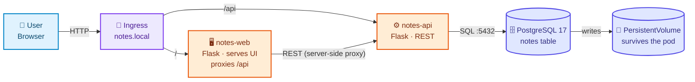

# Architecture — Project 02, Notes Platform

Design record. Written **before** the manifests, as
[CONTRIBUTING §2](../../CONTRIBUTING.md#2-design-before-you-write-yaml) requires.

---

## 1. Design decisions

| Decision | Why |
|---|---|
| **Three tiers, not two** | Project 01 had no datastore on purpose. This project's entire subject is state, so a real database is not optional — it is the thing being taught. |
| **PostgreSQL, not SQLite or Redis** | It has a genuine data directory, a real initialisation sequence, a non-HTTP health check, and it refuses to run twice against one directory. Every storage lesson has something concrete to point at. |
| **The web tier proxies `/api` server-side** | It makes `notes-web` a real in-cluster consumer of `notes-api`, so "pod IPs are unstable" is a failure you watch rather than a claim you read. It also gives the Ingress two genuinely different backends to route between. |
| **The database starts life as a Deployment** | That is what everybody tries first. Watching it lose data is what makes a PVC mean something, and watching two replicas fight over one volume is what makes a StatefulSet mean something. |
| **Schema created twice — by `init.sql` and by the app** | The ConfigMap-mounted script teaches file-shaped config and seeds the welcome rows; the app's `CREATE TABLE IF NOT EXISTS` keeps stages 03–04 working before any ConfigMap exists. Both are idempotent. The overlap lets each stage stand alone. |
| **Ingress before LoadBalancer in reading order** | The learner needs the front door working before asking *how* traffic reaches the controller. Stage 10 then answers "what does `type: LoadBalancer` actually do, and why is it `<pending>`?" — the question stage 09 raises. |
| **Two health endpoints in the API** | `/livez` never touches the database, `/healthz` always does. That split is what makes the readiness-versus-liveness lesson demonstrable instead of theoretical. |
| **Short-lived database connections, one per request** | A pool would hide failures behind a stale socket. Reconnecting per request means deleting the database pod produces an immediate, visible error. |
| **NodePort and LoadBalancer are exhibits** | The Ingress is the real entry point. Those two Services exist to show what sits underneath it and are excluded from `19-final/`. |

---

## 2. High-Level Design (HLD)

*What the application is, ignoring Kubernetes entirely.*

### Component responsibilities

| Component | Responsibility | Stateless? |
|---|---|---|
| `notes-web` | Serve `index.html`; proxy `/api/*` to `notes-api` | ✅ fully |
| `notes-api` | REST CRUD over the `notes` table; expose `/livez` and `/healthz` | ✅ — all state is in PostgreSQL |
| `postgres` | Store the notes; run the seed script on first initialisation | ❌ **the only stateful component** |

That last column is the architecture. Two tiers scale by adding replicas; one
does not, and everything difficult in this project is downstream of that.

### Configuration contract

| Variable | Consumed by | Source, by stage |
|---|---|---|
| `POSTGRES_HOST` | `notes-api`, init container | 03 pod IP → 04 Service DNS → 05 ConfigMap |
| `POSTGRES_PORT` / `POSTGRES_DB` / `POSTGRES_USER` | `notes-api`, `postgres` | 03 literal → 05 ConfigMap |
| `POSTGRES_PASSWORD` | `notes-api`, `postgres` | 03 plaintext literal → 06 **Secret** |
| `NOTES_API_URL` | `notes-web` | 03 pod IP → 04 Service DNS → 05 ConfigMap |
| `APP_ENV`, `LOG_LEVEL` | all tiers | 03 literal → 05 ConfigMap |
| `PGDATA` | `postgres` | 07 onward — a **subdirectory** of the mount point |
| `POD_NAME` | `notes-api`, `notes-web` | Downward API, from the first stage |

**The image never changes between stages.** Only the environment does — which is
what makes ConfigMaps and Secrets teachable rather than decorative.

---

## 3. Low-Level Design (LLD)

The full diagram is in [`../README.md` §7](../README.md#7-kubernetes-architecture--lld);
the source is [`architecture.mmd`](architecture.mmd).

### Object inventory (final state)

| Kind | Name | Stage | Notes |
|---|---|---|---|
| Namespace | `notes-platform` | 00 | Everything below is scoped to it |
| ConfigMap | `notes-config` | 05 | 7 keys, consumed three different ways |
| ConfigMap | `postgres-init` | 05 | `init.sql`, mounted with `subPath` |
| Secret | `postgres-secret` | 06 | One key, two consumers |
| Service | `postgres` | 04 | ClusterIP — ordinary database traffic |
| Service | `postgres-headless` | 08 | `clusterIP: None` — per-pod DNS |
| Service | `notes-api` | 04 | ClusterIP `:8080` |
| Service | `notes-web` | 04 | ClusterIP `:80` → container `:8080` |
| StatefulSet | `postgres` | 08, 11 | 1 replica, `volumeClaimTemplates`, exec probes |
| PVC *(generated)* | `postgres-data-postgres-0` | 08 | Created by the template; **outlives the StatefulSet** |
| Deployment | `notes-api` | 03, 05, 06, 11 | 2 replicas, init container, 3 probes |
| Deployment | `notes-web` | 03, 05, 11 | 2 replicas, 3 probes |
| Ingress | `notes-ingress` | 09 | `notes.local`, `/api` and `/` |

**Teaching artifacts, applied then removed:** `PersistentVolume/notes-hostpath-demo`,
`PVC/postgres-hostpath-demo`, `StorageClass/notes-platform-retain`,
`Service/notes-web-nodeport`, `Service/notes-web-lb`, and the superseded
`Deployment/postgres` versions from stages 03–07.

**Cluster software, installed separately:** the ingress-nginx controller and its
`IngressClass/nginx`. It has its own lifecycle and is shared across projects.

### Relationships this project demonstrates

| Relationship | Where you see it |
|---|---|
| Deployment → ReplicaSet → Pod | Stage 03 §8 |
| Service → EndpointSlice → ready Pods | Stage 04 §8 |
| ConfigMap → env, and ConfigMap → file | Stage 05 §7 |
| Secret → two workloads that must agree | Stage 06 §8 |
| PVC → PV → real disk, via a StorageClass | Stage 07 §8 |
| StatefulSet → per-pod PVC and per-pod DNS | Stage 08 §8 |
| Ingress → IngressClass → controller → EndpointSlice | Stage 09 §8 |
| readiness probe → EndpointSlice membership → what "available" means | Stage 11 §8 |

---

## 4. Failure domains

| Failure | Blast radius | Recovery |
|---|---|---|
| One `notes-web` pod dies | None — the second replica serves | ReplicaSet recreates it in seconds |
| One `notes-api` pod dies | None | Same |
| **`postgres-0` dies** | **Total** — every write and read fails | The StatefulSet recreates it, it reattaches its volume, readiness restores traffic. ~15–40s of downtime |
| The PersistentVolume is lost | **Total and permanent** | Nothing in this project recovers it. Backups are Project 08+ territory and a production requirement |
| The ingress controller dies | No external access; in-cluster traffic is fine | Its Deployment recreates it |
| The node dies | Total on a single-node cluster; on Kind's two-node cluster the database's `local-path` volume is stranded on its node | Recreate the cluster |

**One replica of the database is a deliberate single point of failure.** Adding
replicas of *this* manifest would give you N independent empty databases, not
high availability — stage 08 §8 makes you prove that to yourself.

---

## 5. Scaling characteristics

| Tier | Scales by | Limit |
|---|---|---|
| `notes-web` | `kubectl scale` — fully stateless | Node capacity |
| `notes-api` | `kubectl scale` — fully stateless | **The database's connection limit.** One connection per in-flight request, so replicas × workers × threads is the number that matters |
| `postgres` | Not horizontally, not with this manifest | Vertical only. Real scaling means replication (an operator) or a managed service |

> The API opens a **new connection per request** on purpose, so failures are
> visible. A production service would use a connection pool — and at scale a
> pooler such as PgBouncer, because PostgreSQL's per-connection cost is real.

---

## 6. What this architecture is not

- **Not highly available.** One database instance, no failover, no replication.
- **Not backed up.** A PVC protects against pod deletion, not against `DROP
  TABLE`, corruption, or a deleted namespace.
- **Not secure.** No TLS, no NetworkPolicy, no RBAC beyond defaults, a password
  in Git, and any pod in the cluster can open a connection to the database.
- **Not resource-managed.** Requests are set; limits, QoS and autoscaling are
  Project 05.
- **Not observable.** No metrics, no dashboards, no alerts — Project 08.

Each of those gaps is somebody else's project, on purpose. This one is about
state, identity and external access.
