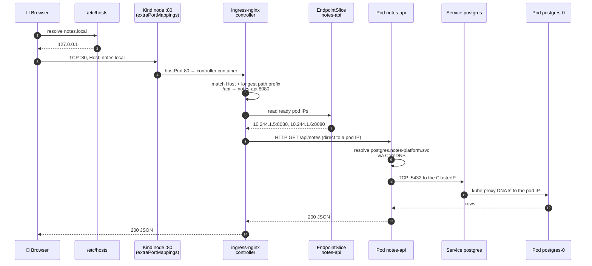
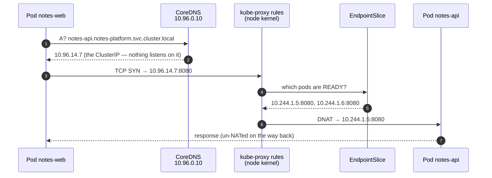
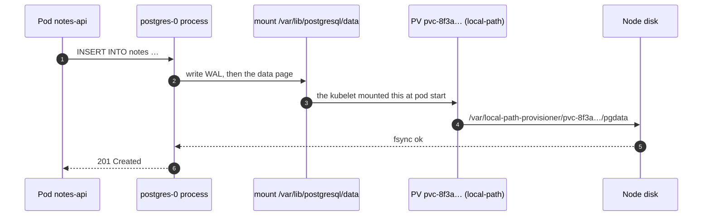

# Request Flow — Project 02

One real request, traced from the browser to the database and back, with the
failure point of every hop named.

This is the page to open when something "just doesn't work": find the hop, run
the command.

---

## 1. External request: browser → the platform

`GET http://notes.local/api/notes`



---

## 2. Internal (east-west) request: notes-web → notes-api

This is the path a `port-forward` or an in-cluster client takes, and the one that
exists whether or not an Ingress does.



▸ **There is no proxy process in this path.** kube-proxy programs the kernel; it
does not carry packets. The client believes it spoke to `10.96.14.7` throughout.

▸ **Load balancing is per connection, not per request.** A client that reuses a
keep-alive connection keeps hitting the same pod.

---

## 3. Hop-by-hop, with the failure at each one

| # | Hop | What happens | Fails when | First command |
|---|---|---|---|---|
| 1 | Browser → DNS | `notes.local` resolves | Missing `/etc/hosts` entry | `curl -H 'Host: notes.local' http://localhost/` |
| 2 | → node port 80 | Kind maps host :80 into the node container | The cluster was not created from `kind-ingress.yaml` | `docker port kubernetes-lab-control-plane` |
| 3 | → ingress controller | `hostPort: 80` on the controller pod | The controller is not running | `kubectl get pods -n ingress-nginx` |
| 4 | Rule matching | Host header, then longest path prefix | **404** — no rule matched | `kubectl describe ingress notes-ingress -n notes-platform` |
| 5 | → EndpointSlice | The controller reads ready pod IPs directly | **503** — no ready endpoints | `kubectl get endpointslices -n notes-platform` |
| 6 | → pod | HTTP to a pod IP | **502** — refused or errored | `kubectl logs deployment/notes-api -n notes-platform` |
| 7 | App → CoreDNS | Resolves the database Service | *"could not translate host name"* — wrong FQDN or namespace | `kubectl exec deploy/notes-api -n notes-platform -- env \| grep POSTGRES_HOST` |
| 8 | → Service `postgres` | ClusterIP `:5432` | Selector mismatch ⇒ no endpoints | `kubectl get endpointslices -l kubernetes.io/service-name=postgres -n notes-platform` |
| 9 | → kube-proxy → pod | DNAT to `postgres-0` | Wrong `targetPort` ⇒ refused | `kubectl get svc postgres -n notes-platform -o yaml` |
| 10 | Authentication | The password from the Secret | *"password authentication failed"* — Secret and initialised DB disagree | `kubectl logs statefulset/postgres -n notes-platform` |
| 11 | Query → volume | Reads the mounted PersistentVolume | PVC `Pending` ⇒ the pod never started | `kubectl describe pvc postgres-data-postgres-0 -n notes-platform` |
| 12 | Response | JSON back up the chain | — | — |

---

## 4. Reading the failure from the status code alone

| You get | It means | Look at |
|---|---|---|
| **Connection refused** on :80 | Nothing is listening — no controller, or no port mapping | `kubectl get pods -n ingress-nginx`, the cluster config |
| **404** from nginx | No Ingress rule matched this Host and path | The Ingress rules; the Host header you actually sent |
| **503** from nginx | A rule matched; the backend has **no ready endpoints** | Pod readiness, then EndpointSlices |
| **502** from nginx | Endpoints exist; connecting or reading failed | `targetPort`, app logs, whether it binds `0.0.0.0` |
| **502** from `notes-web` (a text body naming a URL) | The **web tier** could not reach the API | `NOTES_API_URL`, the `notes-api` Service |
| **503** from `notes-api` (JSON with `"cannot reach postgres at …"`) | The **API** could not reach the database | `postgres-0`, its readiness probe, the Secret |
| **200 with an empty list** | Everything works; there are no notes | Nothing — write one |

**The pattern:** each tier names what *it* could not reach. Read the body, not
just the code.

---

## 5. DNS names in this project

| Name | Resolves to | Used by |
|---|---|---|
| `postgres` | ClusterIP | Anything **in `notes-platform`** — the search path completes it |
| `postgres.notes-platform` | ClusterIP | Partially qualified; also works |
| `postgres.notes-platform.svc.cluster.local` | ClusterIP | **What the manifests use** — unambiguous from anywhere |
| `postgres-headless.notes-platform.svc.cluster.local` | The **pod IPs**, not a VIP | Clients that want the member list |
| `postgres-0.postgres-headless.notes-platform.svc.cluster.local` | **One specific pod**, forever | Replication, admin tooling, anything member-aware |
| `notes-api.notes-platform.svc.cluster.local:8080` | ClusterIP | `notes-web` |
| `notes-web.notes-platform.svc.cluster.local:80` | ClusterIP | `validate.sh`, in-cluster clients |
| `notes.local` | 127.0.0.1 via `/etc/hosts` | Your browser, outside the cluster |

Check any of them from inside the cluster:

```bash
kubectl run dns-test --rm -it --restart=Never --image=busybox:1.36 -n notes-platform -- \
  nslookup postgres-0.postgres-headless.notes-platform.svc.cluster.local
```

---

## 6. What actually happens at the storage layer



▸ **Delete the pod and hops 3–5 are unchanged.** The new `postgres-0` mounts the
same PVC, which is bound to the same PV, which is the same directory on the same
node. That is the entire difference between stage 06 and stage 07.

▸ **On a cloud** the last two hops become "an EBS volume detached from node A and
attached to node B". The manifests do not change; the failure modes do — a
volume can only attach to one node at a time, and cross-zone attachment is
impossible.
