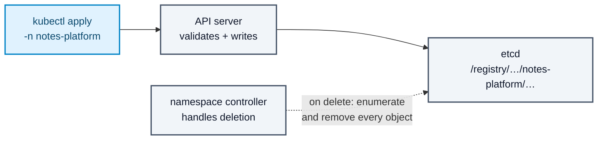
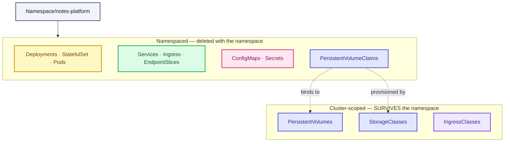

# Stage 00 — Namespace

[⬅ Project 02](../../README.md) · Stage 1 of 11

**00 Namespace** › [03 Deployments](../03-deployments/README.md) › [04 Services](../04-services/README.md) › [05 ConfigMaps](../05-configmaps/README.md) › [06 Secrets](../06-secrets/README.md) › [07 Storage](../07-storage/README.md) › [08 StatefulSets](../08-statefulsets/README.md) › [09 Ingress](../09-ingress/README.md) › [10 LoadBalancer](../10-loadbalancer/README.md) › [11 Probes](../11-health-checks/README.md) › [19 Final](../19-final/README.md)

> **The problem:** you are about to create a database, two Deployments, four
> Services, a Secret, an Ingress and a PersistentVolumeClaim. Project 01's
> objects are probably still in this cluster. Put all of this in `default` and
> you get a bin of unrelated things with no way to delete just this project —
> and a Service called `postgres` that two projects will fight over.

---

## 1. WHY does this resource exist?

A Kubernetes cluster is shared. Multiple applications, multiple teams, multiple
environments, one API. Without a way to partition it you hit four problems:

| Problem | What it looks like |
|---|---|
| **Name collisions** | Object names are unique per *namespace*. Two projects both wanting `Service/postgres` cannot coexist in one. |
| **No blast radius** | `kubectl delete deployment --all` is a career-limiting command in a flat cluster. |
| **No cleanup story** | "Delete everything from that experiment" means remembering all 12 object kinds you created. |
| **No policy boundary** | RBAC, ResourceQuota, LimitRange and NetworkPolicy are all *namespaced*. Without namespaces you cannot say "this team gets 4 CPUs" or "these pods may not talk to those". |

A **Namespace** is the scope that fixes all four.

### What happens without it

Everything lands in `default`. It works — right up until you want to remove one
project, restrict one team, or reuse an obvious name like `postgres`. This
project's cleanup is *one command* precisely because everything shares a
namespace.

### When do you use one — and when not?

| Use a namespace | Don't bother |
|---|---|
| Per application / project | As a substitute for a cluster when you need hard multi-tenancy — namespaces are a **soft** boundary |
| Per environment on a shared cluster (`app-dev`, `app-staging`) | For a single object that has nowhere to live |
| Per team, to attach quota and RBAC | To separate every microservice of one application — they need to talk to each other, and it just makes DNS longer |

> **Not everything is namespaced.** Nodes, PersistentVolumes, StorageClasses,
> IngressClasses, ClusterRoles and the namespaces themselves are cluster-scoped.
> This project creates three cluster-scoped objects (a PV, a StorageClass and —
> via the ingress install — an IngressClass), which is exactly why its cleanup
> script has a second and third step. Check any kind with:
>
> ```bash
> kubectl api-resources --namespaced=false | head -20
> ```

---

## 2. WHAT is it?

A Namespace is **a virtual cluster inside a physical cluster**: a naming scope
for objects, and the unit that policy attaches to.

> **Analogy:** directories on a filesystem. `/home/alice/notes.txt` and
> `/home/bob/notes.txt` are different files with the same name, and you can
> `rm -rf` one home directory without touching the other.
>
> **Technically:** a Namespace is a scope for *object names* and nothing more.
> It is **not** a security boundary by itself, **not** a network boundary
> (pods in different namespaces can reach each other freely until a
> NetworkPolicy says otherwise) and **not** a resource boundary (until a
> ResourceQuota exists).

### Every cluster starts with four

| Namespace | Contains |
|---|---|
| `default` | Where your objects go when you don't say otherwise |
| `kube-system` | The control plane's own workloads — CoreDNS, kube-proxy, the CNI |
| `kube-public` | World-readable cluster info; you will rarely touch it |
| `kube-node-lease` | One Lease object per node for heartbeats — this is how the control plane notices a dead node |

This project adds `notes-platform`. The ingress controller install adds
`ingress-nginx`.

### It shows up in DNS

The namespace is part of every Service's DNS name:

```
<service>.<namespace>.svc.cluster.local
postgres.notes-platform.svc.cluster.local
```

That matters here more than it did in Project 01 — you are about to write that
FQDN into a ConfigMap, and getting the namespace wrong produces a "database
unreachable" error with a perfectly healthy database sitting next to it.

---

## 3. HOW does it work?



1. The namespace is a real API object, stored in etcd like anything else.
2. Namespaced objects are **keyed by namespace** in etcd. That is the whole
   mechanism behind "names are unique per namespace".
3. Deleting a namespace does not delete anything immediately. It sets
   `status.phase: Terminating` and hands the work to the **namespace
   controller**, which enumerates every API resource type, deletes every object
   it finds, and only then removes the namespace itself.
4. If any object has a **finalizer** that never completes, the namespace hangs
   in `Terminating` forever. That is the standard cause of a stuck namespace,
   and stage 07's volumes give you a finalizer to look at.

---

## 4. Manifest

```yaml
apiVersion: v1
kind: Namespace
metadata:
  name: notes-platform
  labels:
    app.kubernetes.io/name: notes-platform
    app.kubernetes.io/part-of: notes-platform
  annotations:
    kubernetes.io/description: "Three-tier Notes Platform — web, API and PostgreSQL"
```

File: [`namespace.yaml`](namespace.yaml)

---

## 5. Manifest breakdown

| Field | Value | What it does | What breaks if it's wrong |
|---|---|---|---|
| `apiVersion` | `v1` | Namespace is a core object — no group prefix | Wrong group → `no matches for kind` |
| `kind` | `Namespace` | The object type | — |
| `metadata.name` | `notes-platform` | Must be a valid DNS label: lowercase alphanumerics and `-`, ≤ 63 chars | `notes_platform` is rejected — underscores are illegal |
| `metadata.labels` | `app.kubernetes.io/*` | Lets you select the namespace itself, and is how a NetworkPolicy will target it later (Projects 04, 07) | Nothing breaks now; selecting it later becomes guesswork |
| `metadata.annotations` | description | Non-selectable metadata for humans and tools | — |

> **Note:** there is no `spec` worth writing. A Namespace has almost no
> configuration — its power comes from the objects that reference it.

---

## 6. Apply

```bash
kubectl apply -f manifests/00-namespace/namespace.yaml
```

▸ **What it does:** sends the manifest to the API server, which creates the
object and records this manifest as the "last applied configuration" so future
applies can compute a diff.

▸ **Why `apply` and not `create`:** `create` fails if the object exists.
`apply` is declarative and idempotent — run it a hundred times, get the same
result. Every command in this project is safe to re-run.

---

## 7. Validate

```bash
kubectl get namespace notes-platform
```

```
NAME             STATUS   AGE
notes-platform   Active   5s
```

▸ `Active` is what you want. `Terminating` means a previous delete has not
finished — wait, or investigate finalizers (§9).

```bash
kubectl get all -n notes-platform
```

```
No resources found in notes-platform namespace.
```

▸ Correct. An empty namespace is the point of this stage.

> ⚠️ **`kubectl get all` is a lie.** It lists a fixed handful of kinds — pods,
> services, deployments, replicasets, statefulsets, daemonsets, jobs, cronjobs.
> It does **not** show ConfigMaps, Secrets, PVCs, Ingresses or anything
> custom. This matters in this project: after stage 07 `get all` shows nothing
> about your storage. To see everything:
>
> ```bash
> kubectl api-resources --verbs=list --namespaced -o name \
>   | xargs -n1 kubectl get --show-kind --ignore-not-found -n notes-platform
> ```

---

## 8. Observe the mechanism

### Names are scoped, and you can prove it

```bash
kubectl create namespace scope-demo
kubectl create configmap same-name --from-literal=k=v -n scope-demo
kubectl create configmap same-name --from-literal=k=different -n notes-platform

kubectl get configmap same-name -n scope-demo -o jsonpath='{.data.k}'; echo
kubectl get configmap same-name -n notes-platform -o jsonpath='{.data.k}'; echo
```

```
v
different
```

▸ Two objects, same kind, same name, no conflict. That is the entire feature.

```bash
kubectl delete namespace scope-demo
kubectl delete configmap same-name -n notes-platform
```

### The namespace is in the DNS name

You will use this constantly from stage 04 onward:

```bash
kubectl run dns-demo --rm -it --restart=Never --image=busybox:1.36 -- \
  cat /etc/resolv.conf
```

```
search default.svc.cluster.local svc.cluster.local cluster.local
nameserver 10.96.0.10
```

▸ The `search` list is why `postgres` alone resolves from a pod **in the same
namespace** — the resolver appends `notes-platform.svc.cluster.local` for you.
From a different namespace it does not, which is why this project writes the
fully qualified name everywhere.

> 🧪 **Try it:** save typing for the rest of the project by making the
> namespace your default:
>
> ```bash
> kubectl config set-context --current --namespace=notes-platform
> ```
>
> …then set it back to `default` when you finish, or you will spend twenty
> minutes wondering where your objects went. Every command in this project
> writes `-n notes-platform` explicitly, because a command that depends on
> invisible context state is a command that breaks for the next reader.

---

## 9. Break it

### Break 1 — an illegal name

```bash
kubectl create namespace Notes_Platform
```

**Symptom:**

```
The Namespace "Notes_Platform" is invalid: metadata.name: Invalid value:
"Notes_Platform": a lowercase RFC 1123 label must consist of lower case
alphanumeric characters or '-' …
```

**Root cause:** namespace names become part of DNS names, and DNS labels are
lowercase, alphanumeric plus hyphen. Uppercase and underscores are impossible.

**Fix:** `notes-platform`.

**What you learned:** every naming rule in Kubernetes traces back to DNS.

### Break 2 — deploying into a namespace that does not exist

```bash
kubectl apply -f manifests/03-deployments/notes-api-deployment.yaml
```

*(with the namespace deleted)*

**Symptom:**

```
Error from server (NotFound): error when creating "…": namespaces "notes-platform" not found
```

**Root cause:** namespaces are not created implicitly. The API server rejects
the object outright.

**Fix:** apply stage 00 first. This is why `deploy.sh` starts here and why
`19-final/complete-production-manifest.yaml` has the Namespace as its first
document — the API server processes a multi-document file in order.

---

## 10. How it interacts



**Remember the right-hand box.** It is the reason `cleanup.sh` in this project
has three steps where Project 01's had one.

---

## 11. Production notes

> 🧪 **DEMO / LEARNING CONFIGURATION**
> One namespace, no quota, no limits, no network policy, no RBAC. Anything in
> the cluster can talk to this database.

> 🏭 **PRODUCTION CONSIDERATIONS**
> - **ResourceQuota** per namespace so one team cannot consume the cluster (Projects 05, 07)
> - **LimitRange** to supply default requests/limits for pods that forget them (Projects 05, 07)
> - **NetworkPolicy**, starting from default-deny — namespaces do **not** isolate traffic (Projects 04, 07)
> - **RBAC** scoped with Roles and RoleBindings, one namespace at a time (Project 07)
> - **Pod Security Standards** labels (`pod-security.kubernetes.io/enforce: restricted`) applied to the namespace object itself (Project 07)
> - Namespaces are a **soft** boundary. Hostile multi-tenancy needs separate clusters or hardened runtimes.
> - Name them predictably (`<app>-<env>`) — humans grep these under pressure.

---

## 12. The next problem

You have an empty scope and nothing in it. The Notes Platform needs three
things running: a PostgreSQL database, an API that reads and writes it, and a
web tier that serves the page.

Project 01 established what a Deployment is and why it beats bare pods and
ReplicaSets. So put all three tiers in Deployments and start there — including
the database, because that is what everybody tries first, and finding out
exactly how it fails is the point of this project.

→ **[Stage 03 — Deployments](../03-deployments/README.md)**

---

## 📚 Official documentation

Everything above is self-contained — these are for going deeper, not for filling gaps.
*(All links verified 2026-08-28.)*

| Reference | What it adds |
|---|---|
| [Namespaces](https://kubernetes.io/docs/concepts/overview/working-with-objects/namespaces/) | Initial namespaces, when to use them, and the DNS relationship |
| [Labels and selectors](https://kubernetes.io/docs/concepts/overview/working-with-objects/labels/) | Why the `app.kubernetes.io/*` set is standard |
| [Managing objects](https://kubernetes.io/docs/concepts/cluster-administration/manage-deployment/) | Bulk operations, `-l` selectors, organising manifests |
| [DNS for Services and Pods](https://kubernetes.io/docs/concepts/services-networking/dns-pod-service/) | Where the namespace appears in a Service's FQDN |

---

| ◀ Previous | ▲ Up | Next ▶ |
|---|:--:|---:|
| ◀ *(first stage)* | [Project 02](../../README.md) · [Manual steps](../../scripts/manual-steps.md) | **[03 Deployments](../03-deployments/README.md)** ▶ |
