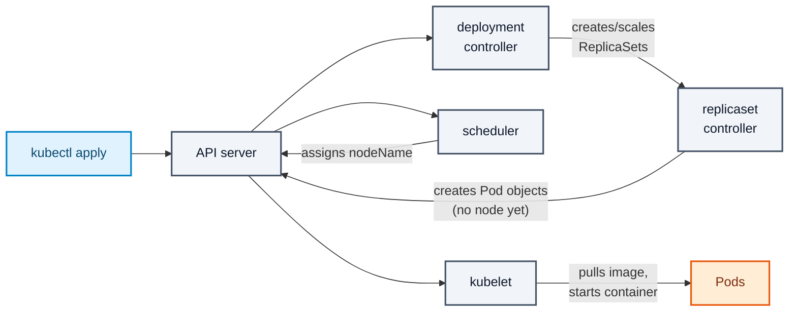
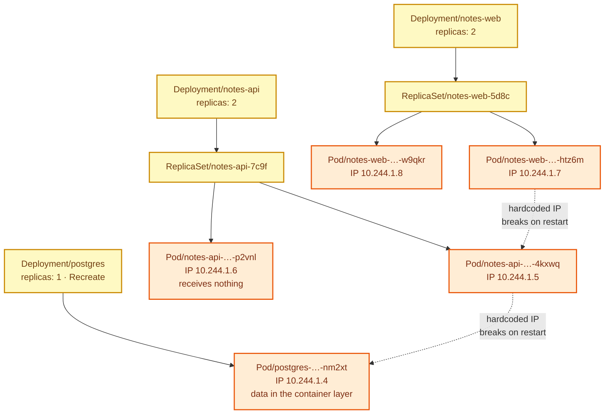

# Stage 03 — Deployments

[⬅ Project 02](../../README.md) · Stage 2 of 11

[00 Namespace](../00-namespace/README.md) › **03 Deployments** › [04 Services](../04-services/README.md) › [05 ConfigMaps](../05-configmaps/README.md) › [06 Secrets](../06-secrets/README.md) › [07 Storage](../07-storage/README.md) › [08 StatefulSets](../08-statefulsets/README.md) › [09 Ingress](../09-ingress/README.md) › [10 LoadBalancer](../10-loadbalancer/README.md) › [11 Probes](../11-health-checks/README.md) › [19 Final](../19-final/README.md)

> **The problem:** you have an empty namespace. Nothing is running. Three tiers
> need to exist — a database, an API and a web UI — and each of them needs to
> survive a node reboot, a crash, and a new image version without anybody
> logging in to fix it by hand.

---

## 1. WHY does this resource exist?

Start from the bottom and work up, because each layer exists to fix a real
failure of the one below it.

| Layer | What it gives you | What it cannot do |
|---|---|---|
| **Pod** | Runs containers, together, on one node, sharing a network namespace | Nothing recreates it. Delete it, or lose its node, and your application is gone permanently |
| **ReplicaSet** | Keeps exactly N pods matching a label selector alive | Cannot change the pod template gradually. Update the image and it kills every pod at once — or nothing at all, depending on how you do it |
| **Deployment** | Owns ReplicaSets and orchestrates *transitions* between them | — |

A **Deployment** exists because *changing* a running application is a different
problem from *running* one. It keeps the old ReplicaSet and the new one side by
side, shifts replicas from one to the other according to a strategy you choose,
stops if the new pods never become healthy, and keeps enough history to undo.

### What happens without it

You either take an outage on every deploy (kill all, start all) or you script
the rollout by hand — and hand-rolled rollouts have no notion of "the new pods
never became ready, stop and leave the old ones serving."

### When do you use one — and when not?

| Use a Deployment | Use something else |
|---|---|
| Stateless replicas that are interchangeable — web tiers, APIs, workers | **Stateful pods needing stable names and their own volumes** → StatefulSet (stage 08) |
| Anything you will roll out a new version of | One pod per node → DaemonSet (Project 08) |
| Anything that should be restarted forever | Work that finishes → Job / CronJob (Project 06) |

> **Read that first "use something else" row again.** This stage deliberately
> runs PostgreSQL in a Deployment, because that is what everyone tries first and
> because the failure has to be *experienced* before StatefulSets mean anything.
> Stages 07 and 08 are the consequences.

---

## 2. WHAT is it?

A Deployment is **a declarative description of a pod template plus a replica
count, together with a policy for moving between versions of that template.**

> **Analogy:** a shift manager. You say "I want three people on the floor, wearing
> the new uniform." The manager brings in a new person, waits until they are
> actually working, sends one of the old ones home, and repeats — never letting
> the floor go empty. If the new uniforms turn out to be unwearable, everyone
> goes back to the old ones.
>
> **Technically:** a Deployment creates and owns **ReplicaSets** — one per
> distinct pod template. It never touches pods directly. Changing anything under
> `spec.template` produces a new ReplicaSet; changing anything else (like
> `replicas`) does not.

### The ownership chain

```
Deployment/notes-api
   └── ReplicaSet/notes-api-6d4f (current, replicas: 2)
   │      ├── Pod/notes-api-6d4f-x1
   │      └── Pod/notes-api-6d4f-y2
   └── ReplicaSet/notes-api-59ab (old, replicas: 0)   ← kept for rollback
```

The hash in the name is derived from the pod template. That is why an identical
`apply` produces `unchanged` and a one-character image edit produces a new
ReplicaSet.

### The two strategies, and why this project uses both

| Strategy | Behaviour | Right for |
|---|---|---|
| `RollingUpdate` | Start new pods, wait for Ready, remove old ones. Controlled by `maxSurge` / `maxUnavailable` | Stateless tiers — `notes-api`, `notes-web` |
| `Recreate` | Terminate **every** old pod, then start the new ones. A deliberate outage | Anything that must not run two copies at once — **`postgres`** |

`Recreate` on the database is not laziness. From stage 07 the database has a
`ReadWriteOnce` volume: a rolling update would try to start a second pod holding
the same data directory while the first still has it. At best the new pod hangs
in `ContainerCreating`; at worst, on storage that permits multi-attach, two
Postgres processes open the same files and corrupt them.

---

## 3. HOW does it work?



1. `apply` writes the Deployment object. **Nothing is running yet** — the API
   server only stores desired state.
2. The **deployment controller** notices a Deployment whose observed state does
   not match its spec, and creates a ReplicaSet with a template-hash suffix.
3. The **replicaset controller** counts pods matching its selector, sees zero,
   and creates pod objects. They have no node assigned.
4. The **scheduler** picks a node for each pod and writes `spec.nodeName`.
5. The **kubelet** on that node sees a pod assigned to it, pulls the image and
   starts the container.

Every one of those is an independent reconcile loop reading and writing the API
server. Nothing calls anything directly. That is why `kubectl describe` on a
stuck pod tells you *which* loop got stuck.

### What happens on an update

1. You change `spec.template.spec.containers[0].image`.
2. New template → new hash → **new ReplicaSet**, scaled to 0.
3. The controller scales the new one up and the old one down, respecting
   `maxSurge` (how many extra pods may exist) and `maxUnavailable` (how many may
   be missing).
4. With `maxUnavailable: 0`, a broken new version means the rollout **stalls**
   with the old pods still serving. That is the single most valuable line in
   these manifests.
5. The old ReplicaSet is kept at 0 replicas, up to `revisionHistoryLimit`. That
   is what `rollout undo` scales back up.

---

## 4. Manifest

Three files, one per tier:

- [`postgres-deployment.yaml`](postgres-deployment.yaml) — the database, `Recreate`, **no volume**
- [`notes-api-deployment.yaml`](notes-api-deployment.yaml) — the API, 2 replicas
- [`notes-web-deployment.yaml`](notes-web-deployment.yaml) — the UI, 2 replicas

The shape they share:

```yaml
apiVersion: apps/v1
kind: Deployment
metadata:
  name: notes-api
  namespace: notes-platform
spec:
  replicas: 2
  selector:
    matchLabels:                            # immutable, keep it minimal
      app.kubernetes.io/name: notes-api
      app.kubernetes.io/instance: notes-api
  strategy:
    type: RollingUpdate
    rollingUpdate:
      maxSurge: 1
      maxUnavailable: 0
  template:
    metadata:
      labels:                               # MUST be a superset of the selector
        app.kubernetes.io/name: notes-api
        app.kubernetes.io/instance: notes-api
    spec:
      containers:
        - name: notes-api
          image: notes-api:1.0.0
          imagePullPolicy: IfNotPresent
          ports:
            - name: http
              containerPort: 8080
          env:
            - name: POSTGRES_HOST
              value: "10.244.0.99"          # ⚠️ a Pod IP. This is the bug.
```

> ⚠️ **Everything in this stage is wired with hardcoded Pod IPs and a plaintext
> password.** Both are deliberate. You will replace the IPs in stage 04 and the
> password in stage 06, after watching each one fail.

---

## 5. Manifest breakdown

| Field | Value | What it does | What breaks if it's wrong |
|---|---|---|---|
| `spec.replicas` | `2` / `1` | Desired pod count. Postgres is 1 — two would be two *different* databases, not a replica pair | 2 database pods ⇒ requests answered by whichever one kube-proxy picked; silent data divergence |
| `spec.selector.matchLabels` | 2 labels | Which pods this Deployment owns | **Immutable.** Changing it means deleting and recreating the Deployment |
| `spec.template.metadata.labels` | ≥ the selector | Stamped on every pod created | Missing a selector label ⇒ the API server rejects the object |
| `spec.strategy.type` | `RollingUpdate` / `Recreate` | How to move between versions | `RollingUpdate` on the database ⇒ two pods contending for one volume (stage 07) |
| `maxSurge` | `1` | Extra pods allowed above `replicas` during a rollout | `0` with `maxUnavailable: 0` ⇒ the rollout can never start |
| `maxUnavailable` | `0` | Pods allowed to be missing during a rollout | `1` ⇒ capacity dips during every deploy; a broken image takes real traffic |
| `revisionHistoryLimit` | `5` | Old ReplicaSets kept for rollback | `0` ⇒ `rollout undo` has nothing to go back to |
| `image` | `notes-api:1.0.0` | Explicit tag, never `latest` | `:latest` ⇒ rollback is meaningless; two nodes can run different code under one tag |
| `imagePullPolicy` | `IfNotPresent` | Use the locally loaded image | `Always` ⇒ the kubelet ignores the `kind load`ed copy and fails with `ErrImagePull` |
| `containerPort` + `name` | `8080`, `http` | Documents the port and gives it a name Services and probes can reference | Wrong number is *not* an error here — it silently breaks the Service in stage 04 |
| `env[].valueFrom.fieldRef` | `metadata.name` | Downward API: injects the pod's own name | Nothing at build time can know this; without it you cannot see which pod answered |
| `resources.requests` | cpu/memory | What the scheduler reserves | Absent ⇒ the scheduler is guessing, and HPA cannot work at all (Project 05) |

---

## 6. Apply

Order matters — the database first, so it has a head start on the API:

```bash
kubectl apply -f manifests/03-deployments/postgres-deployment.yaml
kubectl rollout status deployment/postgres -n notes-platform --timeout=180s

kubectl apply -f manifests/03-deployments/notes-api-deployment.yaml
kubectl apply -f manifests/03-deployments/notes-web-deployment.yaml
```

▸ **What `rollout status` does:** blocks until the Deployment reports its
desired replicas as *available*, then exits 0. It is the correct way to wait in
a script — far better than `sleep 30`, which is either too short or too slow.

---

## 7. Validate

```bash
kubectl get deployments -n notes-platform
```

```
NAME        READY   UP-TO-DATE   AVAILABLE   AGE
notes-api   2/2     2            2           30s
notes-web   2/2     2            2           30s
postgres    1/1     1            1           50s
```

| Column | Means |
|---|---|
| `READY` | pods passing readiness / desired. `0/2` with pods Running ⇒ a probe is failing (stage 11) |
| `UP-TO-DATE` | pods running the **current** template |
| `AVAILABLE` | pods ready long enough to count |

```bash
kubectl get pods -n notes-platform -o wide
```

```
NAME                         READY   STATUS    RESTARTS   AGE   IP           NODE
notes-api-7c9f8b6d5-4kxwq    1/1     Running   0          31s   10.244.1.5   kubernetes-lab-worker
notes-api-7c9f8b6d5-p2vnl    1/1     Running   0          31s   10.244.1.6   kubernetes-lab-worker
notes-web-5d8c7f9b4-htz6m    1/1     Running   0          31s   10.244.1.7   kubernetes-lab-worker
notes-web-5d8c7f9b4-w9qkr    1/1     Running   0          31s   10.244.1.8   kubernetes-lab-worker
postgres-6b4d9c8f7-nm2xt     1/1     Running   0          51s   10.244.1.4   kubernetes-lab-worker
```

▸ **Write down the Postgres pod's IP.** You need it in the next command, and
losing it is the entire lesson.

**Now make the wiring actually work,** by patching the real IP into the API:

```bash
PG_IP=$(kubectl get pod -n notes-platform \
  -l app.kubernetes.io/name=postgres -o jsonpath='{.items[0].status.podIP}')
echo "postgres is at ${PG_IP}"

kubectl set env deployment/notes-api -n notes-platform POSTGRES_HOST="${PG_IP}"
kubectl rollout status deployment/notes-api -n notes-platform

API_IP=$(kubectl get pod -n notes-platform \
  -l app.kubernetes.io/name=notes-api -o jsonpath='{.items[0].status.podIP}')
kubectl set env deployment/notes-web -n notes-platform NOTES_API_URL="http://${API_IP}:8080"
kubectl rollout status deployment/notes-web -n notes-platform
```

▸ **What `kubectl set env` does:** patches the pod template's `env` list, which
changes the template hash, which triggers a new ReplicaSet and a rolling update.
It is an imperative shortcut — useful in a lesson, wrong in a repository,
because the cluster now differs from your YAML.

**See the application work:**

```bash
kubectl port-forward svc/notes-web 8080:80 -n notes-platform 2>/dev/null || \
kubectl port-forward deployment/notes-web 8080:8080 -n notes-platform
```

*(There is no Service yet — that is stage 04 — so forward to the Deployment.)*

```bash
curl -s localhost:8080/api/info
```

```json
{"app_env":"development","db_connected":true,"db_host":"10.244.1.4",
 "db_name":"notes","note_count":2,"pod":"notes-api-7c9f8b6d5-4kxwq"}
```

▸ `"db_connected": true` and two seed notes. Three tiers are talking.

---

## 8. Observe the mechanism

### The Deployment does not own pods — it owns ReplicaSets

```bash
kubectl get replicasets -n notes-platform
kubectl describe pod -n notes-platform -l app.kubernetes.io/name=notes-api | grep -A3 'Controlled By'
```

```
Controlled By:  ReplicaSet/notes-api-7c9f8b6d5
```

▸ And the ReplicaSet is controlled by the Deployment. Three objects, two
ownership links, each one a separate controller.

### Self-healing, for free

```bash
kubectl delete pod -n notes-platform -l app.kubernetes.io/name=notes-web --wait=false
kubectl get pods -n notes-platform -w      # Ctrl-C when you have seen enough
```

▸ A replacement appears within a second, **with a new name and a new IP**. The
ReplicaSet controller never "restarted" anything — it counted pods, saw one
short, and created another. Remember the new IP part; it is about to matter.

### A rollout keeps the old ReplicaSet

```bash
kubectl set image deployment/notes-web notes-web=notes-web:1.0.0 -n notes-platform --record 2>/dev/null || true
kubectl rollout history deployment/notes-web -n notes-platform
kubectl get rs -n notes-platform -l app.kubernetes.io/name=notes-web
```

▸ Old ReplicaSets sit at `0` replicas. They cost nothing and they are the entire
implementation of `kubectl rollout undo`.

---

## 9. Break it

### Break 1 — the database pod is recreated (the headline failure)

```bash
# Note the current IP
kubectl get pod -n notes-platform -l app.kubernetes.io/name=postgres -o wide

# Kill it — exactly what a node drain, an eviction or a node reboot would do
kubectl delete pod -n notes-platform -l app.kubernetes.io/name=postgres

# A new pod appears, with a NEW IP
kubectl get pod -n notes-platform -l app.kubernetes.io/name=postgres -o wide
```

**Symptom:** the UI stops working. `curl localhost:8080/api/notes` returns:

```json
{"detail":"connection failed: … Connection refused","error":"cannot reach postgres at 10.244.1.4:5432"}
```

**Investigate:**

```bash
kubectl logs deployment/notes-api -n notes-platform --tail=5
kubectl exec deployment/notes-api -n notes-platform -- env | grep POSTGRES_HOST
```

**Root cause:** `POSTGRES_HOST` holds the IP of a pod that no longer exists. Pod
IPs are allocated by the CNI when a pod is created and returned to the pool when
it dies. **They are not identity.** Nothing in Kubernetes preserves them.

**And it is worse than a broken link:** every note you wrote is also gone,
because the new pod started with an empty filesystem. Confirm it:

```bash
kubectl exec deployment/postgres -n notes-platform -- \
  psql -U notes -d notes -c 'SELECT count(*) FROM notes'
```

▸ Back to 2 — the two seed rows from the init script, and nothing you added.
Hold that thought: it is the whole of stage 07.

**Fix (for now):** patch in the new IP again.

```bash
PG_IP=$(kubectl get pod -n notes-platform -l app.kubernetes.io/name=postgres -o jsonpath='{.items[0].status.podIP}')
kubectl set env deployment/notes-api -n notes-platform POSTGRES_HOST="${PG_IP}"
```

**What you learned:** a workload that addresses another workload by IP is
broken by design. It works until the first restart, which is always.

### Break 2 — the second replica gets no traffic

```bash
for i in $(seq 1 10); do curl -s localhost:8080/api/info | python3 -c 'import json,sys;print(json.load(sys.stdin)["pod"])'; done
```

**Symptom:** the same API pod name, ten times.

**Root cause:** `NOTES_API_URL` names one pod. The second replica is running,
healthy, consuming resources, and serving nobody.

**Fix:** stage 04. Nothing here can fix it — a name pointing at one pod cannot
load balance across many.

### Break 3 — a mismatched selector

```bash
kubectl patch deployment notes-web -n notes-platform --type=json \
  -p='[{"op":"replace","path":"/spec/selector/matchLabels/app.kubernetes.io~1name","value":"nope"}]'
```

**Symptom:**

```
The Deployment "notes-web" is invalid: spec.selector: Invalid value: …: field is immutable
```

**Root cause:** the selector is how the Deployment finds its own pods. Letting
you change it would orphan every existing pod. Kubernetes forbids it outright.

**Fix:** none — you delete and recreate the Deployment. Which is why
[CONVENTIONS §3](../../../docs/CONVENTIONS.md#3-labeling-conventions) insists
selectors stay minimal and never contain a churny label like `version`.

---

## 10. How it interacts



Both dotted arrows are the same bug, and `Pod/notes-api-…-p2vnl` is the wasted
replica. One resource fixes all three.

---

## 11. Production notes

> 🧪 **DEMO / LEARNING CONFIGURATION**
> Pod IPs in environment variables, a plaintext password, a database with no
> volume, no probes, no limits.

> 🏭 **PRODUCTION CONSIDERATIONS**
> - **Never run a production database in a Deployment.** Use a StatefulSet at
>   minimum (stage 08), and in practice an operator such as CloudNativePG, or a
>   managed service (RDS, Cloud SQL). Kubernetes gives you identity and storage;
>   it does not give you failover, backups, or point-in-time recovery.
> - `maxUnavailable: 0` on every user-facing tier, and it is only meaningful
>   once readiness probes exist (stage 11)
> - `revisionHistoryLimit` between 3 and 10 — enough to roll back, not enough to
>   clutter `get rs`
> - Pin images by **digest** in production, so a re-pushed tag cannot change what
>   runs; scan them in CI
> - Set `requests` **and** `limits`, and understand the QoS class you land in
>   (Project 05)
> - Add `preStop` and a sensible `terminationGracePeriodSeconds` so pods leave
>   the load balancer before they stop accepting connections (Project 05)
> - Spread replicas across nodes and zones — two pods on one node is one node
>   away from an outage (Project 09)

---

## 12. The next problem

Three tiers are running, and the wiring between them is held together with IP
addresses you typed in by hand. Every one of these breaks it:

- deleting a pod
- a node rebooting
- a rolling update
- the scheduler moving a pod

And with two API replicas, one of them is receiving no traffic at all, because a
single IP address cannot mean "any healthy backend".

You need a **stable name with a stable address that always points at the
currently-healthy pods**, and that spreads requests across all of them.

→ **[Stage 04 — Services](../04-services/README.md)**

---

## 📚 Official documentation

Everything above is self-contained — these are for going deeper, not for filling gaps.
*(All links verified 2026-08-28.)*

| Reference | What it adds |
|---|---|
| [Deployments](https://kubernetes.io/docs/concepts/workloads/controllers/deployment/) | Strategies, `maxSurge`/`maxUnavailable`, revision history, rollback |
| [Pod lifecycle](https://kubernetes.io/docs/concepts/workloads/pods/pod-lifecycle/) | Phases, restart policy, why a deleted pod never comes back on its own |
| [Run a single-instance stateful application](https://kubernetes.io/docs/tasks/run-application/run-single-instance-stateful-application/) | The official version of "MySQL in a Deployment", including the same caveats |
| [Managing workloads](https://kubernetes.io/docs/concepts/cluster-administration/manage-deployment/) | Updating, scaling and organising applications in practice |

---

| ◀ Previous | ▲ Up | Next ▶ |
|---|:--:|---:|
| ◀ **[00 Namespace](../00-namespace/README.md)** | [Project 02](../../README.md) · [Manual steps](../../scripts/manual-steps.md) | **[04 Services](../04-services/README.md)** ▶ |
