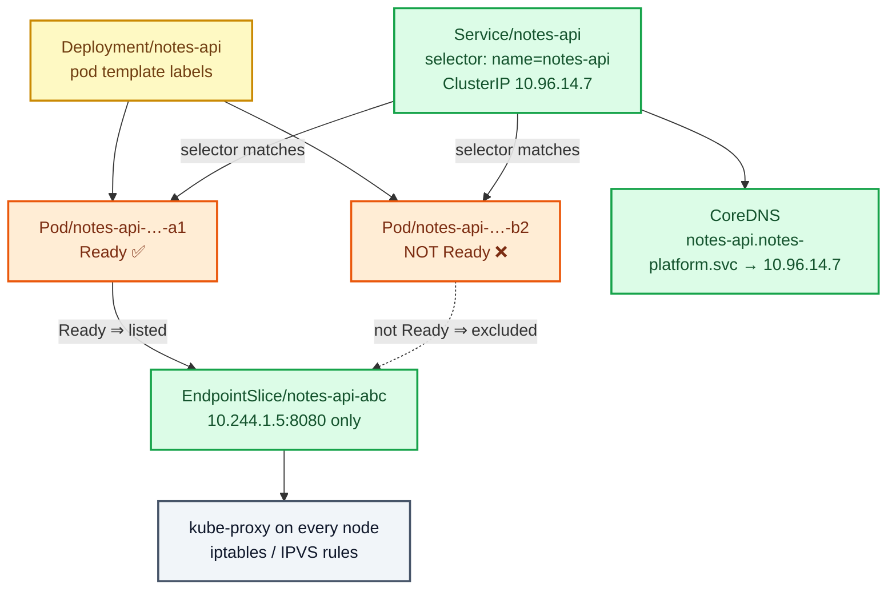
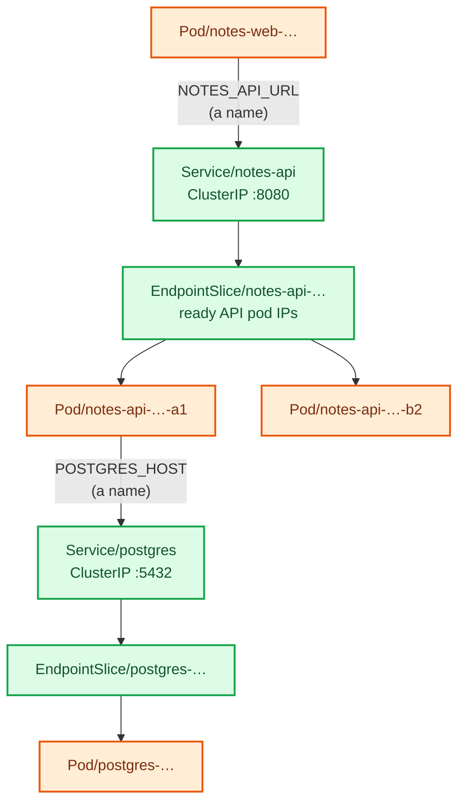

# Stage 04 — Services

[⬅ Project 02](../../README.md) · Stage 3 of 11

[00 Namespace](../00-namespace/README.md) › [03 Deployments](../03-deployments/README.md) › **04 Services** › [05 ConfigMaps](../05-configmaps/README.md) › [06 Secrets](../06-secrets/README.md) › [07 Storage](../07-storage/README.md) › [08 StatefulSets](../08-statefulsets/README.md) › [09 Ingress](../09-ingress/README.md) › [10 LoadBalancer](../10-loadbalancer/README.md) › [11 Probes](../11-health-checks/README.md) › [19 Final](../19-final/README.md)

> **The problem:** `POSTGRES_HOST` and `NOTES_API_URL` hold Pod IP addresses.
> Delete a pod — or let the scheduler move one — and the address is dead. One of
> your two API replicas receives no traffic at all, because one IP cannot mean
> "whichever backend is healthy right now".

---

## 1. WHY does this resource exist?

Pod IPs are **allocated on creation and returned to the pool on deletion**.
They are not identity, nothing preserves them, and every normal cluster event
changes them:

| Event | Pod IP after |
|---|---|
| Pod crashes and is replaced | new |
| Node reboots | new |
| Rolling update | new |
| Scale down then up | new |
| Node drained for maintenance | new |

So a client needs something that is **stable**, **resolvable by name**, and
**knows which backends are currently healthy**. Three requirements, one object.

A **Service** is:

1. a **stable virtual IP** (the ClusterIP), which lives as long as the Service
   object does — far longer than any pod;
2. a **DNS name** in CoreDNS, so nothing has to know the IP either;
3. a **load balancer** across every pod that matches its selector *and* is
   currently Ready.

Point three is the part people underestimate. A Service is not a pointer to a
pod. It is a pointer to a *set*, maintained continuously.

### What happens without it

Exactly what you saw in stage 03: the app works until the first restart, and
half your replicas idle.

### When do you use one — and when not?

| Use a Service | Don't |
|---|---|
| Any pod another pod needs to reach | A one-off debug pod you will `exec` into |
| Any workload with more than one replica | Work that finishes and never listens (Jobs) |
| The database, so the API doesn't chase IPs | Cases needing a *specific* pod, not any pod → headless Service (stage 08) |

---

## 2. WHAT is it?

A Service is **a named, stable network endpoint for a dynamic set of pods,
selected by labels.**

> **Analogy:** a company switchboard number. Staff join and leave, desks move,
> extensions change — the published number does not. Call it and you reach
> somebody who can help, without knowing who is in today.
>
> **Technically:** a Service is a *virtual* IP. Nothing listens on it. No process
> owns it, it never appears on a network interface, and you cannot ping it in
> any meaningful sense. It exists only as **packet-rewriting rules** installed on
> every node by kube-proxy.

### The types

| Type | What it does | Used here |
|---|---|---|
| **ClusterIP** (default) | Reachable only from inside the cluster | All four Services in this stage |
| **NodePort** | ClusterIP **plus** a port on every node | Stage 10 |
| **LoadBalancer** | NodePort **plus** an external address from the cloud provider | Stage 10 |
| **ExternalName** | A CNAME to an out-of-cluster hostname; no proxying at all | Project 03 |
| **Headless** (`clusterIP: None`) | No virtual IP — DNS returns pod IPs directly | Stage 08 |

### The object you did not create: EndpointSlice

When you create a Service with a selector, the **EndpointSlice controller**
starts watching for pods that match it, and maintains a list of the **ready**
ones. That list is the Service's actual backend set.

```bash
kubectl get endpointslices -n notes-platform
```

Every Service problem in Kubernetes is diagnosed here. An empty EndpointSlice
means "this Service has nowhere to send traffic", and the cause is always one
of exactly three things (§9).

---

## 3. HOW does it work?



Follow one request from `notes-api` to the database:

1. The app resolves `postgres.notes-platform.svc.cluster.local`. The pod's
   `/etc/resolv.conf` points at **CoreDNS**, which returns the Service's
   ClusterIP — say `10.96.51.20`.
2. The app opens a TCP connection to `10.96.51.20:5432`.
3. The packet leaves the container and hits the node's kernel, where
   **kube-proxy** has installed rules for that IP and port.
4. The rules **DNAT** the destination to one of the ready pod IPs from the
   EndpointSlice — `10.244.1.4:5432` — chosen at random (iptables mode) or by a
   scheduling algorithm (IPVS mode).
5. The reply is un-NATed on the way back, so the app believes it spoke to
   `10.96.51.20` throughout.

**There is no proxy process in the data path.** No hop, no extra latency, no
single point of failure — it is packet rewriting in the kernel, on the node the
client is running on.

> **The consequence people miss:** load balancing happens **per connection**,
> not per request. An HTTP client that keeps a connection alive keeps talking to
> the same pod. That is why `curl` in a loop looks nicely balanced and a
> connection-pooling client does not.

---

## 4. Manifest

```yaml
apiVersion: v1
kind: Service
metadata:
  name: postgres
  namespace: notes-platform
spec:
  type: ClusterIP
  selector:                       # ← matches POD TEMPLATE labels, not the Deployment's name
    app.kubernetes.io/name: postgres
    app.kubernetes.io/instance: postgres
  ports:
    - name: postgres
      port: 5432                  # what clients connect to
      targetPort: postgres        # the container's NAMED port
      protocol: TCP
```

Files:
[`postgres-service.yaml`](postgres-service.yaml) ·
[`notes-api-service.yaml`](notes-api-service.yaml) ·
[`notes-web-service.yaml`](notes-web-service.yaml)

And the consumers, now pointing at names instead of IPs:
[`notes-api-deployment-patched.yaml`](notes-api-deployment-patched.yaml) ·
[`notes-web-deployment-patched.yaml`](notes-web-deployment-patched.yaml)

```yaml
- name: POSTGRES_HOST
  value: "postgres.notes-platform.svc.cluster.local"
```

---

## 5. Manifest breakdown

| Field | Value | What it does | What breaks if it's wrong |
|---|---|---|---|
| `spec.type` | `ClusterIP` | Internal-only virtual IP | Exposing a database as NodePort/LoadBalancer puts your data on the internet |
| `spec.selector` | pod labels | Which pods are candidate backends | **One typo ⇒ zero endpoints ⇒ connection refused, with no error message anywhere** |
| `spec.ports[].port` | `5432`, `8080`, `80` | The port the *Service* listens on | Clients connect to the wrong port ⇒ connection refused |
| `spec.ports[].targetPort` | `postgres`, `http` | The *container's* port; may be a number or a name | Wrong ⇒ endpoints exist and connections are still refused |
| `spec.ports[].name` | `http` | Required when a Service has >1 port; good practice always | Unnamed ports cannot be referenced from an Ingress by name |
| `spec.ports[].protocol` | `TCP` | TCP, UDP or SCTP | UDP service declared TCP ⇒ silently no traffic |
| `spec.clusterIP` | *(omitted)* | Allocated from the service CIDR | `None` makes it headless (stage 08) — a very different object |
| `spec.sessionAffinity` | *(omitted)* | `ClientIP` pins a client to one backend | Needed for sticky sessions; breaks even load spreading |

> **`port` vs `targetPort` is the classic confusion.** `notes-web` listens on
> **80** and forwards to the container's **8080**. `notes-api` uses 8080 for
> both. Neither has to match; keeping `targetPort` a *name* means the numbers can
> change in the Deployment without touching the Service.

---

## 6. Apply

```bash
kubectl apply -f manifests/04-services/postgres-service.yaml
kubectl apply -f manifests/04-services/notes-api-service.yaml
kubectl apply -f manifests/04-services/notes-web-service.yaml

# And point the workloads at names instead of IPs
kubectl apply -f manifests/04-services/notes-api-deployment-patched.yaml
kubectl apply -f manifests/04-services/notes-web-deployment-patched.yaml
kubectl rollout status deployment/notes-api -n notes-platform
kubectl rollout status deployment/notes-web -n notes-platform
```

▸ **Create the Service before the pods that need it, whenever you can.** Nothing
breaks if you don't — DNS is resolved at connect time, not at pod start — but a
pod that starts first will log connection failures until the Service exists.

---

## 7. Validate

```bash
kubectl get services -n notes-platform
```

```
NAME        TYPE        CLUSTER-IP      EXTERNAL-IP   PORT(S)    AGE
notes-api   ClusterIP   10.96.14.7      <none>        8080/TCP   20s
notes-web   ClusterIP   10.96.201.44    <none>        80/TCP     20s
postgres    ClusterIP   10.96.51.20     ClusterIP     5432/TCP   25s
```

**Then immediately check the endpoints — this is the check that matters:**

```bash
kubectl get endpointslices -n notes-platform
```

```
NAME              ADDRESSTYPE   PORTS   ENDPOINTS               AGE
notes-api-7xk2p   IPv4          8080    10.244.1.5,10.244.1.6   20s
notes-web-mq4rt   IPv4          8080    10.244.1.7,10.244.1.8   20s
postgres-b8vzc    IPv4          5432    10.244.1.4              25s
```

| What you see | Means |
|---|---|
| Pod IPs listed | ✅ working |
| `<unset>` or no rows | ❌ selector matches nothing, or no pod is Ready |
| Fewer IPs than replicas | Some pods are not Ready — normal during a rollout, a problem otherwise |

**Confirm the app works through names:**

```bash
kubectl port-forward svc/notes-web 8080:80 -n notes-platform &
sleep 2; curl -s localhost:8080/api/info; echo; kill %1
```

```json
{"db_connected":true,"db_host":"postgres.notes-platform.svc.cluster.local","note_count":2,…}
```

▸ `db_host` is a **name** now. That is the whole stage.

---

## 8. Observe the mechanism

### DNS actually resolves

```bash
kubectl run dns-test --rm -it --restart=Never --image=busybox:1.36 -n notes-platform -- \
  nslookup postgres.notes-platform.svc.cluster.local
```

```
Name:      postgres.notes-platform.svc.cluster.local
Address 1: 10.96.51.20 postgres.notes-platform.svc.cluster.local
```

▸ That address is the **ClusterIP**, not a pod IP. Nothing is listening on it.

**Short names work too, inside the same namespace:**

```bash
kubectl run dns-test --rm -it --restart=Never --image=busybox:1.36 -n notes-platform -- \
  nslookup postgres
```

▸ The resolver appends the search domains from `/etc/resolv.conf`. From another
namespace this fails — which is why every FQDN in this project is written out
in full.

### The endpoint list follows pod readiness, live

```bash
# Watch in one terminal
kubectl get endpointslices -n notes-platform -l kubernetes.io/service-name=notes-api -w
```

```bash
# In another, halve the replicas
kubectl scale deployment/notes-api --replicas=1 -n notes-platform
```

▸ An IP disappears from the list within a second. Scale back to 2 and it
returns. **Nothing edited the Service.** The controller reconciled it.

```bash
kubectl scale deployment/notes-api --replicas=2 -n notes-platform
```

### Load balancing is real, and it is per connection

```bash
kubectl port-forward svc/notes-web 8080:80 -n notes-platform &
sleep 2
for i in $(seq 1 10); do
  curl -s localhost:8080/api/info | python3 -c 'import json,sys;print(json.load(sys.stdin)["pod"])'
done
kill %1
```

▸ Both API pod names appear. The second replica is finally earning its keep.

### The rules kube-proxy wrote

```bash
docker exec kubernetes-lab-worker iptables-save -t nat | grep notes-api | head
```

▸ Raw DNAT rules naming your ClusterIP and your pod IPs. No proxy process, no
extra hop — the kernel rewrites the packet. (On a cluster in IPVS mode you would
look at `ipvsadm -Ln` instead.)

---

## 9. Break it

### Break 1 — a selector typo (the silent killer)

```bash
kubectl patch service notes-api -n notes-platform \
  -p '{"spec":{"selector":{"app.kubernetes.io/name":"notes-apo"}}}'
```

**Symptom:** the UI shows *"Cannot load notes: API returned 502"*. Every pod is
`Running`, every Deployment is `2/2`, `kubectl get all` looks perfect.

**Investigate:**

```bash
kubectl get endpointslices -n notes-platform -l kubernetes.io/service-name=notes-api
```

```
NAME              ADDRESSTYPE   PORTS     ENDPOINTS   AGE
notes-api-7xk2p   IPv4          <unset>   <unset>     3m
```

**Root cause:** the selector matches no pods, so the EndpointSlice is empty and
kube-proxy has nowhere to send packets. **Kubernetes reports no error for this**
— an empty backend set is a perfectly legal state.

**Fix:**

```bash
kubectl apply -f manifests/04-services/notes-api-service.yaml
```

**What you learned:** `Service → EndpointSlice → Pods` is the debugging path.
When something cannot reach something else, look at endpoints *before* logs.

### Break 2 — the wrong targetPort

```bash
kubectl patch service notes-api -n notes-platform \
  -p '{"spec":{"ports":[{"name":"http","port":8080,"targetPort":9999}]}}'
```

**Symptom:** endpoints are present, and connections are refused anyway.

```bash
kubectl run t --rm -it --restart=Never --image=curlimages/curl:8.10.1 -n notes-platform -- \
  curl -m 5 -sS http://notes-api:8080/api/info
# curl: (7) Failed to connect … Connection refused
```

**Root cause:** the DNAT rule now rewrites the destination to
`10.244.1.5:9999`, and nothing is listening there. The Service layer is fine;
the *pod* layer is wrong.

**How to tell the two apart:** bypass the Service and go straight to the pod.

```bash
POD_IP=$(kubectl get pod -n notes-platform -l app.kubernetes.io/name=notes-api -o jsonpath='{.items[0].status.podIP}')
kubectl run t --rm -it --restart=Never --image=curlimages/curl:8.10.1 -n notes-platform -- \
  curl -m 5 -sS "http://${POD_IP}:8080/api/info"
```

▸ Works ⇒ the pod is fine and the Service is misconfigured. Fails ⇒ the problem
is the application.

**Fix:**

```bash
kubectl apply -f manifests/04-services/notes-api-service.yaml
```

### Break 3 — the wrong namespace in a name

```bash
kubectl set env deployment/notes-api -n notes-platform \
  POSTGRES_HOST=postgres.default.svc.cluster.local
kubectl rollout status deployment/notes-api -n notes-platform
curl -s localhost:8080/api/notes    # via a port-forward
```

**Symptom:**

```json
{"error":"cannot reach postgres at postgres.default.svc.cluster.local:5432",
 "detail":"could not translate host name … to address"}
```

**Root cause:** DNS resolution failure, not a connection failure — read the
error text carefully, it tells you which. There is no `postgres` Service in
`default`.

**Fix:**

```bash
kubectl apply -f manifests/04-services/notes-api-deployment-patched.yaml
```

**What you learned:** *"could not translate host name"* means DNS.
*"connection refused"* means DNS worked and nothing was listening. Two entirely
different investigations.

---

## 10. How it interacts



Two Services, two EndpointSlices, and not a single IP address written down
anywhere.

---

## 11. Production notes

> 🧪 **DEMO / LEARNING CONFIGURATION**
> Everything is ClusterIP and reachable only through `port-forward`. Any pod in
> the cluster can open a connection to the database.

> 🏭 **PRODUCTION CONSIDERATIONS**
> - A database Service stays **ClusterIP**, always. Restrict who may reach it
>   with a NetworkPolicy (Projects 04, 07) — a Service does no authorisation
>   whatsoever.
> - Name every port. Ingresses, ServiceMonitors and NetworkPolicies can all
>   reference ports by name, which survives renumbering.
> - Readiness probes are what make a Service trustworthy. Without one, a pod
>   joins the endpoint list the moment it is Running — before it can serve
>   (stage 11).
> - Add `preStop` + `terminationGracePeriodSeconds` so a terminating pod leaves
>   the EndpointSlice *before* it stops accepting connections; otherwise every
>   rollout drops a few requests (Project 05).
> - `topologyKeys`/traffic distribution and `sessionAffinity` exist, and both
>   trade even balancing for something else — reach for them deliberately.
> - Headless Services for anything that needs to address a *specific* member
>   (stage 08).

---

## 12. The next problem

The wiring is stable. But look at what is now written into three separate
workload manifests:

```yaml
- name: POSTGRES_HOST
  value: "postgres.notes-platform.svc.cluster.local"
- name: POSTGRES_DB
  value: "notes"
- name: POSTGRES_PASSWORD
  value: "devpassword"        # ← in Git, in plain text
```

Rename the Service and you must find every copy. Run the same images in a
staging namespace and you maintain a second set of nearly identical files. And
that password is sitting in a public repository, in a workload spec, where
anybody with `get deployment` can read it.

Configuration does not belong inside workload definitions.

→ **[Stage 05 — ConfigMaps](../05-configmaps/README.md)**

---

## 📚 Official documentation

Everything above is self-contained — these are for going deeper, not for filling gaps.
*(All links verified 2026-08-28.)*

| Reference | What it adds |
|---|---|
| [Service](https://kubernetes.io/docs/concepts/services-networking/service/) | Every type, `port` vs `targetPort`, session affinity |
| [EndpointSlices](https://kubernetes.io/docs/concepts/services-networking/endpoint-slices/) | How the backend list is built, and why it replaced Endpoints |
| [DNS for Services and Pods](https://kubernetes.io/docs/concepts/services-networking/dns-pod-service/) | FQDN forms, search domains, pod DNS policies |
| [Virtual IPs and Service proxies](https://kubernetes.io/docs/reference/networking/virtual-ips/) | What kube-proxy actually installs, in iptables and IPVS mode |

---

| ◀ Previous | ▲ Up | Next ▶ |
|---|:--:|---:|
| ◀ **[03 Deployments](../03-deployments/README.md)** | [Project 02](../../README.md) · [Manual steps](../../scripts/manual-steps.md) | **[05 ConfigMaps](../05-configmaps/README.md)** ▶ |
