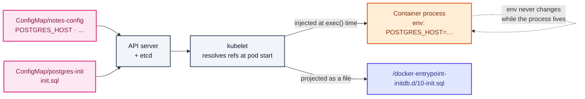
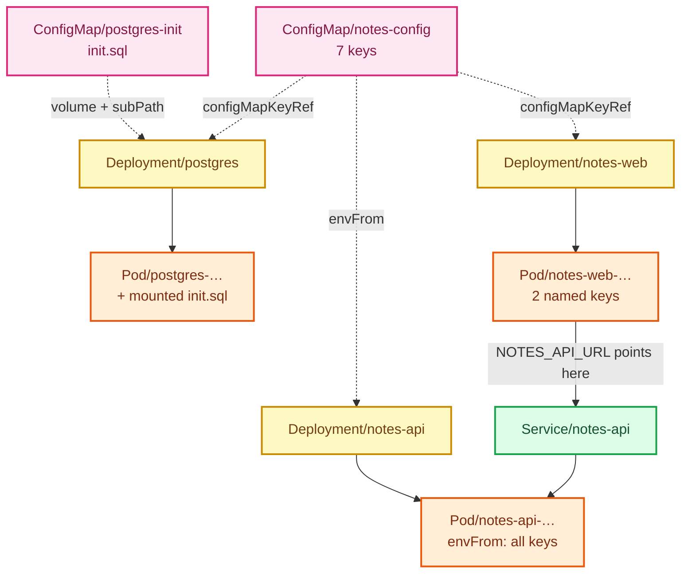

# Stage 05 — ConfigMaps

[⬅ Project 02](../../README.md) · Stage 4 of 11

[00 Namespace](../00-namespace/README.md) › [03 Deployments](../03-deployments/README.md) › [04 Services](../04-services/README.md) › **05 ConfigMaps** › [06 Secrets](../06-secrets/README.md) › [07 Storage](../07-storage/README.md) › [08 StatefulSets](../08-statefulsets/README.md) › [09 Ingress](../09-ingress/README.md) › [10 LoadBalancer](../10-loadbalancer/README.md) › [11 Probes](../11-health-checks/README.md) › [19 Final](../19-final/README.md)

> **The problem:** the database host, port, name and user are literals repeated
> across three Deployment manifests. Changing one means editing workload specs
> and hoping you found every copy. And the seed schema — a whole SQL file — has
> nowhere to live at all.

---

## 1. WHY does this resource exist?

Configuration changes far more often than code, and differs per environment. If
it lives inside the container image you get the worst outcome:

| If config is baked into the image | Consequence |
|---|---|
| A different image per environment | The thing you tested in staging is **not** the thing you ship |
| Change a setting → rebuild → repush → redeploy | Minutes to hours for a one-line change |
| Credentials in image layers | Anyone who can pull the image can read them |

Moving it into the Deployment manifest — where it is now — is better but still
wrong:

- a Deployment describes *how to run* a workload; mixing in *what to tell* it
  conflates two concerns
- three workloads sharing one setting each repeat it, and drift apart
- every config tweak becomes a change to a workload spec

Kubernetes separates the two. **A ConfigMap is a first-class object holding
configuration**, referenced by workloads. One image, many environments.

### What happens without it

You have already seen it: `postgres.notes-platform.svc.cluster.local` appears in
two manifests, `notes` appears in three. Rename the Service and a half-updated
application is a live outage.

### When do you use one — and when not?

| Use a ConfigMap | Don't |
|---|---|
| URLs, hostnames, database names, feature flags, log levels, timeouts | **Anything secret** — use a Secret (stage 06) |
| Whole config files: `nginx.conf`, `application.yaml`, **`init.sql`** | Data over ~1 MiB — that is the hard etcd-backed limit |
| Anything that differs between environments | Values that must change without a restart *and* are consumed as env vars (see §2) |

---

## 2. WHAT is it?

A ConfigMap is **a namespaced key/value object holding non-confidential
configuration**, which pods consume as environment variables, command-line
arguments, or files in a volume.

> **Analogy:** the notice board in a staff room. Anyone can read it, it is posted
> separately from the people reading it, and updating it does not require
> replacing staff.
>
> **Technically:** a ConfigMap is just data in etcd. It has **no schema, no
> validation and no behaviour** — it does nothing until a pod references it.
> Errors surface at pod start-up, not at ConfigMap creation.

### Three ways to consume it — and this project uses all three

| Method | YAML | Used by | Updates without restart? |
|---|---|---|---|
| One key → one env var | `valueFrom.configMapKeyRef` | `postgres`, `notes-web` | ❌ never |
| All keys → env vars | `envFrom.configMapRef` | `notes-api` | ❌ never |
| Mount as files | `volumes.configMap` | `postgres` (`init.sql`) | ✅ yes (~60s) — **except with `subPath`** |

**Environment variables are read once, at process start.** The Linux process
environment is fixed at `exec()` time — Kubernetes cannot change it afterwards.
Editing a ConfigMap consumed via env has **no effect on running pods**, and this
trips up everyone exactly once.

Mounted volumes are different: the kubelet refreshes the files periodically, so
the *file* changes. Whether the *application* notices depends on whether it
re-reads the file.

> ⚠️ **`subPath` mounts are the exception, and it is not obvious.** A whole
> ConfigMap mounted at a directory is kept up to date. A single key mounted at a
> file path with `subPath` is resolved **once, at pod start, and never
> refreshed.** This project uses `subPath` for `init.sql` — which is fine,
> because that file runs exactly once — but using it for a config file you
> expect to hot-reload will waste an afternoon.

### Two ConfigMaps, on purpose

| Object | Holds | Consumed as |
|---|---|---|
| `notes-config` | 6 connection and behaviour settings | environment variables |
| `postgres-init` | one SQL file | a file mounted into `/docker-entrypoint-initdb.d/` |

They are separate because they change for different reasons and are read by
different things. Splitting by *reason to change* is the same instinct that
keeps Secrets out of ConfigMaps.

---

## 3. HOW does it work?



1. You create the ConfigMap. **Nothing happens** — it is inert data.
2. A pod is created referencing it. The kubelet fetches the ConfigMap and
   resolves each `configMapKeyRef`, `envFrom` and volume.
3. A **missing key or a missing ConfigMap is a hard failure**: the container does
   not start and the pod shows `CreateContainerConfigError`. `describe` names the
   exact key.
4. Env values are handed to the container at `exec()`. From then on they are
   frozen for the life of that process.
5. Volume-mounted keys are written into a tmpfs the kubelet manages and, except
   under `subPath`, refreshed on its sync loop.

### How the seed file actually gets used

The `postgres:17.5-alpine` entrypoint runs every `*.sql` and `*.sh` it finds in
`/docker-entrypoint-initdb.d/` **only when the data directory is empty** — that
is, exactly once, on first initialisation.

Right now, with no volume, the data directory is empty on **every** pod start, so
the file runs every time and the two welcome notes reappear. From stage 07,
when the directory persists, it will never run again. Watching that flip is one
of the clearest demonstrations of what persistence means.

### How do you actually roll out a config change?

Change the ConfigMap, then restart the workloads that read it:

```bash
kubectl rollout restart deployment/notes-api -n notes-platform
```

▸ **What it does:** patches the pod template with a
`kubectl.kubernetes.io/restartedAt` annotation. A template change means a new
ReplicaSet, which means a normal rolling update — zero downtime, unlike deleting
pods.

Better still, make the change itself trigger the rollout with a
`checksum/config` annotation containing a hash of the ConfigMap. Project 03 does
this properly.

---

## 4. Manifest

```yaml
apiVersion: v1
kind: ConfigMap
metadata:
  name: notes-config
  namespace: notes-platform
data:
  APP_ENV: "development"
  LOG_LEVEL: "info"
  POSTGRES_HOST: "postgres.notes-platform.svc.cluster.local"
  POSTGRES_PORT: "5432"
  POSTGRES_DB: "notes"
  POSTGRES_USER: "notes"
  NOTES_API_URL: "http://notes-api.notes-platform.svc.cluster.local:8080"
```

And the file-shaped one:

```yaml
apiVersion: v1
kind: ConfigMap
metadata:
  name: postgres-init
  namespace: notes-platform
data:
  init.sql: |                       # ← block scalar: one string, newlines kept
    CREATE TABLE IF NOT EXISTS notes ( … );
    INSERT INTO notes (body) VALUES ( … );
```

Consumed three different ways:

```yaml
# postgres — one key, one variable
env:
  - name: POSTGRES_DB
    valueFrom:
      configMapKeyRef:
        name: notes-config
        key: POSTGRES_DB

# notes-api — every key at once
envFrom:
  - configMapRef:
      name: notes-config

# postgres — one key as a file
volumeMounts:
  - name: init-sql
    mountPath: /docker-entrypoint-initdb.d/10-init.sql
    subPath: init.sql
    readOnly: true
volumes:
  - name: init-sql
    configMap:
      name: postgres-init
      defaultMode: 0444
```

Files: [`configmap.yaml`](configmap.yaml) ·
[`postgres-init-configmap.yaml`](postgres-init-configmap.yaml) ·
[`postgres-deployment.yaml`](postgres-deployment.yaml) ·
[`notes-api-deployment.yaml`](notes-api-deployment.yaml) ·
[`notes-web-deployment.yaml`](notes-web-deployment.yaml)

---

## 5. Manifest breakdown

| Field | Value | What it does | What breaks if it's wrong |
|---|---|---|---|
| `data` | string map | UTF-8 key/value pairs. Keys allow alphanumerics, `-`, `_`, `.` | An invalid key is rejected by the API server |
| `binaryData` | base64 map | Non-UTF-8 content (certificates, archives) | — |
| `immutable` | `true`/`false` | Forbids edits; the object may only be deleted and recreated. Reduces API-server watch load at scale | Covered in Project 03 |
| `configMapKeyRef.name` / `.key` | names | Which ConfigMap, which key | Either missing ⇒ `CreateContainerConfigError` |
| `configMapKeyRef.optional` | default `false` | `false` = the pod refuses to start without it | `true` on a required setting hides the failure until runtime |
| `envFrom.configMapRef` | ConfigMap name | Every key becomes a variable of the same name | A key that is not a valid env var name is **skipped silently** and logged as an event |
| `volumes[].configMap.defaultMode` | `0444` | File permissions for the projected files | Too permissive is a finding in a security review; too strict and the process cannot read it |
| `volumeMounts[].subPath` | `init.sql` | Mount one key as one file | Without it the whole target directory is replaced. With it, the file is never refreshed |

> **YAML gotcha:** everything in `data` is a **string**. `POSTGRES_PORT: 5432`
> makes YAML parse an integer and the API server rejects it — you need
> `"5432"`. Same for `true`/`false`/`yes`/`no`. **Quote everything.**

---

## 6. Apply

```bash
kubectl apply -f manifests/05-configmaps/configmap.yaml
kubectl apply -f manifests/05-configmaps/postgres-init-configmap.yaml

kubectl apply -f manifests/05-configmaps/postgres-deployment.yaml
kubectl apply -f manifests/05-configmaps/notes-api-deployment.yaml
kubectl apply -f manifests/05-configmaps/notes-web-deployment.yaml

kubectl rollout status deployment/postgres  -n notes-platform
kubectl rollout status deployment/notes-api -n notes-platform
kubectl rollout status deployment/notes-web -n notes-platform
```

▸ **Order matters:** create the ConfigMaps **before** the workloads that
reference them, or the new pods hit `CreateContainerConfigError` — which you
will deliberately cause in §9.

▸ **Note the database restarts here.** Its pod template changed, so it is
replaced — and with no volume yet, that means your notes are gone again. The
seed script runs on the fresh data directory and you are back to two notes.

---

## 7. Validate

```bash
kubectl get configmaps -n notes-platform
kubectl describe configmap notes-config -n notes-platform
```

▸ `describe` prints every value in full. **A ConfigMap offers zero
confidentiality.** That is precisely why stage 06 exists.

**Confirm the values reached the container:**

```bash
kubectl exec deployment/notes-api -n notes-platform -- env | grep -E 'POSTGRES_|APP_ENV|LOG_LEVEL'
```

```
POSTGRES_HOST=postgres.notes-platform.svc.cluster.local
POSTGRES_PORT=5432
POSTGRES_DB=notes
POSTGRES_USER=notes
APP_ENV=development
LOG_LEVEL=info
```

**Confirm the file was mounted, and that Postgres read it:**

```bash
kubectl exec deployment/postgres -n notes-platform -- ls -l /docker-entrypoint-initdb.d/
kubectl exec deployment/postgres -n notes-platform -- head -3 /docker-entrypoint-initdb.d/10-init.sql
```

```bash
kubectl exec deployment/postgres -n notes-platform -- psql -U notes -d notes -c '\d notes'
```

▸ Look for `notes_created_at_idx` in the index list. That index exists **only**
in `init.sql` — the application never creates it. Seeing it is proof the mounted
file was executed, not merely present.

---

## 8. Observe the mechanism

### Env vars really are frozen at process start

```bash
kubectl patch configmap notes-config -n notes-platform -p '{"data":{"LOG_LEVEL":"debug"}}'

kubectl get configmap notes-config -n notes-platform -o jsonpath='{.data.LOG_LEVEL}'; echo
# debug

kubectl exec deployment/notes-api -n notes-platform -- env | grep LOG_LEVEL
# LOG_LEVEL=info        ← still the old value
```

▸ **This is not a bug.** The process environment is immutable after `exec()`.
Nothing in Kubernetes can reach into a running process and change it.

**Roll it out properly:**

```bash
kubectl rollout restart deployment/notes-api -n notes-platform
kubectl rollout status  deployment/notes-api -n notes-platform
kubectl exec deployment/notes-api -n notes-platform -- env | grep LOG_LEVEL
# LOG_LEVEL=debug       ← new pods, new environment
```

```bash
kubectl logs deployment/notes-api -n notes-platform --tail=5
```

▸ The logs are chattier — the app is logging at debug level now.

Put it back:

```bash
kubectl apply -f manifests/05-configmaps/configmap.yaml
kubectl rollout restart deployment/notes-api -n notes-platform
```

### A mounted file *does* change — but a `subPath` one does not

```bash
kubectl patch configmap postgres-init -n notes-platform \
  -p '{"data":{"init.sql":"-- edited\n"}}'
sleep 70
kubectl exec deployment/postgres -n notes-platform -- head -2 /docker-entrypoint-initdb.d/10-init.sql
```

▸ Still the original content. `subPath` resolved the file once at pod start.
The ConfigMap changed; this container will never see it.

```bash
kubectl apply -f manifests/05-configmaps/postgres-init-configmap.yaml
```

▸ Try the same experiment in Project 08, where a Prometheus config is mounted as
a **whole directory**, and you will watch the file update in place.

### One source of truth, three consumers

```bash
kubectl exec deployment/notes-web -n notes-platform -- env | grep NOTES_API_URL
kubectl exec deployment/notes-api -n notes-platform -- env | grep POSTGRES_HOST
kubectl exec deployment/postgres  -n notes-platform -- env | grep POSTGRES_DB
```

▸ Three tiers, one ConfigMap. Rename the Service and you edit **one** line.

> 🧪 **Try it:** generate a ConfigMap from a real file without writing YAML —
> this is how `postgres-init-configmap.yaml` should be regenerated whenever
> `init.sql` changes:
>
> ```bash
> kubectl create configmap postgres-init -n notes-platform \
>   --from-file=init.sql=application/database/init.sql \
>   --dry-run=client -o yaml
> ```

---

## 9. Break it

### Break 1 — a missing key

```bash
kubectl patch deployment notes-web -n notes-platform --type=json \
  -p='[{"op":"replace","path":"/spec/template/spec/containers/0/env/0/valueFrom/configMapKeyRef/key","value":"NOTES_API_ENDPOINT"}]'
kubectl get pods -n notes-platform -l app.kubernetes.io/name=notes-web
```

**Symptom:**

```
NAME                        READY   STATUS                       RESTARTS   AGE
notes-web-6c8b9f7d5-k2mzq   0/1     CreateContainerConfigError   0          15s
```

**Investigate:**

```bash
kubectl describe pod -n notes-platform -l app.kubernetes.io/name=notes-web | grep -A5 Events
```

```
Warning  Failed  kubelet  Error: couldn't find key NOTES_API_ENDPOINT in ConfigMap notes-platform/notes-config
```

**Root cause:** `optional` defaults to `false`, so a missing key is a hard
failure. The kubelet cannot build the container's environment, so it never
starts the container.

▸ **Note the old pods are still serving.** `maxUnavailable: 0` meant the rollout
stalled rather than taking the site down. The Deployment protected you.

**Fix:**

```bash
kubectl apply -f manifests/05-configmaps/notes-web-deployment.yaml
```

**What you learned:** `CreateContainerConfigError` always means a referenced
ConfigMap/Secret **object or key** is missing, and `describe` names it exactly.

### Break 2 — the unquoted-value trap

```bash
cat <<'EOF' | kubectl apply -f - 2>&1 | tail -2
apiVersion: v1
kind: ConfigMap
metadata:
  name: bad-types
  namespace: notes-platform
data:
  POSTGRES_PORT: 5432
  DEBUG: true
EOF
```

**Symptom:**

```
Error from server (BadRequest): … cannot unmarshal number into Go struct field ConfigMap.data of type string
```

**Root cause:** YAML parsed `5432` as an integer and `true` as a boolean.
`data` accepts strings only.

**Fix:** quote them — `"5432"`, `"true"`.

**What you learned:** always quote ConfigMap values. This failure is at least
loud; the *silent* version is `version: 1.10` becoming the float `1.1`.

### Break 3 — the init script that never runs

```bash
# Add a third seed row to the init script
kubectl create configmap postgres-init -n notes-platform \
  --from-literal=init.sql="$(cat application/database/init.sql; echo "INSERT INTO notes (body) VALUES ('a third seed note');")" \
  --dry-run=client -o yaml | kubectl apply -f -

kubectl rollout restart deployment/postgres -n notes-platform
kubectl rollout status  deployment/postgres -n notes-platform
kubectl exec deployment/postgres -n notes-platform -- psql -U notes -d notes -c 'SELECT count(*) FROM notes'
```

**Symptom right now:** the count reflects the edit — because with no volume the
data directory is empty on every start, so the script runs every time.

**The symptom you will get in stage 07:** the same edit changes nothing at all.

**Root cause:** `/docker-entrypoint-initdb.d/` runs **only on an empty data
directory**. Once storage persists, that condition is never true again.

**Fix:** restore the ConfigMap and remember the rule.

```bash
kubectl apply -f manifests/05-configmaps/postgres-init-configmap.yaml
kubectl rollout restart deployment/postgres -n notes-platform
```

**What you learned:** entrypoint init scripts are for *bootstrap*, never for
schema changes. Day-two schema work is a migration job (Projects 03, 06).

---

## 10. How it interacts



**Note the loop:** the ConfigMap tells `notes-web` the *name of the Service*
that fronts `notes-api`. Configuration and service discovery meet here.

---

## 11. Production notes

> 🧪 **DEMO / LEARNING CONFIGURATION**
> One shared ConfigMap for three tiers, mutable, mostly consumed as environment
> variables, and a database password still sitting in a workload spec.

> 🏭 **PRODUCTION CONSIDERATIONS**
> - **Never put credentials in a ConfigMap.** `describe` prints it, RBAC on
>   ConfigMaps is usually loose, and it is not encrypted at rest by default.
>   Stage 06.
> - `immutable: true` for config that must not change under a running fleet; it
>   also removes a watch per pod at scale (Project 03)
> - A `checksum/config` annotation on the pod template so a config change
>   triggers a rollout automatically instead of requiring a remembered
>   `rollout restart` (Project 03)
> - Prefer **per-component** ConfigMaps over one shared blob — a shared one means
>   one change restarts everything
> - Environment overlays via Kustomize (`overlays/dev`, `overlays/prod`) rather
>   than hand-maintained copies (stage 19, Project 10)
> - Validate configuration at start-up and fail fast with a clear message; a
>   typo'd hostname should not become a confusing runtime error an hour later
> - 1 MiB is the hard limit — larger config belongs in a volume or object store
> - Generate file-shaped ConfigMaps from the real file (`--from-file`) in CI, so
>   the copy in Git cannot drift from the source

---

## 12. The next problem

Look at what is *still* a literal in two manifests:

```yaml
- name: POSTGRES_PASSWORD
  value: "devpassword"
```

The database uses it to create its superuser; the API uses it to connect. It is
in Git. It is printed by `kubectl describe deployment`. It is readable by anyone
who can list Deployments — which is nearly everyone, because `get deployment` is
in every "read-only" role ever written.

The obvious next move is to put it in the ConfigMap next to `LOG_LEVEL`. That
would make it *worse*: a ConfigMap is printed by `describe`, has loose RBAC by
convention, and is not encrypted at rest.

Credentials need different handling from log levels.

→ **[Stage 06 — Secrets](../06-secrets/README.md)**

---

## 📚 Official documentation

Everything above is self-contained — these are for going deeper, not for filling gaps.
*(All links verified 2026-08-28.)*

| Reference | What it adds |
|---|---|
| [ConfigMaps](https://kubernetes.io/docs/concepts/configuration/configmap/) | Consumption methods, immutability, the 1 MiB limit |
| [Define environment variables for a container](https://kubernetes.io/docs/tasks/inject-data-application/define-environment-variable-container/) | `configMapKeyRef`, `envFrom`, precedence rules |
| [Configuration best practices](https://kubernetes.io/docs/concepts/configuration/overview/) | Official guidance on separating config from images |
| [Volumes](https://kubernetes.io/docs/concepts/storage/volumes/) | The `configMap` volume type, `subPath`, and `defaultMode` |
| [PostgreSQL image documentation](https://github.com/docker-library/docs/blob/master/postgres/README.md) | How `/docker-entrypoint-initdb.d/` and `PGDATA` behave |

---

| ◀ Previous | ▲ Up | Next ▶ |
|---|:--:|---:|
| ◀ **[04 Services](../04-services/README.md)** | [Project 02](../../README.md) · [Manual steps](../../scripts/manual-steps.md) | **[06 Secrets](../06-secrets/README.md)** ▶ |
