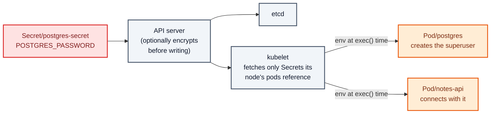
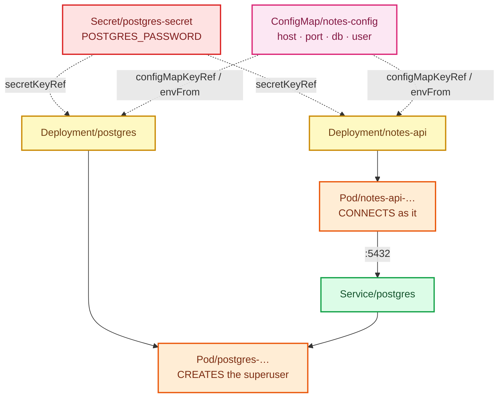

# Stage 06 — Secrets

[⬅ Project 02](../../README.md) · Stage 5 of 11

[00 Namespace](../00-namespace/README.md) › [03 Deployments](../03-deployments/README.md) › [04 Services](../04-services/README.md) › [05 ConfigMaps](../05-configmaps/README.md) › **06 Secrets** › [07 Storage](../07-storage/README.md) › [08 StatefulSets](../08-statefulsets/README.md) › [09 Ingress](../09-ingress/README.md) › [10 LoadBalancer](../10-loadbalancer/README.md) › [11 Probes](../11-health-checks/README.md) › [19 Final](../19-final/README.md)

> **The problem:** `POSTGRES_PASSWORD: "devpassword"` is a literal in two
> Deployment manifests. It is in Git. `kubectl describe deployment` prints it.
> Anyone with `get deployment` — which is in every "read-only" role ever written
> — can read your database password.

---

## 1. WHY does this resource exist?

The obvious next step is to put the password in the ConfigMap next to
`LOG_LEVEL`. That makes it *worse*, and it is worth being precise about why:

| Property | ConfigMap | Secret |
|---|---|---|
| Printed by `kubectl describe` | ✅ values in full | ❌ only `<key>: N bytes` |
| Encrypted at rest in etcd | ❌ never | ✅ **if** the cluster enables `EncryptionConfiguration` |
| Held in tmpfs (RAM) when mounted | ❌ written to disk | ✅ never written to the node's disk |
| Separate RBAC in practice | ❌ `get configmaps` is granted freely | ✅ `get secrets` is the permission people audit |
| Excluded from most log/dump tooling | ❌ | ✅ usually |

None of that is magic. It is *different handling*, which is exactly what a
credential needs and a log level does not.

### What happens without it

Your password is in three places at once — the repository, the Deployment
object, and every `describe` anybody runs — and rotating it means editing
workload specs.

### When do you use one — and when not?

| Use a Secret | Don't |
|---|---|
| Passwords, API tokens, TLS keys, registry credentials | Non-confidential settings — that is what a ConfigMap is for |
| Anything you would be unhappy to see in a screenshot | As a substitute for a real secret manager in production (§11) |
| Anything with its own rotation lifecycle | Certificates you want auto-renewed — use cert-manager, which creates the Secret for you |

---

## 2. WHAT is it?

A Secret is **a namespaced key/value object intended for confidential data,
stored base64-encoded and handled more carefully than a ConfigMap by the
kubelet, the API server and the tooling around them.**

> **Analogy:** a hotel safe in the room. It is a different box, with different
> rules about who opens it and how — but it is still inside the hotel, and the
> management can open it.
>
> **Technically:** a Secret is a ConfigMap with a different `kind`, a `type`
> field, base64 encoding, and better-behaved tooling. **Base64 is encoding, not
> encryption.** Anyone who can `get` the Secret can read the value with one more
> command.

### The one thing everybody gets wrong

```bash
kubectl get secret postgres-secret -n notes-platform -o jsonpath='{.data.POSTGRES_PASSWORD}' | base64 -d; echo
```

That is not "cracking" anything. Base64 exists so that arbitrary bytes survive
JSON and YAML, not to hide them.

**What actually protects a Secret:**

| Control | What it does |
|---|---|
| **RBAC** | Decides who may `get`/`list` Secrets at all. This is the real control. |
| **Encryption at rest** | `EncryptionConfiguration` on the API server so etcd holds ciphertext |
| **tmpfs mounts** | Volume-mounted Secrets never touch the node's disk |
| **Not committing them** | External Secrets Operator, Sealed Secrets, Vault, cloud secret managers |
| **Audit logging** | Knowing *who read it* is often more valuable than preventing the read |

### Types

| Type | Purpose |
|---|---|
| `Opaque` | Generic key/value — this project |
| `kubernetes.io/tls` | `tls.crt` + `tls.key`, consumed by Ingress (Project 10) |
| `kubernetes.io/dockerconfigjson` | Registry credentials for `imagePullSecrets` (Project 07) |
| `kubernetes.io/service-account-token` | Legacy SA tokens; modern ones are projected and short-lived (Project 07) |
| `kubernetes.io/basic-auth`, `/ssh-auth` | Structured convenience types |

### `stringData` vs `data`

```yaml
stringData:                          # you write plain text, the API server encodes it
  POSTGRES_PASSWORD: "dev-password-not-for-production"
data:                                # you write base64 yourself
  POSTGRES_PASSWORD: ZGV2LXBhc3N3b3Jk
```

`stringData` is write-only sugar: read the object back and you get `data`. Use
it in hand-written manifests — it is less error-prone and **exactly as
(in)secure**. A trailing newline from `echo "pw" | base64` is one of the great
time-wasters of Kubernetes; `echo -n` or `stringData` avoids it.

---

## 3. HOW does it work?



1. `apply` sends the Secret. If the cluster is configured for encryption at
   rest, the API server encrypts it before writing to etcd. **Kind does not do
   this by default** — on this cluster the value is plaintext in etcd.
2. A pod referencing it is scheduled. The kubelet on that node fetches the
   Secret — and **only** the Secrets that pods on its node actually reference,
   which limits what a compromised node can see.
3. As env vars: injected at `exec()` and frozen, exactly like a ConfigMap.
   As a volume: written to a **tmpfs**, so it never lands on the node's disk,
   and refreshed if the Secret changes.
4. A missing Secret or key ⇒ `CreateContainerConfigError`, identically to a
   ConfigMap.

### One key, two consumers — and why that matters here

`postgres` uses `POSTGRES_PASSWORD` **on first initialisation** to create the
superuser. `notes-api` uses it **on every connection**. They must agree.

If you change the Secret and restart only the API, you get
`password authentication failed for user "notes"` — while both pods are
`Running`, both are `Ready` by their own probes, and every dashboard is green.
Worse: changing the Secret and restarting *Postgres* does nothing either, because
the password is only read from the environment when the data directory is
initialised. That is stage 07's persistence lesson arriving early.

---

## 4. Manifest

```yaml
apiVersion: v1
kind: Secret
metadata:
  name: postgres-secret
  namespace: notes-platform
type: Opaque
stringData:
  POSTGRES_PASSWORD: "dev-password-not-for-production"
```

Consumed identically by both tiers:

```yaml
env:
  - name: POSTGRES_PASSWORD
    valueFrom:
      secretKeyRef:
        name: postgres-secret
        key: POSTGRES_PASSWORD
```

Files: [`secret.yaml`](secret.yaml) ·
[`postgres-deployment.yaml`](postgres-deployment.yaml) ·
[`notes-api-deployment.yaml`](notes-api-deployment.yaml)

> 🧪 **DEMO / LEARNING CONFIGURATION**
> This file is committed to Git with a readable password in it. It is the one
> thing in this repository you must never copy into real work. §11 is the
> production answer.

---

## 5. Manifest breakdown

| Field | Value | What it does | What breaks if it's wrong |
|---|---|---|---|
| `type` | `Opaque` | Generic secret. Typed secrets validate their required keys | A `kubernetes.io/tls` Secret without `tls.crt` is rejected |
| `stringData` | plain text | Convenience input; encoded by the API server and never read back | — |
| `data` | base64 | The stored form | Invalid base64 ⇒ rejected. A trailing newline ⇒ authentication failures that look like typos |
| `immutable` | `true`/`false` | Forbids edits — useful for a credential that must be rotated by replacement | — |
| `secretKeyRef.name` / `.key` | names | Which Secret, which key | Either missing ⇒ `CreateContainerConfigError` |
| `secretKeyRef.optional` | default `false` | Hard requirement by default | `true` on a required credential turns a start-up failure into a runtime one |

---

## 6. Apply

```bash
kubectl apply -f manifests/06-secrets/secret.yaml
kubectl apply -f manifests/06-secrets/postgres-deployment.yaml
kubectl apply -f manifests/06-secrets/notes-api-deployment.yaml
kubectl rollout status deployment/postgres  -n notes-platform
kubectl rollout status deployment/notes-api -n notes-platform
```

▸ **The Secret first**, always — the pods that reference it will not start
otherwise.

▸ The database pod is replaced again, so the data directory is fresh and the new
password is used to create the superuser. In stage 07, once the directory
persists, this stops being true and password changes stop taking effect. Note
that now; you will meet it as a failure lab later.

---

## 7. Validate

```bash
kubectl get secret postgres-secret -n notes-platform
```

```
NAME              TYPE     DATA   AGE
postgres-secret   Opaque   1      10s
```

```bash
kubectl describe secret postgres-secret -n notes-platform
```

```
Data
====
POSTGRES_PASSWORD:  32 bytes
```

▸ **Compare that with `describe configmap`,** which printed every value. This is
the visible half of "handled differently".

**Confirm the whole chain works:**

```bash
kubectl exec deployment/notes-api -n notes-platform -- \
  python3 -c "import os; print('password length:', len(os.environ['POSTGRES_PASSWORD']))"

kubectl port-forward svc/notes-web 8080:80 -n notes-platform &
sleep 2; curl -s localhost:8080/api/info; echo; kill %1
```

```json
{"db_connected":true,"db_user":"notes","note_count":2,…}
```

▸ `db_connected: true` means the API authenticated with the password from the
Secret against a database created with the same password. One key, two
consumers, agreeing.

---

## 8. Observe the mechanism

### Base64 is not encryption

```bash
kubectl get secret postgres-secret -n notes-platform -o yaml
```

```yaml
data:
  POSTGRES_PASSWORD: ZGV2LXBhc3N3b3JkLW5vdC1mb3ItcHJvZHVjdGlvbg==
```

```bash
kubectl get secret postgres-secret -n notes-platform \
  -o jsonpath='{.data.POSTGRES_PASSWORD}' | base64 -d; echo
```

```
dev-password-not-for-production
```

▸ One command. If you can `get` the Secret, you can read it — **RBAC is the
control, not the encoding.**

### What actually stops someone

```bash
kubectl auth can-i get secrets -n notes-platform
kubectl auth can-i get secrets -n notes-platform --as=system:serviceaccount:notes-platform:default
```

▸ You can (you are cluster-admin on a lab cluster). The default ServiceAccount
cannot. That difference — not base64 — is the security boundary. Project 07 is
entirely about it.

### The value really is in the container's environment

```bash
kubectl exec deployment/notes-api -n notes-platform -- env | grep POSTGRES_PASSWORD
```

▸ Plainly visible. Anyone with `exec` into the pod has the password, which is why
`create pods/exec` is a privileged verb, not a debugging convenience.

> **Volume mounts are the better habit for secrets.** Environment variables leak
> into crash dumps, `/proc/<pid>/environ`, child processes and logging
> middleware that helpfully prints the environment. A file in a tmpfs leaks in
> fewer ways and can be re-read after rotation. This project uses env vars
> because the Postgres image requires them; a service you write yourself should
> prefer a file.

### Rotation, and why it is not as simple as editing the Secret

```bash
kubectl patch secret postgres-secret -n notes-platform \
  -p '{"stringData":{"POSTGRES_PASSWORD":"a-new-password"}}'
kubectl exec deployment/notes-api -n notes-platform -- env | grep POSTGRES_PASSWORD
# …still the old value — env is frozen at exec(), exactly like a ConfigMap
```

```bash
kubectl rollout restart deployment/notes-api -n notes-platform
kubectl rollout status  deployment/notes-api -n notes-platform
curl -s localhost:8080/api/info      # via a port-forward
```

▸ **Now the API is broken**, with `db_connected: false` and *"password
authentication failed"*. The API has the new password; the database still has
the old one, because it only reads `POSTGRES_PASSWORD` when it initialises an
empty data directory.

▸ **This is a genuine production hazard, not a lab artefact.** Rotating a
database password means changing it *in the database* (`ALTER USER … PASSWORD`)
and in the Secret, in that order, then restarting the clients.

Put it back:

```bash
kubectl apply -f manifests/06-secrets/secret.yaml
kubectl rollout restart deployment/notes-api -n notes-platform
kubectl rollout restart deployment/postgres  -n notes-platform
```

---

## 9. Break it

### Break 1 — the Secret is missing

```bash
kubectl delete secret postgres-secret -n notes-platform
kubectl rollout restart deployment/notes-api -n notes-platform
kubectl get pods -n notes-platform -l app.kubernetes.io/name=notes-api
```

**Symptom:**

```
NAME                        READY   STATUS                       RESTARTS   AGE
notes-api-8d7c6b5f4-2xnvq   0/1     CreateContainerConfigError   0          20s
```

**Investigate:**

```bash
kubectl describe pod -n notes-platform -l app.kubernetes.io/name=notes-api | grep -A5 Events
```

```
Warning  Failed  kubelet  Error: secret "postgres-secret" not found
```

**Root cause:** the kubelet cannot resolve `secretKeyRef`, so it cannot build
the container environment, so it never starts the container.

▸ **And the old pods are still serving.** `maxUnavailable: 0` again.

**Fix:**

```bash
kubectl apply -f manifests/06-secrets/secret.yaml
kubectl rollout status deployment/notes-api -n notes-platform
```

### Break 2 — the base64 trailing newline

```bash
cat <<EOF | kubectl apply -f -
apiVersion: v1
kind: Secret
metadata:
  name: newline-demo
  namespace: notes-platform
type: Opaque
data:
  PASSWORD: $(echo "hunter2" | base64)
EOF

kubectl get secret newline-demo -n notes-platform -o jsonpath='{.data.PASSWORD}' | base64 -d | xxd | tail -1
```

**Symptom:** the decoded value ends `0a` — a newline that is not part of your
password. Used against a real database this produces
`password authentication failed`, and the value *looks* correct in every log
line you print.

**Root cause:** `echo` appends a newline. `base64` faithfully encoded it.

**Fix:** `echo -n "hunter2" | base64`, or use `stringData` and never think about
it again.

```bash
kubectl delete secret newline-demo -n notes-platform
```

**What you learned:** the single most common Secret bug is invisible whitespace.

### Break 3 — the tiers disagree

```bash
kubectl set env deployment/notes-api -n notes-platform POSTGRES_PASSWORD=wrong-password
kubectl rollout status deployment/notes-api -n notes-platform
curl -s localhost:8080/api/info      # via a port-forward
```

**Symptom:**

```json
{"db_connected":false,"db_error":"connection failed: … password authentication failed for user \"notes\"",…}
```

Meanwhile:

```bash
kubectl get pods -n notes-platform
# every pod Running, 1/1 READY
```

**Root cause:** the API's readiness probe does not exist yet (stage 11), so
nothing notices. Green status, broken application.

**Fix:**

```bash
kubectl apply -f manifests/06-secrets/notes-api-deployment.yaml
```

**What you learned:** *"all pods are Ready"* is a statement about probes, not
about correctness. Shared credentials must come from **one** object, referenced
by both sides — which is precisely how the manifests are written.

---

## 10. How it interacts



The two dotted red arrows are the same key reaching both sides of the
connection. Split them into two Secrets and you have invented a way to drift.

---

## 11. Production notes

> 🧪 **DEMO / LEARNING CONFIGURATION**
> A password committed to Git, no encryption at rest, consumed as an environment
> variable, no rotation, no audit.

> 🏭 **PRODUCTION CONSIDERATIONS**
> - **Do not commit Secrets.** Pick one: External Secrets Operator (syncs from
>   AWS Secrets Manager / Azure Key Vault / GCP Secret Manager / Vault), Sealed
>   Secrets (encrypted, safe to commit, decrypted in-cluster), or SOPS.
> - **Enable encryption at rest** with an `EncryptionConfiguration` on the API
>   server, ideally backed by a KMS. Without it, etcd holds your credentials in
>   plaintext and an etcd backup is a credential dump.
> - **RBAC is the actual control.** `get secrets` should be rare and audited.
>   Anyone with `create pods` in a namespace can mount any Secret in it — that is
>   an equivalent grant, and it surprises people.
> - Prefer **volume mounts over environment variables** so values are not exposed
>   through `/proc/<pid>/environ`, crash dumps or over-eager logging.
> - **Rotate by replacement**, and remember the ordering: change it in the system
>   that owns it, then in the Secret, then restart consumers.
> - For a database specifically, the real answer is short-lived credentials
>   issued per pod (Vault dynamic secrets, IAM auth) so there is no long-lived
>   password to steal.
> - `automountServiceAccountToken: false` on pods that never call the API server
>   — every pod carries a credential by default (Project 07).

---

## 12. The next problem

Configuration and credentials are handled properly now. The application works.

So write a few notes in the UI, and then do the most ordinary thing in the
world — the thing a node reboot, an eviction, a rolling update or a `kubectl
delete pod` does automatically:

```bash
kubectl delete pod -n notes-platform -l app.kubernetes.io/name=postgres
```

Wait for the new pod, refresh the page, and count your notes.

They are gone. Every one. The only rows left are the two the seed script
recreated on a brand-new, empty data directory.

Your database is writing to the container's writable layer, which is destroyed
with the container. **You do not have a database; you have a cache that
occasionally looks like one.**

→ **[Stage 07 — Storage](../07-storage/README.md)**

---

## 📚 Official documentation

Everything above is self-contained — these are for going deeper, not for filling gaps.
*(All links verified 2026-08-28.)*

| Reference | What it adds |
|---|---|
| [Secrets](https://kubernetes.io/docs/concepts/configuration/secret/) | Types, `stringData`, size limits, and the explicit statement that Secrets are not encrypted by default |
| [Good practices for Kubernetes Secrets](https://kubernetes.io/docs/concepts/security/secrets-good-practices/) | The official threat model and hardening list |
| [Encrypting confidential data at rest](https://kubernetes.io/docs/tasks/administer-cluster/encrypt-data/) | How to make etcd actually hold ciphertext |
| [Define environment variables for a container](https://kubernetes.io/docs/tasks/inject-data-application/define-environment-variable-container/) | `secretKeyRef` alongside `configMapKeyRef` |

---

| ◀ Previous | ▲ Up | Next ▶ |
|---|:--:|---:|
| ◀ **[05 ConfigMaps](../05-configmaps/README.md)** | [Project 02](../../README.md) · [Manual steps](../../scripts/manual-steps.md) | **[07 Storage](../07-storage/README.md)** ▶ |
