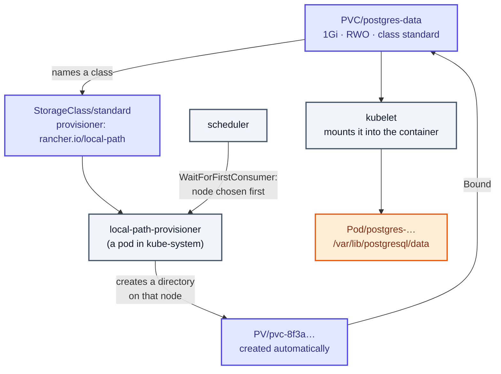
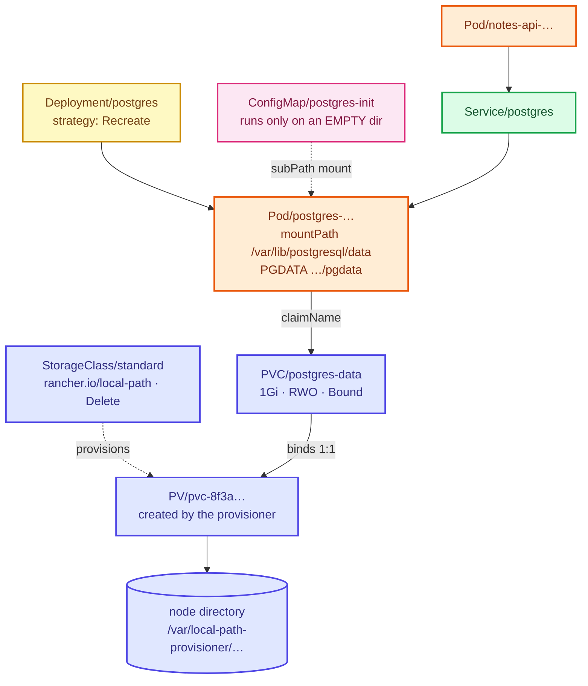

# Stage 07 — Storage

[⬅ Project 02](../../README.md) · Stage 6 of 11

[00 Namespace](../00-namespace/README.md) › [03 Deployments](../03-deployments/README.md) › [04 Services](../04-services/README.md) › [05 ConfigMaps](../05-configmaps/README.md) › [06 Secrets](../06-secrets/README.md) › **07 Storage** › [08 StatefulSets](../08-statefulsets/README.md) › [09 Ingress](../09-ingress/README.md) › [10 LoadBalancer](../10-loadbalancer/README.md) › [11 Probes](../11-health-checks/README.md) › [19 Final](../19-final/README.md)

> **The problem:** you wrote notes, deleted the Postgres pod, and every one of
> them vanished. The replacement started with an empty data directory and the
> seed script ran again. Everything in this application is correct except the
> one thing a notes app exists to do: remember things.

---

## 1. WHY does this resource exist?

A container's filesystem is **the image plus a writable layer**, and that
writable layer is created with the container and destroyed with it. That is not
a limitation to route around; it is the property that makes containers
reproducible. Every container from an image starts identical.

Which leaves a question Kubernetes has to answer: where does state live?

Four candidates, in the order everyone tries them:

| Where | Survives container restart? | Survives pod deletion? | Survives node loss? |
|---|:--:|:--:|:--:|
| Container writable layer *(stages 03–06)* | ❌ | ❌ | ❌ |
| `emptyDir` | ✅ | ❌ | ❌ |
| `hostPath` | ✅ | ✅ | ❌ **and the data is stranded on that node** |
| **PersistentVolume via a PVC** | ✅ | ✅ | ✅ (with real storage behind it) |

This stage walks all four, in that order, because each one fails in a *different*
way and the differences are what you are actually learning.

### The design problem Kubernetes had to solve

An application author knows they need "10 GiB that survives". They do **not**
know whether the cluster runs on EBS, Ceph, NFS, a local disk or a laptop. If
the pod spec had to name the storage system, no manifest would be portable.

So the model is split in two:

| Object | Answers | Written by |
|---|---|---|
| **PersistentVolumeClaim** | "I need 10 GiB, ReadWriteOnce, of class `standard`" | the **application** author |
| **PersistentVolume** | "here is 10 GiB, and here is how to attach it" | the **cluster**, usually automatically |

A **StorageClass** closes the loop: it names a *provisioner* that creates the PV
on demand when a claim appears. The application never mentions a disk.

### When do you use which?

| Use | For |
|---|---|
| `emptyDir` | Scratch space, caches, a channel between two containers in one pod |
| `hostPath` | Node-level agents that genuinely need the host (a log shipper reading `/var/log`) — and nothing else |
| **PVC + StorageClass** | Any data you would be upset to lose |
| PVC + a hand-made PV | Pre-existing storage: an NFS export, a LUN, a volume created by another team |

---

## 2. WHAT is it?

Four objects, and the relationships between them are the whole subject.

| Object | One sentence |
|---|---|
| **Volume** | An entry in a pod's `spec.volumes` — a directory made available to containers. Not an API object of its own. |
| **PersistentVolume (PV)** | A cluster-scoped object representing a piece of storage that *exists*. |
| **PersistentVolumeClaim (PVC)** | A namespaced *request* for storage, which binds one-to-one with a PV. |
| **StorageClass (SC)** | A cluster-scoped template naming a provisioner that creates PVs on demand. |

> **Analogy:** a PVC is a hotel booking ("one double room, three nights"). A PV
> is a room. A StorageClass is the hotel's policy for building rooms on demand
> and what to do with one after checkout. You book a room type, not room 412.
>
> **Technically:** binding is **exclusive and one-to-one**. A bound PV serves
> exactly one PVC and is unavailable to any other, even if it is barely used.

### Access modes — a matching hint, not enforcement

| Mode | Short | Means |
|---|---|---|
| `ReadWriteOnce` | RWO | Read-write by pods on **one node**. Several pods on that node can share it. |
| `ReadWriteOncePod` | RWOP | Read-write by exactly **one pod**, cluster-wide. What a database actually wants. |
| `ReadOnlyMany` | ROX | Read-only from many nodes |
| `ReadWriteMany` | RWX | Read-write from many nodes — needs NFS/CephFS/EFS-class storage |

> ⚠️ **Access modes do not make software safe to run twice.** `ReadWriteMany`
> would happily let two PostgreSQL processes open the same data directory, and
> they would corrupt it. Multi-writer databases *replicate*; they do not share a
> filesystem. The access mode tells the scheduler and the CSI driver what
> attachments to permit, nothing more.

### Reclaim policy — what happens to the data when the claim goes

| Policy | On PVC deletion | Set by |
|---|---|---|
| `Delete` | The PV **and the underlying storage** are destroyed | The StorageClass (`standard` on Kind uses this) |
| `Retain` | The PV stays, phase `Released`, data intact, unusable until an admin cleans it up | The StorageClass, or the PV itself |

`Retain` is the safe default for anything you care about, and it is why cleanup
scripts must look for `Released` volumes. This project ships a `Retain` class so
you can see both behaviours.

### Volume binding mode — the one that causes "stuck in ContainerCreating"

| Mode | Behaviour |
|---|---|
| `Immediate` | Provision the volume as soon as the claim exists |
| `WaitForFirstConsumer` | Wait until a pod using the claim is scheduled, then provision on **that pod's node** |

With node-local storage and `Immediate`, the volume can be created on node A
while the scheduler puts the pod on node B — and the pod waits forever. Kind's
`standard` class uses `WaitForFirstConsumer` for exactly this reason.

---

## 3. HOW does it work?



**Dynamic provisioning, step by step:**

1. You create a PVC naming a StorageClass. Its phase is `Pending`.
2. With `WaitForFirstConsumer`, nothing happens yet — deliberately. The PVC waits
   for a pod.
3. A pod referencing the claim is created. The scheduler picks a node that can
   satisfy it.
4. The **external provisioner** for that class creates real storage on that node
   and creates a **PV** object describing it.
5. The **PV controller** binds PVC ↔ PV. Both go to `Bound`.
6. The **kubelet** mounts the volume into the container at `mountPath`.
7. Deleting the pod detaches the volume. **The PVC and PV are untouched** — which
   is why the next pod finds the data waiting.

**Static provisioning** (the hostPath exhibit) skips steps 1–4: a human creates
the PV, and the PV controller matches it to any claim asking for a compatible
class, size and access mode.

---

## 4. Manifest

This stage has six files, applied in narrative order. Two of them are exhibits
you will delete.

| File | What it is |
|---|---|
| [`01-postgres-deployment-emptydir.yaml`](01-postgres-deployment-emptydir.yaml) | Attempt 1 — a pod-scoped volume. Still loses data. |
| [`02-hostpath-persistentvolume.yaml`](02-hostpath-persistentvolume.yaml) | 🧪 exhibit — a hand-written PV |
| [`03-hostpath-persistentvolumeclaim.yaml`](03-hostpath-persistentvolumeclaim.yaml) | 🧪 exhibit — the claim that binds to it |
| [`04-storageclass.yaml`](04-storageclass.yaml) | 🧪 exhibit — a second class, with `Retain` |
| [`05-postgres-data-persistentvolumeclaim.yaml`](05-postgres-data-persistentvolumeclaim.yaml) | The real claim |
| [`06-postgres-deployment-pvc.yaml`](06-postgres-deployment-pvc.yaml) | The real database, with durable storage |

The two lines that matter, side by side:

```yaml
# Attempt 1 — dies with the pod
volumes:
  - name: data
    emptyDir: {}

# Attempt 4 — outlives the pod, the node and the Deployment
volumes:
  - name: data
    persistentVolumeClaim:
      claimName: postgres-data
```

And the claim itself:

```yaml
apiVersion: v1
kind: PersistentVolumeClaim
metadata:
  name: postgres-data
  namespace: notes-platform
spec:
  storageClassName: standard
  accessModes:
    - ReadWriteOnce
  resources:
    requests:
      storage: 1Gi
```

> **`PGDATA` is not optional here.** Every manifest from this stage on sets
> `PGDATA=/var/lib/postgresql/data/pgdata` — a *subdirectory* of the mount point.
> Mounting a volume directly at `/var/lib/postgresql/data` can leave a
> `lost+found` or a root-owned empty directory in it, and Postgres refuses to
> initialise a non-empty directory. This one line is the most common cause of
> "my Postgres pod will not start on Kubernetes".

---

## 5. Manifest breakdown

**PersistentVolumeClaim**

| Field | Value | What it does | What breaks if it's wrong |
|---|---|---|---|
| `spec.storageClassName` | `standard` | Which class provisions it | A class that does not exist ⇒ `Pending` forever, with the reason in `describe` |
| *(omitted)* | — | Uses the cluster's **default** class | The same manifest behaves differently on two clusters — name it explicitly |
| `""` (empty string) | — | Explicitly **no** class; only binds to a PV that also says `""` | Static binding silently never happens if the PV names a class |
| `spec.accessModes` | `[ReadWriteOnce]` | What attachments are permitted | Asking `ReadWriteMany` from a class that cannot do it ⇒ `Pending` |
| `spec.resources.requests.storage` | `1Gi` | Minimum size | May bind to a **larger** PV, never a smaller one |
| `spec.volumeMode` | *(default `Filesystem`)* | `Block` gives the container a raw device | `Block` with a normal `mountPath` ⇒ the pod fails to start |

**PersistentVolume** *(hand-written only)*

| Field | Value | What it does | What breaks if it's wrong |
|---|---|---|---|
| `spec.capacity.storage` | `1Gi` | The size claims are matched against | With `hostPath` nothing enforces it — write 10 GiB and it works until the node fills |
| `spec.persistentVolumeReclaimPolicy` | `Retain` | Keep the data when the claim goes | `Delete` on a hand-made PV destroys data on the first accidental `delete pvc` |
| `spec.storageClassName` | `""` | Available for static binding | Naming a real class makes the dynamic provisioner and this PV compete |
| `spec.hostPath.type` | `DirectoryOrCreate` | Create the directory if missing | `Directory` on a node without it ⇒ the pod hangs in `ContainerCreating` |

**StorageClass**

| Field | Value | What it does | What breaks if it's wrong |
|---|---|---|---|
| `provisioner` | `rancher.io/local-path` | Which controller creates volumes | A provisioner nobody runs ⇒ every claim `Pending` forever |
| `reclaimPolicy` | `Retain` | Applied to every PV this class creates | `Delete` on production data is one `kubectl delete pvc` from an incident |
| `volumeBindingMode` | `WaitForFirstConsumer` | Provision on the pod's node | `Immediate` + node-local storage ⇒ pods stuck in `ContainerCreating` |
| `allowVolumeExpansion` | `false` | Whether `kubectl edit pvc` may grow it | `true` on a driver that cannot resize ⇒ a resize that never completes |

---

## 6. Apply

Work through it in order — the point is to *feel* each failure.

**Attempt 1 — `emptyDir`:**

```bash
kubectl apply -f manifests/07-storage/01-postgres-deployment-emptydir.yaml
kubectl rollout status deployment/postgres -n notes-platform
```

**Exhibits — static PV and a second StorageClass:**

```bash
kubectl apply -f manifests/07-storage/02-hostpath-persistentvolume.yaml
kubectl apply -f manifests/07-storage/03-hostpath-persistentvolumeclaim.yaml
kubectl apply -f manifests/07-storage/04-storageclass.yaml
```

**The real thing:**

```bash
kubectl apply -f manifests/07-storage/05-postgres-data-persistentvolumeclaim.yaml
kubectl get pvc -n notes-platform                 # postgres-data is Pending — correct, see §8
kubectl apply -f manifests/07-storage/06-postgres-deployment-pvc.yaml
kubectl rollout status deployment/postgres -n notes-platform
```

**Tidy the exhibits away** once you have looked at them (§8):

```bash
kubectl delete -f manifests/07-storage/03-hostpath-persistentvolumeclaim.yaml
kubectl delete -f manifests/07-storage/02-hostpath-persistentvolume.yaml
```

---

## 7. Validate

```bash
kubectl get pvc,pv -n notes-platform
```

```
NAME                                  STATUS   VOLUME        CAPACITY   ACCESS MODES   STORAGECLASS   AGE
persistentvolumeclaim/postgres-data   Bound    pvc-8f3a1c…   1Gi        RWO            standard       40s

NAME                       CAPACITY   ACCESS MODES   RECLAIM POLICY   STATUS   CLAIM                          STORAGECLASS
persistentvolume/pvc-8f3a1c…   1Gi    RWO            Delete           Bound    notes-platform/postgres-data   standard
```

| What you see | Means |
|---|---|
| `Bound` | ✅ working |
| `Pending` **before** any pod exists | ✅ correct with `WaitForFirstConsumer` |
| `Pending` **after** the pod exists | ❌ see §9 |
| `Lost` | The PV was deleted out from under the claim |

**Prove the data actually persists — the whole point of the stage:**

```bash
kubectl port-forward svc/notes-web 8080:80 -n notes-platform &
sleep 2
curl -sX POST localhost:8080/api/notes -H 'Content-Type: application/json' \
  -d '{"body":"written before deleting the pod"}'
curl -s localhost:8080/api/notes | python3 -m json.tool | tail -8
kill %1
```

```bash
# The event that destroyed everything in stage 06
kubectl delete pod -n notes-platform -l app.kubernetes.io/name=postgres
kubectl rollout status deployment/postgres -n notes-platform

kubectl exec deployment/postgres -n notes-platform -- \
  psql -U notes -d notes -c 'SELECT id, body FROM notes ORDER BY id'
```

```
 id |                body
----+-------------------------------------
  1 | Welcome — this row came from the ConfigMap-mounted init.sql
  2 | Delete the postgres pod and refresh. Which notes survive?
  3 | written before deleting the pod
```

▸ **Note ids 1 and 2 were not duplicated.** The seed script did **not** run
again, because the data directory was no longer empty. That is the clearest
possible signal that this volume survived.

---

## 8. Observe the mechanism

### Attempt 1 — `emptyDir` survives a *container* restart but not a *pod* deletion

```bash
kubectl apply -f manifests/07-storage/01-postgres-deployment-emptydir.yaml
kubectl rollout status deployment/postgres -n notes-platform
kubectl exec deployment/postgres -n notes-platform -- \
  psql -U notes -d notes -c "INSERT INTO notes (body) VALUES ('emptyDir test')"

# Kill the PROCESS — the kubelet restarts the container in the SAME pod
kubectl exec deployment/postgres -n notes-platform -- \
  bash -c 'kill 1' 2>/dev/null || true
sleep 15
kubectl get pods -n notes-platform -l app.kubernetes.io/name=postgres
```

```
NAME                        READY   STATUS    RESTARTS      AGE
postgres-7d4b8c9f6-x2mnq    1/1     Running   1 (12s ago)   2m
```

▸ `RESTARTS 1`, **same pod name**. Check the data:

```bash
kubectl exec deployment/postgres -n notes-platform -- \
  psql -U notes -d notes -c "SELECT body FROM notes WHERE body = 'emptyDir test'"
```

▸ Still there. The volume belongs to the *pod*, and the pod did not go away.

```bash
# Now delete the POD
kubectl delete pod -n notes-platform -l app.kubernetes.io/name=postgres
kubectl rollout status deployment/postgres -n notes-platform
kubectl exec deployment/postgres -n notes-platform -- \
  psql -U notes -d notes -c "SELECT count(*) FROM notes"
```

▸ Back to 2. **`emptyDir` is scratch space, not persistence.** It is genuinely
useful — caches, a scratch directory, a shared channel between two containers in
one pod (Project 06) — and it is never a database's home.

### Exhibit — a hand-written PV and the binding handshake

```bash
kubectl apply -f manifests/07-storage/02-hostpath-persistentvolume.yaml
kubectl get pv notes-hostpath-demo
# STATUS: Available     ← storage that exists and nobody has claimed

kubectl apply -f manifests/07-storage/03-hostpath-persistentvolumeclaim.yaml
sleep 2
kubectl get pv notes-hostpath-demo
kubectl get pvc postgres-hostpath-demo -n notes-platform
# STATUS: Bound         ← on both, within a second
```

▸ Nothing was scheduled and nothing was provisioned. The PV controller simply
matched a request to an offer on **class, access mode and size**. Every dynamic
provisioner in existence automates precisely this handshake.

**Now see why `hostPath` is disqualified:**

```bash
kubectl get pv notes-hostpath-demo -o jsonpath='{.spec.hostPath.path}'; echo
kubectl get nodes
```

▸ That path exists on **one** node. Reschedule a pod using it to a different
node and it starts with an empty directory and no error whatsoever. On a
single-node cluster it looks like it works, which is exactly what makes it a
trap.

```bash
kubectl delete -f manifests/07-storage/03-hostpath-persistentvolumeclaim.yaml
kubectl delete -f manifests/07-storage/02-hostpath-persistentvolume.yaml
```

### The classes on this cluster

```bash
kubectl get storageclass
```

```
NAME                    PROVISIONER             RECLAIMPOLICY   VOLUMEBINDINGMODE      AGE
notes-platform-retain   rancher.io/local-path   Retain          WaitForFirstConsumer   1m
standard (default)      rancher.io/local-path   Delete          WaitForFirstConsumer   40m
```

▸ Same provisioner, different policy. `(default)` is why a PVC with no
`storageClassName` still works here and might not somewhere else.

```bash
kubectl get storageclass standard -o jsonpath='{.metadata.annotations}' | python3 -m json.tool
```

▸ `storageclass.kubernetes.io/is-default-class: "true"` — one annotation, and
the source of a great deal of "it works on my cluster".

### `WaitForFirstConsumer`, watched live

```bash
kubectl apply -f manifests/07-storage/05-postgres-data-persistentvolumeclaim.yaml
kubectl get pvc postgres-data -n notes-platform
```

```
NAME            STATUS    VOLUME   CAPACITY   ACCESS MODES   STORAGECLASS   AGE
postgres-data   Pending                                      standard       5s
```

```bash
kubectl describe pvc postgres-data -n notes-platform | tail -5
```

```
Normal  WaitForFirstConsumer  persistentvolume-controller  waiting for first consumer to be created before binding
```

▸ **`Pending` here is correct, not broken.** The provisioner cannot choose a node
until the scheduler has. Apply the Deployment and watch it bind within seconds:

```bash
kubectl apply -f manifests/07-storage/06-postgres-deployment-pvc.yaml
sleep 10
kubectl get pvc postgres-data -n notes-platform
```

### Where the data physically is

```bash
PV=$(kubectl get pvc postgres-data -n notes-platform -o jsonpath='{.spec.volumeName}')
kubectl get pv "$PV" -o jsonpath='{.spec.local.path}{"\n"}'
docker exec kubernetes-lab-worker ls -l "$(kubectl get pv "$PV" -o jsonpath='{.spec.local.path}')" 2>/dev/null \
  || docker exec kubernetes-lab-control-plane ls -l "$(kubectl get pv "$PV" -o jsonpath='{.spec.local.path}')"
```

▸ A real directory on the Kind node, containing `pgdata/`. On EKS this same
command would show you an EBS volume id instead — same objects, different
implementation, unchanged manifest.

### The PVC outlives the Deployment

```bash
kubectl delete deployment postgres -n notes-platform
kubectl get pvc,pv -n notes-platform
```

▸ Still `Bound`. Deleting a workload does **not** delete its data — Kubernetes
treats that as a decision a human must make explicitly.

```bash
kubectl apply -f manifests/07-storage/06-postgres-deployment-pvc.yaml
kubectl rollout status deployment/postgres -n notes-platform
kubectl exec deployment/postgres -n notes-platform -- psql -U notes -d notes -c 'SELECT count(*) FROM notes'
```

▸ The new pod reattached to the same volume, and your notes are back.

---

## 9. Break it

### Break 1 — a StorageClass that does not exist

```bash
cat <<'EOF' | kubectl apply -f -
apiVersion: v1
kind: PersistentVolumeClaim
metadata:
  name: broken-claim
  namespace: notes-platform
spec:
  storageClassName: fast-ssd
  accessModes: [ReadWriteOnce]
  resources:
    requests:
      storage: 1Gi
EOF
kubectl get pvc broken-claim -n notes-platform
```

**Symptom:** `Pending`, indefinitely, with no error on the PVC line itself.

**Investigate:**

```bash
kubectl describe pvc broken-claim -n notes-platform | tail -5
```

```
Warning  ProvisioningFailed  storageclass.storage.k8s.io "fast-ssd" not found
```

**Root cause:** no class, so no provisioner, so no PV. And a pod using this claim
would sit in `Pending` too — `kubectl describe pod` would say
`pod has unbound immediate PersistentVolumeClaims`.

**Fix:** name a class that exists (`kubectl get storageclass`).

```bash
kubectl delete pvc broken-claim -n notes-platform
```

**What you learned:** the *pod's* error message points at the PVC. The real
explanation is always in `describe pvc`. Chase storage failures one object at a
time, backwards.

### Break 2 — an impossible access mode

```bash
cat <<'EOF' | kubectl apply -f -
apiVersion: v1
kind: PersistentVolumeClaim
metadata:
  name: rwx-claim
  namespace: notes-platform
spec:
  storageClassName: standard
  accessModes: [ReadWriteMany]
  resources:
    requests:
      storage: 1Gi
EOF
kubectl describe pvc rwx-claim -n notes-platform | tail -4
```

**Symptom:** `Pending`, with the provisioner refusing the request.

**Root cause:** `local-path` is node-local storage. `ReadWriteMany` means "many
nodes at once", which it physically cannot do. On EKS the same claim against
`gp3` fails the same way — EBS attaches to one node — and you would need EFS.

**Fix:** ask for what the storage can do, or use a class that can do more.

```bash
kubectl delete pvc rwx-claim -n notes-platform
```

**What you learned:** access modes are constrained by the *storage technology*.
No amount of YAML makes a block device shareable.

### Break 3 — two pods, one ReadWriteOnce volume

```bash
kubectl scale deployment/postgres --replicas=2 -n notes-platform
kubectl get pods -n notes-platform -l app.kubernetes.io/name=postgres
```

**Symptom:** with `strategy: Recreate` the Deployment will not even try to run
two at once. Force the issue by switching to a rolling update:

```bash
kubectl patch deployment postgres -n notes-platform \
  -p '{"spec":{"strategy":{"type":"RollingUpdate","rollingUpdate":{"maxSurge":1,"maxUnavailable":0}}}}'
kubectl set env deployment/postgres -n notes-platform FORCE_ROLL=1
kubectl get pods -n notes-platform -l app.kubernetes.io/name=postgres -w    # Ctrl-C when you have seen it
```

**On a single-node Kind cluster** both pods land on the same node, RWO permits
it, and the second Postgres process finds the data directory locked:

```bash
kubectl logs -n notes-platform -l app.kubernetes.io/name=postgres --tail=5 --prefix
```

```
FATAL:  lock file "postmaster.pid" already exists
HINT:  Is another postmaster (PID 1) running in data directory …?
```

**On a multi-node cluster** the second pod instead sits in `ContainerCreating`
with `Multi-Attach error for volume`.

**Root cause:** one volume, one database process. Two replicas of a Deployment
share *one* PVC — the Deployment has no way to give each replica its own.

**Fix:**

```bash
kubectl apply -f manifests/07-storage/06-postgres-deployment-pvc.yaml
kubectl scale deployment/postgres --replicas=1 -n notes-platform
```

**What you learned:** this is not a bug you can configure your way out of. It is
the structural limit of Deployments for stateful workloads, and it is exactly
what stage 08 exists to fix.

### Break 4 — deleting the PVC really does delete the data

```bash
# On a class with reclaimPolicy: Delete — like Kind's `standard`
kubectl delete deployment postgres -n notes-platform
kubectl delete pvc postgres-data -n notes-platform
kubectl get pv
```

**Symptom:** the PV disappears within seconds, and with it the directory on the
node.

**Root cause:** `reclaimPolicy: Delete` on the `standard` class. The claim was
the storage's owner.

**Fix:** there is none. That is the lesson. Recreate and re-seed:

```bash
kubectl apply -f manifests/07-storage/05-postgres-data-persistentvolumeclaim.yaml
kubectl apply -f manifests/07-storage/06-postgres-deployment-pvc.yaml
kubectl rollout status deployment/postgres -n notes-platform
```

**What you learned:** know your class's reclaim policy *before* you type
`delete pvc`. Production classes for real data use `Retain`, and PVCs get
finalizers (`kubernetes.io/pvc-protection`) so a claim in use cannot be deleted
out from under a running pod — try `kubectl delete pvc` while the pod is running
and watch it hang in `Terminating` instead.

---

## 10. How it interacts



**Two lifetimes on one diagram.** Everything yellow and orange is disposable.
Everything indigo is not, and deleting the namespace deletes the PVC — which,
on a `Delete` class, takes the disk with it.

---

## 11. Production notes

> 🧪 **DEMO / LEARNING CONFIGURATION**
> Node-local storage on a laptop, `reclaimPolicy: Delete`, 1 GiB, no backups, no
> snapshots, no monitoring of free space, and a single database instance with no
> failover.

> 🏭 **PRODUCTION CONSIDERATIONS**
> - **`local-path` is not production storage.** The data is on one node's disk.
>   Lose the node, lose the data. Use a CSI driver backed by real storage: EBS
>   (`gp3`), Persistent Disk, Azure Disk, Ceph, Portworx.
> - **`reclaimPolicy: Retain` for anything you care about**, plus a documented
>   procedure for cleaning up `Released` volumes. `Delete` turns one wrong
>   command into permanent loss.
> - **A PVC is not a backup.** Snapshots (VolumeSnapshot) protect against
>   corruption and mistakes; replication protects against hardware. You need
>   both, and you need a *restore* you have actually tested.
> - **Size for growth and enable `allowVolumeExpansion`.** A full database disk
>   is an outage that a `kubectl edit pvc` could have prevented — if the class
>   permitted it.
> - **Monitor free space** on the volume, not just the pod. Nothing in Kubernetes
>   warns you at 95%.
> - `ReadWriteOncePod` for databases where the driver supports it — it makes the
>   "two writers" failure impossible instead of merely unlikely.
> - **Do not run a production database in Kubernetes casually.** A StatefulSet
>   gives you identity and storage. It does not give you failover, backups,
>   point-in-time recovery, connection pooling or major-version upgrades. Use an
>   operator (CloudNativePG, Zalando) or a managed service.
> - Never `hostPath` in an application manifest. It is a node escape hatch for
>   infrastructure agents, and Pod Security Standards `restricted` forbids it
>   outright (Project 07).

---

## 12. The next problem

The data survives. Now try to run the database the way you would run any other
workload — with more than one replica:

```bash
kubectl scale deployment/postgres --replicas=2 -n notes-platform
```

Every replica of a Deployment shares **one** PVC, because a Deployment has one
pod template and that template names one claim. So either the pods fight over a
volume that permits one writer, or they hang waiting to attach it. Neither is
"two databases".

And even at one replica, look at what you cannot do:

- the pod's name changes every time it is recreated, so nothing can address
  *this particular* database member
- start-up and shutdown order is undefined, which is exactly what a
  primary/standby pair needs to control
- there is no way to say "each replica gets **its own** volume"

Deployments are built for pods that are interchangeable. A database is the
canonical thing that is not.

→ **[Stage 08 — StatefulSets](../08-statefulsets/README.md)**

---

## 📚 Official documentation

Everything above is self-contained — these are for going deeper, not for filling gaps.
*(All links verified 2026-08-28.)*

| Reference | What it adds |
|---|---|
| [Persistent Volumes](https://kubernetes.io/docs/concepts/storage/persistent-volumes/) | Lifecycle, phases, access modes, reclaim policies, expansion |
| [Storage Classes](https://kubernetes.io/docs/concepts/storage/storage-classes/) | Provisioners, parameters, binding modes, the default-class annotation |
| [Dynamic volume provisioning](https://kubernetes.io/docs/concepts/storage/dynamic-provisioning/) | How a claim becomes a volume without an administrator |
| [Volumes](https://kubernetes.io/docs/concepts/storage/volumes/) | `emptyDir`, `hostPath` and every other volume type, with their warnings |
| [Configure a pod to use a PersistentVolume](https://kubernetes.io/docs/tasks/configure-pod-container/configure-volume-storage/) | The task version of this stage, end to end |
| [local-path-provisioner](https://github.com/rancher/local-path-provisioner) | What Kind's `standard` class actually runs |

---

| ◀ Previous | ▲ Up | Next ▶ |
|---|:--:|---:|
| ◀ **[06 Secrets](../06-secrets/README.md)** | [Project 02](../../README.md) · [Manual steps](../../scripts/manual-steps.md) | **[08 StatefulSets](../08-statefulsets/README.md)** ▶ |
