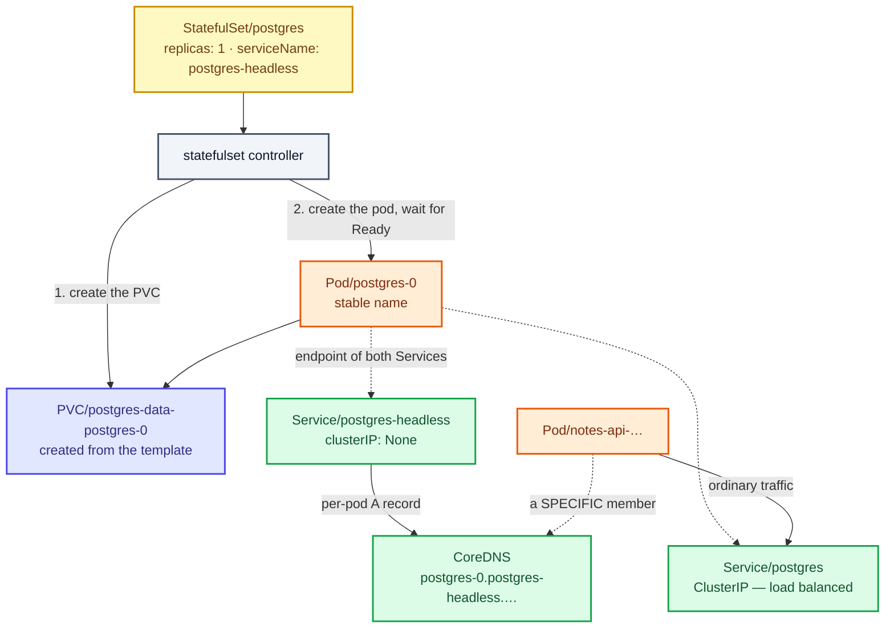
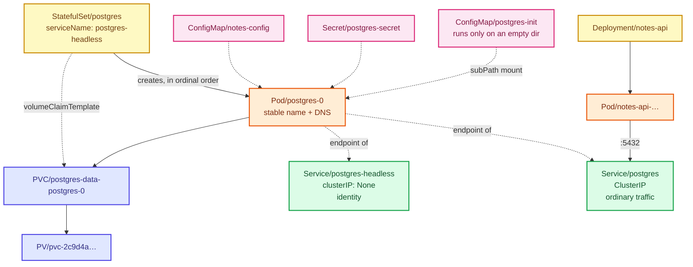

# Stage 08 — StatefulSets

[⬅ Project 02](../../README.md) · Stage 7 of 11

[00 Namespace](../00-namespace/README.md) › [03 Deployments](../03-deployments/README.md) › [04 Services](../04-services/README.md) › [05 ConfigMaps](../05-configmaps/README.md) › [06 Secrets](../06-secrets/README.md) › [07 Storage](../07-storage/README.md) › **08 StatefulSets** › [09 Ingress](../09-ingress/README.md) › [10 LoadBalancer](../10-loadbalancer/README.md) › [11 Probes](../11-health-checks/README.md) › [19 Final](../19-final/README.md)

> **The problem:** the data survives, but the database is still managed by an
> object designed for interchangeable pods. Scale it to 2 and both replicas fight
> over one volume. The pod's name changes on every recreation, so nothing can
> address *this specific* member. Start-up order is undefined. A Deployment
> cannot give each replica its own storage, because it has one pod template
> naming one claim.

---

## 1. WHY does this resource exist?

A Deployment makes three assumptions, and every one of them is false for stateful
software:

| Deployment assumes | Reality for a database |
|---|---|
| Pods are **interchangeable** — any replica can serve any request | Members have roles. The primary accepts writes; standbys do not. |
| Pods are **anonymous** — random name suffixes are fine | Members must be addressable individually: "replicate from `postgres-0`" |
| Pods **share** the pod template's volumes | Each member needs **its own** data directory |

There is a fourth, subtler one: a Deployment starts and stops replicas in
whatever order is convenient. Clustered software usually cannot bootstrap that
way — a standby that starts before its primary has nothing to replicate from.

A **StatefulSet** provides exactly what is missing:

| Guarantee | What you get |
|---|---|
| **Stable identity** | `postgres-0`, `postgres-1` — the same name for the life of the workload |
| **Stable network identity** | `postgres-0.postgres-headless.notes-platform.svc.cluster.local`, forever |
| **Stable storage** | One PVC per pod, from a `volumeClaimTemplate`, reattached on every recreation |
| **Ordered operations** | Created 0→N, deleted N→0, updated N→0, each waiting for Ready |

### What happens without it

You saw it in stage 07: `lock file "postmaster.pid" already exists`, or a pod
stuck in `ContainerCreating` with `Multi-Attach error for volume`. Neither is
fixable by configuration.

### When do you use one — and when not?

| Use a StatefulSet | Use a Deployment |
|---|---|
| Databases: PostgreSQL, MySQL, MongoDB | Web tiers, APIs, workers |
| Clustered stores where members find each other by name: Kafka, Elasticsearch, etcd, Redis, ZooKeeper | Anything that keeps its state elsewhere |
| Anything needing a per-replica volume | Anything where "restart any replica" is safe |

> **A StatefulSet is not a magic "make it stateful" button.** It gives you
> identity, ordering and storage. It does **not** give you replication, leader
> election, failover, or backups — those live inside the software you are
> running. Deploying PostgreSQL with a StatefulSet and calling it highly
> available is the single most common misunderstanding in this area.

---

## 2. WHAT is it?

A StatefulSet is **a workload controller that manages pods with persistent,
predictable identities and per-pod storage.**

> **Analogy:** a Deployment hires temps from an agency — anyone will do, they
> wear a badge with a random number, and their locker is emptied when they
> leave. A StatefulSet hires named employees — desk 0, desk 1 — each with their
> own locker that is still theirs when they come back from holiday.
>
> **Technically:** the identity is the **ordinal index**. Every guarantee follows
> from it: the pod name is `<sts-name>-<ordinal>`, the DNS record is
> `<pod-name>.<serviceName>`, the PVC is
> `<volumeClaimTemplate-name>-<pod-name>`, and operations happen in ordinal
> order.

### The three things you have to provide

| Field | Why it is mandatory in practice |
|---|---|
| `serviceName` | Names the **headless Service** that owns per-pod DNS. Get it wrong and the pods start fine but their names never resolve. |
| `volumeClaimTemplates` | The per-pod storage. Without it, a StatefulSet is just an oddly-named Deployment. |
| A **headless Service** | `clusterIP: None`, so DNS returns pod IPs and per-pod records instead of one virtual IP. |

### Headless Services

A normal ClusterIP Service *hides* which pod you reached. For a set of stateful
members that is precisely wrong.

```bash
# Normal ClusterIP → one virtual IP
postgres.notes-platform.svc.cluster.local        → 10.96.51.20

# Headless → the pod IPs themselves
postgres-headless.notes-platform.svc.cluster.local → 10.244.1.9

# And, uniquely, one record per pod
postgres-0.postgres-headless.notes-platform.svc.cluster.local → 10.244.1.9
```

This project keeps **both**: the ClusterIP Service for clients that want "the
database, whichever pod that is", and the headless Service for identity. That is
the normal production arrangement, not a lab convenience.

### The PVC lifecycle surprise

`volumeClaimTemplates` creates real PVCs named `postgres-data-postgres-0`. They
are **not** garbage-collected when the StatefulSet is deleted, and **not**
deleted when you scale down.

That is deliberate — deleting a workload should never destroy its data — and it
is why `kubectl delete statefulset` followed by `kubectl get pvc` surprises
people. Recreate the StatefulSet and `postgres-0` reattaches to its old volume
with everything intact. Scaling from 3 to 1 and back to 3 gives pods 1 and 2
their *original* data.

> Kubernetes 1.27+ adds `persistentVolumeClaimRetentionPolicy` to opt into
> deleting them on scale-down or delete. The default remains "keep", and for a
> database that default is correct.

---

## 3. HOW does it work?



**Creating a StatefulSet with 3 replicas, in order:**

1. Create PVC `postgres-data-postgres-0`, wait for it to bind.
2. Create pod `postgres-0`. **Wait until it is Running and Ready.**
3. Only then create PVC `postgres-data-postgres-1` and pod `postgres-1`.
4. Repeat for 2.

If `postgres-0` never becomes Ready, `postgres-1` is **never created**. A
StatefulSet stuck at `0/3` with one pending pod is not broken — it is doing
exactly what `OrderedReady` promises. (`podManagementPolicy: Parallel` opts out,
for software whose members do not bootstrap from each other.)

**Deleting or scaling down** reverses it: the highest ordinal goes first, and its
PVC stays behind.

**Rolling updates** also walk from the highest ordinal down, one pod at a time,
waiting for Ready. `updateStrategy.rollingUpdate.partition: N` updates only
ordinals ≥ N — the mechanism behind canarying a stateful upgrade.

### What actually makes the DNS name work

The kubelet writes the pod's `hostname` and `subdomain` from the StatefulSet, and
the DNS controller creates an A record per pod **for the headless Service named
in `serviceName`**. Name a Service that does not exist and the pods run
perfectly while `postgres-0.postgres-headless…` returns NXDOMAIN — a failure
that looks like a DNS problem and is really a typo in a workload spec.

`publishNotReadyAddresses: true` on the headless Service matters for the same
reason: members must be able to resolve each other **while they are still
starting**, which is exactly when they are not Ready.

---

## 4. Manifest

Two files, applied in order:

- [`01-postgres-headless-service.yaml`](01-postgres-headless-service.yaml)
- [`02-postgres-statefulset.yaml`](02-postgres-statefulset.yaml)

```yaml
apiVersion: v1
kind: Service
metadata:
  name: postgres-headless
spec:
  clusterIP: None                  # ← the only line that makes it headless
  publishNotReadyAddresses: true   # members must find each other during start-up
  selector:
    app.kubernetes.io/name: postgres
  ports:
    - name: postgres
      port: 5432
      targetPort: postgres
```

```yaml
apiVersion: apps/v1
kind: StatefulSet
metadata:
  name: postgres
spec:
  serviceName: postgres-headless   # ← owns the per-pod DNS names
  replicas: 1
  podManagementPolicy: OrderedReady
  updateStrategy:
    type: RollingUpdate
    rollingUpdate:
      partition: 0
  selector:
    matchLabels: { … }             # immutable, as always
  template: { … }                  # same containers as the Deployment
  volumeClaimTemplates:            # ← the feature
    - metadata:
        name: postgres-data        # → PVC "postgres-data-postgres-0"
      spec:
        storageClassName: standard
        accessModes: [ReadWriteOnce]
        resources:
          requests:
            storage: 1Gi
```

Note what is **absent**: there is no `volumes:` entry for `postgres-data`. The
`volumeMounts` name refers to the claim template directly.

---

## 5. Manifest breakdown

| Field | Value | What it does | What breaks if it's wrong |
|---|---|---|---|
| `spec.serviceName` | `postgres-headless` | Which headless Service owns per-pod DNS | A name that does not exist ⇒ pods run, `postgres-0.…` never resolves |
| `spec.replicas` | `1` | Ordinals `0…N-1` | 2 replicas of *this* manifest = two empty, unrelated databases (§9) |
| `spec.podManagementPolicy` | `OrderedReady` | One at a time, waiting for Ready | `Parallel` starts them all at once — right for Redis, wrong for a primary/standby bootstrap. **Immutable after creation.** |
| `spec.updateStrategy.type` | `RollingUpdate` | Highest ordinal first, one at a time | `OnDelete` means pods are only updated when you delete them by hand |
| `…rollingUpdate.partition` | `0` | Update ordinals ≥ this | Set to 1 with 3 replicas and pod 0 is never updated — the canary mechanism |
| `spec.selector` | 2 labels | Which pods belong to it | **Immutable**, same as a Deployment |
| `volumeClaimTemplates[].metadata.name` | `postgres-data` | Becomes the PVC name prefix and the `volumeMounts` name | Renaming it orphans every existing PVC and provisions empty new ones |
| `volumeClaimTemplates[].spec` | class/mode/size | A normal PVC spec | **Immutable** except for size on a class allowing expansion |
| `terminationGracePeriodSeconds` | `60` | Time for a clean shutdown before SIGKILL | Too short ⇒ the database is killed mid-checkpoint and does crash recovery on next boot |
| `publishNotReadyAddresses` *(Service)* | `true` | DNS records exist before pods are Ready | `false` ⇒ an ordered cluster bootstrap deadlocks waiting for names |
| `clusterIP: None` *(Service)* | — | Headless | Omit it and you get a load-balanced VIP and no per-pod records |

---

## 6. Apply

**Delete the Deployment first.** Both objects create pods with the same labels;
running both means two databases behind one Service, answering at random.

```bash
kubectl delete deployment postgres -n notes-platform
kubectl get pods -n notes-platform -l app.kubernetes.io/name=postgres   # wait until gone
```

▸ The stage 07 PVC `postgres-data` is **not** deleted with the Deployment. The
StatefulSet will create its own claim, `postgres-data-postgres-0`, so the notes
you wrote in stage 07 stay behind in the old volume. §8 shows you how to see
both, and §11 explains what a real migration would look like. This is a genuine
property of the model, not an artefact of the lesson.

```bash
kubectl apply -f manifests/08-statefulsets/01-postgres-headless-service.yaml
kubectl apply -f manifests/08-statefulsets/02-postgres-statefulset.yaml
kubectl rollout status statefulset/postgres -n notes-platform --timeout=300s
```

▸ **`rollout status` on a StatefulSet** waits for every replica to be Ready, in
order. On the first run it also waits for a volume to be provisioned and for
`initdb` to finish, which takes noticeably longer than a stateless pod.

Tidy up the orphaned stage 07 claim once you have looked at it:

```bash
kubectl delete pvc postgres-data -n notes-platform
```

---

## 7. Validate

```bash
kubectl get statefulset,pods,pvc -n notes-platform
```

```
NAME                        READY   AGE
statefulset.apps/postgres   1/1     45s

NAME                            READY   STATUS    RESTARTS   AGE
pod/postgres-0                  1/1     Running   0          45s
pod/notes-api-8d7c6b5f4-2xnvq   1/1     Running   0          10m

NAME                                                STATUS   VOLUME        CAPACITY   STORAGECLASS
persistentvolumeclaim/postgres-data-postgres-0      Bound    pvc-2c9d4a…   1Gi        standard
```

| What you see | Means |
|---|---|
| `pod/postgres-0` | ✅ an ordinal name, not a random hash |
| `postgres-data-postgres-0` | ✅ `<template>-<sts>-<ordinal>`, created by the controller |
| `0/1` with the pod `Pending` | Check the PVC first — `describe pvc` before `describe pod` |

**The name is stable — prove it:**

```bash
kubectl delete pod postgres-0 -n notes-platform
kubectl get pods -n notes-platform -w         # Ctrl-C once it is Running
```

▸ It comes back as `postgres-0`. Not `postgres-0-x7k2p`. Not a new name. The
same name, reattached to the same volume.

**The application still works:**

```bash
kubectl port-forward svc/notes-web 8080:80 -n notes-platform &
sleep 2; curl -s localhost:8080/api/info; echo; kill %1
```

▸ `db_connected: true`. Nothing in `notes-api` changed — it still connects to
`postgres.notes-platform.svc.cluster.local`, the ClusterIP Service, whose
selector matches the StatefulSet's pods just as it matched the Deployment's.
**The consumer never learned that the database changed shape.**

---

## 8. Observe the mechanism

### Per-pod DNS, the feature you cannot get from a Deployment

```bash
kubectl run dns-test --rm -it --restart=Never --image=busybox:1.36 -n notes-platform -- \
  nslookup postgres-0.postgres-headless.notes-platform.svc.cluster.local
```

```
Name:      postgres-0.postgres-headless.notes-platform.svc.cluster.local
Address 1: 10.244.1.9 postgres-0.postgres-headless.notes-platform.svc.cluster.local
```

▸ That is a **pod IP**, addressed by a name that belongs to ordinal 0 forever.
This is how Kafka brokers, etcd members and Postgres standbys find each other.

**Compare the two Services:**

```bash
kubectl run dns-test --rm -it --restart=Never --image=busybox:1.36 -n notes-platform -- \
  sh -c 'nslookup postgres.notes-platform.svc.cluster.local; echo ---; nslookup postgres-headless.notes-platform.svc.cluster.local'
```

▸ The first returns a **ClusterIP** (`10.96.x.x`, nothing listening on it). The
second returns **pod IPs** directly. Same pods, two different questions.

### Identity survives deletion; a Deployment's does not

```bash
kubectl get pod postgres-0 -n notes-platform -o jsonpath='{.status.podIP}{"\n"}'
kubectl delete pod postgres-0 -n notes-platform
kubectl wait --for=condition=Ready pod/postgres-0 -n notes-platform --timeout=180s
kubectl get pod postgres-0 -n notes-platform -o jsonpath='{.status.podIP}{"\n"}'
```

▸ The **IP changed**. The **name did not**, and neither did the DNS record. That
separation — identity from address — is the entire point.

### The volume is reattached, not recreated

```bash
kubectl exec postgres-0 -n notes-platform -- \
  psql -U notes -d notes -c "INSERT INTO notes (body) VALUES ('written to postgres-0')"

kubectl delete pod postgres-0 -n notes-platform
kubectl wait --for=condition=Ready pod/postgres-0 -n notes-platform --timeout=180s

kubectl exec postgres-0 -n notes-platform -- \
  psql -U notes -d notes -c "SELECT body FROM notes ORDER BY id"
```

▸ Still there — and still no duplicate seed rows, because the data directory was
not empty so `init.sql` did not run.

### The PVC outlives the StatefulSet

```bash
kubectl delete statefulset postgres -n notes-platform
kubectl get pvc -n notes-platform
```

```
NAME                        STATUS   VOLUME        CAPACITY   STORAGECLASS   AGE
postgres-data-postgres-0    Bound    pvc-2c9d4a…   1Gi        standard       8m
```

▸ The workload is gone; the data is not. Recreate it and pod 0 reattaches:

```bash
kubectl apply -f manifests/08-statefulsets/02-postgres-statefulset.yaml
kubectl rollout status statefulset/postgres -n notes-platform
kubectl exec postgres-0 -n notes-platform -- psql -U notes -d notes -c 'SELECT count(*) FROM notes'
```

▸ **This is the single most important behavioural difference to remember.** A
Deployment's storage is described in its pod template; a StatefulSet's storage
is a set of independent objects that merely *outlive* it.

### Ordinal ordering, watched live

```bash
kubectl scale statefulset/postgres --replicas=3 -n notes-platform
kubectl get pods -n notes-platform -l app.kubernetes.io/name=postgres -w
```

▸ `postgres-1` is created only after `postgres-0` is Ready; `postgres-2` only
after `postgres-1`. Three PVCs appear, one per pod:

```bash
kubectl get pvc -n notes-platform
```

▸ **And now look at what you have actually built:**

```bash
for i in 0 1 2; do
  echo -n "postgres-$i: "
  kubectl exec "postgres-$i" -n notes-platform -- psql -U notes -d notes -tAc 'SELECT count(*) FROM notes'
done
```

```
postgres-0: 4
postgres-1: 2
postgres-2: 2
```

▸ **Three separate, unrelated databases.** Pods 1 and 2 got brand-new empty
volumes, ran `init.sql`, and hold only the seed rows. Meanwhile the ClusterIP
Service is load-balancing across all three, so your application now returns
different data depending on which pod answered.

▸ **A StatefulSet gave you identity and storage. It did not give you a cluster.**
Replication is configured inside PostgreSQL, and doing it properly is what
operators like CloudNativePG exist for.

Scale back down before continuing:

```bash
kubectl scale statefulset/postgres --replicas=1 -n notes-platform
kubectl delete pvc postgres-data-postgres-1 postgres-data-postgres-2 -n notes-platform
```

▸ Note you had to delete those PVCs **by hand**. Scaling down does not.

---

## 9. Break it

### Break 1 — `serviceName` names a Service that does not exist

```bash
kubectl patch statefulset postgres -n notes-platform \
  -p '{"spec":{"serviceName":"does-not-exist"}}'
kubectl delete pod postgres-0 -n notes-platform
kubectl wait --for=condition=Ready pod/postgres-0 -n notes-platform --timeout=180s

kubectl run dns-test --rm -it --restart=Never --image=busybox:1.36 -n notes-platform -- \
  nslookup postgres-0.postgres-headless.notes-platform.svc.cluster.local
```

**Symptom:**

```
** server can't find postgres-0.postgres-headless.notes-platform.svc.cluster.local: NXDOMAIN
```

…while `kubectl get pods` shows `postgres-0` perfectly `1/1 Running`.

**Root cause:** per-pod DNS records are created for the Service named in
`serviceName`. Point it elsewhere and the records are simply never made. Nothing
validates that the Service exists — it is a string.

**Fix:**

```bash
kubectl apply -f manifests/08-statefulsets/02-postgres-statefulset.yaml
kubectl delete pod postgres-0 -n notes-platform
```

**What you learned:** a healthy StatefulSet with unresolvable member names is a
`serviceName` typo, every time.

### Break 2 — the headless Service is not headless

```bash
kubectl delete service postgres-headless -n notes-platform
kubectl create service clusterip postgres-headless --tcp=5432:5432 -n notes-platform
kubectl run dns-test --rm -it --restart=Never --image=busybox:1.36 -n notes-platform -- \
  nslookup postgres-0.postgres-headless.notes-platform.svc.cluster.local
```

**Symptom:** NXDOMAIN again, and `nslookup postgres-headless…` now returns a
single ClusterIP.

**Root cause:** per-pod A records exist **only** for headless Services. A
ClusterIP Service deliberately abstracts pods away; you cannot have both from one
object.

**Fix:**

```bash
kubectl delete service postgres-headless -n notes-platform
kubectl apply -f manifests/08-statefulsets/01-postgres-headless-service.yaml
```

### Break 3 — editing an immutable field

```bash
kubectl patch statefulset postgres -n notes-platform \
  -p '{"spec":{"volumeClaimTemplates":[{"metadata":{"name":"postgres-data"},"spec":{"resources":{"requests":{"storage":"2Gi"}}}}]}}'
```

**Symptom:**

```
The StatefulSet "postgres" is invalid: spec: Forbidden: updates to statefulset spec for
fields other than 'replicas', 'ordinals', 'template', 'updateStrategy',
'persistentVolumeClaimRetentionPolicy' and 'minReadySeconds' are forbidden
```

**Root cause:** claim templates are immutable. Existing PVCs were created from
the old template, and Kubernetes will not silently leave them inconsistent with
the spec.

**Fix:** grow the **PVCs** instead, if the StorageClass allows expansion:

```bash
kubectl patch pvc postgres-data-postgres-0 -n notes-platform \
  -p '{"spec":{"resources":{"requests":{"storage":"2Gi"}}}}'
```

▸ On Kind's `local-path` class this is rejected (`allowVolumeExpansion: false`).
On EKS `gp3` it works and the filesystem grows online. **Know your class before
you need the space.**

### Break 4 — deleting the StatefulSet does not free the disk

```bash
kubectl delete statefulset postgres -n notes-platform
kubectl get pvc,pv -n notes-platform
```

**Symptom:** the PVC and PV are still `Bound`, still consuming storage, with no
workload using them.

**Root cause:** working as designed — data outlives workloads. On a cluster
where nobody cleans up, this is how you end up paying for hundreds of orphaned
EBS volumes.

**Fix:**

```bash
kubectl apply -f manifests/08-statefulsets/02-postgres-statefulset.yaml   # reattaches
# or, to actually reclaim the space:
# kubectl delete pvc postgres-data-postgres-0 -n notes-platform
```

**What you learned:** deleting a StatefulSet is not cleanup. Auditing orphaned
PVCs belongs on your operational checklist, and `cleanup.sh` in this project
does exactly that.

---

## 10. How it interacts



**Two Services on one workload**, doing two different jobs. `notes-api` uses the
ClusterIP one and never needs to know a pod exists; a replication-aware client
would use the headless one and address `postgres-0` by name.

---

## 11. Production notes

> 🧪 **DEMO / LEARNING CONFIGURATION**
> One replica, no replication, no backups, no failover, node-local storage, and
> a `initdb`-time schema. Losing the node loses the database.

> 🏭 **PRODUCTION CONSIDERATIONS**
> - **A StatefulSet is not high availability.** Identity, ordering and storage are
>   all it provides. Failover, replication and backups come from the software or
>   from an **operator** — CloudNativePG or Zalando for PostgreSQL, Strimzi for
>   Kafka, the ECK operator for Elasticsearch.
> - **Consider a managed database.** RDS, Cloud SQL or Aurora take backups,
>   failover, patching and point-in-time recovery off your plate. Run a database
>   in Kubernetes when you have a specific reason, not by default.
> - **Backups are a separate system.** A PVC protects against pod deletion. It
>   does not protect against `DROP TABLE`, corruption or a deleted namespace.
>   Take snapshots or logical dumps, store them elsewhere, and **test the
>   restore**.
> - **Migrating data between claims is your job.** As you saw, moving from a
>   Deployment's PVC to a StatefulSet's does not carry the data. Real migrations
>   are `pg_dump`/`pg_restore`, logical replication, or a volume snapshot
>   restored into the new claim.
> - `persistentVolumeClaimRetentionPolicy` (1.27+) lets you opt into deleting
>   PVCs on scale-down. Leave it at `Retain` for databases.
> - `terminationGracePeriodSeconds` long enough for a clean shutdown, and a
>   `preStop` hook if the software needs a command rather than a signal
>   (Project 05).
> - Spread members across nodes and zones with anti-affinity and topology spread
>   constraints — three ordinals on one node is one node away from total loss
>   (Project 09).
> - A **PodDisruptionBudget** so `kubectl drain` cannot take the last member down
>   (Projects 05, 09).
> - Give the database its own StorageClass with `Retain`, expansion enabled, and
>   the fastest disk you can justify.

---

## 12. The next problem

The platform is correct now: three tiers, durable storage, stable identity,
config and credentials handled properly.

And the only way anybody can use it is:

```bash
kubectl port-forward svc/notes-web 8080:80 -n notes-platform
```

That is a foreground process on one engineer's laptop, tunnelling through the
Kubernetes API server, that dies with the terminal, serves one Service at a
time, and requires cluster credentials to use. It is a debugging tool, not a
front door.

Real users arrive over HTTP, at a hostname, on port 80. And the platform has two
things to expose from one hostname — the UI at `/` and the API at `/api` — which
no single Service can do, because Services route by port, not by URL path.

→ **[Stage 09 — Ingress](../09-ingress/README.md)**

---

## 📚 Official documentation

Everything above is self-contained — these are for going deeper, not for filling gaps.
*(All links verified 2026-08-28.)*

| Reference | What it adds |
|---|---|
| [StatefulSets](https://kubernetes.io/docs/concepts/workloads/controllers/statefulset/) | Guarantees, ordering, update strategies, PVC retention policy |
| [StatefulSet basics tutorial](https://kubernetes.io/docs/tutorials/stateful-application/basic-stateful-set/) | Scaling, ordering and identity demonstrated step by step |
| [Headless Services](https://kubernetes.io/docs/concepts/services-networking/service/#headless-services) | Why `clusterIP: None` changes what DNS returns |
| [DNS for Services and Pods](https://kubernetes.io/docs/concepts/services-networking/dns-pod-service/) | The per-pod A record format, and `publishNotReadyAddresses` |
| [Run a replicated stateful application](https://kubernetes.io/docs/tasks/run-application/run-replicated-stateful-application/) | The official example of what real replication requires |

---

| ◀ Previous | ▲ Up | Next ▶ |
|---|:--:|---:|
| ◀ **[07 Storage](../07-storage/README.md)** | [Project 02](../../README.md) · [Manual steps](../../scripts/manual-steps.md) | **[09 Ingress](../09-ingress/README.md)** ▶ |
