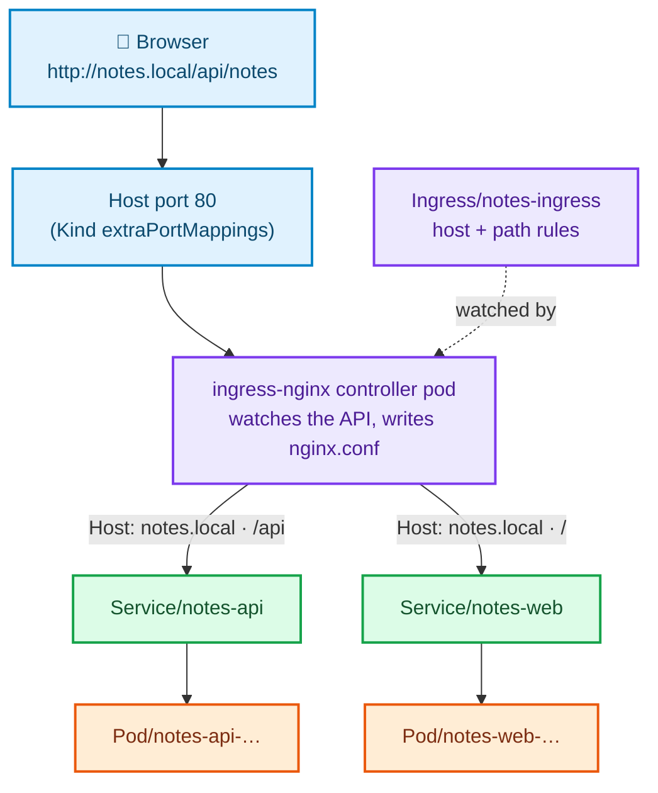
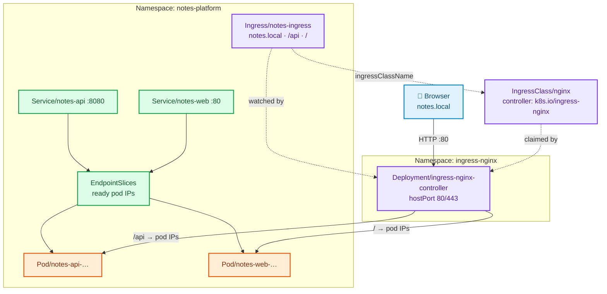

# Stage 09 — Ingress

[⬅ Project 02](../../README.md) · Stage 8 of 11

[00 Namespace](../00-namespace/README.md) › [03 Deployments](../03-deployments/README.md) › [04 Services](../04-services/README.md) › [05 ConfigMaps](../05-configmaps/README.md) › [06 Secrets](../06-secrets/README.md) › [07 Storage](../07-storage/README.md) › [08 StatefulSets](../08-statefulsets/README.md) › **09 Ingress** › [10 LoadBalancer](../10-loadbalancer/README.md) › [11 Probes](../11-health-checks/README.md) › [19 Final](../19-final/README.md)

> **The problem:** the only way into this platform is `kubectl port-forward` — a
> foreground process on one laptop, tunnelling through the API server, that dies
> with the terminal and needs cluster credentials to use. And you have two things
> to serve from one hostname, `/` and `/api`, which a Service cannot do because
> Services route by port, not by URL path.

---

## 1. WHY does this resource exist?

Suppose you refuse to use an Ingress. Your options are:

| Approach | What it costs |
|---|---|
| `port-forward` | A person and a terminal per user. Not a product. |
| `NodePort` per Service | A random high port per Service, on every node, and you tell users `http://10.0.3.14:31274`. No TLS, no names, no paths. |
| `LoadBalancer` per Service | On a cloud, one **billed** load balancer and one public IP per Service. Ten Services, ten load balancers, ten DNS records, ten TLS certificates. |

All three share a deeper problem: they operate at **layer 4**. They see TCP ports
and IPs, not HTTP. So they cannot:

- route `/` and `/api` to different backends
- route `notes.local` and `shop.local` to different backends on the same address
- terminate TLS in one place
- rewrite paths, set headers, redirect, rate limit

An **Ingress** is HTTP routing: hostnames and URL paths mapped to Services. One
entry point, many backends, one place for TLS.

### What happens without it

Every service you add costs another external address and another certificate,
and you can never serve two things from one hostname.

### When do you use one — and when not?

| Use an Ingress | Use something else |
|---|---|
| HTTP/HTTPS traffic from outside the cluster | Non-HTTP protocols — Postgres, Redis, gRPC streaming without HTTP/2 support: `LoadBalancer` (stage 10) |
| Several backends behind one hostname | Internal service-to-service traffic: a ClusterIP Service (stage 04) |
| Somewhere to terminate TLS | Anything needing rich traffic policy — a service mesh or the Gateway API |

---

## 2. WHAT is it?

An Ingress is **a set of HTTP routing rules** — and, critically, **it is only
data**.

> **Analogy:** the directory board in a building lobby. "Accounts → 2nd floor,
> Sales → 3rd." The board does not move anybody. Somebody has to read it and act
> on it.
>
> **Technically:** an Ingress object does nothing on its own. Kubernetes ships
> **no** ingress implementation. A separate program — the **ingress controller**
> — watches Ingress objects and reconfigures a real proxy (nginx, HAProxy, Envoy,
> an AWS ALB) to match.

### The distinction that trips everyone up

| | Ingress **resource** | Ingress **controller** |
|---|---|---|
| What | A YAML object holding rules | A running program (usually a Deployment or DaemonSet in its own namespace) |
| Who creates it | You | The cluster administrator, once |
| Effect on its own | **None** | It is the thing that actually proxies traffic |

> ⚠️ **"My Ingress does nothing" is almost always one of three things:** no
> controller installed, the wrong `ingressClassName`, or a cluster whose network
> never reaches the controller. Create an Ingress on a cluster with no
> controller and you get no error at all — the object is created, `ADDRESS` stays
> empty forever, and nothing tells you why.

### IngressClass — how a rule finds its controller

A cluster can run several controllers at once: nginx for internal apps, an AWS
ALB controller for public ones. **IngressClass** is the link between them:

```
Ingress.spec.ingressClassName: nginx
        ↓ names
IngressClass "nginx" .spec.controller: k8s.io/ingress-nginx
        ↓ matched by
the ingress-nginx controller's own --controller-class flag
```

Every controller ignores Ingresses that are not its class. An IngressClass may
be annotated `ingressclass.kubernetes.io/is-default-class: "true"`, in which case
Ingresses that omit the field are assigned to it. **The ingress-nginx Kind
manifest does not set that annotation**, so on this cluster omitting
`ingressClassName` produces an Ingress nothing ever picks up.

### Path types

| `pathType` | Matches |
|---|---|
| `Prefix` | Path segments: `/api` matches `/api`, `/api/notes`, `/api/x/y` — but **not** `/apifoo` |
| `Exact` | The exact string only |
| `ImplementationSpecific` | Whatever the controller decides. Avoid — it is how manifests stop being portable |

`pathType` is **required**. Omitting it is rejected by the API server.

### Where Ingress stops

Everything beyond basic host/path routing lives in **controller-specific
annotations**: `nginx.ingress.kubernetes.io/rewrite-target`,
`alb.ingress.kubernetes.io/scheme`, and hundreds more. They do not transfer
between controllers. That portability gap is precisely why the **Gateway API**
exists as the long-term successor — richer, role-oriented, and typed instead of
annotation-driven.

---

## 3. HOW does it work?



1. The controller **watches** Ingress, Service and EndpointSlice objects through
   the API server.
2. When anything changes it **regenerates its nginx configuration** and reloads.
   You can read that file — see §8.
3. A request arrives on port 80 of the node. On Kind it got there through the
   `extraPortMappings` in `clusters/kind-ingress.yaml`, which map your laptop's
   port 80 into the node container.
4. nginx matches the **`Host:` header** first, then the longest matching path.
5. It proxies to a backend. **ingress-nginx sends traffic directly to pod IPs
   from the EndpointSlice**, not through the Service's ClusterIP — it does its
   own load balancing. The Service still matters: it is how the controller
   discovers which pods to use, and its `port` is what the rule names.

> **The consequence:** a pod that is not Ready is not in the EndpointSlice, so
> the ingress controller never sends it traffic — the same readiness gate as any
> Service (stage 11). And because the controller bypasses kube-proxy, a Service
> with a wrong `targetPort` can fail here in a way it would not through a plain
> ClusterIP.

### Why Kind needs a special cluster config

The ingress controller has to be reachable from outside. On a cloud, a
`LoadBalancer` Service in front of it does that (stage 10). On Kind there is no
cloud, so the standard manifest uses **`hostPort`** on the controller pod, and
the cluster must map the host's port 80 into the node container:

```yaml
extraPortMappings:
  - containerPort: 80
    hostPort: 80
```

**This cannot be added after the cluster exists** — it is a node-creation
setting. Forgetting it is the most common reason "my Ingress does nothing" on a
laptop, and it is why this project requires
[`clusters/kind-ingress.yaml`](../../../clusters/kind-ingress.yaml).

---

## 4. Manifest

**First, the controller** — cluster software, installed once, not part of the
application:

```bash
kubectl apply -f https://raw.githubusercontent.com/kubernetes/ingress-nginx/controller-v1.15.1/deploy/static/provider/kind/deploy.yaml
kubectl wait --namespace ingress-nginx \
  --for=condition=Ready pod \
  --selector=app.kubernetes.io/component=controller \
  --timeout=180s
```

**Then the rules:**

```yaml
apiVersion: networking.k8s.io/v1
kind: Ingress
metadata:
  name: notes-ingress
  namespace: notes-platform
  annotations:
    nginx.ingress.kubernetes.io/proxy-body-size: "1m"
spec:
  ingressClassName: nginx
  rules:
    - host: notes.local
      http:
        paths:
          - path: /api
            pathType: Prefix
            backend:
              service:
                name: notes-api
                port:
                  number: 8080
          - path: /
            pathType: Prefix
            backend:
              service:
                name: notes-web
                port:
                  number: 80
```

Files: [`01-ingressclass-reference.yaml`](01-ingressclass-reference.yaml)
*(read it, do not apply it — the controller install already created it)* ·
[`02-notes-ingress.yaml`](02-notes-ingress.yaml)

> **What changes for the browser.** Until now the page's `/api` calls went to
> `notes-web`, which proxied them server-side to `notes-api`. With this Ingress
> the browser's `/api` requests are routed **straight to `notes-api`** by the
> controller. Both paths still work — the web tier's proxy is what
> `port-forward` and `validate.sh` still exercise — and having two genuinely
> different backends behind one hostname is the whole reason path routing exists.

---

## 5. Manifest breakdown

| Field | Value | What it does | What breaks if it's wrong |
|---|---|---|---|
| `spec.ingressClassName` | `nginx` | Which controller implements this | Wrong or missing on a cluster with no default class ⇒ **created, no error, no effect** |
| `spec.rules[].host` | `notes.local` | Matches the HTTP `Host:` header | Omit it and the rule matches every hostname — fine for a single app, a collision otherwise |
| `spec.rules[].http.paths[].path` | `/api`, `/` | The URL prefix | `/api` and `/` in the wrong order still works with nginx (longest match), but do not rely on that across controllers |
| `pathType` | `Prefix` | Segment-wise prefix matching | **Required.** Omitting it is rejected |
| `backend.service.name` | `notes-api` | The target Service, **in the same namespace** | A Service in another namespace cannot be referenced — that is deliberate |
| `backend.service.port.number` | `8080` | The **Service** port, not the container port | Wrong port ⇒ 502 from the controller, with the reason in its logs |
| `metadata.annotations` | `nginx.…/proxy-body-size` | Controller-specific behaviour | Silently ignored by a different controller — the portability gap |
| `spec.tls` | *(absent here)* | Names a `kubernetes.io/tls` Secret per host | Without it the site is plain HTTP. Project 10 does TLS properly |

---

## 6. Apply

```bash
# 1. The controller (once per cluster)
kubectl apply -f https://raw.githubusercontent.com/kubernetes/ingress-nginx/controller-v1.15.1/deploy/static/provider/kind/deploy.yaml
kubectl wait --namespace ingress-nginx --for=condition=Ready pod \
  --selector=app.kubernetes.io/component=controller --timeout=180s

# 2. Look at what it installed — do NOT apply the reference file
kubectl get ingressclass
kubectl get pods -n ingress-nginx

# 3. The rules
kubectl apply -f manifests/09-ingress/02-notes-ingress.yaml

# 4. Make the hostname resolve on your machine
echo "127.0.0.1 notes.local" | sudo tee -a /etc/hosts
```

▸ **No sudo?** You do not need DNS at all — the controller matches on the `Host`
header, so `curl -H 'Host: notes.local' http://localhost/` is equivalent, and it
is what `validate.sh` uses.

---

## 7. Validate

```bash
kubectl get ingress -n notes-platform
```

```
NAME            CLASS   HOSTS         ADDRESS     PORTS   AGE
notes-ingress   nginx   notes.local   localhost   80      30s
```

| Column | What to check |
|---|---|
| `CLASS` | `nginx`. `<none>` means no controller will ever pick it up |
| `ADDRESS` | Populated by the controller once it has adopted the Ingress. **Empty after a minute = nothing is watching it** |
| `PORTS` | `80`; `80, 443` once `spec.tls` exists |

```bash
kubectl describe ingress notes-ingress -n notes-platform
```

```
Rules:
  Host         Path  Backends
  ----         ----  --------
  notes.local
               /api   notes-api:8080 (10.244.1.5:8080,10.244.1.6:8080)
               /      notes-web:80   (10.244.1.7:8080,10.244.1.8:8080)
Events:
  Normal  Sync  ingress-nginx-controller  Scheduled for sync
```

▸ **Backends must list pod IPs.** `<error: endpoints "notes-api" not found>`
means the Service name is wrong; an empty list means the Service has no ready
endpoints, and you are back to the stage 04 debugging path.

**Now use it:**

```bash
curl -s http://notes.local/api/notes | head -c 200; echo
curl -s -o /dev/null -w '%{http_code}\n' http://notes.local/

# Or, without touching /etc/hosts:
curl -s -H 'Host: notes.local' http://localhost/api/info
```

▸ Open <http://notes.local> in a browser. No `port-forward`, no cluster
credentials, no terminal held open.

---

## 8. Observe the mechanism

### The controller really does rewrite nginx.conf

```bash
POD=$(kubectl get pod -n ingress-nginx -l app.kubernetes.io/component=controller -o name | head -1)
kubectl exec -n ingress-nginx "$POD" -- cat /etc/nginx/nginx.conf | grep -A12 'server_name notes.local'
```

▸ Real nginx configuration, generated from your YAML. Add a path to the Ingress
and re-run this — the file changes within a second or two.

```bash
kubectl logs -n ingress-nginx "$POD" --tail=20
```

▸ You will see it log the config reload. This is the reconcile loop, visible.

### It talks to pods, not to the ClusterIP

```bash
kubectl describe ingress notes-ingress -n notes-platform | grep -A4 Rules
kubectl get endpointslices -n notes-platform -l kubernetes.io/service-name=notes-api
```

▸ The same pod IPs appear in both. ingress-nginx reads EndpointSlices and load
balances itself; the ClusterIP is never in the path. That is why a readiness
probe (stage 11) gates ingress traffic just as it gates Service traffic.

### The Host header is the routing key

```bash
curl -s -o /dev/null -w 'notes.local     → %{http_code}\n' -H 'Host: notes.local'  http://localhost/
curl -s -o /dev/null -w 'wrong.local     → %{http_code}\n' -H 'Host: wrong.local'  http://localhost/
curl -s -o /dev/null -w 'no host header  → %{http_code}\n'                          http://localhost/
```

```
notes.local     → 200
wrong.local     → 404
no host header  → 404
```

▸ `404` from the **ingress controller** means "no rule matched", which is a
completely different failure from a 404 produced by your application. §9 shows
how to tell them apart.

### Path routing, both branches

```bash
curl -s -H 'Host: notes.local' http://localhost/api/info | python3 -m json.tool | head -3
curl -s -H 'Host: notes.local' http://localhost/whoami
```

▸ `/api/info` is answered by a **notes-api** pod. `/whoami` is answered by a
**notes-web** pod. One hostname, one port, two backends — the thing no Service
can do.

### Watch a rule change take effect live

```bash
kubectl patch ingress notes-ingress -n notes-platform --type=json \
  -p='[{"op":"replace","path":"/spec/rules/0/host","value":"other.local"}]'
sleep 3
curl -s -o /dev/null -w 'notes.local → %{http_code}\n' -H 'Host: notes.local' http://localhost/
curl -s -o /dev/null -w 'other.local → %{http_code}\n' -H 'Host: other.local' http://localhost/
kubectl apply -f manifests/09-ingress/02-notes-ingress.yaml
```

▸ Seconds, no restart, no downtime for the other rules. Nothing was redeployed —
a controller noticed an object change and reloaded a proxy.

---

## 9. Break it

### Break 1 — the wrong ingressClassName (the silent one)

```bash
kubectl patch ingress notes-ingress -n notes-platform \
  -p '{"spec":{"ingressClassName":"traefik"}}'
kubectl get ingress -n notes-platform
```

**Symptom:**

```
NAME            CLASS     HOSTS         ADDRESS   PORTS   AGE
notes-ingress   traefik   notes.local             80      5m
```

▸ `ADDRESS` is now **empty**, and `curl http://notes.local/` returns
`404 Not Found` from nginx — which no longer has any rule for that host.

**Investigate:**

```bash
kubectl get ingressclass
kubectl describe ingress notes-ingress -n notes-platform | tail -5
```

▸ **No events at all.** Nothing claimed it. There is no error to find, because
nothing considers this object its business.

**Root cause:** each controller only processes its own class. `traefik` is not
installed, so nobody is watching.

**Fix:**

```bash
kubectl apply -f manifests/09-ingress/02-notes-ingress.yaml
```

**What you learned:** an empty `ADDRESS` and no events means *no controller
adopted this Ingress*. Check `kubectl get ingressclass` first, every time.

### Break 2 — 404 vs 502 vs 503, and what each tells you

```bash
# 404 — no rule matched this Host/path
curl -s -o /dev/null -w '%{http_code}\n' -H 'Host: nope.local' http://localhost/

# 503 — the rule matched, but the backend has no ready endpoints
kubectl scale deployment/notes-api --replicas=0 -n notes-platform
sleep 5
curl -s -o /dev/null -w '%{http_code}\n' -H 'Host: notes.local' http://localhost/api/notes
kubectl scale deployment/notes-api --replicas=2 -n notes-platform

# 502 — endpoints exist, but connecting to them failed
kubectl patch service notes-api -n notes-platform \
  -p '{"spec":{"ports":[{"name":"http","port":8080,"targetPort":9999}]}}'
sleep 3
curl -s -o /dev/null -w '%{http_code}\n' -H 'Host: notes.local' http://localhost/api/notes
kubectl apply -f manifests/04-services/notes-api-service.yaml
```

| Code | Meaning | Look at |
|---|---|---|
| **404** | No rule matched the Host and path | The Ingress rules, and the Host header you actually sent |
| **503** | Rule matched; **no ready endpoints** | `kubectl get endpointslices`, pod readiness |
| **502** | Endpoints exist; the connection or response failed | `targetPort`, the app's logs, whether it listens on `0.0.0.0` |

**Memorise that table.** It converts an ingress problem into a one-command
diagnosis, and it is a standard interview question.

### Break 3 — a Service in another namespace

```bash
kubectl patch ingress notes-ingress -n notes-platform --type=json \
  -p='[{"op":"replace","path":"/spec/rules/0/http/paths/1/backend/service/name","value":"kubernetes"}]'
curl -s -o /dev/null -w '%{http_code}\n' -H 'Host: notes.local' http://localhost/
kubectl describe ingress notes-ingress -n notes-platform | grep -i default
```

**Symptom:** 503, and `describe` shows the backend has no endpoints it can use.

**Root cause:** an Ingress may only reference Services **in its own namespace**.
There is no cross-namespace field, on purpose: it would let anyone with write
access in one namespace expose another namespace's Services to the internet.

**Fix:**

```bash
kubectl apply -f manifests/09-ingress/02-notes-ingress.yaml
```

**What you learned:** the namespace boundary is real for Ingress. Cross-namespace
routing is a Gateway API feature (`ReferenceGrant`), and it requires the target
namespace to consent.

### Break 4 — no controller at all

```bash
kubectl scale deployment ingress-nginx-controller -n ingress-nginx --replicas=0
sleep 10
curl -sS -m 5 -H 'Host: notes.local' http://localhost/ ; echo "exit=$?"
kubectl get ingress -n notes-platform
```

**Symptom:** `Failed to connect to localhost port 80: Connection refused`. The
Ingress object still exists and still *looks* configured.

**Root cause:** the Ingress was always just data. The program that read it is
gone.

**Fix:**

```bash
kubectl scale deployment ingress-nginx-controller -n ingress-nginx --replicas=1
kubectl wait --namespace ingress-nginx --for=condition=Ready pod \
  --selector=app.kubernetes.io/component=controller --timeout=180s
```

**What you learned:** *"the Ingress exists"* and *"the routing works"* are
unrelated statements. This is the difference between the resource and the
controller, felt rather than read.

---

## 10. How it interacts



Note the **dotted** arrows: they are all "reads" and "claims", not traffic. The
only solid line into the cluster is the browser hitting the controller.

---

## 11. Production notes

> 🧪 **DEMO / LEARNING CONFIGURATION**
> Plain HTTP, a fake hostname in `/etc/hosts`, one controller replica reachable
> through a `hostPort`, no rate limiting, no WAF, no authentication.

> 🏭 **PRODUCTION CONSIDERATIONS**
> - **TLS is not optional.** Add `spec.tls` with a `kubernetes.io/tls` Secret, and
>   let **cert-manager** issue and renew certificates automatically. Redirect
>   HTTP to HTTPS (`nginx.ingress.kubernetes.io/ssl-redirect`, on by default once
>   TLS exists).
> - **Run the controller behind a real `LoadBalancer` Service**, not a `hostPort`
>   (stage 10). Multiple replicas, spread across nodes and zones, with a PDB.
> - **Real DNS**, not `/etc/hosts` — an A/CNAME record pointing at the load
>   balancer, managed by external-dns if you want it automated.
> - Set timeouts, body-size limits and rate limits deliberately. The nginx
>   defaults (60s proxy timeouts, 1m body) are guesses about your application.
> - **Separate internal and external controllers** by IngressClass, so an
>   internal admin UI cannot be published by a copy-pasted annotation.
> - Watch the controller's own metrics — it is the single busiest component in
>   your request path, and a saturated ingress looks exactly like a slow
>   application (Project 08).
> - Consider the **Gateway API** for new clusters: roles are separated
>   (infrastructure vs application), routing is typed instead of annotation-based,
>   and cross-namespace routing is explicit and consented.
> - Do **not** expose an admin or metrics path through the same Ingress as the
>   public app without authentication in front of it.

---

## 12. The next problem

Traffic reaches the platform from a browser now. But look at *how* it arrives on
this cluster, and answer the interview question hiding in it:

```bash
kubectl get svc -n ingress-nginx
```

The controller's own Service is `type: LoadBalancer`, and on Kind its
`EXTERNAL-IP` is `<pending>` — forever. Traffic is only reaching it because the
Kind manifest also puts a `hostPort` on the controller pod and your cluster
config mapped the host's port 80 into the node container.

So: **how does traffic get to the ingress controller on a real cluster?** What
does `type: LoadBalancer` actually do, why is it `<pending>` here, and what would
you do for a service that is not HTTP at all — like exposing PostgreSQL to a
migration tool outside the cluster?

Those are Service types, and they sit underneath everything this stage built.

→ **[Stage 10 — LoadBalancer](../10-loadbalancer/README.md)**

---

## 📚 Official documentation

Everything above is self-contained — these are for going deeper, not for filling gaps.
*(All links verified 2026-08-28.)*

| Reference | What it adds |
|---|---|
| [Ingress](https://kubernetes.io/docs/concepts/services-networking/ingress/) | Rules, path types, TLS, default backends |
| [Ingress controllers](https://kubernetes.io/docs/concepts/services-networking/ingress-controllers/) | The list of implementations, and the explicit statement that you must install one |
| [IngressClass](https://kubernetes.io/docs/concepts/services-networking/ingress/#ingress-class) | How a rule is bound to a controller, and the default-class annotation |
| [ingress-nginx documentation](https://kubernetes.github.io/ingress-nginx/) | Every annotation this controller understands |
| [ingress-nginx path matching](https://kubernetes.github.io/ingress-nginx/user-guide/ingress-path-matching/) | Exactly how `Prefix` and rewrites behave in nginx |
| [Ingress on Kind](https://kind.sigs.k8s.io/docs/user/ingress/) | Why `extraPortMappings` and `ingress-ready` are needed on a laptop |

---

| ◀ Previous | ▲ Up | Next ▶ |
|---|:--:|---:|
| ◀ **[08 StatefulSets](../08-statefulsets/README.md)** | [Project 02](../../README.md) · [Manual steps](../../scripts/manual-steps.md) | **[10 LoadBalancer](../10-loadbalancer/README.md)** ▶ |
