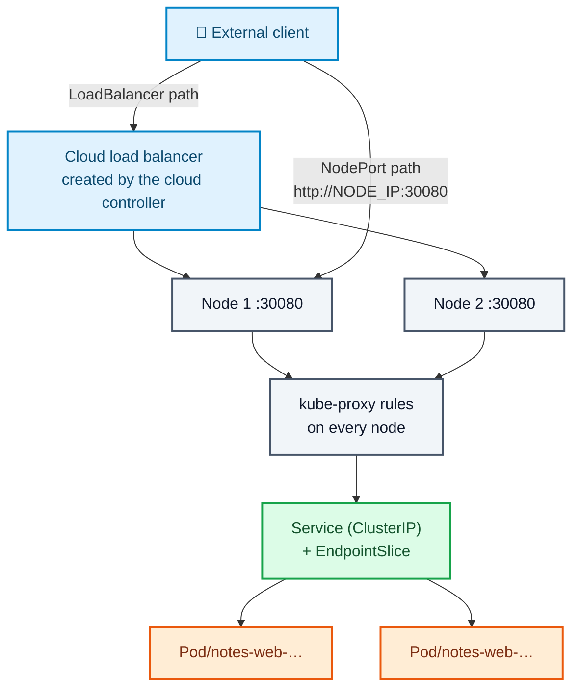
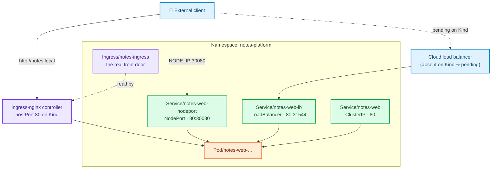

# Stage 10 — LoadBalancer and NodePort

[⬅ Project 02](../../README.md) · Stage 9 of 11

[00 Namespace](../00-namespace/README.md) › [03 Deployments](../03-deployments/README.md) › [04 Services](../04-services/README.md) › [05 ConfigMaps](../05-configmaps/README.md) › [06 Secrets](../06-secrets/README.md) › [07 Storage](../07-storage/README.md) › [08 StatefulSets](../08-statefulsets/README.md) › [09 Ingress](../09-ingress/README.md) › **10 LoadBalancer** › [11 Probes](../11-health-checks/README.md) › [19 Final](../19-final/README.md)

> **The problem:** the Ingress works, and you cannot explain *why*. Look at the
> controller's own Service — it is `type: LoadBalancer` with `EXTERNAL-IP:
> <pending>`, permanently. Traffic only arrives because the Kind manifest also
> puts a `hostPort` on the controller pod. So how does traffic reach an ingress
> controller on a real cluster? And what do you do for something that is not
> HTTP at all — exposing PostgreSQL to a migration tool outside the cluster,
> say — where an Ingress cannot help?

---

## 1. WHY does this resource exist?

A ClusterIP is unreachable from outside the cluster **by design**: it is a
virtual IP that only exists as packet-rewriting rules on cluster nodes. Nothing
routes to it from your laptop or the internet.

So Kubernetes needs a way to say "let outside traffic in", and it has to work on
a laptop, in a data centre, and on three clouds that all do external networking
differently. The answer is a ladder, where each rung **includes** the one below:

```
ClusterIP        internal virtual IP
   └── NodePort      + a fixed port on EVERY node
          └── LoadBalancer  + an external address from the platform
```

| Type | You get | The problem it leaves |
|---|---|---|
| `ClusterIP` | Internal name and VIP | Nothing outside can reach it |
| `NodePort` | A port (30000–32767) on **every** node | Ugly URLs, a port per Service, you must know node IPs, and nodes come and go |
| `LoadBalancer` | A stable external IP/hostname from the cloud | **One billed load balancer per Service** |

And that last cost is exactly why the Ingress from stage 09 exists: **one**
LoadBalancer Service in front of an ingress controller, then unlimited HTTP
routing behind it, for free.

### What happens without them

Nothing external can reach anything. `port-forward` is not an answer for users —
it needs cluster credentials and a terminal.

### When do you use which?

| Use | For |
|---|---|
| `ClusterIP` | Everything internal. The default, and the right default. |
| `NodePort` | Bare metal without a load balancer, quick lab access, or as the target of an external load balancer you manage yourself |
| `LoadBalancer` | Exactly two things in practice: the **ingress controller**, and **non-HTTP** services that must be reachable externally |
| `Ingress` (stage 09) | All HTTP traffic, behind that one LoadBalancer |

---

## 2. WHAT is it?

### NodePort

A Service that, in addition to its ClusterIP, makes **every node in the cluster**
listen on the same high port and forward to the Service.

> **Analogy:** a doorbell fitted to every door of a large building, all wired to
> the same flat. Ring any of them and you reach the same place.
>
> **Technically:** kube-proxy adds a rule for `*:30080` on each node. It works
> even on nodes running none of the pods — the packet is forwarded across the
> cluster network to a node that has one.

| Property | Detail |
|---|---|
| Port range | 30000–32767 by default (`--service-node-port-range`) |
| Allocation | Random unless you pin `nodePort`, and a pinned port can collide |
| Source IP | Lost by default (SNAT). `externalTrafficPolicy: Local` preserves it but only routes to pods on the node that received the packet |

### LoadBalancer

A Service that asks the **platform** for an external address.

> **Analogy:** ordering a phone line. You fill in a form; the phone company
> installs it. If nobody is there to receive the order, your form sits in the
> tray forever — which is exactly what `<pending>` means.
>
> **Technically:** `type: LoadBalancer` allocates a ClusterIP and a NodePort,
> then sets `.status.loadBalancer` **empty** and waits for a **cloud controller
> manager** to notice, provision a real load balancer pointing at the node ports,
> and write the address back into `.status`.

**Kubernetes itself creates nothing.** No cloud controller, no address, forever.
That is not a broken cluster; it is an unanswered request.

| Environment | Result |
|---|---|
| Kind (bare) | `<pending>` forever |
| Kind + `cloud-provider-kind` / MetalLB | A real, routable IP |
| EKS | A Network Load Balancer, billed hourly |
| GKE / AKS | A cloud load balancer, billed hourly |

### The two annotations that change everything

`type: LoadBalancer` says nothing about *what kind* of load balancer. Internal or
internet-facing? NLB or classic? Which subnets? All of that lives in
**cloud-specific annotations** on the Service — which is why an identical
manifest is safe on one cloud and publishes a database on another. Project 10
does this against real AWS.

---

## 3. HOW does it work?



**NodePort, packet by packet:**

1. You create the Service. The API server allocates (or accepts) a node port.
2. **Every** kube-proxy sees it and adds a rule for that port on its node.
3. A packet to `NODE_IP:30080` is DNAT'd to a ready pod IP from the
   EndpointSlice — possibly on a **different node**, in which case it crosses the
   pod network.
4. The reply is un-NAT'd on the way back.

**LoadBalancer, on a cloud:**

1. Everything NodePort does, plus:
2. The **cloud controller manager** sees a Service of this type and calls the
   provider's API to create a load balancer whose targets are all nodes on that
   node port.
3. It writes the resulting IP or hostname into `.status.loadBalancer.ingress`,
   and `EXTERNAL-IP` stops saying `<pending>`.
4. Provider health checks decide which nodes receive traffic.

**On Kind, step 2 never happens** — there is no cloud controller. This is worth
proving to yourself rather than believing, because "EXTERNAL-IP is pending" is a
question you will be asked in an interview, and the correct answer is *"which
component is supposed to fill that in, and is it running?"*

### So how does the ingress controller receive traffic here?

```bash
kubectl get svc -n ingress-nginx
kubectl get pod -n ingress-nginx -l app.kubernetes.io/component=controller \
  -o jsonpath='{.items[0].spec.containers[0].ports}' | python3 -m json.tool
```

Its Service is `LoadBalancer` and `<pending>`, and the controller pod
additionally declares `hostPort: 80` and `hostPort: 443` — binding directly to
the node's network namespace. Combined with the `extraPortMappings` in
`clusters/kind-ingress.yaml`, that is the entire path from your browser to the
controller.

`hostPort` is a **development shortcut**, not a pattern to copy: it bypasses
Services entirely, allows only one pod per port per node, and is forbidden by
`restricted` Pod Security Standards (Project 07).

---

## 4. Manifest

```yaml
# NodePort — a fixed port on every node
apiVersion: v1
kind: Service
metadata:
  name: notes-web-nodeport
spec:
  type: NodePort
  selector: { … }
  ports:
    - name: http
      port: 80
      targetPort: http
      nodePort: 30080        # pinned for the lesson; omit it in production
```

```yaml
# LoadBalancer — <pending> on Kind, a real NLB on EKS
apiVersion: v1
kind: Service
metadata:
  name: notes-web-lb
spec:
  type: LoadBalancer
  selector: { … }
  ports:
    - name: http
      port: 80
      targetPort: http
```

Files: [`01-notes-web-nodeport.yaml`](01-notes-web-nodeport.yaml) ·
[`02-notes-web-loadbalancer.yaml`](02-notes-web-loadbalancer.yaml)

> 🧪 **Both are teaching exhibits.** The Ingress is the real front door for this
> platform. These exist so you can see what sits underneath it, and they are
> deliberately excluded from `19-final/`.

---

## 5. Manifest breakdown

| Field | Value | What it does | What breaks if it's wrong |
|---|---|---|---|
| `spec.type` | `NodePort` / `LoadBalancer` | Which rung of the ladder | `LoadBalancer` on a database in a cloud = your data on the internet |
| `spec.ports[].nodePort` | `30080` | Pins the node port | Outside 30000–32767 ⇒ rejected. Already taken ⇒ the Service fails to create |
| *(omit `nodePort`)* | — | The API server allocates one | Nothing breaks — this is the production default |
| `spec.ports[].port` | `80` | The Service port, and the **load balancer's** port | — |
| `spec.ports[].targetPort` | `http` | The container port | Wrong ⇒ endpoints exist and connections are refused |
| `spec.externalTrafficPolicy` | *(default `Cluster`)* | `Cluster` SNATs and spreads across all nodes; `Local` preserves the client IP but only serves from local pods | `Local` with no pod on a node ⇒ that node's health check fails, which is intended but surprises people |
| `spec.loadBalancerSourceRanges` | *(unset)* | CIDRs allowed to reach the load balancer | Unset ⇒ open to the world on a cloud |
| `metadata.annotations` | *(none here)* | Cloud-specific: scheme, subnets, TLS, LB type | Missing `service.beta.kubernetes.io/aws-load-balancer-internal` ⇒ an internal service published publicly |

---

## 6. Apply

```bash
kubectl apply -f manifests/10-loadbalancer/01-notes-web-nodeport.yaml
kubectl apply -f manifests/10-loadbalancer/02-notes-web-loadbalancer.yaml
kubectl get svc -n notes-platform
```

---

## 7. Validate

```bash
kubectl get svc -n notes-platform
```

```
NAME                 TYPE           CLUSTER-IP      EXTERNAL-IP   PORT(S)        AGE
notes-api            ClusterIP      10.96.14.7      <none>        8080/TCP       40m
notes-web            ClusterIP      10.96.201.44    <none>        80/TCP         40m
notes-web-lb         LoadBalancer   10.96.88.12     <pending>     80:31544/TCP   20s
notes-web-nodeport   NodePort       10.96.140.9     <none>        80:30080/TCP   25s
postgres             ClusterIP      10.96.51.20     <none>        5432/TCP       40m
postgres-headless    ClusterIP      None            <none>        5432/TCP       25m
```

Read that table carefully — it contains four lessons:

| Row | What it tells you |
|---|---|
| `notes-web-lb` `<pending>` | **Correct on Kind.** No cloud controller answered the request |
| `notes-web-lb` `80:31544/TCP` | It got a node port anyway — LoadBalancer *includes* NodePort |
| `notes-web-nodeport` `80:30080/TCP` | Service port 80, node port 30080 |
| `postgres-headless` `CLUSTER-IP: None` | Headless — no virtual IP at all (stage 08) |

**Use the NodePort.** On Kind the node is a container, so reach it by its
container IP:

```bash
NODE_IP=$(kubectl get nodes -o jsonpath='{.items[0].status.addresses[?(@.type=="InternalIP")].address}')
echo "node: ${NODE_IP}"
docker exec kubernetes-lab-control-plane curl -s -o /dev/null -w '%{http_code}\n' "http://${NODE_IP}:30080/"
```

▸ `200`. From your laptop this is usually unreachable, because the Kind node's
network is inside Docker and only ports listed in `extraPortMappings` are
published. **On a real cluster you would simply browse to `http://NODE_IP:30080`
— and immediately notice you had to know a node's IP address**, which is the
whole argument against NodePort as a user-facing mechanism.

**Prove every node listens**, not just the one running a pod:

```bash
for node in kubernetes-lab-control-plane kubernetes-lab-worker; do
  ip=$(kubectl get node "$node" -o jsonpath='{.status.addresses[?(@.type=="InternalIP")].address}')
  echo -n "$node ($ip): "
  docker exec kubernetes-lab-control-plane curl -s -o /dev/null -w '%{http_code}\n' "http://${ip}:30080/"
done
```

▸ Both answer `200`, even though `notes-web` pods are not on both. kube-proxy
forwarded across the pod network. **That is the NodePort guarantee: any node,
same port, same result.**

---

## 8. Observe the mechanism

### `<pending>` is a missing component, not a bug

```bash
kubectl describe svc notes-web-lb -n notes-platform | tail -6
kubectl get pods -A | grep -i cloud
```

▸ No events about provisioning, and no cloud-controller-manager pod anywhere.
There is no error because nothing failed — nobody was listening.

> **The interview answer:** *"`type: LoadBalancer` is a request to the cloud
> controller manager. `<pending>` means no cloud provider integration is running,
> which is the normal state on Kind, Minikube or bare metal. Install
> `cloud-provider-kind` or MetalLB locally; on EKS/GKE/AKS the provider's
> controller is already there and provisions a real load balancer."*
> — [Kind: LoadBalancer](https://kind.sigs.k8s.io/docs/user/loadbalancer/)

### Optional — make it real

```bash
# In a SEPARATE terminal, left running (needs Docker access):
#   go install sigs.k8s.io/cloud-provider-kind@latest && cloud-provider-kind
kubectl get svc notes-web-lb -n notes-platform -w
```

▸ Within a few seconds `EXTERNAL-IP` changes from `<pending>` to a routable
address, and `curl http://<that-ip>/` works. **You changed no YAML.** The
manifest was always correct; the platform was missing. That is the single most
useful thing to understand about `LoadBalancer`.

### The rules kube-proxy wrote for the node port

```bash
docker exec kubernetes-lab-worker iptables-save -t nat | grep -E '30080|notes-web-nodeport' | head
```

▸ A `KUBE-NODEPORTS` rule for `dpt:30080`, and DNAT rules to pod IPs. On IPVS
clusters you would look at `ipvsadm -Ln` instead.

### The ladder is real: LoadBalancer contains NodePort contains ClusterIP

```bash
kubectl get svc notes-web-lb -n notes-platform \
  -o jsonpath='{.spec.type}{"  clusterIP="}{.spec.clusterIP}{"  nodePort="}{.spec.ports[0].nodePort}{"\n"}'
```

```
LoadBalancer  clusterIP=10.96.88.12  nodePort=31544
```

▸ One object, three access paths. That is why "switching a Service to
LoadBalancer" never breaks internal clients — the ClusterIP does not change.

### Why an Ingress is cheaper than LoadBalancers

```bash
kubectl get ingress -n notes-platform
kubectl get svc -n ingress-nginx
```

▸ **Two** backends (`notes-web`, `notes-api`) reachable from outside, through
**one** entry point. Give each its own LoadBalancer Service on EKS and you are
paying for two NLBs, managing two DNS records and two certificates — to serve one
website.

---

## 9. Break it

### Break 1 — a node port collision

```bash
cat <<'EOF' | kubectl apply -f -
apiVersion: v1
kind: Service
metadata:
  name: collision-demo
  namespace: notes-platform
spec:
  type: NodePort
  selector:
    app.kubernetes.io/name: notes-web
  ports:
    - name: http
      port: 80
      targetPort: http
      nodePort: 30080
EOF
```

**Symptom:**

```
The Service "collision-demo" is invalid: spec.ports[0].nodePort: Invalid value: 30080:
provided port is already allocated
```

**Root cause:** node ports are a **cluster-wide** allocation. Pinning them means
coordinating them across every team using the cluster.

**Fix:** omit `nodePort` and let the API server allocate. Pin only when an
external firewall rule already names the port.

### Break 2 — out of range

```bash
kubectl patch svc notes-web-nodeport -n notes-platform \
  -p '{"spec":{"ports":[{"name":"http","port":80,"targetPort":"http","nodePort":8080}]}}'
```

**Symptom:**

```
provided port is not in the valid range. The range of valid ports is 30000-32767
```

**Root cause:** the range is an API-server flag, chosen to avoid colliding with
anything a node might already be running. You cannot serve users on port 80 with
a NodePort — another reason it is not a front door.

**Fix:**

```bash
kubectl apply -f manifests/10-loadbalancer/01-notes-web-nodeport.yaml
```

### Break 3 — `externalTrafficPolicy: Local` with no local pod

```bash
kubectl patch svc notes-web-nodeport -n notes-platform \
  -p '{"spec":{"externalTrafficPolicy":"Local"}}'
kubectl scale deployment/notes-web --replicas=1 -n notes-platform
sleep 5

for node in kubernetes-lab-control-plane kubernetes-lab-worker; do
  ip=$(kubectl get node "$node" -o jsonpath='{.status.addresses[?(@.type=="InternalIP")].address}')
  echo -n "$node: "
  docker exec kubernetes-lab-control-plane curl -s -m 3 -o /dev/null -w '%{http_code}\n' "http://${ip}:30080/" || echo "no answer"
done
```

**Symptom:** the node running the pod answers; the other one does not.

**Root cause:** `Local` refuses to forward to another node, precisely so the
client's source IP is preserved. A cloud load balancer's health checks notice
and stop sending traffic to pod-less nodes — which is the intended design, and a
mystery if you did not know the setting was there.

**Fix:**

```bash
kubectl apply -f manifests/10-loadbalancer/01-notes-web-nodeport.yaml
kubectl scale deployment/notes-web --replicas=2 -n notes-platform
```

**What you learned:** you trade **client IP visibility** against **even
distribution**. Pick deliberately: if you log or rate-limit by client IP, you
need `Local` plus enough spread that every node has a pod.

### Break 4 — the mistake that matters

```bash
# DO NOT DO THIS ON A CLOUD CLUSTER.
kubectl patch svc postgres -n notes-platform -p '{"spec":{"type":"LoadBalancer"}}'
kubectl get svc postgres -n notes-platform
```

**Symptom on Kind:** `<pending>`, harmless.

**Symptom on EKS:** an internet-facing NLB in front of your database within
sixty seconds, listening on 5432, with no network policy, no TLS requirement, and
a password committed to Git.

**Root cause:** one word in a manifest, no confirmation, no warning.

**Fix:**

```bash
kubectl apply -f manifests/04-services/postgres-service.yaml
```

**What you learned:** the same YAML has wildly different consequences per
platform. Databases stay `ClusterIP`; if something outside genuinely needs
access, it goes through a bastion, a VPN, or a private-only load balancer with
`loadBalancerSourceRanges` — and it is reviewed by a human.

---

## 10. How it interacts



Four ways into the same pods. In production you keep the last one and delete the
first two.

---

## 11. Production notes

> 🧪 **DEMO / LEARNING CONFIGURATION**
> A pinned node port, a LoadBalancer that will never be fulfilled, no source
> ranges, no TLS, and an ingress controller reachable through a `hostPort`.

> 🏭 **PRODUCTION CONSIDERATIONS**
> - **Exactly one LoadBalancer**, in front of the ingress controller. Everything
>   HTTP goes behind it as an Ingress. Additional LoadBalancers only for
>   protocols an Ingress cannot carry.
> - **Never pin `nodePort`** unless an external firewall rule requires it —
>   cluster-wide allocation makes collisions somebody else's outage.
> - **`loadBalancerSourceRanges`**, or the cloud's equivalent security group, on
>   anything not meant for the whole internet.
> - Choose `externalTrafficPolicy` deliberately: `Local` for real client IPs
>   (needed for rate limiting and audit), `Cluster` for even spread.
> - Cloud annotations are load-bearing: internal vs internet-facing scheme,
>   NLB vs ALB, subnets, idle timeout, TLS policy, access logs. Review them the
>   way you review firewall rules (Project 10).
> - Every LoadBalancer costs money **and** an IP address, and a forgotten one
>   keeps costing after the cluster is gone. Orphaned load balancers are the
>   classic surprise on a cloud bill — Project 10 ships a teardown checklist for
>   exactly this.
> - Locally, prefer `cloud-provider-kind` or MetalLB over `hostPort` if you want
>   a realistic path; `hostPort` is banned by `restricted` Pod Security Standards
>   anyway (Project 07).

---

## 12. The next problem

The platform is complete and reachable. Now watch it during a deploy:

```bash
kubectl rollout restart deployment/notes-api -n notes-platform
# and immediately, in another terminal:
while true; do curl -s -o /dev/null -w '%{http_code} ' -H 'Host: notes.local' http://localhost/api/notes; sleep 0.3; done
```

You will see 502s and 503s scattered through the restart. And on a cold cluster
it is worse — start everything at once and `notes-api` pods come up before
PostgreSQL is accepting connections, spend their first minute logging failures,
and are put into service anyway.

The cause is the same in both cases: **Kubernetes believes a pod can serve
traffic the moment its container is Running.** Running means the process started.
It says nothing about whether the app has finished booting, whether it can reach
its database, or whether it is about to shut down.

Nothing in this project has told Kubernetes how to ask *"are you ready?"*, and
nothing has told it that the API must not start until the database is up.

→ **[Stage 11 — Probes](../11-health-checks/README.md)**

---

## 📚 Official documentation

Everything above is self-contained — these are for going deeper, not for filling gaps.
*(All links verified 2026-08-28.)*

| Reference | What it adds |
|---|---|
| [Service — type NodePort](https://kubernetes.io/docs/concepts/services-networking/service/#type-nodeport) | Port ranges, allocation, `externalTrafficPolicy` |
| [Service — type LoadBalancer](https://kubernetes.io/docs/concepts/services-networking/service/#loadbalancer) | What the cloud controller does, and the annotation surface |
| [Virtual IPs and Service proxies](https://kubernetes.io/docs/reference/networking/virtual-ips/) | The iptables and IPVS rules behind all of this |
| [Kind: LoadBalancer](https://kind.sigs.k8s.io/docs/user/loadbalancer/) | The official explanation of `<pending>` on Kind, and how to fix it locally |
| [cloud-provider-kind](https://github.com/kubernetes-sigs/cloud-provider-kind) | The component that makes `LoadBalancer` real on a laptop |

---

| ◀ Previous | ▲ Up | Next ▶ |
|---|:--:|---:|
| ◀ **[09 Ingress](../09-ingress/README.md)** | [Project 02](../../README.md) · [Manual steps](../../scripts/manual-steps.md) | **[11 Probes](../11-health-checks/README.md)** ▶ |
