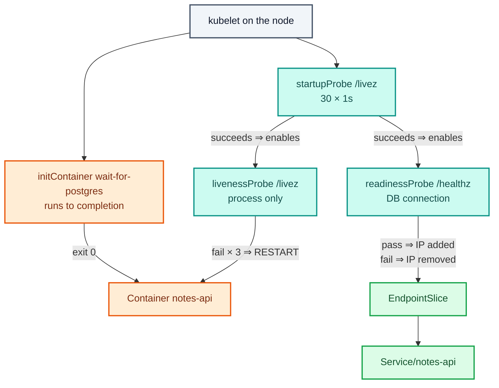
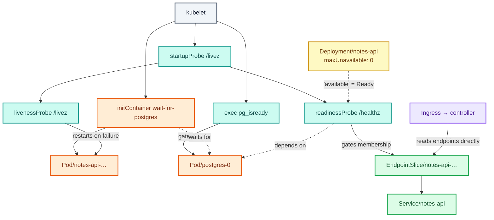

# Stage 11 — Probes and Init Containers

[⬅ Project 02](../../README.md) · Stage 10 of 11

[00 Namespace](../00-namespace/README.md) › [03 Deployments](../03-deployments/README.md) › [04 Services](../04-services/README.md) › [05 ConfigMaps](../05-configmaps/README.md) › [06 Secrets](../06-secrets/README.md) › [07 Storage](../07-storage/README.md) › [08 StatefulSets](../08-statefulsets/README.md) › [09 Ingress](../09-ingress/README.md) › [10 LoadBalancer](../10-loadbalancer/README.md) › **11 Probes** › [19 Final](../19-final/README.md)

> **The problem:** during a rollout, users get 502s. On a cold cluster, the API
> pods start before PostgreSQL is accepting connections, log failures for a
> minute, and are put into service anyway. Kubernetes believes a pod can serve
> traffic the moment its container is `Running` — which only means the process
> started.

---

## 1. WHY do these exist?

`Running` is a statement about a **process**, not about an **application**. The
gap between them is where outages live:

| The pod is Running, but… | What the user sees |
|---|---|
| The app is still loading configuration or warming a cache | 502 for the first few seconds after every deploy |
| The database is unreachable | Every request fails, and the pod is still in the load balancer |
| The app has deadlocked but the process is alive | Requests hang forever; nothing restarts it |
| The pod is shutting down | Requests routed to a process that is closing its sockets |

Kubernetes cannot know any of this. Only the application does. So the kubelet
asks — and **probes are the question**.

Three questions, three probes, three completely different consequences:

| Probe | Question | On failure |
|---|---|---|
| **startup** | "Have you finished booting?" | Keep waiting; **suspend** the other two |
| **readiness** | "Should I send you traffic *now*?" | **Remove from EndpointSlices.** Not restarted |
| **liveness** | "Are you still working at all?" | **Restart the container** |

And a fourth mechanism for a different problem: **init containers** run to
completion *before* the app container starts, which is how you express "do not
start until the database exists".

### What happens without them

- No readiness ⇒ `maxUnavailable: 0` is meaningless, because a pod counts as
  available the instant it is Running. Every rollout drops requests.
- No liveness ⇒ a wedged process stays in service forever.
- No startup probe ⇒ a slow starter is killed by its own liveness probe, over and
  over: `CrashLoopBackOff` on an application that would have worked.
- No init container ⇒ dependency-ordering failures at every cold start.

### When do you use which?

| Use | For |
|---|---|
| **readiness** | Every long-running container, without exception |
| **liveness** | Processes that can wedge — and only checking *themselves* |
| **startup** | Anything with a slow or variable boot: databases, JVMs, migrations |
| **init container** | Ordering, one-off setup, fetching a file, waiting for a dependency |

---

## 2. WHAT are they?

### The probes

A probe is **a periodic check the kubelet runs against a container**, in one of
four ways:

| Type | How | Used here |
|---|---|---|
| `httpGet` | HTTP GET; 200–399 is success | `notes-api`, `notes-web` |
| `exec` | Run a command in the container; exit 0 is success | `postgres` (`pg_isready`) |
| `tcpSocket` | Open a TCP connection | — |
| `grpc` | The gRPC health-checking protocol | — |

> **`exec` is the most expensive.** It forks a process every period. Do not run
> one every second against a busy database.

**The distinction that causes outages:**

> **Readiness controls traffic. Liveness controls life.**
>
> A failing readiness probe is a pod politely saying "not me, not right now" —
> and it can recover. A failing liveness probe is a death sentence. Point liveness
> at a dependency check and a five-second database blip becomes a cluster-wide
> restart storm that outlives the blip.

That is exactly why this application exposes **two** endpoints:

| Endpoint | Checks | Used by |
|---|---|---|
| `/livez` | Only that this process is answering. **Never touches the database** | liveness, startup |
| `/healthz` | Opens a real database connection | readiness |

### The timing fields

| Field | Default | Meaning |
|---|---|---|
| `initialDelaySeconds` | 0 | Wait before the first check. A **startup probe is the better tool** — a fixed delay is a guess |
| `periodSeconds` | 10 | How often |
| `timeoutSeconds` | 1 | How long to wait for an answer. **The default is aggressive** — one slow response counts as a failure |
| `failureThreshold` | 3 | Consecutive failures before acting |
| `successThreshold` | 1 | Consecutive successes to recover. Must be 1 for liveness and startup |

**Time to act = `failureThreshold` × `periodSeconds`.** Write it out for every
probe you configure; that number is what a user experiences.

### Init containers

Containers that run **to completion, in order, before any app container starts**.
They share the pod's volumes and network, and they can carry tools the app image
should not.

| Property | Consequence |
|---|---|
| Run to completion | The app container starts only after every one succeeds |
| Run in order | Sequential dependencies are expressible |
| Failure is retried per the pod's `restartPolicy` | A pod stuck in `Init:0/1` means the app never started — a different problem from `CrashLoopBackOff` |
| Own image and resources | Put `psql`, `curl` or migration tooling here, not in the app image |

This project uses one, `wait-for-postgres`, running `pg_isready` in a loop until
the database answers.

> **Init container or startup probe?** An init container answers "is my
> **dependency** ready?"; a startup probe answers "am **I** ready?". They compose:
> here, the init container waits for PostgreSQL, then the startup probe gives the
> API up to 30 seconds to boot.

---

## 3. HOW does it work?



**The lifecycle of one API pod:**

1. The pod is scheduled. The kubelet pulls images and starts
   `wait-for-postgres`. The pod status reads `Init:0/1`.
2. `pg_isready` fails while PostgreSQL boots, and the loop retries. **Nothing is
   restarting** — this container is simply not finished.
3. It exits 0. The kubelet starts `notes-api`. Status becomes `Running`, `0/1`
   ready.
4. The **startup probe** polls `/livez` every second. Readiness and liveness are
   **suspended**.
5. Startup succeeds. Readiness and liveness begin.
6. The **readiness probe** opens a database connection through `/healthz`. On
   success, the EndpointSlice controller adds this pod's IP, and kube-proxy and
   the ingress controller begin sending it traffic.
7. The **liveness probe** polls `/livez` every 10s forever. Three failures and
   the container is killed and restarted (`RESTARTS` increments, exit code 137 —
   SIGKILL).

**The readiness loop never stops.** If the database goes away later, `/healthz`
starts returning 503, the pod leaves the EndpointSlice within ~15 seconds, and
clients get a clean failure instead of a hanging request. When the database
returns, the pod rejoins automatically. Nothing was restarted, and no human was
involved.

### Why readiness makes `maxUnavailable: 0` real

Without a readiness probe, "available" means "Running", so the Deployment
controller removes an old pod the moment a new one starts a process. With one, it
waits for the new pod to prove it can serve. **That single field is the
difference between a zero-downtime rollout and a rollout that drops requests.**

---

## 4. Manifest

Three files — the final version of every workload in this project:

- [`postgres-statefulset.yaml`](postgres-statefulset.yaml) — `exec` probes with `pg_isready`
- [`notes-api-deployment.yaml`](notes-api-deployment.yaml) — init container + three HTTP probes
- [`notes-web-deployment.yaml`](notes-web-deployment.yaml) — three HTTP probes

```yaml
initContainers:
  - name: wait-for-postgres
    image: postgres:17.5-alpine        # already on the node; ships pg_isready
    command:
      - sh
      - -c
      - |
        until pg_isready -h "$POSTGRES_HOST" -p "$POSTGRES_PORT" -U "$POSTGRES_USER"; do
          echo "waiting for $POSTGRES_HOST:$POSTGRES_PORT …"
          sleep 2
        done
    envFrom:
      - configMapRef:
          name: notes-config

containers:
  - name: notes-api
    startupProbe:                       # 30 × 1s = 30s to boot
      httpGet: { path: /livez, port: http }
      periodSeconds: 1
      failureThreshold: 30
    readinessProbe:                     # /healthz — checks the DATABASE
      httpGet: { path: /healthz, port: http }
      periodSeconds: 5
      timeoutSeconds: 2
      failureThreshold: 3
    livenessProbe:                      # /livez — checks only THIS process
      httpGet: { path: /livez, port: http }
      periodSeconds: 10
      timeoutSeconds: 2
      failureThreshold: 3
```

And the database, which speaks no HTTP:

```yaml
readinessProbe:
  exec:
    command: [sh, -c, 'pg_isready -h 127.0.0.1 -U "$POSTGRES_USER" -d "$POSTGRES_DB"']
  periodSeconds: 10
  timeoutSeconds: 5
  failureThreshold: 3
```

> ⚠️ **`-h 127.0.0.1` is not decoration.** During `initdb`, PostgreSQL runs a
> temporary server that listens on a **unix socket only**. A `pg_isready` without
> `-h` talks to that socket, cheerfully reports "accepting connections" while the
> database is still being built, and the pod is marked Ready far too early —
> which is exactly the bug probes are supposed to prevent. Forcing TCP tests the
> port real clients use.

---

## 5. Manifest breakdown

| Field | Value | What it does | What breaks if it's wrong |
|---|---|---|---|
| `startupProbe.failureThreshold × periodSeconds` | 30 × 1s | Boot budget before liveness may act | Too small ⇒ `CrashLoopBackOff` on a healthy but slow app |
| `readinessProbe.httpGet.path` | `/healthz` | The traffic gate | Pointing it at `/` may return 200 from a static file while the app is broken |
| `readinessProbe.httpGet.port` | `http` (a **name**) | Which port to probe | A number that drifts from the container port ⇒ probe fails, no traffic, no obvious cause |
| `readinessProbe.periodSeconds` | 5 | How fast a broken pod leaves the load balancer | 30 ⇒ up to 90s of failed requests before it is pulled |
| `readinessProbe.failureThreshold` | 3 | ~15s of failure before withdrawal | 1 ⇒ one slow response takes the pod out of service |
| `livenessProbe.httpGet.path` | `/livez` | **Must not** check dependencies | `/healthz` here ⇒ a DB blip restarts every API pod (§9, Break 2) |
| `livenessProbe.periodSeconds` | 10 | Restart latency | Aggressive values turn slowness into restart storms |
| `timeoutSeconds` | 2 | How long to wait for an answer | The **default is 1** — far too tight for anything doing real work |
| `successThreshold` | 1 | Successes to recover | Must be 1 for liveness/startup; >1 on readiness damps flapping |
| `initContainers[].command` | `until pg_isready …` | Blocks until the dependency answers | A command that never succeeds ⇒ the pod sits in `Init:0/1` forever |
| `initContainers[].image` | `postgres:17.5-alpine` | Carries `pg_isready` | An image without the tool ⇒ the init container fails immediately |

---

## 6. Apply

```bash
kubectl apply -f manifests/11-health-checks/postgres-statefulset.yaml
kubectl rollout status statefulset/postgres -n notes-platform --timeout=300s

kubectl apply -f manifests/11-health-checks/notes-api-deployment.yaml
kubectl apply -f manifests/11-health-checks/notes-web-deployment.yaml
kubectl rollout status deployment/notes-api -n notes-platform
kubectl rollout status deployment/notes-web -n notes-platform
```

▸ Watch the API pods pass through `Init:0/1` on their way to `Running`. On a warm
cluster it is over in a second, because PostgreSQL is already up. §8 shows you
how to see it do real work.

---

## 7. Validate

```bash
kubectl get pods -n notes-platform
```

```
NAME                         READY   STATUS    RESTARTS   AGE
notes-api-6f4d8c9b7-8xk2m    1/1     Running   0          45s
notes-api-6f4d8c9b7-q5wtn    1/1     Running   0          40s
notes-web-7b9c5d8f6-mz3vq    1/1     Running   0          38s
notes-web-7b9c5d8f6-r7kpl    1/1     Running   0          35s
postgres-0                   1/1     Running   0          2m
```

| What you see | Means |
|---|---|
| `1/1` | Ready and receiving traffic |
| `0/1 Running` | Alive and deliberately receiving **no** traffic — readiness is failing |
| `Init:0/1` | The init container has not finished. The app has not started at all |
| `RESTARTS` climbing | Liveness is killing it — check `logs --previous` |

```bash
kubectl describe pod -n notes-platform -l app.kubernetes.io/name=notes-api | grep -E 'Liveness|Readiness|Startup'
```

```
Liveness:   http-get http://:http/livez delay=0s timeout=2s period=10s #success=1 #failure=3
Readiness:  http-get http://:http/healthz delay=0s timeout=2s period=5s #success=1 #failure=3
Startup:    http-get http://:http/livez delay=0s timeout=2s period=1s #success=1 #failure=30
```

▸ Read those three lines back as sentences. If you cannot say what each one does
on failure, re-read §2 — this is the part interviews test.

**A zero-downtime rollout, measured:**

```bash
# Terminal 1
while true; do
  curl -s -o /dev/null -w '%{http_code} ' -H 'Host: notes.local' http://localhost/api/notes
  sleep 0.3
done

# Terminal 2
kubectl rollout restart deployment/notes-api -n notes-platform
```

▸ All `200`. Compare with the same test in stage 10, before probes existed.

---

## 8. Observe the mechanism

### The init container really blocks

```bash
kubectl scale statefulset/postgres --replicas=0 -n notes-platform
kubectl rollout restart deployment/notes-api -n notes-platform
kubectl get pods -n notes-platform -l app.kubernetes.io/name=notes-api
```

```
NAME                         READY   STATUS     RESTARTS   AGE
notes-api-6f4d8c9b7-2np8x    0/1     Init:0/1   0          25s
```

```bash
kubectl logs -n notes-platform -l app.kubernetes.io/name=notes-api -c wait-for-postgres --tail=4
```

```
waiting for postgres.notes-platform.svc.cluster.local:5432 …
waiting for postgres.notes-platform.svc.cluster.local:5432 …
```

▸ **`Init:0/1`, not `CrashLoopBackOff`.** The app container has not started, so
there is nothing to crash. Note the `-c` flag: init container logs need it.

▸ And note the old pods are still `1/1` and still serving. `maxUnavailable: 0`
plus readiness means a broken dependency stalls the rollout instead of causing an
outage.

```bash
kubectl scale statefulset/postgres --replicas=1 -n notes-platform
kubectl rollout status deployment/notes-api -n notes-platform
```

▸ The init container's loop succeeds, the app starts, and the rollout completes.
Nobody intervened.

### Readiness removes a pod from the load balancer without killing it

```bash
# Watch the endpoints in one terminal
kubectl get endpointslices -n notes-platform -l kubernetes.io/service-name=notes-api -w
```

```bash
# In another, take the database away
kubectl scale statefulset/postgres --replicas=0 -n notes-platform
```

▸ Within about 15 seconds (3 × 5s) both API pod IPs leave the EndpointSlice.

```bash
kubectl get pods -n notes-platform -l app.kubernetes.io/name=notes-api
```

```
NAME                         READY   STATUS    RESTARTS   AGE
notes-api-6f4d8c9b7-8xk2m    0/1     Running   0          6m
```

▸ **`0/1 Running`, `RESTARTS 0`.** Alive, not receiving traffic, not being
punished. Exactly right — restarting it would not conjure a database.

```bash
kubectl describe pod -n notes-platform -l app.kubernetes.io/name=notes-api | grep -A3 Events
```

```
Warning  Unhealthy  kubelet  Readiness probe failed: HTTP probe failed with statuscode: 503
```

Bring it back:

```bash
kubectl scale statefulset/postgres --replicas=1 -n notes-platform
kubectl wait --for=condition=Ready pod/postgres-0 -n notes-platform --timeout=180s
sleep 10
kubectl get pods -n notes-platform -l app.kubernetes.io/name=notes-api
```

▸ Back to `1/1` on their own, and back in the EndpointSlice. **Self-healing that
required no restart and no human.**

### The two endpoints really do differ

```bash
kubectl scale statefulset/postgres --replicas=0 -n notes-platform
sleep 20
POD=$(kubectl get pod -n notes-platform -l app.kubernetes.io/name=notes-api -o name | head -1)
kubectl exec -n notes-platform "$POD" -- \
  python3 -c "
import urllib.request
for p in ('livez','healthz'):
    try:
        r = urllib.request.urlopen(f'http://127.0.0.1:8080/{p}')
        print(p, r.status)
    except Exception as e:
        print(p, e)
"
kubectl scale statefulset/postgres --replicas=1 -n notes-platform
```

```
livez 200
healthz HTTP Error 503: SERVICE UNAVAILABLE
```

▸ The process is alive; the application cannot serve. **Two endpoints, two
answers, two probes.** Wire them to one endpoint and you lose the distinction —
which is the subject of Break 2.

### The startup probe suspends the others

```bash
kubectl describe pod postgres-0 -n notes-platform | grep -E 'Startup|Readiness|Liveness'
```

▸ `postgres`'s startup budget is 30 × 5s = **150 seconds**, because a first
`initdb` on an empty volume takes far longer than a restart. Its liveness probe
cannot fire during that window, so a slow first boot can never be mistaken for a
hang.

---

## 9. Break it

### Break 1 — a readiness path that does not exist

```bash
kubectl patch deployment notes-api -n notes-platform --type=json \
  -p='[{"op":"replace","path":"/spec/template/spec/containers/0/readinessProbe/httpGet/path","value":"/health"}]'
kubectl get pods -n notes-platform -l app.kubernetes.io/name=notes-api -w    # Ctrl-C after ~30s
```

**Symptom:** new pods reach `Running` and sit at `0/1` forever. The rollout never
completes:

```bash
kubectl rollout status deployment/notes-api -n notes-platform --timeout=30s
# error: timed out waiting for the condition
```

**Investigate:**

```bash
kubectl describe pod -n notes-platform -l app.kubernetes.io/name=notes-api | grep -A3 Events
# Readiness probe failed: HTTP probe failed with statuscode: 404
```

**Root cause:** `/health` does not exist; the app returns 404, which is not
2xx/3xx, so the probe fails.

▸ **And the old pods are still serving.** The stall is the feature: a version
that cannot pass its own readiness check never receives traffic.

**Fix:**

```bash
kubectl apply -f manifests/11-health-checks/notes-api-deployment.yaml
```

**What you learned:** a stalled rollout with `0/1 Running` pods is a readiness
failure, and `describe` gives you the exact status code.

### Break 2 — liveness pointed at a dependency (the self-inflicted outage)

```bash
kubectl patch deployment notes-api -n notes-platform --type=json \
  -p='[{"op":"replace","path":"/spec/template/spec/containers/0/livenessProbe/httpGet/path","value":"/healthz"}]'
kubectl rollout status deployment/notes-api -n notes-platform

# Now simulate a brief database problem
kubectl scale statefulset/postgres --replicas=0 -n notes-platform
sleep 60
kubectl get pods -n notes-platform -l app.kubernetes.io/name=notes-api
```

**Symptom:**

```
NAME                         READY   STATUS             RESTARTS      AGE
notes-api-5c7d9f8b6-k2mzq    0/1     CrashLoopBackOff   3 (20s ago)   2m
```

```bash
kubectl describe pod -n notes-platform -l app.kubernetes.io/name=notes-api | grep -E 'Last State|Exit Code|Killing'
```

```
Last State:     Terminated
  Reason:       Error
  Exit Code:    137          ← SIGKILL, sent by the kubelet
```

**Root cause:** liveness asked "can you reach the database?" and killed the
container for answering honestly. Restarting does not fix a database outage — so
the pods restart, fail again, back off, and are still restarting long after the
database has recovered. **You converted a recoverable dependency blip into a
compounding outage of your own making.**

**Fix:**

```bash
kubectl scale statefulset/postgres --replicas=1 -n notes-platform
kubectl apply -f manifests/11-health-checks/notes-api-deployment.yaml
kubectl rollout status deployment/notes-api -n notes-platform
```

**What you learned:** **liveness checks the process; readiness checks the
service.** This is the highest-value probe lesson there is, and `exit code 137`
in `describe` is its fingerprint.

### Break 3 — a startup budget that is too small

```bash
kubectl patch statefulset postgres -n notes-platform --type=json \
  -p='[{"op":"replace","path":"/spec/template/spec/containers/0/startupProbe/failureThreshold","value":2}]'
kubectl delete pvc postgres-data-postgres-0 -n notes-platform --wait=false 2>/dev/null || true
kubectl delete pod postgres-0 -n notes-platform
kubectl get pods -n notes-platform -w      # Ctrl-C after a minute
```

**Symptom:** `postgres-0` restarts repeatedly and never becomes Ready, on a
database that is perfectly healthy — it is simply still running `initdb`.

**Root cause:** the startup budget is now 2 × 5s = 10 seconds. First
initialisation takes longer, so the startup probe gives up, and liveness — now
active — kills the container. Every restart begins initialisation again.

**Fix:**

```bash
kubectl apply -f manifests/11-health-checks/postgres-statefulset.yaml
kubectl rollout status statefulset/postgres -n notes-platform --timeout=300s
```

**What you learned:** startup probes exist so that slow boots are not
misdiagnosed as hangs. Budget for the **worst** case — a cold cache, an empty
volume, a busy node — not the case you saw on your laptop.

### Break 4 — no readiness probe at all

```bash
kubectl patch deployment notes-web -n notes-platform --type=json \
  -p='[{"op":"remove","path":"/spec/template/spec/containers/0/readinessProbe"}]'

# Terminal 1
while true; do curl -s -o /dev/null -w '%{http_code} ' -H 'Host: notes.local' http://localhost/; sleep 0.2; done
# Terminal 2
kubectl rollout restart deployment/notes-web -n notes-platform
```

**Symptom:** 502s and 503s appear in the stream during the rollout.

**Root cause:** with no readiness probe, a pod is "available" the moment it is
Running. The Deployment removes an old pod immediately, and the EndpointSlice
includes a pod that is not yet serving.

**Fix:**

```bash
kubectl apply -f manifests/11-health-checks/notes-web-deployment.yaml
```

**What you learned:** `maxUnavailable: 0` is a promise the Deployment can only
keep if something tells it what "available" means.

### Break 5 — an init container that never succeeds

```bash
kubectl patch deployment notes-api -n notes-platform --type=json \
  -p='[{"op":"replace","path":"/spec/template/spec/initContainers/0/command/2","value":"until pg_isready -h nonexistent-host -p 5432 -U notes; do echo waiting; sleep 2; done"}]'
kubectl get pods -n notes-platform -l app.kubernetes.io/name=notes-api
```

**Symptom:** `Init:0/1` indefinitely. No application logs, because no application
container exists.

**Investigate:**

```bash
kubectl logs -n notes-platform -l app.kubernetes.io/name=notes-api -c wait-for-postgres --tail=3
kubectl describe pod -n notes-platform -l app.kubernetes.io/name=notes-api | grep -A5 'Init Containers'
```

**Root cause:** the loop can never exit. An init container with no timeout is an
unbounded wait.

**Fix:**

```bash
kubectl apply -f manifests/11-health-checks/notes-api-deployment.yaml
```

**What you learned:** `Init:0/N` means *"look at the init container, with `-c`"*.
And give production wait-loops a bounded retry that eventually fails loudly — an
infinite wait hides the real fault.

---

## 10. How it interacts



Follow the readiness arrow: one probe result decides EndpointSlice membership,
which decides what kube-proxy *and* the ingress controller do, which decides
what "available" means to the Deployment. **One boolean, three consumers.**

---

## 11. Production notes

> 🧪 **DEMO / LEARNING CONFIGURATION**
> No `preStop` hook, no PodDisruptionBudget, an unbounded init wait loop, and
> probe periods tuned for watching things happen rather than for cost.

> 🏭 **PRODUCTION CONSIDERATIONS**
> - **Every long-running container gets a readiness probe.** No exceptions —
>   without one, rolling updates drop traffic.
> - **Liveness probes are optional, and a bad one is worse than none.** Add one
>   only for processes that genuinely wedge, point it at a trivial endpoint, and
>   make it slack.
> - **Never let readiness cascade.** A tier whose readiness depends on a
>   downstream tier propagates one outage upward until nothing has endpoints. Be
>   ready when *you* can serve; report dependency failures as errors.
> - Add a **`preStop` sleep** (5–10s) so the pod leaves EndpointSlices *before*
>   SIGTERM. Endpoint updates and container termination race, and without it
>   every rollout drops a few in-flight requests (Project 05).
> - `terminationGracePeriodSeconds` longer than your slowest request, and longer
>   still for a database.
> - Probe endpoints must be **cheap and unauthenticated from inside the pod**. A
>   `/healthz` that queries five dependencies executes that query per pod per
>   period, forever.
> - Raise `timeoutSeconds` from the default 1. One slow response should not count
>   as a failure.
> - **Startup probes instead of `initialDelaySeconds`.** A fixed delay is a guess
>   that is either too slow every day or too short on a bad one.
> - Alert on `RESTARTS` and on pods that are `Running` but not Ready — both are
>   invisible in a green "all pods running" dashboard (Project 08).
> - A **PodDisruptionBudget** so voluntary disruptions cannot take every ready
>   replica at once (Projects 05, 09).

---

## 12. The next problem

Everything works, and the final state of this platform is scattered across seven
directories. The current `notes-api` is a merge of stages 03, 05, 06 and 11. The
database is a merge of 08 and 11. To rebuild this cluster from scratch you would
have to know which file supersedes which — and apply them in the right order.

That is perfect for learning and wrong for operating. A cluster's desired state
should be **one thing you can apply in any order, against any starting state, and
converge**.

→ **[Stage 19 — The Complete Manifest](../19-final/README.md)**

---

## 📚 Official documentation

Everything above is self-contained — these are for going deeper, not for filling gaps.
*(All links verified 2026-08-28.)*

| Reference | What it adds |
|---|---|
| [Configure liveness, readiness and startup probes](https://kubernetes.io/docs/tasks/configure-pod-container/configure-liveness-readiness-startup-probes/) | Every probe type and field, with worked examples |
| [Pod lifecycle](https://kubernetes.io/docs/concepts/workloads/pods/pod-lifecycle/) | Phases, conditions, restart policy, termination |
| [Init containers](https://kubernetes.io/docs/concepts/workloads/pods/init-containers/) | Ordering, resource accounting, failure behaviour |
| [Sidecar containers](https://kubernetes.io/docs/concepts/workloads/pods/sidecar-containers/) | Init containers with `restartPolicy: Always`, the modern sidecar |
| [pg_isready](https://www.postgresql.org/docs/17/app-pg-isready.html) | Exactly what the database probe is asking, and its exit codes |

---

| ◀ Previous | ▲ Up | Next ▶ |
|---|:--:|---:|
| ◀ **[10 LoadBalancer](../10-loadbalancer/README.md)** | [Project 02](../../README.md) · [Manual steps](../../scripts/manual-steps.md) | **[19 Final](../19-final/README.md)** ▶ |
