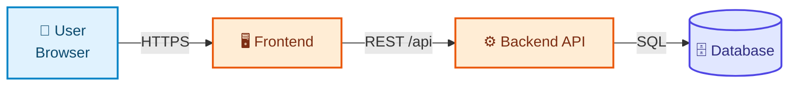
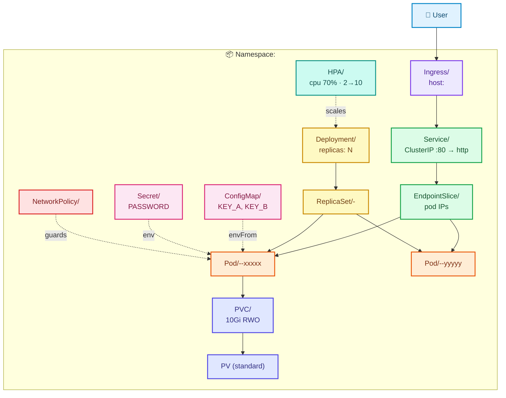
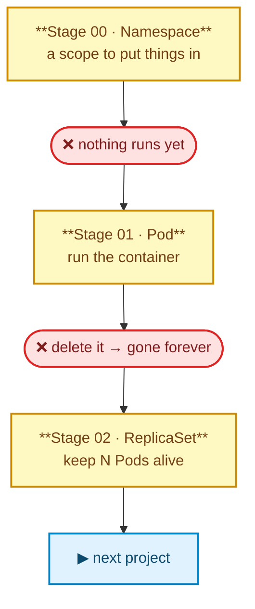

# Project XX — <Project Name>

> **Difficulty:** 🟢 Beginner / 🟡 Intermediate / 🔴 Advanced / ⚫ Production
> **Estimated time:** X hours
> **Cluster required:** `clusters/kind-<single-node|ingress|multi-node>.yaml`
> **Assumes:** basic Docker. No prior knowledge of any other project in this repository.

<!--
  TEMPLATE INSTRUCTIONS (delete this block)
  · Keep every numbered section, in this order.
  · Section 6 must contain the colored HLD diagram; section 7 the colored LLD diagram.
  · Diagram palette is fixed — see docs/CONVENTIONS.md §6. Same colors mean the same layers in every project.
  · Never write "see Project XX for the explanation". Repeat the theory. Duplication is the design.
  · Every resource must be introduced by the problem it solves, after the learner has felt the failure.
-->

---

## 1. What Are We Building?

One paragraph: the application, what it does, who would use it. Then the components table.

| Component | Technology | Responsibility | Port |
|---|---|---|---|
| Frontend | | | |
| Backend | | | |
| Datastore | | | |

---

## 2. Why This Project?

The Kubernetes story this application forces you to learn, and why *this* app is the right vehicle for it.

---

## 3. Learning Objectives

By the end you will be able to:

- [ ] Explain why <resource> exists and what breaks without it
- [ ] Write and debug <resource> manifests from scratch
- [ ] Diagnose <specific failure> using `kubectl describe` / `logs` / `events`
- [ ] Explain the production trade-offs of <topic>

---

## 4. Technologies Used

| Layer | Choice | Why |
|---|---|---|

---

## 5. Prerequisites

| Tool | Version | Verify |
|---|---|---|
| Docker | 24+ | `docker version` |
| kubectl | 1.29+ | `kubectl version --client` |
| Kind | 0.23+ | `kind version` |

```bash
# Create the cluster this project expects
kind create cluster --name kubernetes-lab --config ../clusters/kind-<config>.yaml

# Verify
kubectl cluster-info --context kind-kubernetes-lab
kubectl get nodes
```

---

## 6. Application Architecture — HLD

*What the application is, ignoring Kubernetes entirely.*



**Rules:** ≤ 15 nodes · roles not Kubernetes kinds · label every edge with its protocol.

---

## 7. Kubernetes Architecture — LLD

*Every object this project creates, and how they wire together. This is the diagram you come back to when something
doesn't work.*



**Rules:** `subgraph` per namespace/tier · node label = `Kind/name` + key spec · solid arrow = traffic/ownership ·
dotted arrow = reference/mount/scale · source also saved to [`architecture/architecture.mmd`](architecture/architecture.mmd).

**Legend**

| Color | Layer |
|---|---|
| 🟦 blue | External / user |
| 🟪 purple | Ingress / gateway |
| 🟩 green | Networking (Service, EndpointSlice, DNS) |
| 🟨 yellow | Workload controllers |
| 🟧 orange | Pods / containers |
| 🩷 pink | Config / Secrets |
| 🟦 indigo | Storage |
| 🟥 red | Security |
| 🟩 teal | Observability |

---

## 8. Request Flow

Numbered, hop by hop, with what can fail at each hop.

| # | Hop | What happens | Fails when |
|---|---|---|---|
| 1 | Browser → DNS | | |
| 2 | → Ingress Controller | | |
| 3 | → Ingress rules | | |
| 4 | → Service (ClusterIP) | | |
| 5 | → EndpointSlice / kube-proxy | | |
| 6 | → Pod → Container | | |
| 7 | → Datastore | | |

Full sequence diagram: [`architecture/request-flow.md`](architecture/request-flow.md).

---

## 9. Kubernetes Resources Used

| Resource | Why We Need It | Application Usage | Stage |
|---|---|---|---|
| Namespace | Isolation | Separates this project's objects | `00` |
| Deployment | Pod lifecycle management | Backend replicas | `03` |
| Service | Stable networking | Backend connectivity | `04` |
| ConfigMap | External configuration | API URL, log level | `05` |
| Secret | Sensitive data | Database password | `06` |
| PVC | Persistent storage | Database data | `07` |
| Ingress | HTTP routing | External access | `09` |
| HPA | Autoscaling | API scaling under load | `13` |

---

## 10. Deployment Journey

Each stage introduces **one** idea, motivated by the failure in the stage before it.

<!-- JOURNEY DIAGRAM — mandatory, see docs/CONVENTIONS.md §9.4.
     Alternate stage → failure → stage so the problem-first chain is visible at a glance. -->



| Stage | Directory | Problem it solves | Guide |
|---|---|---|---|
| 00 | `manifests/00-namespace` | Objects scattered across `default` | `manifests/00-namespace/README.md` |
| 01 | `manifests/01-pods` | Get the app running at all | `manifests/01-pods/README.md` |
| 02 | `manifests/02-replicasets` | A deleted Pod never comes back | `manifests/02-replicasets/README.md` |
| 03 | `manifests/03-deployments` | ReplicaSets can't roll out a new version | `manifests/03-deployments/README.md` |
| 04 | `manifests/04-services` | Pod IPs change constantly | `manifests/04-services/README.md` |
| … | | | |

> Delete rows for stages this project legitimately skips. **Never renumber** — `07` always means storage.

### Two ways to run this project

| Path | Use it | Start here |
|---|---|---|
| **Manual (recommended first time)** | Every command typed by hand and explained — what it does, expected output, what to do when it fails | [`scripts/manual-steps.md`](scripts/manual-steps.md) |
| **Scripted** | After you've done it once, or to reset quickly | `./scripts/build-images.sh && ./scripts/deploy.sh` |

> The scripts do nothing that isn't written out in `manual-steps.md`. If you only run the script, you've learned a
> shell script — not Kubernetes.

### Reading order

<!-- Mandatory — see docs/CONVENTIONS.md §9.5. Adjust the times to your project. -->

| # | Do this | Where | Time |
|---|---|---|---|
| 1 | Read sections 1–9 above | this file | 15 min |
| 2 | Create the cluster and build images | `scripts/manual-steps.md` Parts 1–2 | 15 min |
| 3 | **Walk the stages in order** | `manifests/00-namespace/README.md` | X h |
| 4 | Run the failure labs | `failure-labs/labs.md` | X min |
| 5 | Attempt the exercises | `exercises/` | X min |
| 6 | Review interview questions | `interview-questions/questions.md` | X min |
| 7 | Clean up | `scripts/manual-steps.md` Part 5 | 2 min |

Every stage README carries a breadcrumb and a **◀ Previous / Next ▶** footer, so you always know where you are.

---

## 11. Validation

```bash
./scripts/validate.sh
```

| Check | Command | Expected |
|---|---|---|
| Pods Ready | `kubectl get pods -n <ns>` | all `Running`, `READY n/n` |
| Endpoints populated | `kubectl get endpointslices -n <ns>` | pod IPs listed, not `<none>` |
| App responds | `curl -s http://<host>/healthz` | `200 OK` |

---

## 12. Testing

Functional walkthrough: create data, read it back, restart a pod, confirm behaviour.

---

## 13. Failure Simulation

Full labs: [`failure-labs/labs.md`](failure-labs/labs.md). Each lab is **break → observe → diagnose → fix**.

| Lab | You break | You should see | You learn |
|---|---|---|---|
| 1 | Delete a Pod | Replacement appears | Desired state reconciliation |
| 2 | Typo the Service selector | Empty EndpointSlice, connection refused | Selectors are the contract |
| 3 | Bad image tag | `ImagePullBackOff` | Reading `describe` events |
| 4 | Wrong `targetPort` | Connection refused via Service, works via port-forward | Service port mapping |
| 5 | Remove a ConfigMap key | `CreateContainerConfigError` | Config is a hard dependency |
| 6 | Failing readiness probe | Pod `Running` but `0/1 READY`, removed from Service | Ready ≠ Running |

---

## 14. Troubleshooting

Quick table here; full version in [`troubleshooting/common-errors.md`](troubleshooting/common-errors.md).

| Symptom | Investigate | Likely cause | Fix |
|---|---|---|---|
| `Pending` | `kubectl describe pod` | No resources / no matching node / unbound PVC | |
| `ImagePullBackOff` | `describe` events | Wrong tag, private registry, image not loaded into Kind | |
| `CrashLoopBackOff` | `logs --previous` | App crash, bad config, missing dependency | |
| `CreateContainerConfigError` | `describe` | Missing ConfigMap/Secret key | |
| Service unreachable | `get endpointslices` | Selector mismatch, wrong `targetPort` | |
| `OOMKilled` | `describe` last state | Memory limit too low | |
| Ingress 404 | controller logs | Wrong host/path, missing IngressClass | |

**Command toolkit:** `get -o wide` · `describe` · `logs [-f] [--previous]` · `exec -it` · `events --sort-by=.lastTimestamp` · `get endpointslices` · `top pods` · `explain <resource>.<field>`

---

## 15. Production Considerations

> 🧪 **DEMO / LEARNING CONFIGURATION**
> What this project does for teaching convenience, and why it isn't safe or scalable.

> 🏭 **PRODUCTION CONSIDERATIONS**
> What must change: managed datastores, real secret management, HA replicas, backups, resource tuning, monitoring,
> image policy, multi-AZ, TLS.

---

## 16. Security Considerations

| Area | This project | Production |
|---|---|---|
| Secrets | base64 in Git | External Secrets / Vault / cloud secret manager |
| Container user | | `runAsNonRoot`, `readOnlyRootFilesystem`, dropped capabilities |
| Network | Flat cluster network | Default-deny NetworkPolicy |
| RBAC | Default ServiceAccount | Dedicated SA, least-privilege Role |
| Images | | Pinned digests, scanned, trusted registry |

---

## 17. Interview Questions

Sample below; full set with model answers in [`interview-questions/questions.md`](interview-questions/questions.md).

> 🎯 What's the difference between a Deployment and a ReplicaSet, and when would you create a ReplicaSet directly?
> 🎯 A Service returns "connection refused" but the pods are Running. Walk me through your debugging.

---

## 18. Exercises

| Level | File |
|---|---|
| Beginner | [`exercises/beginner.md`](exercises/beginner.md) |
| Intermediate | [`exercises/intermediate.md`](exercises/intermediate.md) |
| Advanced | [`exercises/advanced.md`](exercises/advanced.md) |

Solutions are in [`exercises/solutions/`](exercises/solutions/) — try first.

---

## 19. Cleanup

```bash
./scripts/cleanup.sh

# Confirm nothing survived (PVs are cluster-scoped and outlive namespaces)
kubectl get all -n <namespace>
kubectl get pv
```

---

## 20. What's Next

Where to go from here and which project builds on this one.
