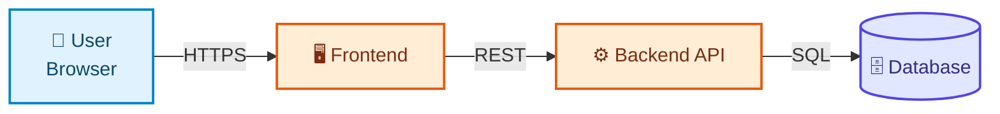
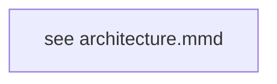

# Architecture — Project XX

## 1. Design Decisions

Written **before** any manifest exists (see [CONTRIBUTING.md](../../../CONTRIBUTING.md#2-design-before-you-write-yaml)).

| Question | Answer |
|---|---|
| What is the application? | |
| Why is it interesting as a Kubernetes lesson? | |
| Which resources does it genuinely require? | |
| Which stages (00–19) apply? Which are skipped, and why? | |
| What does it add to the coverage matrix? | |

---

## 2. High-Level Design (HLD)

*The application, ignoring Kubernetes. ≤ 15 nodes, roles not kinds, every edge labelled with its protocol.*



### Component responsibilities

| Component | Technology | Responsibility | Port | Stateful? |
|---|---|---|---|---|

---

## 3. Low-Level Design (LLD)

*Every Kubernetes object and how they wire together. Source of truth:
[`architecture.mmd`](architecture.mmd) — keep the two in sync.*



### Object inventory

| Kind | Name | Stage | Owns / owned by | Notes |
|---|---|---|---|---|

### Relationships this project demonstrates

```
Deployment → ReplicaSet → Pods
Service    → EndpointSlice → Pods
Ingress    → Service → Pods
PVC        → PV → Storage backend
HPA        → Deployment → ReplicaSet → Pods
ConfigMap / Secret → Pod (env or volume)
ServiceAccount → RoleBinding → Role → permissions
```

---

## 4. Failure Domains

| If this fails | Blast radius | Mitigation in this project |
|---|---|---|
| One Pod | | ReplicaSet reconciliation |
| One Node | | Anti-affinity / topology spread |
| The datastore | | PVC + backups (or: accepted, this is a lab) |
| The Ingress Controller | | Multiple replicas (production note) |

---

## 5. Scaling Characteristics

| Component | Stateless? | Scale by | Limit |
|---|---|---|---|

---

## 6. What This Architecture Is Not

Honest list of what's simplified for teaching: single-replica datastore, no backups, no TLS, no multi-AZ, etc. —
each with a pointer to the production alternative.
