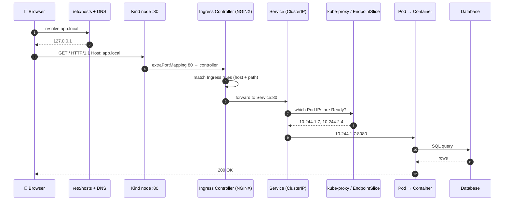
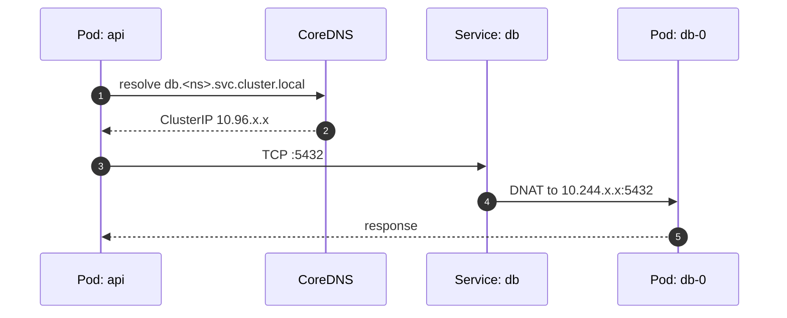

# Request Flow — Project XX

One real request, traced end to end. This is the mental model that makes debugging fast: when something returns 404,
502, 503, or "connection refused", you should immediately know **which hop** is talking.

---

## 1. Sequence



---

## 2. Hop-by-hop

| # | Hop | Mechanism | Fails when | Symptom | First command |
|---|---|---|---|---|---|
| 1 | Browser → DNS | `/etc/hosts` or cluster DNS | Missing host entry | `DNS_PROBE_FINISHED_NXDOMAIN` | `getent hosts app.local` |
| 2 | → Node :80 | Kind `extraPortMappings` | Cluster created without them | Connection refused | `docker port <node>` |
| 3 | → Ingress Controller | Controller pod with hostPort | Controller not installed / not Ready | Connection refused | `kubectl get pods -n ingress-nginx` |
| 4 | → Ingress rules | Host + path match | Wrong host/path/IngressClass | **404** from nginx | `kubectl describe ingress -n <ns>` |
| 5 | → Service | ClusterIP virtual IP | Service name/port wrong | **503** | `kubectl get svc -n <ns>` |
| 6 | → EndpointSlice | Selector matches Ready pods | Selector mismatch, all pods unready | **503**, empty endpoints | `kubectl get endpointslices -n <ns>` |
| 7 | → kube-proxy → Pod | iptables/IPVS DNAT | `targetPort` wrong | **502** / connection refused | `kubectl describe svc <name> -n <ns>` |
| 8 | → Container | App listening on the port | App bound to `127.0.0.1` not `0.0.0.0` | 502 | `kubectl logs <pod> -n <ns>` |
| 9 | → Database | Service DNS + credentials | Wrong FQDN, bad Secret, NetworkPolicy | App 500 | `kubectl exec … -- nslookup <svc>` |

---

## 3. Reading the status code

| Code | Who emitted it | Usually means |
|---|---|---|
| **404** | Ingress Controller | No Ingress rule matched this host/path — the request never reached your app |
| **503** | Ingress Controller | Rule matched, but the Service has **no ready endpoints** |
| **502** | Ingress Controller | Reached a Pod, but the connection failed or the app returned garbage — usually wrong `targetPort` or a crashing app |
| **500** | Your application | Your code — check `kubectl logs` |
| Connection refused | Nothing is listening at that hop | Controller missing, port mapping missing, or wrong port |

---

## 4. Internal (east-west) flow

Service-to-service calls skip the Ingress entirely:



**DNS name forms** (shortest to longest, all valid from inside a Pod in the same namespace):

```
db
db.<namespace>
db.<namespace>.svc
db.<namespace>.svc.cluster.local     ← always use the FQDN in config; the short forms rely on search domains
```

Headless Service adds per-Pod names:

```
db-0.db.<namespace>.svc.cluster.local
```
